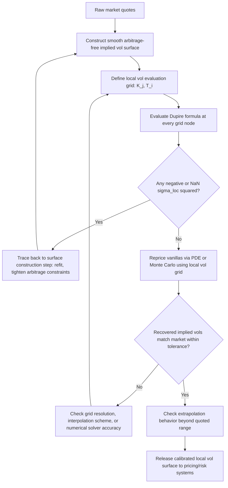

## Calibrating Local Volatility Models

### Overview

Calibrating a local volatility model means constructing a full local volatility surface $\sigma_{loc}(S,t)$ that, when used to price the entire vanilla option set, exactly reproduces the market implied volatility surface. In principle, Dupire's formula (see "The Dupire Equation and Local Volatility Function") already *is* the calibration — but going from theory to a robust, production-grade calibrated surface involves a distinct set of practical steps: choosing an underlying implied-vol-surface representation, ensuring differentiability and arbitrage-freeness, handling sparse/irregular market data, and validating the resulting local vol grid before it is handed to a pricing engine. This item focuses on that end-to-end **calibration pipeline** as distinct from the pure formula derivation.

### What "Calibration" Means for a Local Vol Model

Unlike stochastic volatility models (Heston, SABR), which have a handful of parameters fit by least-squares to minimize repricing error, local volatility calibration is **not a parameter-fitting optimization problem** in the traditional sense — there is no error to minimize once the implied vol surface itself is taken as given and arbitrage-free, since Dupire's formula produces $\sigma_{loc}$ *analytically/numerically* from that surface, not through iterative search. The actual calibration effort is almost entirely concentrated in **constructing a sufficiently smooth, arbitrage-free implied vol surface** from raw market quotes — the local vol computation itself is comparatively mechanical once that surface exists.

This reframes local vol "calibration" into three sequential sub-problems:

1. **Surface construction** — building a continuous, twice-differentiable, arbitrage-free implied vol surface from discrete market quotes (see "Volatility Surface Calibration Techniques").
2. **Local vol extraction** — applying the Dupire formula (analytically or numerically) to that surface (see "Deriving Local Volatility From Implied Volatility").
3. **Validation and stabilization** — checking the resulting local vol grid for numerical pathologies and ensuring day-to-day stability for risk/Greeks purposes.

### Step 1: Surface Construction Choices and Their Impact on Calibration Quality

| Surface Construction Method | Local Vol Calibration Impact |
| --- | --- |
| Raw per-slice SVI | Fast, analytically differentiable, but calendar arbitrage between slices can produce negative local variance at slice boundaries unless explicitly patched |
| SSVI (surface-level) | Calendar consistency built in under parameter conditions, giving a generally cleaner, more stable local vol surface across maturities |
| Constrained spline on $w(k,T)$ | Most flexible fit to market quotes, but numerical (not closed-form) second derivatives make the resulting local vol surface more sensitive to spline knot placement and smoothing parameters |
| SABR per-slice (with $\beta$ fixed) | Good for FX/rates conventions; known to occasionally produce arbitrageable wings under Hagan's asymptotic formula, which propagates directly into invalid (negative) local variance in the wings unless a corrected/exact SABR density is used |

**Practical implication:** the choice of implied-vol-surface-construction technique is effectively the *primary calibration decision* for a local vol model — everything downstream (the Dupire evaluation) is comparatively mechanical.

### Step 2: Discretization and Grid Construction

Since $\sigma_{loc}(S,t)$ must ultimately be evaluated at arbitrary $(S,t)$ points encountered during PDE solving or Monte Carlo path simulation (not just at the originally quoted strikes/maturities), calibration produces a **local volatility grid**:

1. Define a grid of strikes $\{K_j\}$ (typically dense near ATM, sparser in the deep wings) and maturities $\{T_i\}$ (dense near the near-term expiries where gamma/theta sensitivity is highest, coarser further out).
2. Evaluate $\sigma_{loc}(K_j, T_i)$ at every grid node using the Dupire formula applied to the fitted, differentiable implied vol surface.
3. Choose an **interpolation scheme between grid nodes** for the pricing engine (bilinear is common and simple; higher-order schemes trade smoothness for potential oscillation) — since a PDE solver or Monte Carlo path will need $\sigma_{loc}$ at off-grid $(S_t, t)$ points continuously through the simulation/solve.

### Step 3: Validation and Arbitrage Diagnostics

Before releasing a calibrated local vol surface to production pricing:

- **Sign check:** scan the entire $(K,T)$ grid for negative or NaN $\sigma_{loc}^2$ values — any occurrence indicates residual calendar or butterfly arbitrage in the underlying implied vol surface at that point (see "Arbitrage-Free Surface Conditions").
- **Repricing check:** re-price the original vanilla quotes using the local vol surface (via PDE or Monte Carlo) and confirm the recovered implied vols match the input market quotes within tolerance — this validates that the numerical Dupire evaluation and grid interpolation haven't introduced material error relative to the intended exact-reprice property.
- **Smoothness/stability check:** inspect the local vol surface visually or via curvature metrics for spurious oscillation, especially near quoted strike/maturity nodes where spline-based constructions are most prone to artifacts.
- **Extrapolation check at grid boundaries:** confirm the local vol surface behaves reasonably (doesn't blow up or go negative) beyond the last quoted strike/maturity, since simulated paths can wander outside the originally quoted range even if the initial spot is well within it.

### Handling Sparse or Irregular Market Data

Real option markets do not quote a dense, regular grid of strikes and maturities — liquid quotes cluster around ATM and standard listed expiries. Calibration must therefore also address:

- **Interpolation across sparse maturities:** use the ATM term-structure fit (e.g., SSVI's $\theta_T$) to interpolate smoothly between quoted expiries rather than treating each maturity as fully independent.
- **Extrapolation beyond the shortest/longest quoted maturity:** short-end extrapolation is particularly delicate since $\partial w/\partial T$ (the Dupire numerator) can be poorly determined near $T \to 0$ from limited near-term data; long-end extrapolation typically flattens toward a stable structural view of long-run variance.
- **Sparse strike coverage in deep wings:** since these regions have low vega and wide bid-ask spreads, calibration weighting (vega-weighted least squares — see "Volatility Surface Calibration Techniques") naturally de-emphasizes them in the *implied surface* fit, but the local vol formula's sensitivity to curvature means even small residual noise there can produce a visibly rougher local vol wing than the smoothness of the implied vol wing might suggest.

### Local Volatility Calibration via PDE Inversion (Alternative to Direct Formula)

An alternative to directly evaluating the closed-form Dupire formula is to **solve the Dupire forward PDE numerically** for a trial local vol function and iteratively adjust it (a form of inverse problem / PDE-constrained optimization) until the model-implied vanilla prices match the market — conceptually closer to how stochastic volatility model calibration works, but rarely necessary in practice for local vol given that the closed-form formula already provides a direct, non-iterative construction when the implied surface is sufficiently smooth. This PDE-inversion approach becomes more relevant in **local-stochastic volatility (LSV) calibration**, where the local component must be solved for (often via a particle-method / Markovian projection technique) to complement a pre-specified stochastic volatility process rather than standing alone — an important adjacent but distinct calibration problem (see Related Topics).

### Numerical Solvers Used With a Calibrated Local Vol Surface

Once calibrated, the local vol surface feeds into one of two standard numerical frameworks for actual option pricing:

- **Finite-difference PDE solvers** (e.g., Crank-Nicolson schemes on the backward PDE with $\sigma_{loc}(S,t)$ substituted for constant $\sigma$) — efficient for low-dimensional, path-dependent-but-not-too-exotic payoffs (barriers, American options).
- **Monte Carlo simulation** of the SDE $dS_t = (r-q)S_t\,dt + \sigma_{loc}(S_t,t)S_t\,dW_t$, with $\sigma_{loc}$ looked up via grid interpolation at each simulated time step — preferred for higher-dimensional or strongly path-dependent exotics (cliquets, Asians, multi-asset baskets using a local vol per underlying).

**Common numerical subtlety:** discretization bias in Monte Carlo (e.g., Euler scheme timestep too coarse relative to local vol curvature) can cause the simulated model to *not quite* reprice the vanillas it was calibrated to reproduce exactly in continuous time — a well-known practical discrepancy that motivates finer timestepping or bias-correction techniques (e.g., using the exact Black-Scholes transition where feasible, or a mixing Euler scheme) specifically around known vanilla-heavy regions of the payoff.

### Recalibration Frequency and Stability

- Local vol surfaces are typically **recalibrated whenever the underlying implied vol surface is refreshed** (intraday for liquid indices, at least daily for most desks) — since local vol is a direct function of the implied surface, any implied surface update mechanically requires a local vol recompute.
- **Parameter stability of the underlying implied vol fit** (e.g., regularization toward the previous day's SVI/SSVI parameters, as discussed in surface calibration) indirectly stabilizes the local vol surface as well, since the local vol formula amplifies curvature — an unstable implied vol fit produces a *more* unstable local vol surface, not merely an equally unstable one.
- Risk desks commonly monitor day-over-day local vol surface changes at fixed grid points as a secondary stability diagnostic beyond just tracking implied vol parameter stability directly.

### Worked Example: End-to-End Calibration Sketch

Given three liquid maturities' worth of quotes for an equity index, a typical calibration run proceeds:

1. **Fit SSVI globally:** ATM term structure $\theta_T$ fit near-exactly to the three ATM quotes; global $(\rho, \eta, \gamma)$ fit by weighted least squares across all strikes and maturities jointly (see "Volatility Surface Calibration Techniques" for the worked SSVI example).
2. **Verify arbitrage-freeness:** confirm the sufficient conditions on $(\rho,\eta,\gamma)$ from Gatheral-Jacquier hold, guaranteeing no calendar or butterfly arbitrage across the fitted surface.
3. **Differentiate analytically:** since SSVI has a closed form, compute $\partial w/\partial T$, $\partial w/\partial k$, $\partial^2 w/\partial k^2$ symbolically/analytically at each desired grid node (see "Deriving Local Volatility From Implied Volatility" for the term-by-term mechanics).
4. **Evaluate local vol grid:** compute $\sigma_{loc}(K_j,T_i)$ across a fine $(K,T)$ grid spanning, say, 50%–200% moneyness and out to the longest quoted maturity, plus a modest extrapolation buffer.
5. **Sign/repricing/smoothness validation:** confirm no negative values, reprice vanillas via a PDE solver using the grid, and confirm recovered vols match input quotes within a small tolerance (e.g., well under a vol point for liquid strikes).
6. **Release to pricing engine:** the validated grid (with its chosen interpolation scheme) becomes the local vol lookup table used for exotic pricing until the next recalibration cycle.

### Common Calibration Pitfalls

| Pitfall | Consequence |
| --- | --- |
| Calibrating implied surface and local vol as fully separate, disconnected steps with no feedback loop | Arbitrage or noise introduced in the implied fit only discovered late, after Greeks/pricing already look wrong |
| Using too coarse a local vol grid near ATM/near-term | Understates local vol curvature exactly where gamma exposure and short-dated exotic sensitivity are highest |
| Ignoring extrapolation behavior beyond quoted range | Barrier/exotic payoffs whose simulated paths breach quoted strike range pick up poorly-behaved extrapolated local vol |
| Not re-validating repricing after building the grid/interpolation layer | Interpolation scheme itself (not just the underlying formula) can introduce small but material repricing error |
| Recalibrating implied surface without regularization to prior day | Local vol curvature swings excessively day-to-day, destabilizing exotic desk Greeks unrelated to genuine market moves |

### Key Points

- Local vol "calibration" is less an optimization problem than a construction pipeline: build a smooth arbitrage-free implied vol surface, then apply Dupire's formula mechanically.
- The primary calibration decision is the choice of implied-vol-surface-fitting technique (SVI, SSVI, spline, SABR), since it dictates the local vol surface's smoothness and arbitrage-freeness.
- A local vol grid (not just a formula) must be constructed with attention to grid density, interpolation scheme, and extrapolation behavior for actual pricing-engine use.
- Validation should include sign checks, full vanilla-repricing checks, and smoothness diagnostics before release — local vol's exact-reprice property is a design goal, not an automatic guarantee once numerical discretization enters.
- Recalibration is typically driven by implied surface refresh frequency, and day-to-day stability of the implied fit directly determines day-to-day stability of the (curvature-amplified) local vol surface.

**Related Topics**

- The Dupire Equation and Local Volatility Function
- Deriving Local Volatility From Implied Volatility
- Arbitrage-Free Surface Conditions
- Volatility Surface Calibration Techniques (SVI, SSVI, SABR)
- Local-Stochastic Volatility (LSV) Models and Particle Method Calibration
- Finite-Difference PDE Methods for Option Pricing
- Monte Carlo Discretization Schemes and Bias Correction Techniques
- Exotic Option Pricing Under Local Volatility (Barriers, Cliquets, Asians)