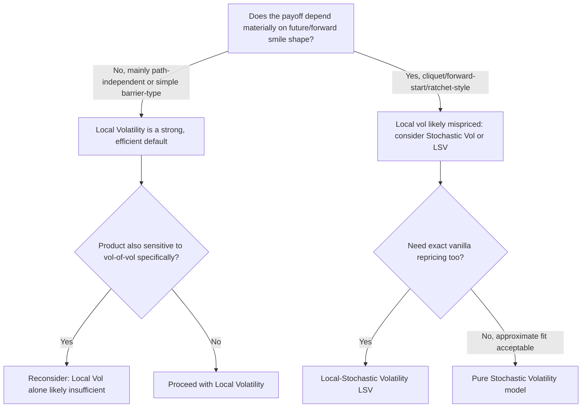

## Strengths and Weaknesses of Local Volatility

### Overview

Local volatility (Dupire) models occupy a specific, well-understood place in the volatility-modeling landscape: they are the unique single-factor diffusion consistent with a full vanilla implied volatility surface, which makes them simultaneously very useful for certain classes of problems and structurally unsuited to others. This item consolidates the practical trade-offs — many touched on individually in the Dupire equation, calibration, and sticky-rule items — into a direct strengths/weaknesses assessment relevant to model selection in practice.

### Strength: Exact Calibration to the Vanilla Surface

By construction, a correctly built local vol surface reprices every quoted vanilla option in the input implied vol surface exactly (subject only to numerical/interpolation error). No other single-factor or multi-factor model class offers this as a direct, closed-form/mechanical construction — stochastic volatility models (Heston, SABR) require an approximate least-squares fit and generally cannot match every quoted point exactly without extension. This makes local vol the natural baseline for any pricing task that requires strict consistency with today's observed vanilla market.

### Strength: Single Source of Randomness (Market Completeness)

Local vol models have exactly one Brownian motion driving the underlying, so in principle the market is **complete**: any contingent claim can be perfectly replicated by dynamically trading the underlying and a risk-free bond, with no additional unhedgeable volatility risk. This is a theoretically clean property that stochastic volatility models (which introduce a second, generally imperfectly-hedgeable source of randomness) do not share, and it simplifies certain hedging arguments and risk-neutral pricing derivations.

### Strength: Deterministic, Well-Defined Numerical Implementation

Because $\sigma_{loc}(S,t)$ is a deterministic function (once calibrated), pricing under local vol reduces to standard, mature numerical machinery:

- **PDE solvers** (finite difference) work directly and efficiently, since the model has the same dimensionality as Black-Scholes (spot and time only — no extra stochastic volatility state variable to discretize).
- **Monte Carlo simulation** requires no correlated multi-factor SDE system — just a single SDE with a spot- and time-dependent diffusion coefficient looked up from the calibrated grid.

This computational simplicity (relative to two-factor stochastic or local-stochastic volatility models) translates into faster pricing and Greeks computation, which matters for real-time risk systems and intraday re-pricing.

### Strength: Direct, Formula-Based Construction (No Iterative Optimization)

As discussed under "Calibrating Local Volatility Models," local vol calibration is largely mechanical once a smooth arbitrage-free implied vol surface exists — no iterative non-convex optimization is required (unlike SABR/Heston/SVI parameter fitting), which removes local-minima and convergence-related calibration risk from the local-vol-extraction step itself (though it shifts that risk earlier, into the implied surface construction step).

### Weakness: Unrealistic Forward Smile Dynamics

This is the most significant and most frequently cited practical weakness. As discussed under "The Dupire Equation and Local Volatility Function," a local vol model calibrated to today's smile implies a **specific, testable prediction** about how the smile will look after spot moves — and that prediction tends to **flatten the future skew** much faster than what is typically observed in realized market behavior. Concretely:

- For payoffs whose value depends materially on the *future* smile shape (forward-starting options, cliquets, ratchet options, some barrier structures), local vol can produce systematically mispriced values relative to what a trading desk observes the market actually charging for such structures.
- This mispricing arises specifically because local vol's forward-smile dynamic is a **byproduct of the single-factor diffusion assumption**, not a free modeling choice — it cannot be tuned away without changing the fundamental model class (e.g., adding a stochastic volatility component).

### Weakness: Poor Fit to the Sticky Delta / Sticky Strike Spectrum

As covered in "Sticky Strike Versus Sticky Delta Dynamics," real markets often behave closer to a blend of sticky strike and sticky delta, or closer to sticky delta in trending/FX-convention markets. Local vol's implied dynamic sits at neither extreme in general and, as noted, is often viewed as flattening too aggressively — meaning **delta hedges derived from a local vol model can differ systematically from what would be obtained under a simple sticky-delta or sticky-strike heuristic**, and this divergence itself becomes a source of hedging P&L that must be actively managed or at least understood by the desk relying on the model.

### Weakness: Numerical Fragility of the Calibration Step

As detailed in "Deriving Local Volatility From Implied Volatility," the Dupire formula involves a **second derivative** of the implied variance surface with respect to strike. This is inherently more sensitive to noise and imperfect smoothness in the input implied vol surface than, say, a first-derivative-only quantity like BS delta. Consequences:

- Small quote noise or an imperfectly smoothed parametric fit can produce visibly rough, oscillatory, or even locally negative local vol surfaces.
- This motivates a heavier reliance on well-regularized parametric surface fits (SSVI, well-behaved SVI) with analytically computable derivatives, shifting calibration complexity "upstream" into the implied surface construction rather than eliminating it.

### Weakness: Volatility of Volatility Is Not Modeled

Local vol has **no independent stochastic driver for volatility itself** — vol at a future date is entirely determined by where spot has moved to, with no additional randomness. This means:

- Local vol cannot naturally capture "vol-of-vol" risk — the empirical fact that implied volatility itself moves in ways not fully explained by spot moves alone (e.g., a volatility spike with little corresponding spot move, driven by changing risk sentiment).
- Products sensitive specifically to vol-of-vol (variance swaps of variance, certain volatility-of-volatility-sensitive exotic structures, and some correlation/dispersion trades) are generally not well-served by a pure local vol model.

### Weakness: Single-Asset, No Natural Extension to Joint Spot-Vol Dynamics

Because there is no separate volatility state variable, local vol models don't naturally accommodate features like:

- Mean-reversion in volatility (a well-documented empirical property of realized and implied vol that stochastic vol models like Heston explicitly capture via a mean-reverting variance process).
- Volatility clustering dynamics beyond what is implicitly baked into the deterministic $\sigma_{loc}(S,t)$ function's dependence on the *current* spot level (which is a purely mechanical/backward-looking encoding, not a genuine separate stochastic process for vol).

### Comparison Table: Local Vol vs. Stochastic Vol vs. LSV

| Property | Local Volatility | Stochastic Volatility (Heston/SABR) | Local-Stochastic Volatility (LSV) |
| --- | --- | --- | --- |
| Exact fit to today's vanilla surface | Yes, by construction | No, approximate least-squares fit | Yes (local component recalibrated to enforce it) |
| Market completeness (single Brownian driver) | Yes | No (vol has its own driver) | No |
| Forward smile realism | Poor — flattens too fast | Generally better, model-dependent | Best of both — tunable via the stochastic component |
| Vol-of-vol captured | No | Yes | Yes |
| Computational cost | Lowest (single-factor PDE/MC) | Moderate (two-factor) | Highest (two-factor, plus calibration complexity) |
| Calibration complexity | Low (mechanical, given a smooth implied surface) | Moderate (non-convex parameter optimization) | High (joint calibration of stochastic + local components, often via particle methods) |
| Typical use case | Exotic pricing needing exact vanilla consistency and moderate path dependency | Products where forward smile / vol-of-vol dynamics dominate value | Production-grade exotics desks needing both exact calibration and realistic dynamics |

### Practical Decision Framework

### Illustrative Example: When Local Vol Works Well vs. Poorly

**Works well:** pricing a European-style down-and-in put barrier option on an equity index, where the main risk driver is the vanilla smile shape *at the barrier level and maturity today*, and the payoff has limited sensitivity to how the smile evolves after spot moves before the barrier is tested. Local vol's exact-reprice property directly ensures the vanilla-consistent boundary conditions are respected.

**Works poorly:** pricing a **cliquet** (a series of forward-starting, periodically-reset options, e.g., a "locally-capped, globally-floored" structure common in structured retail products), where each period's payoff depends on the *forward* smile at the start of that period — precisely the aspect of the volatility surface that local vol is known to model unrealistically (excessive flattening). Desks pricing such structures commonly move to stochastic or local-stochastic volatility models specifically because of this known weakness. [Inference: this qualitative product-selection guidance reflects widely cited practitioner consensus in the volatility modeling literature, not a formal universal rule for every possible cliquet structure or market regime.]

### Key Points

- Local vol's core strength is exact, mechanical consistency with today's full vanilla implied volatility surface, achieved via a single-factor, complete-market diffusion.
- Its core weakness is a structurally unrealistic forward/future smile dynamic (excessive flattening), inherited directly from the single-factor diffusion assumption, not a tunable calibration artifact.
- Numerical fragility (second-derivative sensitivity) and the total absence of vol-of-vol dynamics are secondary but practically important limitations.
- Local vol remains the appropriate default for payoffs with limited forward-smile sensitivity, given its computational simplicity and exact calibration; stochastic or local-stochastic volatility models are the standard remedy when forward smile or vol-of-vol dynamics materially affect payoff value.
- Local-stochastic volatility (LSV) models exist specifically to combine local vol's exact-calibration strength with a stochastic component's more realistic forward dynamics, at the cost of materially higher calibration and computational complexity.

**Related Topics**

- The Dupire Equation and Local Volatility Function
- Calibrating Local Volatility Models
- Sticky Strike Versus Sticky Delta Dynamics
- Local-Stochastic Volatility (LSV) Models and Particle Method Calibration
- Heston Stochastic Volatility Model
- SABR Model Dynamics and Parameter Interpretation
- Forward Smile and Cliquet/Forward-Starting Option Pricing
- Variance Swaps and Vol-of-Vol Sensitive Structures