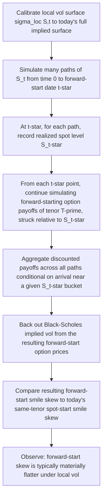

## Forward Volatility Dynamics Under Local Vol

### Overview

Forward volatility dynamics refers to how a model's implied smile at a future date, conditional on the spot having moved to some level, differs from the smile observed today. This is a **model-implied prediction**, not a market-observed quantity — it can only be extracted by actually rolling the model forward (analytically or via simulation) and inspecting the resulting conditional smile. For local volatility models, this forward-smile behavior is well-characterized, has a specific and largely unavoidable qualitative shape, and is the single most consequential dynamic property of local vol for exotic pricing — this item develops the mechanics in more depth than the summary treatment in "Strengths and Weaknesses of Local Volatility."

### Defining the Forward Smile

Given a local vol model calibrated at time $0$ to today's implied surface $\sigma_{BS}(K,T)$, the **forward implied volatility surface** at a future date $t^*$, conditional on spot being at $S_{t^*}$, is defined by the implied vols of forward-start options:

$$\sigma_{fwd}(K', T'; t^*, S_{t^*}) = \text{implied vol, at time } t^*, \text{ of a European option struck at } K' \text{ (often relative to } S_{t^*}\text{, e.g., } K' = \kappa \cdot S_{t^*}\text{) maturing at } t^* + T'$$

This is precisely the object priced by **forward-starting options** and is the core valuation driver for **cliquets**, ratchets, and other structures whose payoff resets relative to a future spot level. Because it is defined conditionally on a simulated/projected future state, the forward smile is fundamentally a *model output*, and different models (local vol, stochastic vol, LSV) produce different forward smiles even when calibrated to the *identical* current-day vanilla surface.

### Mechanics: Why Local Vol Flattens the Forward Smile

The intuition connects directly to the "local vol is roughly twice the implied vol skew" relationship (see "The Dupire Equation and Local Volatility Function"):

1. Implied volatility at any strike $K$ and maturity $T$ can be understood as a kind of **path-averaged local volatility** — specifically, a suitably weighted average of $\sigma_{loc}(S_u, u)$ over all paths from $S_0$ to $K$ over $[0,T]$, weighted by how much "time" the diffusion effectively spends near each $(S_u,u)$ pair conditional on ending near $K$.
2. Because this is an *averaging* operation over many possible paths (not all of which pass through the same region of the local vol surface), the *observed* implied vol skew is a **damped/smoothed version** of the underlying local vol surface's skew — hence the roughly 2:1 ratio between local vol skew and implied vol skew near the money.
3. Now consider the smile **conditional on spot having already moved** to $S_{t^*}$ at time $t^*$. The forward-start option's payoff only "sees" the local vol surface over the *remaining* time window $[t^*, t^*+T']$, starting from the *actual* realized spot level $S_{t^*}$ — a materially shorter averaging window than the original $[0,T]$ window used to produce today's *unconditional* $T$-maturity smile.
4. With a shorter effective averaging window and a starting point already "inside" the local vol surface's post-move region, the resulting forward-start implied smile inherits a *diminished* version of the skew that the *local vol surface itself* still carries at that point — the averaging effect that dampens the raw local vol skew into the milder implied vol skew compounds again with the shortened path history, producing a forward smile that is flatter than today's *same-tenor* implied smile would suggest, holding the local vol surface itself fixed. [Inference: this is the standard heuristic explanation for the local-vol forward-smile-flattening result found across the quant volatility literature; the phenomenon itself is well-documented, though the precise averaging-based intuition offered here is a simplified explanatory device rather than a rigorous derivation.]

### Quantifying the Flattening: The Term-Structure-of-Skew View

A common way desks quantify this is to compute, from the local vol model (via simulation or approximation), the **forward-start ATM skew** — the analogue of $\partial \sigma_{BS}/\partial K$ at $K = S_{t^*}$ for options struck at time $t^*$ — as a function of both $t^*$ (the forward-start date) and $T'$ (the tenor of the forward-starting option), and compare it to today's *spot-start* ATM skew of the same tenor $T'$.

**Typical qualitative finding** (widely reported in local vol literature, e.g., in the context of Bergomi's and Gatheral's writing on forward smile): the forward-start ATM skew under local vol decays roughly like $1/t^*$ or faster as the forward-start date $t^*$ increases, becoming substantially flatter than the *spot-start* skew of the same remaining tenor $T'$ observed today. This is the concrete, model-testable version of the "local vol flattens the future smile too fast" criticism. [Inference: the specific decay rate cited (roughly $1/t^*$) reflects commonly discussed qualitative behavior in the literature on this topic; exact decay rates are model-parameter- and market-specific and should not be treated as a universal constant.]

### Diagram: Forward Smile Flattening Under Local Vol (svg_diagram)

<svg xmlns="http://www.w3.org/2000/svg" viewBox="0 0 700 400" font-family="sans-serif">
<text x="350" y="24" text-anchor="middle" font-size="16" font-weight="bold">Forward Smile Flattening Under Local Vol (svg_diagram)</text>
<line x1="70" y1="330" x2="640" y2="330" stroke="black" stroke-width="1.5" />
<line x1="70" y1="330" x2="70" y2="60" stroke="black" stroke-width="1.5" />
<text x="355" y="360" text-anchor="middle" font-size="12">Moneyness (K / Spot at start of option)</text>
<text x="35" y="195" text-anchor="middle" font-size="12" transform="rotate(-90 35 195)">Implied Vol</text>

<path d="M 110 220 Q 250 130 590 200" stroke="#2b6cb0" stroke-width="2.5" fill="none" />
<text x="130" y="210" font-size="11" fill="#2b6cb0">Today's spot-start smile (tenor T)</text>

<path d="M 110 245 Q 250 220 590 240" stroke="#c53030" stroke-width="2.5" fill="none" stroke-dasharray="6,3" />
<text x="130" y="270" font-size="11" fill="#c53030">Local-vol forward-start smile at t* (same tenor T)</text>

<line x1="250" y1="132" x2="250" y2="218" stroke="#4a5568" stroke-width="1" stroke-dasharray="3,3" />
<text x="260" y="175" font-size="10" fill="#4a5568">skew damped</text>
<text x="355" y="385" text-anchor="middle" font-size="10" font-style="italic">
Same tenor T, but the forward-start version (conditional on spot arriving at t*) shows materially less skew
</text>
</svg>

### Numerical Illustration via Simulation Logic

While an exact closed-form forward smile under local vol generally requires either a full PDE/Monte Carlo computation or a specialized asymptotic expansion, the *procedure* for extracting it is straightforward to describe:

### Worked Example: Directional Intuition With Illustrative Numbers

Suppose today's 1-year ATM skew (change in implied vol per 1% change in moneyness near the money) for an equity index is approximately $-0.60$ vol points per 1% moneyness (a fairly typical order of magnitude for equity index skew). Consider a 1-year forward-starting option that begins accruing in 2 years (i.e., $t^* = 2$, $T' = 1$).

Under the qualitative local-vol flattening pattern described above, the forward-start ATM skew at $t^*=2$ for the same 1-year tenor might come out to something meaningfully smaller in magnitude — illustratively, perhaps in the region of $-0.20$ to $-0.35$ vol points per 1% moneyness, i.e., roughly a third to a half of today's spot-start skew for the same tenor. [Inference: these illustrative numbers are directionally consistent with the widely cited qualitative flattening pattern in the local-vol forward-smile literature, but are not derived from an actual calibrated model or specific market surface — they are meant only to convey the order of magnitude of the effect, not to serve as a quantitative benchmark.]

**Practical consequence:** if a cliquet structure's fair value is sensitive to the size of that 1-year forward-start skew, pricing it under local vol (which produces the flatter, roughly $-0.20$ to $-0.35$ skew) versus a stochastic or local-stochastic volatility model calibrated to better match observed forward-smile behavior (which might imply a skew closer to the original $-0.60$, depending on the model and its own parametrization) can produce materially different valuations for the *identical* payoff — purely as a function of model choice, holding the *current-day* vanilla calibration fixed and identical across both models.

### Why Stochastic and Local-Stochastic Vol Models Address This

- **Pure stochastic volatility models** (Heston, SABR) have their own, separately-parametrized dynamics for how volatility evolves independent of spot, so the forward smile they produce is not mechanically tied to the same averaging/damping argument that constrains local vol — their forward-smile behavior is instead governed by the vol-of-vol and mean-reversion parameters, which can be calibrated (to the extent market data allows) to better match observed or desired forward-smile behavior.
- **Local-stochastic volatility (LSV) models** combine a stochastic component (governing more realistic forward dynamics) with a local component (recalibrated to restore exact fit to today's vanilla surface) — explicitly designed to decouple the "exact calibration today" property from the "realistic forward dynamics" property that pure local vol cannot achieve simultaneously.

### Practical Risk Management Implications

- **Cliquet and forward-starting option desks** typically do not rely on pure local vol for final marking/pricing precisely because of this forward-smile flattening bias; they use stochastic or local-stochastic volatility models, often supplemented by a direct forward-smile "add-on" or overlay calibrated to whatever forward-starting or forward-vol-sensitive market instruments are actually observable (e.g., variance swap forward-starting structures, or dealer-quoted forward-vol-agreements where available).
- **Vanna/volga risk on forward-starting structures** computed under local vol should be treated with caution, since the underlying forward-smile assumption embedded in the local vol model diverges from what the market likely implies for the actual future smile — the model's Greeks may not reflect a realistic re-hedging cost if the future smile turns out closer to today's, unflattened shape.

### Key Points

- The forward smile is a *model-implied* prediction of the future conditional smile, extracted by rolling the model forward, not something directly observed in the current vanilla market.
- Local vol's single-factor, path-averaging structure mechanically produces a forward smile that is flatter than the current same-tenor spot-start smile — this is a structural consequence of the model class, not a calibration artifact that can be corrected by refitting.
- The flattening effect grows more pronounced as the forward-start date increases, broadly following a decaying pattern widely discussed in the literature (commonly summarized as roughly $1/t^*$-type decay, though exact rates are model- and market-specific).
- This is the central reason cliquets, ratchets, and other forward-smile-sensitive payoffs are typically priced with stochastic or local-stochastic volatility models rather than pure local volatility.
- Greeks and hedge ratios derived from a local vol model for forward-smile-sensitive structures should be interpreted cautiously, given the model's known divergence from realistic forward dynamics.

**Related Topics**

- The Dupire Equation and Local Volatility Function
- Strengths and Weaknesses of Local Volatility
- Sticky Strike Versus Sticky Delta Dynamics
- Local-Stochastic Volatility (LSV) Models and Particle Method Calibration
- Forward Smile and Cliquet/Forward-Starting Option Pricing
- Bergomi's Forward Variance Modeling Framework
- Heston Stochastic Volatility Model
- Variance Swaps and Forward Volatility Agreements