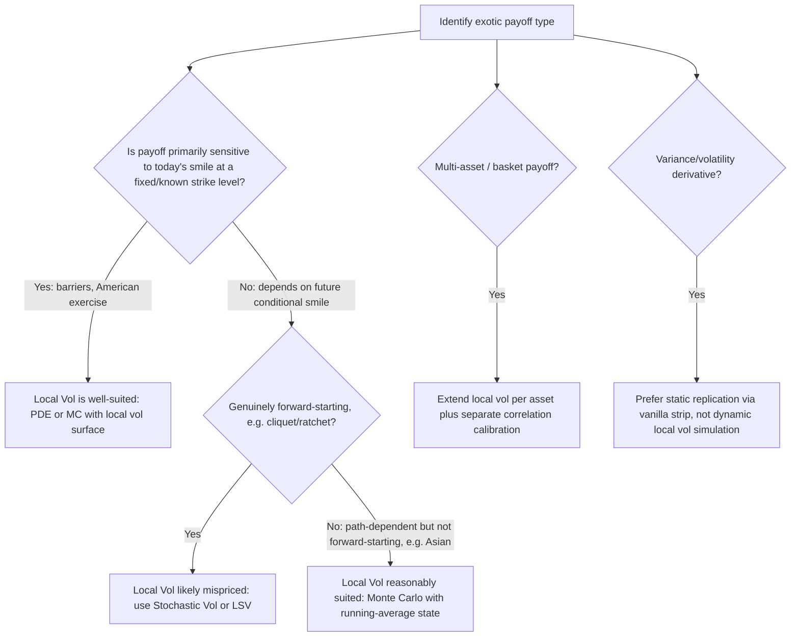

## Applying Local Volatility to Exotic Pricing

### Overview

Local volatility's exact consistency with the vanilla surface makes it a natural pricing engine for exotic and path-dependent payoffs whenever the exotic's value should be anchored to today's observable vanilla market rather than to a separately-modeled forward-smile view. This item surveys how local vol is actually deployed across the main families of exotic structures, which payoff features make local vol appropriate versus inappropriate (building directly on "Strengths and Weaknesses of Local Volatility" and "Forward Volatility Dynamics Under Local Vol"), and the standard numerical techniques used for each family.

### General Pricing Framework

Given a calibrated local vol surface $\sigma_{loc}(S,t)$, exotic payoffs are priced via one of two numerical routes:

1. **PDE / finite-difference methods** — solving the backward pricing PDE

   $$\frac{\partial V}{\partial t} + \frac{1}{2}\sigma_{loc}^2(S,t)S^2\frac{\partial^2 V}{\partial S^2} + (r-q)S\frac{\partial V}{\partial S} - rV = 0$$

   with payoff-specific boundary/terminal conditions and, for path-dependent features (barriers, American exercise), appropriate domain modifications (knock-out boundaries, early-exercise free-boundary conditions via penalty or PSOR methods).
2. **Monte Carlo simulation** — simulating $dS_t = (r-q)S_t\,dt + \sigma_{loc}(S_t,t)S_t\,dW_t$ directly, with $\sigma_{loc}$ interpolated from the calibrated grid at each timestep, then averaging discounted payoffs across paths.

The choice between the two follows standard exotic-pricing trade-offs: PDE methods are efficient and precise for low-dimensional, single-underlying payoffs (especially those with early-exercise features, where PDE/lattice methods handle the free boundary more naturally); Monte Carlo is preferred for path-dependent payoffs with many observation dates, multi-asset baskets, or high-dimensional state (though local vol itself doesn't add dimensionality — the multi-asset case adds it via multiple correlated underlyings, each potentially with its own local vol surface).

### Barrier Options

**Why local vol is well-suited:** A barrier option's value depends heavily on the implied vol *at the barrier level and the relevant maturity* — precisely the smile information local vol encodes exactly by construction. Because the payoff is a function of whether/when spot crosses a fixed level, and the barrier-crossing risk is concentrated at a specific, known strike-like level, local vol's smile-consistency is directly and appropriately utilized without requiring assumptions about *future* smile shape beyond what's implied by today's surface.

**Practical approach:**

- Down-and-out / up-and-out barriers: solve the PDE with an absorbing boundary condition at the barrier level (option value set to zero, or to a specified rebate, once the barrier is touched).
- Down-and-in / up-and-in barriers: typically priced via in-out parity (vanilla minus the corresponding out-barrier) rather than direct simulation of the "in" condition, since vanilla and out-barrier values are usually more numerically stable to compute directly.
- **Well-documented local-vol-specific behavior:** because local vol at the barrier level directly reflects the market's smile skew there, barrier option values under local vol can differ materially from a flat/constant-vol (Black-Scholes) valuation — this sensitivity to the *skew at the barrier strike* is a large part of *why* barrier desks moved to local vol (or smile-consistent models generally) rather than a single flat implied vol input, historically a major driver of the adoption of local volatility models on equity and FX barrier desks in the 1990s-2000s. [Verified: this historical adoption narrative is widely documented in the volatility modeling literature.]

**Caveat:** for barriers with long maturities or complex window/American-style barrier monitoring (continuously monitored vs. discretely monitored), the model's forward-smile behavior can still matter if the barrier-crossing risk is meaningfully concentrated at a future date rather than today — though this sensitivity is generally understood to be materially less pronounced than for genuinely forward-starting structures like cliquets.

### American and Bermudan-Style Options

**Why local vol is well-suited:** early-exercise decisions depend on the option's intrinsic value versus continuation value at each point in time, computed off the current spot-vol relationship — the PDE framework with local vol handles this directly via standard free-boundary numerical techniques (e.g., PSOR, penalty methods, or explicit free-boundary tracking), with no meaningful added complication from local vol versus constant vol beyond the vol surface itself being spot/time-dependent rather than flat.

**Practical approach:** standard finite-difference PDE solvers with early-exercise checks at each timestep (compare continuation value from the PDE solve against immediate exercise value, take the maximum) — a mature, well-established numerical technique largely unaffected by the added smile-consistency of local vol relative to constant-vol American option pricing.

### Asian Options

**Why local vol is moderately well-suited:** Asian option payoffs depend on an average of spot over the life of the option (or part of it), which introduces genuine path-dependency requiring either a PDE with an added averaging state variable or Monte Carlo simulation. Local vol handles this reasonably well since the averaging feature, while path-dependent, doesn't specifically stress the *forward smile* mechanism the way forward-starting structures do — the averaging period generally begins at (or near) inception, so the relevant smile information is largely "today's" smile rolled forward along realized paths, not a genuinely conditional future smile.

**Practical approach:** Monte Carlo simulation is the standard technique (tracking the running average as an additional path statistic alongside spot), since the PDE approach requires an extra state dimension (the running average) that is less commonly implemented compared to the straightforward simulation route.

### Cliquets, Ratchets, and Forward-Starting Structures

**Why local vol is poorly suited:** as detailed in "Forward Volatility Dynamics Under Local Vol," these payoffs are explicitly structured around resets relative to a *future* spot level, making their value directly and materially sensitive to the model's forward-smile prediction. Local vol's structural tendency to flatten the forward smile too aggressively means cliquet valuations under pure local vol are widely regarded as unreliable relative to what the market for such structures (to the extent one is observable) or a properly calibrated stochastic/local-stochastic vol model would suggest.

**Practical approach:** these structures are generally priced under stochastic volatility or local-stochastic volatility models specifically because of this known weakness — local vol is typically used only as a first-pass sanity check or a component within a broader LSV framework, not as the primary pricing model, on desks with material cliquet exposure.

### Multi-Asset and Basket-Type Exotics

**Why local vol is applicable but requires care:** each underlying in a basket can be given its own calibrated local vol surface, with the joint dynamics driven by simulating correlated Brownian motions across assets. This extends naturally from the single-asset local vol Monte Carlo framework.

**Practical complications:**

- **Correlation calibration** becomes a separate, additional problem — the local vol surfaces individually calibrate each asset's marginal vanilla smile, but the basket/multi-asset payoff also depends on the *joint* (correlation) structure, which vanilla single-asset options provide no information about; this typically requires calibrating to any available correlation-sensitive market instruments (e.g., basket options, dispersion trades) or relying on historical/implied proxies.
- **Local vol's forward-smile weakness compounds across assets** for genuinely multi-asset forward-starting structures, making the cliquet-style caveat above even more relevant for basket cliquets or worst-of/best-of forward-starting structures.

### Variance and Volatility Derivatives

**Why local vol is generally not the natural choice:** variance swaps and volatility swaps are, by design, direct bets on realized/implied variance itself; local vol has no independent vol-of-vol dynamic (as discussed in "Strengths and Weaknesses of Local Volatility"), so it is structurally unable to capture the risk factors these products are specifically designed to isolate.

**Practical approach:** variance swaps are more commonly priced via **static replication using a strip of vanilla options** (a model-independent, log-contract-based replication argument), rather than via a dynamic local-vol Monte Carlo simulation — local vol is not the standard tool here even though it *could* mechanically be used to simulate a variance-swap-like payoff, because the static replication approach is both simpler and more theoretically robust (not reliant on any particular dynamic model assumption).

### Decision Framework Across Exotic Families

### Worked Example: Barrier Option Sensitivity to Local Vol Skew

Consider a 1-year down-and-out put on an equity index, strike at-the-money, barrier set at 80% of spot. Suppose the market's implied skew means the 80%-strike 1-year implied vol is materially higher than the ATM implied vol (typical equity index negative skew).

- Under a **flat (constant) vol assumption** using only the ATM implied vol, the barrier's proximity risk (probability and cost of being knocked out) would be understated, since the elevated implied vol actually observed at the barrier strike (80% moneyness) is not reflected.
- Under **local vol**, the calibrated surface directly encodes the higher vol prevailing near 80% moneyness (recalling that local vol skew is typically steeper than implied vol skew — see "The Dupire Equation and Local Volatility Function"), so the PDE solve or Monte Carlo simulation naturally incorporates a *higher* effective volatility as spot approaches the barrier, appropriately increasing the modeled probability of knock-out and adjusting the option's value (typically reducing it, since a more likely knock-out reduces the surviving payoff's expected value) relative to the flat-vol approximation.
- This directional difference — local vol pricing barrier risk more consistently with the actual skew at the barrier level — is the core, well-documented rationale for why barrier desks adopted smile-consistent (local vol) models over flat-vol Black-Scholes pricing. [Inference: the directional statement here (local vol produces a lower down-and-out value than naive flat-ATM-vol pricing, under typical negative equity skew) reflects the standard qualitative result cited in barrier-option / local-vol literature; the precise magnitude depends on the specific skew shape, barrier level, and maturity of any real trade.]

### Summary Table: Local Vol Suitability by Exotic Type

| Exotic Type | Local Vol Suitability | Primary Reason |
| --- | --- | --- |
| Barrier options | Well-suited | Value driven by today's skew at the barrier strike, exactly what local vol encodes |
| American / Bermudan options | Well-suited | Early-exercise mechanics unaffected by local vs. constant vol beyond the surface itself |
| Asian options | Reasonably suited | Path-dependent but not forward-smile-sensitive in the problematic sense |
| Cliquets / ratchets / forward-starting | Poorly suited | Directly exposed to local vol's known forward-smile flattening bias |
| Multi-asset baskets | Suited with added correlation calibration | Marginal smiles handled well; joint/correlation structure is a separate problem |
| Variance/volatility swaps | Not the standard tool | No vol-of-vol dynamic; static replication is the preferred model-independent approach |

### Key Points

- Local vol is best applied to exotics whose value depends on today's vanilla smile at a specific, largely known strike/level — barriers and American-style options are the clearest well-suited cases.
- Asian options are reasonably well-handled since their path-dependency doesn't specifically stress the forward-smile weakness.
- Cliquets and other genuinely forward-starting structures are the clearest poorly-suited case, directly exposed to local vol's structural forward-smile-flattening bias.
- Multi-asset extensions are mechanically straightforward per-asset but introduce a separate correlation calibration problem not addressed by local vol itself.
- Variance and volatility derivatives are generally priced via model-independent static replication rather than dynamic local vol simulation, since local vol has no vol-of-vol dynamic to offer for these products in the first place.

**Related Topics**

- The Dupire Equation and Local Volatility Function
- Strengths and Weaknesses of Local Volatility
- Forward Volatility Dynamics Under Local Vol
- Local-Stochastic Volatility (LSV) Models and Particle Method Calibration
- Finite-Difference PDE Methods for American and Barrier Option Pricing
- Monte Carlo Methods for Path-Dependent and Multi-Asset Payoffs
- Static Replication of Variance Swaps
- Correlation Calibration for Multi-Asset Derivatives