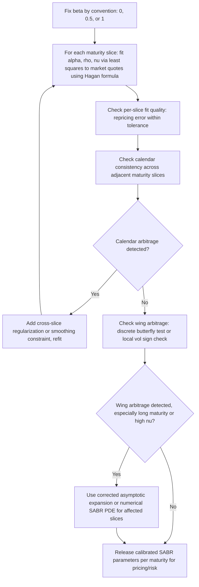

## The SABR Model and Its Calibration

### Overview

SABR ("Stochastic Alpha, Beta, Rho") is a stochastic volatility model introduced by Hagan, Kumar, Lesniewski, and Woodward (2002), originally developed for and still dominant in **interest rate derivatives** (swaptions, caps/floors) but also widely used in FX and, to a lesser extent, equity markets. Its defining practical feature is a closed-form **asymptotic expansion** for implied volatility as a function of strike, avoiding the need for numerical PDE solving or Monte Carlo simulation during calibration — a different route to fast calibration than Heston's characteristic-function approach, but serving the same practical purpose of making smile-consistent calibration computationally tractable.

### Model Dynamics

SABR specifies the forward price (or forward rate, in its original rates-market context) and its volatility as a jointly stochastic system:

$$dF_t = \alpha_t F_t^\beta \, dW_t^F$$

$$d\alpha_t = \nu \alpha_t \, dW_t^\alpha$$

$$dW_t^F \, dW_t^\alpha = \rho \, dt$$

**Parameters:**

- $F_t$: the forward price/rate (SABR is naturally formulated in terms of the forward, consistent with its rates-market origin).
- $\alpha_t$: the stochastic volatility level (analogous to Heston's $\sqrt{v_t}$, but here itself following a driftless lognormal process — no mean reversion, unlike Heston's CIR variance).
- $\beta$: the **CEV exponent** (elasticity), controlling the backbone shape — how the ATM volatility level itself changes as the forward moves, independent of the smile/skew shape.
- $\rho$: correlation between the forward and its volatility — the primary skew driver, as in Heston.
- $\nu$: **volatility of volatility**, the primary curvature/smile-wing driver, as in Heston's $\xi$.

**Key structural difference from Heston:** the volatility process $\alpha_t$ in SABR is a **driftless geometric Brownian motion** (no mean reversion), whereas Heston's $v_t$ is a mean-reverting CIR process. This means SABR's volatility can, in principle, drift arbitrarily far from its initial level over long horizons with no pull back toward a central value — a property that makes SABR less suited to modeling long-dated term structure behavior realistically, and is one reason SABR is more commonly used per-maturity-slice (each maturity calibrated somewhat independently) rather than as a single global term-structure model the way Heston or SSVI can be.

### The Role of Beta (β)

$\beta$ sits on a spectrum between two well-known limiting cases:

- $\beta = 1$: **lognormal-like** dynamics for the forward (analogous to Black-Scholes-style proportional volatility) — common convention in some FX and equity contexts.
- $\beta = 0$: **normal-like** dynamics (absolute, not proportional, volatility) — common convention in certain rates contexts, particularly when rates can be low or negative.
- $\beta = 0.5$: **CIR/square-root-like** dynamics — a common intermediate convention, historically associated with certain interest rate modeling traditions.

**Practical calibration convention:** $\beta$ is very frequently **fixed by market convention or trader judgment** rather than jointly optimized alongside $\alpha, \rho, \nu$, because $\alpha$ (initial vol level) and $\beta$ (backbone shape) are poorly jointly identified from a single smile snapshot — many different $(\alpha,\beta)$ combinations can produce nearly identical ATM-vol-versus-forward behavior over the range of forwards typically observed, so fixing $\beta$ and calibrating the remaining three parameters is standard practice for calibration stability. [Verified: this near-collinearity between $\alpha$ and $\beta$ and the resulting convention of fixing $\beta$ is well-documented in the SABR calibration literature.]

### Hagan's Asymptotic Implied Volatility Formula

The central practical tool is Hagan et al.'s closed-form asymptotic expansion for Black-Scholes-equivalent implied volatility as a function of strike $K$ and forward $F$:

$$\sigma_{SABR}(K,F) \approx \frac{\alpha}{(FK)^{\frac{1-\beta}{2}}\left[1 + \frac{(1-\beta)^2}{24}\ln^2(F/K) + \frac{(1-\beta)^4}{1920}\ln^4(F/K)\right]} \cdot \frac{z}{\chi(z)} \cdot \left[1 + \left(\frac{(1-\beta)^2\alpha^2}{24(FK)^{1-\beta}} + \frac{\rho\beta\nu\alpha}{4(FK)^{(1-\beta)/2}} + \frac{2-3\rho^2}{24}\nu^2\right)T\right]$$

where

$$z = \frac{\nu}{\alpha}(FK)^{\frac{1-\beta}{2}}\ln(F/K), \qquad \chi(z) = \ln\left(\frac{\sqrt{1-2\rho z+z^2}+z-\rho}{1-\rho}\right)$$

**Practical significance:** this formula gives an essentially instantaneous mapping from four parameters $(\alpha,\beta,\rho,\nu)$ to a full implied vol smile at a given maturity, with no numerical integration, PDE solve, or simulation required — even faster in practice than Heston's characteristic-function-plus-Fourier-inversion route for a single slice, which is part of why SABR remains the dominant choice for real-time interest-rate derivatives trading desks needing to reprice/re-quote smiles very frequently throughout the trading day.

**Known limitation — arbitrage in the wings:** as noted under "The Dupire Equation and Local Volatility Function," Hagan's asymptotic formula is exactly that — an asymptotic approximation, valid for moderate strikes and typically short-to-medium maturities — and can produce implied vols that translate into a **non-monotonic or non-convex price surface** (i.e., static arbitrage, negative implied density) for extreme strikes, long maturities, or high vol-of-vol parameter regimes. This is a well-documented practical issue that has motivated both corrected asymptotic expansions (e.g., higher-order terms beyond Hagan's original, or the Hagan et al. "SABR PDE" and later refinements) and fully numerical alternatives (solving the SABR forward PDE directly, or using an exact/near-exact known-density approach for special cases like $\beta=0$ or $\beta=1$) when wing accuracy for exotics pricing is critical. [Verified: this arbitrage limitation of Hagan's original formula is extensively documented in the SABR literature, including in Hagan's own later work refining the original approximation.]

### Calibration Procedure

1. **Fix $\beta$** by convention or desk policy (common values: $\beta=1$, $\beta=0.5$, or $\beta=0$ depending on asset class and rate-level context).
2. **Fit $(\alpha, \rho, \nu)$ per maturity slice** via weighted least-squares against market-quoted implied vols at that maturity, using Hagan's formula directly as the pricing function (no Fourier inversion or numerical integration needed, unlike Heston) — this is typically a fast, well-behaved (often near-convex for reasonable starting points) three-parameter optimization.
3. **Repeat independently for each quoted maturity** — since SABR (in its standard single-slice form) has no built-in cross-maturity consistency mechanism analogous to SSVI's shared parametrization, each maturity's $(\alpha,\rho,\nu)$ triple is generally fit separately, meaning calendar-arbitrage consistency across maturities is not automatically guaranteed and should be checked post-hoc (see "Arbitrage-Free Surface Conditions").
4. **Validate wing behavior**, particularly for maturities/strike-ranges where the asymptotic formula's known limitations are more likely to bite (long maturities, high $\nu$, extreme strikes) — via the standard arbitrage diagnostics (discrete butterfly test, or evaluating the implied local vol surface built from the SABR-generated smile and checking for negative values).

### Parameter Interpretation Summary

| Parameter | Role | Typical Fixing Convention |
| --- | --- | --- |
| $\alpha$ | Initial/current volatility level | Always calibrated (not fixed) |
| $\beta$ | Backbone shape (CEV exponent) | Usually fixed by market/asset-class convention |
| $\rho$ | Skew driver (correlation between forward and vol) | Always calibrated |
| $\nu$ | Curvature/wing driver (vol-of-vol) | Always calibrated |

### SABR vs. Heston: Practical Comparison

| Aspect | SABR | Heston |
| --- | --- | --- |
| Pricing formula | Closed-form asymptotic expansion (Hagan) | Semi-closed-form via characteristic function + Fourier inversion |
| Volatility process | Driftless lognormal (no mean reversion) | Mean-reverting CIR process |
| Typical calibration unit | Per-maturity slice, independently | Often global, single parameter set across whole surface (though per-slice Heston is also used) |
| Native market context | Interest rate derivatives (swaptions, caps), also FX | Originally equity, now widely cross-asset |
| Wing/arbitrage behavior | Known asymptotic-formula wing arbitrage risk, addressed via corrections or numerical PDE | Generally more robust in wings given the model's own consistent dynamics, though calibration residual error still exists |
| Long-dated term structure realism | Weaker (no mean reversion in vol) | Stronger (mean-reversion parameter $\kappa,\theta$ directly targets term structure) |

### Worked Example: Qualitative Calibration Walkthrough

Consider calibrating SABR to a 5-year swaption smile with $\beta = 0.5$ fixed by desk convention (a common choice in rates markets). Suppose the ATM implied vol is quoted at 22%, with a pronounced negative skew (payer swaptions more expensive at higher strikes is *not* typical — receiver-side, i.e., lower-strike, skew direction conventions vary by market; the specific directional skew sign depends on the market's own convention and current rate regime).

1. **Initial guess:** set $\alpha$ from the ATM quote via the SABR ATM approximation, $\rho$ from an initial rough skew read, $\nu$ from an initial rough wing-curvature read.
2. **Least-squares fit:** optimize $(\alpha,\rho,\nu)$ jointly against the full set of quoted strikes at this 5-year maturity, using Hagan's formula to generate model-implied vols at each iteration.
3. **Check fit quality:** confirm the resulting repricing error across quoted strikes is within acceptable tolerance (e.g., a small fraction of a vol point for liquid ATM-adjacent strikes, potentially larger for illiquid deep-wing strikes given their wider bid-ask and lower calibration weight).
4. **Check wing behavior:** particularly for a longer maturity like 5 years, explicitly verify (via the local-vol-sign or discrete-butterfly diagnostics) that the calibrated $(\alpha,\rho,\nu)$ triple doesn't produce arbitrageable extreme-strike behavior — 5-year is within a range where Hagan's asymptotic formula is often still reasonably reliable, but this check remains standard practice rather than being skipped based on maturity alone. [Inference: the specific qualitative reliability assessment for a 5-year tenor reflects general practitioner experience with the model rather than a precise, universally applicable threshold — actual reliability depends on the specific parameter regime obtained from the fit.]

### Extensions

- **SABR with mean reversion / "mixture SABR":** modifications introducing mean-reverting or bounded volatility dynamics to address SABR's lack of long-term stability, used when better long-dated term-structure behavior is needed than the plain driftless-lognormal $\alpha_t$ process provides.
- **Shifted SABR:** for negative-rate environments (particularly relevant in rates markets during and after periods of near-zero or negative policy rates), a shift parameter is added to the forward ($F_t + \text{shift}$) to keep the CEV-type dynamics well-defined even when $F_t$ itself is negative.
- **Zero-correlation / free-boundary SABR (exact solutions):** for special parameter cases ($\beta=0$ or $\beta=1$, or $\rho=0$), exact or near-exact closed-form densities are available, avoiding Hagan's asymptotic approximation and its associated wing-arbitrage risk entirely for those special cases.

### Key Points

- SABR provides a closed-form asymptotic (not exact) formula for implied volatility, avoiding numerical integration/simulation and making it extremely fast for real-time calibration and re-quoting.
- $\beta$ is typically fixed by convention due to poor joint identifiability with $\alpha$, leaving $(\alpha,\rho,\nu)$ as the actively calibrated parameters per maturity slice.
- SABR's volatility process has no mean reversion (unlike Heston's CIR variance), making it less suited to modeling realistic long-dated term structure and generally used slice-by-slice rather than as a unified surface model.
- Hagan's original asymptotic formula is well known to produce arbitrageable (non-convex) prices in extreme strike/maturity/parameter regimes, motivating corrected expansions or numerical PDE alternatives when wing precision matters.
- SABR remains the dominant model in interest-rate derivatives markets specifically because of its calibration speed and interpretable parameters, despite its known asymptotic-formula and long-dated-dynamics limitations.

**Related Topics**

- The Heston Model and Its Properties
- Characteristic Function Pricing Methods
- Arbitrage-Free Surface Conditions
- Volatility Surface Calibration Techniques
- Local-Stochastic Volatility (LSV) Models and Particle Method Calibration
- Interest Rate Derivatives: Swaptions and Caps/Floors
- Shifted SABR and Negative Rate Environments