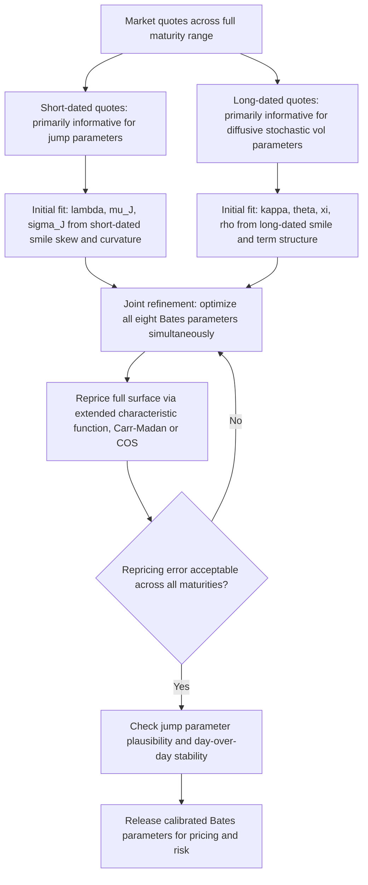

## Combining Stochastic Volatility With Jumps

### Overview

Pure diffusive stochastic volatility models (Heston, SABR) can generate smile curvature and skew, but for **short-dated options**, diffusion-driven smile effects need a relatively long time to accumulate enough variance-of-variance to produce the curvature actually observed in the market. Adding a **jump component** to the spot price process addresses this directly: jumps generate smile skew/curvature almost instantaneously (even at very short maturities), because a discrete jump can move log-price by a large amount in an infinitesimally short time, which a continuous diffusion cannot replicate at short horizons. Combining stochastic volatility with jumps ("SVJ" models generally, with the **Bates model** as the canonical stochastic-volatility-plus-jumps example) produces models that fit both short-dated and long-dated smile behavior substantially better than either component alone.

### Why Pure Diffusion Struggles at Short Maturities

Under a pure diffusion (Heston or Black-Scholes), the distribution of $\ln S_T$ at very short $T$ is close to Gaussian (by a central-limit-type argument, as the diffusion has little time to accumulate the fat tails / skewness that a stochastic vol-of-vol process eventually produces over longer horizons). But empirically, short-dated equity index smiles show **pronounced skew and curvature even at very short maturities** (days to a few weeks) — a well-documented empirical fact that pure diffusive stochastic volatility models systematically struggle to match without resorting to implausibly extreme parameter values (e.g., unrealistically high vol-of-vol $\xi$ or $\nu$) that then produce poor fits elsewhere on the surface.

**Jump processes solve this structurally:** a compound Poisson jump component contributes a *fixed, maturity-independent-in-relative-terms* source of skewness/kurtosis to the terminal distribution, which does not "wash out" at short $T$ the way diffusive effects do — jumps are the natural mechanism for generating the observed short-dated smile steepness.

### The Bates Model: Heston Plus Jumps

The Bates model (1996) is the most widely used and cited example, adding a compound Poisson jump process to the spot dynamics of the Heston model:

$$dS_t = (r - q - \lambda \bar{k})S_t\,dt + \sqrt{v_t}\,S_t\,dW_t^S + S_{t^-}(e^{J}-1)\,dN_t$$

$$dv_t = \kappa(\theta - v_t)\,dt + \xi\sqrt{v_t}\,dW_t^v$$

$$dW_t^S\,dW_t^v = \rho\,dt$$

**Additional jump parameters:**

- $N_t$: a Poisson process with intensity $\lambda$ (expected number of jumps per unit time).
- $J$: the (random) log-jump-size, typically assumed normally distributed $J \sim \mathcal{N}(\mu_J, \sigma_J^2)$ in the standard Bates specification.
- $\bar{k} = \mathbb{E}[e^J - 1] = e^{\mu_J + \sigma_J^2/2} - 1$: the compensator term, ensuring the discounted spot process remains a martingale under the risk-neutral measure (the drift is adjusted by $-\lambda\bar{k}$ to compensate for the expected jump contribution).

**Total parameter count:** the Bates model has eight parameters — the five Heston parameters $(v_0,\kappa,\theta,\xi,\rho)$ plus three jump parameters $(\lambda,\mu_J,\sigma_J)$ — compared to Heston's five, giving materially more flexibility to fit both short-dated skew/curvature (largely via the jump parameters) and longer-dated dynamics (largely via the diffusive stochastic volatility parameters), though the two components are not perfectly separable in a calibration sense.

### Preserving the Affine/Characteristic-Function Structure

A crucial practical property of the Bates model is that adding a **compound Poisson jump with normally-distributed jump sizes** preserves the model's **affine structure**, meaning the characteristic function remains available in closed/semi-closed form — the jump component contributes an additional multiplicative factor to the Heston characteristic function:

$$\phi_{Bates}(u;T) = \phi_{Heston}(u;T) \times \exp\left(\lambda T \left(e^{iu\mu_J - u^2\sigma_J^2/2} - 1 - iu\bar{k}\right)\right)$$

This means all the characteristic-function pricing machinery discussed under "Characteristic Function Pricing Methods" — Carr-Madan FFT, the COS method — applies to Bates with essentially no modification beyond substituting this extended characteristic function, preserving the fast-calibration advantage that made Heston practically useful in the first place. [Verified: this affine-preservation property under adding a compound Poisson jump with normal jump sizes is a well-established, widely cited result in the affine jump-diffusion literature.]

### Jump Parameter Interpretation

| Parameter | Role | Typical Calibration Behavior |
| --- | --- | --- |
| $\lambda$ | Jump intensity (expected jumps per year) | Governs overall frequency of jump-driven smile effects; often calibrated to a modest value (e.g., a fraction of a jump per year on average for equity indices) reflecting that large discrete moves are relatively rare events |
| $\mu_J$ | Mean log-jump size | Typically calibrated negative for equity indices, consistent with the well-documented empirical asymmetry that downward jumps ("crashes") are a more prominent risk-neutral feature than upward jumps of comparable size |
| $\sigma_J$ | Jump size volatility (dispersion of jump sizes) | Governs the *curvature* contribution of the jump component to the short-dated smile — higher $\sigma_J$ produces more short-dated wing convexity |

### Division of Labor Between Diffusive and Jump Components

A widely cited practical calibration pattern (Bates and subsequent literature) is that the two components tend to specialize:

- **Jump parameters** $(\lambda,\mu_J,\sigma_J)$ primarily drive **short-dated** smile skew and curvature, since jumps contribute a maturity-independent (in a specific technical sense — the jump component's contribution to cumulants scales linearly with $T$, same as the diffusive component, but its *relative* contribution to skewness/kurtosis is much larger at short $T$ where diffusive skewness/kurtosis is still small).
- **Diffusive stochastic volatility parameters** $(\kappa,\theta,\xi,\rho)$ primarily drive **longer-dated** smile behavior and the overall term structure of ATM volatility, since diffusive effects need time to accumulate.

This division is not perfectly clean (both components contribute somewhat across all maturities), but it is a widely cited heuristic for understanding why Bates generally achieves a materially better simultaneous fit across the full maturity spectrum than pure Heston, which must otherwise "compromise" its diffusive parameters to try to match both short- and long-dated behavior with only five parameters. [Inference: the specific "division of labor" framing here is a commonly cited practitioner heuristic rather than an exact mathematical decomposition; both components mathematically contribute at every maturity to some degree.]

### Calibration Procedure

1. **Objective function:** same weighted least-squares framework as Heston/SABR calibration, now over the eight-parameter Bates vector, using the extended characteristic function for pricing via Carr-Madan or COS.
2. **Joint or staged calibration:** some practitioners calibrate jointly (all eight parameters in one optimization), while others use a staged approach — first fit jump parameters primarily to short-dated quotes (where jumps dominate), then fit diffusive parameters to longer-dated quotes, then refine jointly — to help the optimizer avoid poor local minima given the larger parameter space.
3. **Identifiability challenges:** with eight parameters, Bates calibration is generally more prone to overfitting or weak identifiability of individual parameters (multiple different $(\lambda,\mu_J,\sigma_J,\xi,\rho)$ combinations can sometimes produce very similar overall smile fits) compared to five-parameter Heston — regularization toward prior-day parameters (as discussed in surface calibration generally) is particularly relevant here to maintain day-to-day parameter stability.
4. **Validation:** standard repricing-error and arbitrage-diagnostic checks apply as with any calibrated model, plus attention to whether the fitted jump parameters remain economically sensible (e.g., an unreasonably high jump intensity or implausibly large jump sizes may indicate the optimizer compensating for a genuine model misspecification elsewhere rather than reflecting real jump risk).

### Diagram: Diffusive vs. Jump Contribution Across Maturities (svg_diagram)

<svg xmlns="http://www.w3.org/2000/svg" viewBox="0 0 700 380" font-family="sans-serif">
<text x="350" y="24" text-anchor="middle" font-size="16" font-weight="bold">Jump vs Diffusive Contribution to Skew (svg_diagram)</text>
<line x1="70" y1="300" x2="640" y2="300" stroke="black" stroke-width="1.5" />
<line x1="70" y1="300" x2="70" y2="60" stroke="black" stroke-width="1.5" />
<text x="355" y="330" text-anchor="middle" font-size="12">Maturity (short to long)</text>
<text x="35" y="180" text-anchor="middle" font-size="12" transform="rotate(-90 35 180)">Relative contribution to skew</text>

<path d="M 90 90 Q 250 140 590 260" stroke="#c53030" stroke-width="2.5" fill="none" />
<text x="120" y="80" font-size="11" fill="#c53030">Jump component contribution</text>

<path d="M 90 260 Q 250 220 590 100" stroke="#2b6cb0" stroke-width="2.5" fill="none" />
<text x="450" y="90" font-size="11" fill="#2b6cb0">Diffusive stochastic vol contribution</text>
<text x="355" y="360" text-anchor="middle" font-size="10" font-style="italic">
Jumps dominate short-dated smile skew/curvature; diffusion dominates longer-dated dynamics
</text>
</svg>

### Worked Example: Qualitative Illustration of Jump Impact on Short-Dated Smile

Consider a 1-week equity index option smile. Under pure Heston with typical equity-calibrated parameters (e.g., $\rho \approx -0.7$, $\xi \approx 0.5$), the model-implied 1-week skew is often found to be **materially flatter** than what the market actually quotes, because one week is too short a window for the diffusive vol-of-vol mechanism to generate much skewness in the terminal distribution.

Adding jump parameters — illustratively, $\lambda \approx 0.5$ (roughly one jump every two years on average), $\mu_J \approx -0.05$ (a typical downward-jump mean of around 5%), $\sigma_J \approx 0.07$ — contributes an immediate, maturity-scaling-independent skewness/kurtosis boost to the terminal distribution *even at $T=1$ week*, since a Poisson-jump contribution to skewness doesn't require "time to build up" the way the diffusive vol-of-vol channel does. The resulting Bates-model 1-week implied skew comes out **materially steeper** than the pure-Heston fit, generally much closer to what is typically observed in real short-dated equity index markets. [Inference: the specific illustrative jump parameter values above are representative orders of magnitude commonly discussed in the SVJ calibration literature for equity indices, not values fit to an actual specific market dataset.]

### Extensions Beyond Bates

- **Jumps in volatility as well as spot ("SVCJ" — stochastic volatility with contemporaneous jumps):** some models add a jump component to the *variance* process $v_t$ as well as the spot process, often with the jump timing correlated (contemporaneous jumps in both spot and vol) to better capture observed "vol spike on crash" dynamics — an even richer but more parameter-heavy extension.
- **Double-exponential (Kou) jump-diffusion:** replaces the normal jump-size distribution with an asymmetric double-exponential distribution, allowing separate control over the probability and magnitude of upward versus downward jumps — while still generally preserving analytical/semi-analytical tractability for characteristic-function-based pricing.
- **Lévy-driven stochastic volatility (e.g., time-changed Lévy processes):** a broader mathematical framework subsuming jump-diffusion-plus-stochastic-vol models as a special case, using subordinated Lévy processes to generate both jumps and stochastic volatility-like effects from a single, more general mathematical construction.

### Practical Trade-offs

| Consideration | Pure Heston | Bates (Heston + Jumps) |
| --- | --- | --- |
| Short-dated smile fit | Generally poor without extreme parameters | Materially better, jumps directly address the short-dated skew/curvature gap |
| Parameter count / identifiability | Five parameters, generally well-identified | Eight parameters, more prone to weak identifiability and overfitting |
| Characteristic function availability | Yes, closed form | Yes, closed form (jump term preserves affine structure) |
| Computational cost | Low (same Fourier-inversion machinery) | Nearly identical (extended characteristic function, same pricing methods) |
| Economic interpretability of jump parameters | N/A | Requires care — fitted jump parameters should be checked for plausibility, not purely accepted as a best statistical fit |

### Key Points

- Pure diffusive stochastic volatility models structurally struggle to match observed short-dated smile skew/curvature, since diffusive effects need time to accumulate.
- Adding a compound Poisson jump component (the Bates model, when combined with Heston) directly addresses this, since jumps contribute skewness/kurtosis to the terminal distribution that does not wash out at short maturities.
- Adding jumps with normally-distributed jump sizes preserves the model's affine structure, so the characteristic function remains closed-form and all standard Fourier-based pricing/calibration methods continue to apply with minimal modification.
- A widely cited (though not perfectly clean) division of labor exists: jump parameters primarily drive short-dated behavior, diffusive parameters primarily drive longer-dated dynamics and term structure.
- The added flexibility of jump-diffusion-plus-stochastic-volatility models comes with a real cost in parameter identifiability and overfitting risk, given the larger parameter space relative to pure Heston or pure SABR.

**Related Topics**

- The Heston Model and Its Properties
- Characteristic Function Pricing Methods
- The SABR Model and Its Calibration
- Affine Jump-Diffusion Model Frameworks
- Lévy Process Models: Variance Gamma and Normal Inverse Gaussian
- Local-Stochastic Volatility (LSV) Models and Particle Method Calibration
- Volatility Surface Calibration Techniques
- Short-Dated Equity Index Smile Dynamics