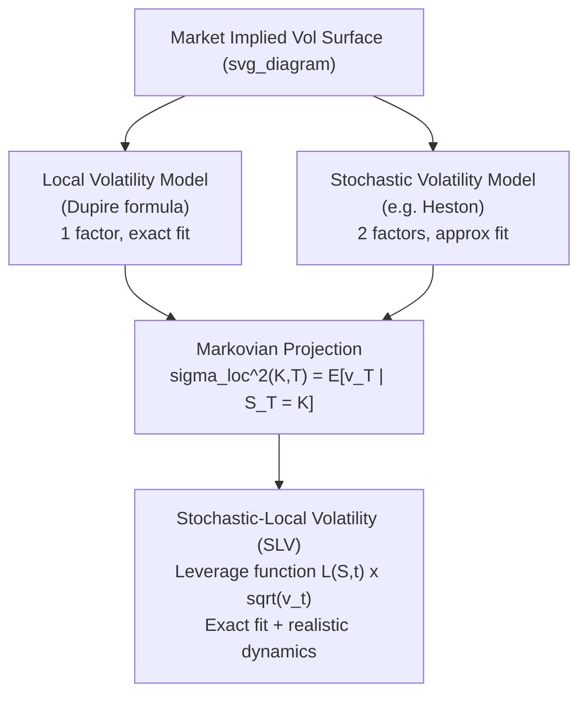

## Local Versus Stochastic Volatility Compared

### Overview

Local volatility (LV) and stochastic volatility (SV) are two distinct frameworks for extending the Black-Scholes model to capture the implied volatility skew/smile observed in option markets. Both are arbitrage-free frameworks capable of exactly fitting a given implied volatility surface at a point in time, but they encode fundamentally different assumptions about the nature of volatility and produce materially different dynamics for the smile itself, hedging behavior, and exotic option pricing.

### Core Definitions

**Local Volatility Model**

In the local volatility framework (Dupire, 1994), volatility is a deterministic function of the underlying asset price and time:

$$dS_t = \mu S_t \, dt + \sigma_{loc}(S_t, t) S_t \, dW_t$$

There is a single source of randomness ($W_t$). The function $\sigma_{loc}(S,t)$ is uniquely determined (in principle) from the full continuum of European option prices via Dupire's formula:

$$\sigma_{loc}^2(K,T) = \frac{\partial_T C(K,T) + rK \partial_K C(K,T)}{\frac{1}{2} K^2 \partial_{KK} C(K,T)}$$

where $C(K,T)$ is the market call price surface.

**Stochastic Volatility Model**

In the stochastic volatility framework, volatility (or variance) is itself a separate random process, typically correlated with the underlying's Brownian motion:

$$dS_t = \mu S_t \, dt + \sqrt{v_t} S_t \, dW_t^S$$

$$dv_t = \kappa(\theta - v_t) \, dt + \xi \sqrt{v_t} \, dW_t^v$$

$$dW_t^S \, dW_t^v = \rho \, dt$$

This is the Heston (1993) specification. Two sources of randomness drive the system, and volatility has its own risk (vega risk is now genuinely undiversifiable via the stock alone).

### Key Points

- **Number of risk factors**: LV has one Brownian driver; SV has two (spot and vol), typically correlated via $\rho$.
- **Volatility as state variable**: In LV, volatility is a *known function* of $(S,t)$ — given $S_t = 100$ today, $\sigma_{loc}$ is fixed. In SV, volatility is a *random variable* — given $S_t = 100$, the instantaneous vol could be high or low depending on the realized path of $v_t$.
- **Market completeness**: LV models are complete markets (single tradable source of risk plus the stock replicates any payoff). SV models are incomplete — variance risk cannot be perfectly hedged with the underlying alone, requiring a market price of volatility risk and typically a second hedging instrument (a variance swap or another option).
- **Calibration to vanillas**: Both can be calibrated to fit an entire implied vol surface exactly (LV by construction via Dupire; SV via numerical calibration of parameters $\{\kappa, \theta, \xi, \rho, v_0\}$, though a pure SV model often cannot fit every strike/maturity perfectly — hence the popularity of SLV, discussed below).

### Smile Dynamics: The Central Distinction

The most consequential practical difference is **how the model predicts the smile will move as spot moves** — this directly affects the hedge ratios (delta, vega) computed today.

**Local volatility smile dynamics**

LV models exhibit "sticky-strike"-like behavior at the instantaneous level, but importantly they imply that the *skew flattens as spot moves in the direction reducing moneyness distortion*, and more specifically LV models notoriously produce implied volatility surfaces that move in the **opposite direction** to spot: as spot decreases, the model's implied smile shifts down/becomes less skewed at the new-current spot in an unrealistic way relative to observed market behavior. This is often summarized as LV violating the empirically observed **"sticky-delta" or "sticky-moneyness"** rule of thumb, and it tends to flatten the forward skew (skew for future starting options) too quickly relative to what's traded in the market for cliquets/forward-starting options.

**Stochastic volatility smile dynamics**

SV models, particularly with $\rho < 0$ (as calibrated to equity markets, capturing the leverage effect), naturally produce a smile that moves in a manner closer to observed market dynamics: when spot falls, implied volatility rises and the skew becomes more pronounced, consistent with sticky-delta-like behavior. SV models also better preserve a persistent forward skew, which matters materially for pricing forward-starting structures.

**Implication for hedging**

Because LV and SV disagree on how the smile shifts with spot, they produce different **delta and vega hedge ratios** even when calibrated to the *identical* set of vanilla prices today. A trader using LV deltas versus SV deltas on the same book will rebalance differently as the market moves, and empirical studies (e.g., comparing hedging P&L variance) generally favor SV-implied hedges for skew-sensitive books, though results are [Inference] dependent on the specific market regime and instrument.

### Comparison Table

| Dimension | Local Volatility | Stochastic Volatility |
| --- | --- | --- |
| Volatility source | Deterministic function $\sigma(S,t)$ | Independent stochastic process $v_t$ |
| Number of factors | 1 | 2 (correlated) |
| Market completeness | Complete | Incomplete (needs vol instrument to hedge) |
| Fits vanilla surface exactly | Yes, by construction (Dupire) | Approximately (needs calibration; exact fit typically requires SLV) |
| Forward smile behavior | Flattens too fast | Persists, more realistic |
| Smile dynamics vs. spot | Often "wrong-way" / inconsistent with sticky-delta | Better matches sticky-delta / market-observed skew dynamics |
| Vega hedging | Single vega bucket sufficient in theory | Requires vol-of-vol and correlation hedges (vanna, volga) |
| Barrier/exotic pricing | Can materially misprice barriers due to smile dynamics | Generally more consistent for path-dependent, forward-starting payoffs |
| Computational cost | Fast (PDE calibration, closed-form Dupire) | Heavier (calibration is a nonlinear optimization; semi-closed-form via characteristic functions, e.g. Heston) |
| Typical use case | Quick calibration, simple exotics, benchmark | Skew-sensitive exotics, cliquets, forward starts, variance products |

### Mathematical Comparison of Local Variance and Stochastic Variance

A useful theoretical bridge is Gyöngy's (1986) mimicking theorem / Dupire's insight applied to SV models: the local volatility function that reproduces the *same marginal distributions* as a given SV model at each time $T$ is the conditional expectation of instantaneous variance given the spot level:

$$\sigma_{loc}^2(K,T) = \mathbb{E}\left[ v_T \mid S_T = K \right]$$

This shows that local volatility can be interpreted as a "Markovian projection" of stochastic volatility — it captures the *average* smile shape correctly (matching vanilla prices) but discards the *conditional variance of volatility* itself, which is precisely the information that drives forward-smile dynamics and volatility-of-volatility-sensitive exotic payoffs (e.g., cliquets, volatility swaps, barrier options near the barrier).

### Example: Pricing a Barrier Option

Consider a down-and-out call struck at-the-money with a barrier 20% below spot.

**Under LV**: The model has a single random driver, so once the barrier is hit, the local vol at that new spot level is a fixed, known function value. LV models typically produce a lower price for this barrier because the model's smile dynamics tend to imply a *lower* local volatility near the barrier as spot approaches it in a down move (the well-known result that LV models often underprice down-and-out puts/calls relative to SV, since the actual market-implied skew steepens as spot falls, raising the effective volatility of hitting the barrier — a feature LV underrepresents).

**Under SV (e.g., Heston)**: With $\rho < 0$, a falling spot is correlated with rising variance, meaning the model captures the empirically realistic phenomenon that vol *rises* as the underlying approaches the barrier, generally producing a higher, more market-consistent barrier price, and hedge parameters that better match the realized rebalancing costs.

[Inference] The precise price gap between LV and SV barrier prices depends on the specific skew steepness, barrier proximity, and time to maturity, and can be significant (multiple vega points) for near-the-money barriers close to expiry.

### Convergence: Stochastic-Local Volatility (SLV) Models

In practice, quant desks often combine both: a **Stochastic-Local Volatility (SLV)** model layers a local volatility "leverage function" $L(S,t)$ on top of an SV process:

$$dS_t = \mu S_t \, dt + L(S_t,t)\sqrt{v_t}\, S_t\, dW_t^S$$

$$dv_t = \kappa(\theta - v_t)\,dt + \xi \sqrt{v_t}\, dW_t^v$$

The leverage function is calibrated (via particle methods or PDE-based fixed-point iteration, e.g., Guyon-Henry-Labordère) so that the model reproduces the market vanilla surface *exactly* (a property pure SV often lacks) while retaining SV's more realistic forward-smile and hedging dynamics. This is now the industry-standard approach at most derivatives desks for exotic pricing, precisely because it resolves the LV-vs-SV trade-off rather than forcing a choice between calibration accuracy and dynamic realism.

### Diagram: Conceptual Relationship

### SVG: Smile Dynamics Under a Spot Shock

<svg xmlns="http://www.w3.org/2000/svg" viewBox="0 0 640 340">
<text x="320" y="24" font-size="15" text-anchor="middle" font-family="sans-serif" font-weight="bold">Smile Shift After Spot Falls (svg_diagram)</text>
<line x1="60" y1="280" x2="600" y2="280" stroke="black" stroke-width="1.5" />
<line x1="60" y1="280" x2="60" y2="60" stroke="black" stroke-width="1.5" />
<text x="330" y="310" font-size="12" text-anchor="middle" font-family="sans-serif">Strike (Moneyness)</text>
<text x="25" y="170" font-size="12" text-anchor="middle" font-family="sans-serif" transform="rotate(-90 25 170)">Implied Vol</text>
<path d="M 100 180 Q 250 120 400 150 Q 500 190 560 230" fill="none" stroke="#888888" stroke-width="2" />
<text x="565" y="225" font-size="11" fill="#888888" font-family="sans-serif">Initial smile</text>
<path d="M 100 130 Q 250 90 400 130 Q 500 175 560 215" fill="none" stroke="#1f77b4" stroke-width="2.5" />
<text x="420" y="105" font-size="11" fill="#1f77b4" font-family="sans-serif">SV smile after spot drop (shifts up, sticky-delta-like)</text>
<path d="M 100 200 Q 250 150 400 175 Q 500 205 560 240" fill="none" stroke="#d62728" stroke-width="2.5" stroke-dasharray="6,3" />
<text x="420" y="255" font-size="11" fill="#d62728" font-family="sans-serif">LV smile after spot drop (inconsistent shift)</text>
<line x1="330" y1="60" x2="330" y2="280" stroke="black" stroke-width="1" stroke-dasharray="3,3" />
<text x="330" y="295" font-size="11" text-anchor="middle" font-family="sans-serif">ATM (old spot)</text>
</svg>

### Practical Model Selection Criteria

- **Choose LV** when: fast calibration to the full vanilla surface is required, the payoff is not highly path-dependent or forward-start sensitive (e.g., European vanillas, simple digital options), or as a consistent benchmark/sanity-check model.
- **Choose SV** when: the product has meaningful vega convexity (volga) or correlation exposure between spot and vol (vanna) — e.g., variance swaps, volatility swaps, cliquets — and realistic forward-smile behavior materially affects the price.
- **Choose SLV** when: both an exact fit to today's vanilla surface *and* realistic dynamic/forward-smile behavior are required — the standard choice for barrier options, autocallables, and other path-dependent structured products at most sell-side desks. [Unverified] The exact choice of leverage-function calibration method (particle method vs. PDE fixed point) varies by institution and can affect numerical stability near barriers.

### Next Steps

- Dupire's local volatility formula: derivation and PDE calibration methods
- Heston model: characteristic function, semi-closed-form pricing via Fourier inversion
- Stochastic-Local Volatility (SLV): leverage function calibration (particle method, Markovian projection)
- Forward-starting options and forward-smile risk
- Vanna-volga pricing method for smile-consistent adjustments
- Variance swaps and the model-free replication of variance
- Rough volatility models (rough Bergomi) as an alternative to classical SV
- Barrier option pricing sensitivity to smile dynamics assumptions