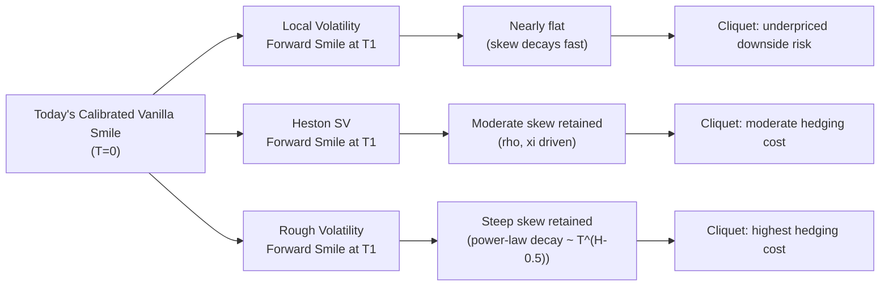

## Forward Smile and Cliquet Sensitivity

### Overview

The forward smile refers to the implied volatility smile that will prevail at a *future* date, conditional on information available today, for options that start at that future date (forward-starting options). Because forward smile cannot be directly observed in the vanilla market — vanilla options only reveal today's spot-starting smile — its shape is entirely a model-dependent extrapolation. This makes forward smile one of the most model-sensitive quantities in derivatives pricing, and it is the primary driver of valuation and risk for cliquet options and other forward-starting structured products.

### Defining Forward Volatility and Forward Smile

**Forward-starting option**: a call/put whose strike is set as a percentage of the spot observed at a future date $T_1$ (the "reset date"), with payoff realized at a later maturity $T_2$:

$$\text{Payoff} = \max\left(\frac{S_{T_2}}{S_{T_1}} - K, 0\right)$$

**Forward implied volatility** $\sigma_{fwd}(T_1, T_2, k)$ is the volatility that would need to be plugged into a Black-Scholes-type formula to match the model price of this forward-starting option, as a function of moneyness $k = K/S_{T_1}$.

**Forward variance** (model-independent building block): using variance swaps, forward variance between $T_1$ and $T_2$ is:

$$V_{fwd}(T_1,T_2) = \frac{T_2 \cdot \sigma_{VS}^2(T_2) - T_1 \cdot \sigma_{VS}^2(T_1)}{T_2 - T_1}$$

where $\sigma_{VS}(T)$ is the fair variance-swap volatility to maturity $T$. This *level* of forward variance is model-free (replicable from a static strip of vanillas), but the **forward skew/smile** — how that variance is distributed across strikes — is not, and requires a dynamic model assumption.

### Key Points

- Forward smile is unobservable directly; it must be inferred from a dynamic model calibrated to today's vanilla surface.
- Different models calibrated to the *identical* today's smile can produce **very different forward smiles** — this is the central practical problem in pricing cliquets and forward-starts.
- Local volatility models tend to produce a forward smile that **flattens too quickly** as $T_1$ increases — an artifact of LV's Markovian, single-factor structure (see Markovian projection identity in the LV/SV comparison).
- Stochastic volatility models (Heston, SABR, rough vol) generally preserve a **more persistent, realistic forward skew**, closer to what is observed when the actual smile evolves through time.
- The rate at which the model "forgets" today's skew as the reset date $T_1$ moves forward is often called **skew decay** or **forward skew decay**, and it is the single most important qualitative feature separating models for cliquet pricing.

### Why Local Volatility Flattens the Forward Smile

Using the Markovian projection result:

$$\sigma_{loc}^2(K,T) = \mathbb{E}[v_T \mid S_T = K]$$

Local volatility, by construction, only depends on the *current* spot level, not on the path taken to get there or the current instantaneous variance level. As time evolves, the "memory" of today's calibrated skew is progressively diluted because the model has only one source of randomness reprocessing the same information (spot itself) at every horizon. This causes the forward-starting smile implied by an LV model to become nearly flat for $T_1$ even a few months out, which is inconsistent with empirically observed skew persistence in equity index markets. [Inference] This flattening effect is a well-documented qualitative feature of LV models across the literature, though its exact magnitude is model/market-specific.

### Why Stochastic Volatility Preserves Forward Skew

In an SV model such as Heston, the variance process $v_t$ has its own memory (mean-reversion speed $\kappa$, vol-of-vol $\xi$) independent of realized spot moves, and correlation $\rho$ links spot and vol shocks persistently through time. The forward-starting smile inherits skew both from:

1. The **correlation channel** ($\rho < 0$): spot/vol co-movement continues to generate skew at future horizons.
2. The **vol-of-vol channel** ($\xi$): the smile curvature (convexity/wings) persists because uncertainty about future variance itself remains.

This is why SV (and even more so, rough volatility models with a Hurst exponent $H < 0.5$) is generally preferred by desks pricing cliquets, since these models better match the observed persistence and even the term structure of skew decay seen historically.

### Cliquet Structures and Their Sensitivity to Forward Smile

A **cliquet** (ratchet option) is a series of forward-starting options, typically structured to lock in periodic returns:

$$\text{Payoff} = \sum_{i=1}^{n} f\left( \frac{S_{T_i}}{S_{T_{i-1}}} \right)$$

Common variants:

- **Globally-floored, locally-capped cliquet**: each period's return is capped, floored, and summed, with a global floor (e.g., 0%) on the total.
- **Reverse cliquet**: accumulates negative returns, capped, subtracted from an initial high coupon.
- **Napoleon**: pays a fixed coupon minus the worst monthly negative return.

**Why cliquets are pure forward-smile plays**: because each period after the first is a forward-starting option, the entire product's value (beyond the first period) depends almost exclusively on the model's forward smile assumption, *not* on today's spot-starting vanilla smile. Two models perfectly calibrated to today's vanilla market can price the same cliquet several volatility points apart purely due to differing forward-smile dynamics.

### Sensitivity Table: Key Greeks for Cliquets

| Greek | Description | Model Dependency |
| --- | --- | --- |
| Forward vega | Sensitivity to forward variance level $V_{fwd}(T_1,T_2)$ | Partially model-free if hedged with a variance-swap strip |
| Forward skew sensitivity | Sensitivity to forward smile slope | Highly model-dependent — largest driver of LV vs. SV price gap |
| Volga (vol-of-vol) | Sensitivity to convexity in vol | Directly parameterized by $\xi$ in Heston/SV |
| Vanna | Cross-sensitivity of spot and vol moves | Directly parameterized by $\rho$ |
| Gamma of variance | Sensitivity to changes in the local realized volatility path | Path-dependent; differs materially between LV and SV simulated paths |

### Example: Pricing a One-Year Reverse Cliquet

Consider a reverse cliquet with 12 monthly reset dates, each period's return capped at 0% (i.e., contributes to a negative-return accumulator only if negative), with a total coupon of $12\%$ minus the sum of capped negative monthly returns.

- Under **LV**, calibrated to today's index skew, the forward-starting monthly options 6-12 months out see an almost flat smile — meaning the model underestimates the likelihood of the persistent negative skew (large downside moves) recurring each month, and tends to **underprice the cost of the embedded short-downside-variance risk** to the issuer.
- Under **Heston/SV** with $\rho \approx -0.7$ (typical equity index calibration) and realistic $\xi$, the forward monthly smiles retain a meaningfully negative skew each period, generally producing a **higher fair coupon requirement / higher hedging cost** for the same structure.
- [Inference] The magnitude of this price gap grows with the number of reset periods and the tenor to the final reset, since LV's flattening compounds over successive forward periods.

### Rough Volatility as a Further Refinement

Empirical studies of realized variance (Gatheral, Jaisson, Rosenbaum, 2018) show that log-volatility behaves like a fractional Brownian motion with Hurst exponent $H \approx 0.1$, far rougher than the $H=0.5$ implied by standard diffusive SV models. Rough volatility models reproduce:

- The steep, persistent **short-maturity skew** observed in index options without needing an unrealistically high vol-of-vol parameter.
- A more realistic **term structure of at-the-money skew** ($\sim T^{H-1/2}$ power-law decay), which matters directly for cliquet pricing across multiple maturities.

[Unverified] Whether rough volatility models are now standard production models at most sell-side desks (versus SLV extensions of classical Heston) varies by institution, and remains an active area of quant research and adoption as of recent years.

### Diagram: Forward Smile Decay Comparison Across Models

### SVG: Forward Skew Decay by Model

<svg xmlns="http://www.w3.org/2000/svg" viewBox="0 0 640 340">
<text x="320" y="24" font-size="15" text-anchor="middle" font-family="sans-serif" font-weight="bold">ATM Forward Skew Decay vs. Reset Horizon (svg_diagram)</text>
<line x1="60" y1="280" x2="600" y2="280" stroke="black" stroke-width="1.5" />
<line x1="60" y1="280" x2="60" y2="60" stroke="black" stroke-width="1.5" />
<text x="330" y="310" font-size="12" text-anchor="middle" font-family="sans-serif">Reset Horizon T1 (months)</text>
<text x="25" y="170" font-size="12" text-anchor="middle" font-family="sans-serif" transform="rotate(-90 25 170)">Skew Magnitude</text>
<path d="M 90 90 L 150 175 L 220 230 L 300 258 L 400 272 L 560 278" fill="none" stroke="#d62728" stroke-width="2.5" />
<text x="420" y="260" font-size="11" fill="#d62728" font-family="sans-serif">Local Volatility (fast decay)</text>
<path d="M 90 90 L 150 130 L 220 160 L 300 185 L 400 205 L 560 225" fill="none" stroke="#1f77b4" stroke-width="2.5" />
<text x="420" y="200" font-size="11" fill="#1f77b4" font-family="sans-serif">Heston SV (moderate decay)</text>
<path d="M 90 90 L 150 105 L 220 118 L 300 130 L 400 145 L 560 165" fill="none" stroke="#2ca02c" stroke-width="2.5" />
<text x="420" y="140" font-size="11" fill="#2ca02c" font-family="sans-serif">Rough Volatility (slow decay)</text>
</svg>

### Practical Hedging Implications

- **Forward vega hedging**: partially achievable with a strip of variance swaps/vanillas spanning $T_1$ and $T_2$, isolating the level of forward variance from its distribution across strikes.
- **Forward skew risk cannot be statically hedged** with vanillas alone — it requires dynamic hedging under the chosen model, exposing the desk to **model risk** (the risk that the true forward smile differs from the model's assumption).
- Desks typically manage this via a **model reserve** (a P&L buffer held against the spread between competing model prices, e.g., LV vs. SLV vs. rough vol) for cliquet books, since forward smile cannot be locked in via replication the way today's vanilla smile can.

### Related Topics

- Variance swaps: replication and the model-free forward variance formula
- SABR model and its forward-smile behavior
- Rough volatility models (rough Bergomi, rough Heston)
- Skew-stickiness ratio (SSR) as an empirical/model diagnostic
- Autocallables and their sensitivity to forward skew
- Model risk reserves and Prudent Valuation (PRA/EBA frameworks) for exotic derivatives desks