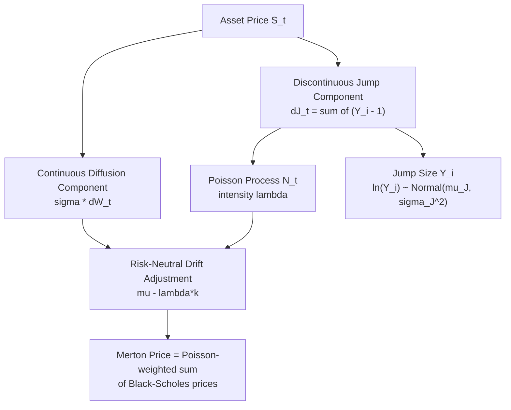

## The Merton Jump Diffusion Model

### Overview

The Merton Jump Diffusion (MJD) model, introduced by Robert Merton in 1976, extends the Black-Scholes framework by superimposing a compound Poisson jump process onto the standard geometric Brownian motion. It was the first widely-adopted model to address a key empirical shortcoming of Black-Scholes: the inability to generate the volatility skew/smile and to account for sudden, discontinuous price moves (crashes, earnings surprises, macro shocks) that diffusion-only models cannot capture regardless of how volatility is specified.

### Model Specification

The underlying asset price follows:

$$dS_t = (\mu - \lambda k) S_t \, dt + \sigma S_t \, dW_t + S_{t^-} \, dJ_t$$

where:

- $W_t$ is a standard Brownian motion
- $J_t = \sum_{i=1}^{N_t} (Y_i - 1)$ is a compound Poisson process
- $N_t$ is a Poisson process with intensity (jump arrival rate) $\lambda$
- $Y_i$ are i.i.d. jump size multipliers, with $\ln Y_i \sim \mathcal{N}(\mu_J, \sigma_J^2)$ in Merton's original specification (lognormally distributed jump sizes)
- $k = \mathbb{E}[Y_i - 1] = e^{\mu_J + \sigma_J^2/2} - 1$ is the compensator, ensuring the drift-adjusted process remains a martingale under the risk-neutral measure when $\mu$ is replaced by $r$

Equivalently, in log-price terms, between jumps $\ln S_t$ follows Brownian motion with drift, and at each jump arrival (Poisson-timed), $\ln S_t$ receives an additive normal increment $\ln Y_i \sim \mathcal{N}(\mu_J, \sigma_J^2)$.

### Key Points

- **Two independent sources of risk**: continuous diffusion risk (captured by $\sigma$) and discontinuous jump risk (captured by $\lambda, \mu_J, \sigma_J$), driven by independent Poisson and Brownian processes.
- **Five parameters** total: $\sigma$ (diffusive vol), $\lambda$ (jump intensity, jumps per year), $\mu_J$ (mean log-jump size), $\sigma_J$ (jump size volatility), plus the risk-free rate $r$.
- **Incomplete market**: because jump risk cannot be perfectly hedged with the underlying alone (jumps are not spanned by continuous trading), the model is technically incomplete. Merton's original approach assumed jump risk is diversifiable/idiosyncratic and priced it under the physical measure with no risk premium — a simplifying assumption criticized in later literature, since market crashes are typically systemic, not diversifiable.
- **Semi-closed-form pricing**: despite market incompleteness, Merton derived a closed-form (infinite series) option pricing formula by conditioning on the number of jumps.

### The Merton Pricing Formula

Conditional on exactly $n$ jumps occurring before maturity $T$, the option price is a Black-Scholes price with adjusted volatility and drift. Unconditioning over the Poisson-distributed number of jumps gives:

$$C_{MJD} = \sum_{n=0}^{\infty} \frac{e^{-\lambda' T} (\lambda' T)^n}{n!} \, C_{BS}(S, K, T, r_n, \sigma_n)$$

where:

$$\lambda' = \lambda(1+k), \qquad \sigma_n^2 = \sigma^2 + \frac{n \sigma_J^2}{T}, \qquad r_n = r - \lambda k + \frac{n \ln(1+k)}{T}$$

Each term in the sum is simply a Black-Scholes price computed as if exactly $n$ jumps of average size occurred, weighted by the Poisson probability of observing $n$ jumps. In practice, the series converges quickly (typically 10-20 terms suffice for double-precision accuracy) since Poisson probabilities decay factorially.

### Why Jumps Generate a Volatility Smile

Unlike pure diffusion, jumps introduce **excess kurtosis (fat tails)** and, when jump sizes are asymmetric ($\mu_J < 0$, i.e., downward jumps more likely/larger — as calibrated to equity indices), **negative skewness** in the risk-neutral return distribution. Both effects map directly into implied volatility surface features:

- **Excess kurtosis** → implied vol smile (higher IV for both far OTM puts and calls relative to ATM) — most pronounced at **short maturities**, since jump effects are diluted by diffusion over longer horizons (Central Limit Theorem effect on the diffusion component).
- **Negative skewness** ($\mu_J < 0$) → implied vol **skew** (OTM puts trade at higher IV than OTM calls), matching the equity index skew observed post-1987.

**Term structure signature**: MJD produces a smile that is steep and pronounced for short maturities and flattens rapidly as $T$ increases — this is a distinctive qualitative feature (and, [Inference] arguably a limitation) of pure jump-diffusion models, since observed equity skew, while it does flatten with maturity, tends to flatten more slowly than a pure Merton-style jump component alone would predict. This has motivated combining jumps with stochastic volatility (e.g., Bates model, SVJ) to fit both short and long maturity skew simultaneously.

### Example: Calibration Intuition

Suppose SPX 1-month options show a pronounced negative skew and elevated wing prices relative to Black-Scholes ATM vol. A typical calibrated parameter set for equity indices might be (illustrative, not universal):

- $\sigma \approx 12$–$15\%$ (diffusive component, roughly the "normal-times" volatility)
- $\lambda \approx 0.5$–$1$ (i.e., on average 0.5 to 1 jump events per year)
- $\mu_J \approx -0.10$ to $-0.15$ (jumps average a 10-15% downward move in the log-price)
- $\sigma_J \approx 0.10$–$0.20$ (dispersion around that average jump size)

[Inference] Exact calibrated values are highly sample- and market-regime-dependent; the values above illustrate typical orders of magnitude discussed in the literature rather than a universal parameter set.

With $\mu_J$ negative and $\lambda$ non-trivial, the model produces exactly the fat left tail and negative skew observed in index options, something constant-volatility Black-Scholes structurally cannot produce at any single $\sigma$.

### Simulating the Merton Model (Monte Carlo)

```python
import numpy as np

def simulate_merton_paths(S0, r, sigma, lam, mu_J, sigma_J, T, n_steps, n_paths):
    dt = T / n_steps
    # Martingale compensator
    k = np.exp(mu_J + 0.5 * sigma_J**2) - 1
    drift = (r - 0.5 * sigma**2 - lam * k) * dt

    paths = np.zeros((n_paths, n_steps + 1))
    paths[:, 0] = S0

    for t in range(1, n_steps + 1):
        Z = np.random.standard_normal(n_paths)
        diffusion = sigma * np.sqrt(dt) * Z

        # Poisson-distributed jump count this step
        N = np.random.poisson(lam * dt, n_paths)
        # Sum of N lognormal jump log-sizes per path
        jump_component = np.zeros(n_paths)
        for i in range(n_paths):
            if N[i] > 0:
                jump_component[i] = np.sum(
                    np.random.normal(mu_J, sigma_J, N[i])
                )

        log_return = drift + diffusion + jump_component
        paths[:, t] = paths[:, t - 1] * np.exp(log_return)

    return paths
```

**Output** (illustrative, single path characteristics): paths exhibit long stretches of smooth Brownian-like motion punctuated by discrete downward (or upward) discontinuities at random times, visually distinct from a pure GBM path. [Inference] Vectorizing the inner jump-sum loop (e.g., via `np.add.reduceat` or precomputing per-path jump sums with `scipy.stats`) would substantially improve performance for large `n_paths`; the loop form above favors clarity over speed.

### Diagram: Model Structure



### SVG: Sample Path Comparison

<svg xmlns="http://www.w3.org/2000/svg" viewBox="0 0 640 300">
<text x="320" y="22" font-size="15" text-anchor="middle" font-family="sans-serif" font-weight="bold">GBM vs. Merton Jump-Diffusion Sample Path (svg_diagram)</text>
<line x1="50" y1="250" x2="600" y2="250" stroke="black" stroke-width="1.5" />
<line x1="50" y1="250" x2="50" y2="50" stroke="black" stroke-width="1.5" />
<text x="325" y="278" font-size="12" text-anchor="middle" font-family="sans-serif">Time</text>

<path d="M 50 150 Q 100 140 140 145 Q 190 130 230 138 Q 280 120 330 128 Q 380 110 420 118 Q 470 100 520 108 Q 560 95 590 100" fill="none" stroke="`#888888`" stroke-width="2" />

<text x="500" y="90" font-size="11" fill="`#888888`" font-family="sans-serif">GBM (smooth)</text>

<path d="M 50 150 Q 100 140 140 145 Q 190 130 225 138 L 225 200 Q 260 195 280 188 Q 320 175 350 182 L 350 230 Q 390 225 420 218 Q 460 205 500 212 Q 540 200 590 190" fill="none" stroke="`#d62728`" stroke-width="2.5" />

<text x="420" y="245" font-size="11" fill="`#d62728`" font-family="sans-serif">Merton (with jumps)</text>

<line x1="225" y1="138" x2="225" y2="200" stroke="#d62728" stroke-width="1" stroke-dasharray="2,2" />
<line x1="350" y1="182" x2="350" y2="230" stroke="#d62728" stroke-width="1" stroke-dasharray="2,2" />
</svg>

### Strengths and Limitations

**Strengths**:

- Closed-form (series) pricing formula, fast to evaluate and calibrate.
- Generates realistic short-maturity smile/skew that pure diffusion models cannot.
- Intuitive parameterization directly tied to observable phenomena (crash frequency, crash severity).
- Foundational building block for more advanced affine jump-diffusion models.

**Limitations**:

- Assumes jump risk is diversifiable (zero jump risk premium under Merton's original derivation) — [Inference] widely regarded in later literature as an oversimplification for systemic market crash risk.
- Constant diffusive volatility $\sigma$ between jumps means the model still cannot independently fit the *term structure* of skew as flexibly as models combining jumps with stochastic volatility.
- Jump sizes are i.i.d. and time-homogeneous — no time-varying jump intensity (e.g., higher jump risk during crises), a feature addressed by extensions such as Hawkes-process-driven jump models.
- Smile flattens with maturity faster than typically observed empirically at long-dated tenors, motivating hybrid models.

### Extensions

- **Bates (1996) model / SVJ**: combines Heston stochastic volatility with Merton-style lognormal jumps, addressing both the short-maturity skew (via jumps) and longer-maturity smile persistence (via SV).
- **Kou (2002) double-exponential jump model**: replaces the normal jump-size distribution with an asymmetric double-exponential, improving tail fit and yielding closed-form barrier option prices.
- **Variance Gamma, CGMY, and other pure-jump Lévy models**: replace the diffusion component entirely with an infinite-activity pure jump process, offering an alternative to superimposing jumps on diffusion.

### Related Topics

- The Bates model (stochastic volatility + jumps)
- Kou's double-exponential jump-diffusion model
- Variance Gamma and CGMY Lévy processes
- Characteristic function methods and Fourier-based option pricing (Carr-Madan)
- Jump risk premia and the pricing kernel under incomplete markets
- Calibrating jump-diffusion models to the implied volatility surface