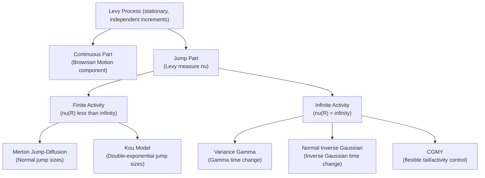

## Levy Processes in Finance


### Overview

Lévy processes are the broad mathematical class of stochastic processes with stationary and independent increments, encompassing Brownian motion, Poisson jump processes, and a rich family of pure-jump and jump-diffusion processes as special cases. In finance, Lévy processes generalize the Black-Scholes-Merton framework beyond the Gaussian assumption, allowing asset returns to exhibit the fat tails, skewness, and infinite-activity small-jump behavior consistently observed in empirical return data — features that neither pure diffusion nor even simple compound Poisson jump-diffusion (Merton) models can fully capture.

### Mathematical Foundations

**Definition**: A process $X_t$ is a Lévy process if:

1. $X_0 = 0$ almost surely
2. Independent increments: for $t_1 < t_2 < \ldots$, the increments $X_{t_2} - X_{t_1}, X_{t_3} - X_{t_2}, \ldots$ are independent
3. Stationary increments: the distribution of $X_{t+s} - X_t$ depends only on $s$, not $t$
4. Stochastic continuity: $\lim_{h \to 0} \mathbb{P}(|X_{t+h} - X_t| > \epsilon) = 0$

**Lévy-Khintchine representation**: every Lévy process is characterized by a triplet $(\gamma, \sigma^2, \nu)$ — drift, diffusion variance, and a **Lévy measure** $\nu(dx)$ governing jump frequency and size — via the characteristic function:

$$\mathbb{E}[e^{iuX_t}] = \exp\left\{ t \left[ i\gamma u - \frac{\sigma^2 u^2}{2} + \int_{\mathbb{R}} \left( e^{iux} - 1 - iux \mathbb{1}_{|x|<1} \right) \nu(dx) \right] \right\}$$

The Lévy measure $\nu(dx)$ describes the expected number of jumps of size in $dx$ per unit time. Crucially, $\nu$ need not be a finite measure — it can have **infinite total mass** while still integrating $x^2$ to a finite value near the origin, giving rise to processes with **infinitely many small jumps** in any finite time interval (infinite activity), a qualitatively different behavior from Merton's finite-activity compound Poisson jumps.

### Classification: Finite vs. Infinite Activity

| Category | Total jump rate $\nu(\mathbb{R})$ | Path behavior | Examples |
| --- | --- | --- | --- |
| Finite activity | Finite ($\nu(\mathbb{R}) = \lambda < \infty$) | Finitely many jumps in any interval; looks diffusive between jumps | Merton jump-diffusion, Kou double-exponential |
| Infinite activity | Infinite ($\nu(\mathbb{R}) = \infty$) | Infinitely many (small) jumps in any interval; no separate diffusion component often needed | Variance Gamma, CGMY, Normal Inverse Gaussian (NIG) |

Infinite-activity pure-jump models are notable because the accumulation of infinitely many small jumps can itself generate paths with realistic-looking "noise" without requiring an explicit Brownian component at all — the jumps alone do the work.

### Key Points

- **Generalization hierarchy**: Brownian motion (Black-Scholes) $\subset$ Compound Poisson jump-diffusion (Merton) $\subset$ General Lévy processes (VG, CGMY, NIG, etc.)
- **No continuous-time hedging analog to Black-Scholes**: like Merton's model, general exponential Lévy models produce **incomplete markets** — the jump/Lévy risk cannot be replicated by the underlying alone, requiring either an equivalent martingale measure selection (e.g., Esscher transform, minimal entropy martingale measure) or additional hedging instruments.
- **Self-decomposability and subordination**: many popular financial Lévy processes (VG, NIG) are constructed via **subordination** — running Brownian motion on a random "business time" clock given by an increasing Lévy process (a subordinator), typically Gamma-distributed (VG) or Inverse Gaussian-distributed (NIG) time change. This gives an elegant economic interpretation: markets run on stochastic information-arrival time rather than calendar time.
- **Exponential Lévy models**: asset prices are typically modeled as $S_t = S_0 e^{X_t}$ where $X_t$ is a Lévy process, with a compensator adjustment ensuring the discounted price is a martingale under the pricing measure.

### The Variance Gamma (VG) Model

Introduced by Madan and Seneta (1990), the VG process is Brownian motion evaluated at a random time given by a Gamma process:

$$X_t^{VG} = \theta G_t + \sigma W_{G_t}$$

where $G_t$ is a Gamma process with mean rate $t$ and variance rate $\nu$ (the "variance of the gamma time change," giving the model its name), $\theta$ controls skewness, and $\sigma$ controls overall volatility of the time-changed Brownian motion.

- **Three parameters**: $\sigma$ (volatility), $\nu$ (kurtosis / degree of randomness in time change), $\theta$ (skewness, asymmetry).
- **Pure jump, infinite activity, finite variation**: no continuous diffusion component; the process moves purely through (infinitely many, in any interval) jumps.
- **Closed-form density and characteristic function**, enabling fast Fourier-based option pricing (Carr-Madan FFT method).

### The CGMY Model

Carr, Geman, Madan, and Yor (2002) generalized VG with four parameters $(C, G, M, Y)$, offering independent control over the fine structure of small jumps (via $Y$) and large jump decay rates on the up/down sides (via $G, M$) separately:

$$\nu(dx) = C \left[ \frac{e^{-Gx}}{x^{1+Y}} \mathbb{1}_{x>0} + \frac{e^{-M|x|}}{|x|^{1+Y}} \mathbb{1}_{x<0} \right] dx$$

- $Y < 0$: finite activity (VG is the special case $Y=0$)
- $0 \le Y < 1$: infinite activity, finite variation
- $1 \le Y < 2$: infinite activity, infinite variation (Brownian-motion-like local roughness without an explicit diffusion term)

This flexibility lets CGMY match both the **fine local path behavior** and the **tail decay** of empirical returns independently, a degree of control unavailable in VG or Merton.

### The Normal Inverse Gaussian (NIG) Model

Barndorff-Nielsen (1997) proposed subordinating Brownian motion with an **Inverse Gaussian** process instead of Gamma:

$$X_t^{NIG} = \theta I_t + \sigma W_{I_t}$$

NIG shares VG's four-parameter-like flexibility (via $\alpha$ = tail heaviness, $\beta$ = asymmetry, $\delta$ = scale, $\mu$ = location in its standard parameterization) and is popular in FX and energy derivatives modeling due to good empirical fit and semi-heavy tails (exponentially decaying but heavier than Gaussian).

### Comparison Table: Lévy-Based Models

| Model | Activity | Variation | Diffusion component | Parameters | Typical use |
| --- | --- | --- | --- | --- | --- |
| Merton JD | Finite | Finite | Yes (explicit $\sigma$) | 5 | Equity index, general purpose |
| Kou (double-exp) | Finite | Finite | Yes (explicit $\sigma$) | 5 | Barrier/exotic pricing (closed-form) |
| Variance Gamma | Infinite | Finite | No (pure jump) | 3 | Equity, credit |
| NIG | Infinite | Finite | No (pure jump) | 4 | FX, energy, equity |
| CGMY | Infinite (typically) | Flexible | No (pure jump; can mimic diffusion-like roughness) | 4 | Research, flexible fitting across tenors |

### Pricing via Characteristic Functions: Carr-Madan FFT

Because Lévy models generally lack simple closed-form option pricing formulas (unlike Merton's convergent series), the **Carr-Madan (1999) Fourier transform method** is the standard pricing technique: given the characteristic function $\phi_T(u) = \mathbb{E}[e^{iu X_T}]$ (known in closed form for VG, NIG, CGMY), the call price is recovered via a single FFT evaluation across a strike grid, dramatically faster than direct numerical integration or Monte Carlo for calibration purposes.

$$C(k) = \frac{e^{-\alpha k}}{\pi} \int_0^\infty e^{-iuk} \frac{e^{-rT}\phi_T(u - (\alpha+1)i)}{\alpha^2 + \alpha - u^2 + i(2\alpha+1)u} \, du$$

where $k = \ln K$ and $\alpha$ is a damping factor ensuring integrability.

### Example: Calibration Snapshot

```python
import numpy as np
from scipy.optimize import minimize

def vg_characteristic_function(u, T, sigma, nu, theta, r):
    """Variance Gamma characteristic function under risk-neutral drift adjustment."""
    omega = (1/nu) * np.log(1 - theta*nu - 0.5*sigma**2*nu)
    exponent = 1j*u*(r + omega)*T - (T/nu) * np.log(
        1 - 1j*u*theta*nu + 0.5*sigma**2*u**2*nu
    )
    return np.exp(exponent)

# Calibration would minimize squared pricing error across a strike/maturity
# grid using Carr-Madan FFT prices vs. market vanilla prices, e.g.:
#
# result = minimize(objective_function, x0=[sigma0, nu0, theta0],
#                    method='Nelder-Mead')
```

[Inference] Calibrated VG/NIG/CGMY parameters vary substantially by asset class and sample period; the exact numerical values obtained depend heavily on the specific market snapshot and optimization routine used, so no single canonical parameter set applies universally.

### Diagram: Lévy Model Taxonomy



### SVG: Path Roughness Across Model Classes

<svg xmlns="http://www.w3.org/2000/svg" viewBox="0 0 640 320">
<text x="320" y="22" font-size="15" text-anchor="middle" font-family="sans-serif" font-weight="bold">Path Character: Diffusion vs. Finite-Activity vs. Infinite-Activity Jumps (svg_diagram)</text>
<line x1="50" y1="90" x2="600" y2="90" stroke="#dddddd" stroke-width="1" />
<path d="M 50 90 Q 100 80 140 85 Q 190 70 230 78 Q 280 60 330 68 Q 380 50 420 58 Q 470 40 520 48 Q 560 35 590 40" fill="none" stroke="#888888" stroke-width="2" />
<text x="30" y="65" font-size="11" font-family="sans-serif" text-anchor="end">GBM</text>
<line x1="50" y1="170" x2="600" y2="170" stroke="#dddddd" stroke-width="1" />
<path d="M 50 170 Q 100 160 130 165 L 130 200 Q 170 195 200 190 Q 240 180 270 185 L 270 220 Q 320 210 360 205 Q 410 195 440 200 L 440 145 Q 480 140 520 135 Q 560 130 590 128" fill="none" stroke="#1f77b4" stroke-width="2.5" />
<text x="30" y="145" font-size="11" font-family="sans-serif" text-anchor="end">Merton</text>
<line x1="50" y1="250" x2="600" y2="250" stroke="#dddddd" stroke-width="1" />
<path d="M 50 250 L 60 245 L 70 255 L 80 248 L 95 260 L 105 252 L 120 258 L 135 240 L 150 265 L 170 250 L 185 258 L 200 245 L 220 262 L 240 248 L 260 255 L 285 235 L 305 250 L 330 244 L 355 258 L 380 240 L 405 252 L 430 246 L 460 260 L 485 240 L 510 250 L 540 235 L 565 248 L 590 240" fill="none" stroke="#d62728" stroke-width="1.5" />
<text x="30" y="245" font-size="11" font-family="sans-serif" text-anchor="end">VG/NIG</text>
</svg>

### Practical Applications in Derivatives

- **Vanilla smile calibration**: VG/NIG/CGMY offer parsimonious (3-4 parameter), fast-calibrating alternatives to stochastic volatility models for fitting a single-maturity smile, particularly useful for FX and commodity options.
- **Credit derivatives**: Lévy processes (especially VG) are used to model firm-value processes in structural credit models, since jumps naturally generate the sudden defaults that pure diffusion (Merton's original 1974 structural model) cannot.
- **Exotic and path-dependent pricing**: infinite-activity models require care with barrier and lookback options, since path simulation must approximate the infinite small-jump activity (via truncation or series representations, e.g., Rosinski's method).
- **Time-changed Lévy models**: combining a Lévy process with a stochastic (rather than deterministic Gamma/IG) time change reintroduces stochastic-volatility-like features on top of jump behavior — a bridge toward unifying the jump and stochastic volatility literatures (e.g., Carr-Wu time-changed Lévy framework).

### Limitations

- Most tractable Lévy models (VG, NIG, CGMY) are **static/single-period** in their basic form — they describe the distribution of returns over a fixed horizon well but do not, by themselves, specify a fully consistent multi-maturity dynamic (term structure calibration typically requires either time-inhomogeneous Lévy processes or a time-changed extension).
- Because they are still, in the additive Lévy sense, **processes with independent increments**, the forward smile problem seen in local volatility models can persist: an additive Lévy process does not automatically capture path-dependent, stochastic-volatility-style skew persistence.
- [Unverified] Industry adoption of pure Lévy models (VG/NIG/CGMY) as primary production pricing engines (versus SLV or SV-jump hybrids) varies significantly by asset class and institution, with heavier use reported in FX and commodities than in equity index derivatives.

### Related Topics

- Time-changed Lévy processes and the Carr-Wu framework
- Esscher transform and measure change for Lévy-driven markets
- Structural credit models with jump risk (Lévy firm-value processes)
- FFT-based option pricing (Carr-Madan method) implementation details
- Simulating infinite-activity Lévy processes (series representations, truncation methods)
- The Bates model as a hybrid of stochastic volatility and jumps