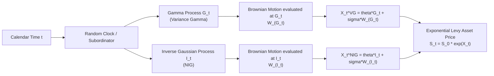

## Variance Gamma and Normal Inverse Gaussian Models

### Overview

The Variance Gamma (VG) and Normal Inverse Gaussian (NIG) models are two of the most widely used infinite-activity, pure-jump Lévy processes in financial modeling. Both are constructed via **Brownian subordination** — running Brownian motion on a random, non-decreasing "business time" clock — but differ in the subordinator distribution used (Gamma for VG, Inverse Gaussian for NIG), which produces distinct tail and small-jump behavior. Both offer parsimonious (three- to four-parameter), closed-form-characteristic-function alternatives to stochastic volatility and jump-diffusion models for fitting a single-maturity implied volatility smile.

### Brownian Subordination: The Shared Construction Principle

Both models follow the general template:

$$X_t = \theta \Theta_t + \sigma W_{\Theta_t}$$

where $W_t$ is standard Brownian motion, $\Theta_t$ is a **subordinator** (a non-decreasing Lévy process representing random "economic time"), $\theta$ controls skewness (asymmetric response to time-change shocks), and $\sigma$ scales the volatility of the time-changed Brownian motion. The economic interpretation is that markets do not evolve in calendar time but in a stochastic "information time" or "trading activity time" — periods of high trading intensity compress more variance into less calendar time, and vice versa.

### The Variance Gamma (VG) Model

**Subordinator**: $\Theta_t = G_t$, a Gamma process with mean rate $t$ and variance rate $\nu$ per unit time, i.e., $G_t \sim \text{Gamma}(t/\nu, \nu)$.

$$X_t^{VG} = \theta G_t + \sigma W_{G_t}$$

**Parameters** (three, plus $\sigma_0$ typically fixed by calibration to overall level):

- $\sigma$: volatility of the underlying Brownian motion
- $\nu$: variance rate of the Gamma time change — controls **kurtosis**; larger $\nu$ implies more randomness in the time change and fatter tails
- $\theta$: drift of the Brownian motion within the time change — controls **skewness**; $\theta < 0$ produces negative skew (typical equity index calibration)

**Density**: has a known closed form in terms of the modified Bessel function of the second kind, though in practice the characteristic function is used directly for pricing rather than the density.

**Characteristic function** (risk-neutral, martingale-corrected):

$$\phi_T^{VG}(u) = \left(1 - iu\theta\nu + \frac{1}{2}\sigma^2 u^2 \nu \right)^{-T/\nu} e^{iu(r+\omega)T}$$

where $\omega = \frac{1}{\nu}\ln\left(1 - \theta\nu - \frac{1}{2}\sigma^2\nu\right)$ is the convexity/compensator adjustment ensuring $\mathbb{E}[e^{X_T}] = e^{rT}$.

**Key properties**:

- Pure jump process: **infinite activity** (infinitely many jumps in any interval) but **finite variation** (the sum of absolute jump sizes converges) — paths have no continuous diffusion component yet are not "rough" in the fractal sense.
- Can be represented as the **difference of two independent Gamma processes**, giving an interpretation as the net of "up-moves" and "down-moves" each arriving via their own Gamma-timed jump processes.
- Nests Brownian motion as a limiting case as $\nu \to 0$.

### The Normal Inverse Gaussian (NIG) Model

**Subordinator**: $\Theta_t = I_t$, an Inverse Gaussian process — the first-passage-time process of a Brownian motion with drift, which is itself a Lévy process with I.G.-distributed increments.

$$X_t^{NIG} = \theta I_t + \sigma W_{I_t}$$

**Standard parameterization** (Barndorff-Nielsen, 1997) uses four parameters $(\alpha, \beta, \delta, \mu)$ instead:

- $\alpha > 0$: tail heaviness (steepness) — larger $\alpha$ means lighter (thinner) tails
- $\beta$, with $|\beta| < \alpha$: asymmetry parameter — $\beta < 0$ produces negative skew
- $\delta > 0$: scale parameter, analogous to volatility
- $\mu$: location/drift

**Density**: NIG has a genuinely closed-form probability density function (unlike VG's Bessel-function density, NIG's is more directly tractable):

$$f_{NIG}(x) = \frac{\alpha\delta}{\pi} \frac{K_1\left(\alpha\sqrt{\delta^2+(x-\mu)^2}\right)}{\sqrt{\delta^2+(x-\mu)^2}} e^{\delta\sqrt{\alpha^2-\beta^2}+\beta(x-\mu)}$$

where $K_1$ is the modified Bessel function of the second kind of order 1.

**Characteristic function**:

$$\phi_T^{NIG}(u) = \exp\left\{ T\left[ \delta\sqrt{\alpha^2-\beta^2} - \delta\sqrt{\alpha^2-(\beta+iu)^2} \right] + iu\mu T \right\}$$

**Key properties**:

- Also pure jump, **infinite activity**, and **finite variation**.
- Exhibits **semi-heavy tails**: exponentially decaying tails (unlike power-law-decaying stable distributions) but heavier than Gaussian — a good empirical match to observed daily equity and FX return distributions.
- Closed under convolution *only* when $\delta$ scales linearly and $\alpha,\beta$ are held fixed — meaning the NIG family is not closed under time-aggregation in general, an important caveat for multi-horizon consistency. [Inference] This aggregation limitation is one reason NIG (like VG) is typically calibrated per-maturity rather than assumed to hold identically across all tenors from a single parameter set.

### Comparison Table: VG vs. NIG

| Feature | Variance Gamma (VG) | Normal Inverse Gaussian (NIG) |
| --- | --- | --- |
| Subordinator | Gamma process | Inverse Gaussian process |
| Parameters | 3 ($\sigma, \nu, \theta$) | 4 ($\alpha, \beta, \delta, \mu$) |
| Variation | Finite | Finite |
| Activity | Infinite | Infinite |
| Closed-form density | Yes (Bessel-based, less tractable) | Yes (Bessel-based, more standard/tractable form) |
| Tail behavior | Semi-heavy, controlled via $\nu$ | Semi-heavy, controlled via $\alpha$ |
| Representation | Difference of two Gamma processes | Time-changed Brownian motion via I.G. clock |
| Typical domain of use | Equity, credit | FX, energy/commodities, equity |
| Aggregation property | Infinitely divisible; per-maturity recalibration typical | Infinitely divisible; per-maturity recalibration typical |

### Key Points

- Both models are **static, single-period distributions** in their basic form: they describe the risk-neutral distribution of log-returns over a fixed horizon $T$ well, but neither specifies, by itself, a fully self-consistent joint dynamic across *all* maturities simultaneously — recalibrating $(\sigma,\nu,\theta)$ or $(\alpha,\beta,\delta,\mu)$ at each maturity is standard practice, meaning the models are often used more like "smile interpolators" than fully dynamic term-structure models.
- Both are **more parsimonious** than Merton jump-diffusion (3-4 parameters vs. 5) while often achieving comparable or better single-maturity fit, since removing the separate diffusion term lets the (typically dominant) small-jump activity do double duty.
- Both require **Fourier-transform-based pricing** (Carr-Madan FFT) rather than a convergent closed-form series like Merton, since there is no simple "conditioning on number of jumps" decomposition for infinite-activity processes.
- **Market incompleteness** persists: neither model can be dynamically hedged with the underlying alone; risk-neutral pricing requires selecting a specific equivalent martingale measure (commonly via the **Esscher transform**, which is analytically convenient for both Gamma- and IG-subordinated processes).

### The Esscher Transform (Measure Change)

Because VG and NIG define return distributions under the physical measure, an equivalent martingale measure must be selected for risk-neutral pricing. The Esscher transform exponentially tilts the density:

$$f^{Q}(x) = \frac{e^{\eta x} f^{P}(x)}{\mathbb{E}^P[e^{\eta X}]}$$

where $\eta$ is chosen so that the discounted asset price is a martingale under $Q$. Both VG and NIG admit closed-form Esscher-tilted parameter transformations (the tilting simply shifts $\theta$/$\beta$ in a tractable way), which is a major practical reason for their popularity over less analytically convenient Lévy families.

### Example: Calibrating VG to a Single-Maturity Smile

```python
import numpy as np
from scipy.optimize import minimize
from scipy.integrate import quad

def vg_char_function(u, T, sigma, nu, theta, r):
    omega = (1.0/nu) * np.log(1 - theta*nu - 0.5*sigma**2*nu)
    return np.exp(1j*u*(r+omega)*T) * \
           (1 - 1j*u*theta*nu + 0.5*sigma**2*u**2*nu) ** (-T/nu)

def carr_madan_call_price(S0, K, T, r, char_func_params, alpha=1.5, N=4096, eta=0.25):
    # Standard Carr-Madan FFT setup (illustrative structure)
    lam = 2*np.pi / (N*eta)
    b = N*lam / 2
    ks = -b + lam*np.arange(N)
    v = eta*np.arange(N)
    # ... (FFT evaluation of the damped call price transform) ...
    # Returns array of call prices across strikes ks
    pass

def calibration_objective(params, market_strikes, market_ivs, S0, T, r):
    sigma, nu, theta = params
    model_prices = carr_madan_call_price(S0, market_strikes, T, r,
                                          (sigma, nu, theta))
    # Convert to implied vols and compare to market_ivs (squared error)
    return np.sum((model_prices - market_ivs)**2)  # simplified illustrative form

result = minimize(calibration_objective, x0=[0.2, 0.3, -0.1],
                   args=(strikes, market_ivs, S0, T, r),
                   method='Nelder-Mead')
```

[Inference] Production calibration typically uses a proper FFT implementation (full Carr-Madan grid evaluation) rather than repeated single-strike integration, for computational efficiency across the full strike grid at each optimizer iteration; the sketch above simplifies this for illustrative clarity.

### Diagram: Subordination Mechanism



### SVG: Return Density Comparison (Illustrative Shapes)

<svg viewBox="0 0 640 320" xmlns="http://www.w3.org/2000/svg">
<text x="320" y="22" font-size="15" text-anchor="middle" font-family="sans-serif" font-weight="bold">Return Density: Normal vs. VG vs. NIG (svg_diagram)</text>
<line x1="60" y1="270" x2="580" y2="270" stroke="black" stroke-width="1.5"/>
<line x1="320" y1="270" x2="320" y2="50" stroke="black" stroke-width="0.5" stroke-dasharray="2,2"/>
<text x="320" y="290" font-size="12" text-anchor="middle" font-family="sans-serif">Log-Return</text>

<path d="M 100 265 Q 220 260 260 180 Q 300 60 320 60 Q 340 60 380 180 Q 420 260 540 265"
fill="none" stroke="`#888888`" stroke-width="2"/>

<text x="130" y="255" font-size="11" fill="`#888888`" font-family="sans-serif">Normal (Gaussian)</text>

<path d="M 90 267 Q 200 262 250 190 Q 295 70 320 55 Q 345 65 385 175 Q 430 258 550 267"
fill="none" stroke="`#1f77b4`" stroke-width="2.5"/>

<text x="420" y="90" font-size="11" fill="`#1f77b4`" font-family="sans-serif">VG (symmetric params)</text>

<path d="M 85 268 Q 190 264 240 210 Q 290 75 315 52 Q 335 45 380 160 Q 440 255 560 268"
fill="none" stroke="`#d62728`" stroke-width="2.5"/>

<text x="80" y="230" font-size="11" fill="`#d62728`" font-family="sans-serif">NIG (negative skew, theta<0)</text>

</svg>

### Practical Applications

- **Fast smile fitting**: both models are widely used for quickly interpolating/extrapolating a single-maturity implied volatility smile with few parameters, useful for exotic desks needing a smooth arbitrage-free vanilla surface as an input to Monte Carlo pricing of path-dependent payoffs.
- **Credit and structural models**: VG in particular has been used as a firm-value process in structural credit models (Madan-related literature), since its jump component naturally generates sudden, large negative moves consistent with default events.
- **FX and commodity smile modeling**: NIG's four-parameter flexibility and good semi-heavy-tail fit make it a common choice in FX options desks, where symmetric/near-symmetric smiles with fat tails are typical.
- **Time-changed extensions**: replacing the deterministic Gamma/IG subordinator with a *stochastic-volatility-driven* time change (Carr-Geman-Madan-Yor, Carr-Wu frameworks) reintroduces term-structure-consistent, stochastic-volatility-like dynamics on top of the VG/NIG jump structure, addressing the single-maturity limitation.

### Limitations

- Neither model, in its basic form, provides an internally consistent multi-maturity term structure without per-tenor recalibration — a structural gap relative to fully dynamic SV or SLV models.
- Because both are pure-jump processes with independent increments (in the Lévy sense), they do not by themselves generate the path-dependent, self-exciting clustering of volatility (volatility clustering) observed empirically, unless embedded within a time-changed or stochastic-intensity extension.
- Parameter interpretation, while more tractable than raw Lévy-measure specification, is still less immediately intuitive than Merton's "jump frequency / jump size" framing for non-quant stakeholders. [Unverified] This is sometimes cited informally as a reason some trading desks continue to favor Merton-style or SV-jump hybrid models for stakeholder communication despite VG/NIG's superior single-maturity fit in some markets.

### Related Topics

- The Merton jump-diffusion model (finite-activity comparison)
- CGMY model as a four-parameter generalization nesting VG
- Carr-Madan FFT option pricing implementation
- Time-changed Lévy processes (Carr-Geman-Madan-Yor, Carr-Wu)
- Esscher transform and equivalent martingale measure selection
- Structural credit risk models with Lévy-driven firm value