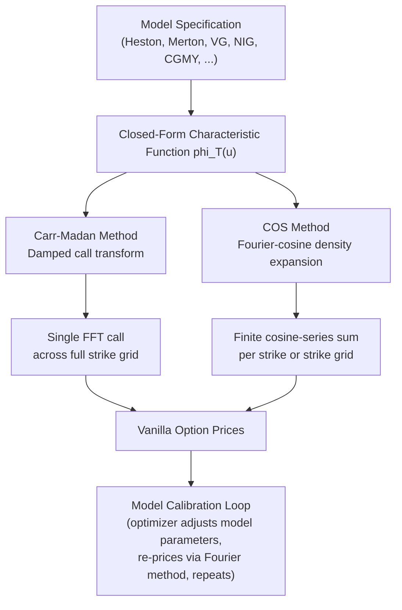

## Fourier and Characteristic Function Pricing

### Overview

Fourier and characteristic function pricing methods form the standard computational toolkit for option pricing under jump-diffusion and Lévy process models, where closed-form density functions are often unavailable or intractable but the characteristic function (Fourier transform of the density) is known analytically. These methods exploit the mathematical duality between a distribution's density and its characteristic function to compute option prices via numerical Fourier inversion, typically implemented as a Fast Fourier Transform (FFT) for computational efficiency across an entire strike grid simultaneously.

### Why Characteristic Functions Matter

For most models beyond Black-Scholes and Merton's convergent series, the risk-neutral probability density of log-returns $\ln(S_T/S_0)$ has no simple closed form. However, the **characteristic function**:

$$\phi_T(u) = \mathbb{E}^Q\left[e^{iu \ln S_T}\right]$$

is available in closed form for essentially every model of practical interest — Heston, Bates, Merton, Variance Gamma, NIG, CGMY, and more — because the characteristic function of an affine or Lévy process typically has an explicit exponential-affine or Lévy-Khintchine form. This makes Fourier methods the **unifying computational framework** across the entire landscape of advanced option pricing models.

### Key Points

- **Universality**: any model with a known characteristic function can be priced via Fourier methods, regardless of whether the underlying process is diffusive, jump-diffusion, pure-jump, finite-activity, or infinite-activity.
- **Speed**: a single FFT evaluation prices options across an entire grid of strikes simultaneously (typically thousands of strikes) in a fraction of a second, versus needing separate Monte Carlo simulations or numerical integrations per strike.
- **Calibration enabler**: because model calibration to a market vanilla surface requires repeatedly re-pricing hundreds of options as parameters are varied by an optimizer, Fourier methods' speed is what makes calibration of Heston, Bates, VG, NIG, and CGMY models computationally feasible in practice.
- **Two dominant approaches**: the **Carr-Madan (1999) damped FFT method** and the **COS method** (Fang and Oosterlee, 2008) using Fourier-cosine series expansion — both are widely used, with different trade-offs in accuracy, speed, and implementation complexity.

### The Carr-Madan Method

**Core idea**: the raw call price transform is not integrable (it doesn't decay at low strikes), so Carr and Madan introduce a damping factor $\alpha > 0$ applied to the call price $c_T(k) = e^{-\alpha k} C_T(k)$ (where $k = \ln K$), making the damped price integrable and Fourier-transformable.

**Derivation sketch**: the Fourier transform of the damped call price is:

$$\psi_T(u) = \frac{e^{-rT}\phi_T(u - (\alpha+1)i)}{\alpha^2 + \alpha - u^2 + i(2\alpha+1)u}$$

Recovering the call price via inverse Fourier transform and applying a discretization suitable for FFT evaluation (Simpson's rule weighting for accuracy) gives:

$$C_T(k) = \frac{e^{-\alpha k}}{\pi} \int_0^\infty e^{-iuk} \psi_T(u) \, du$$

which is evaluated numerically for an entire vector of strikes $k_j$ via a single FFT call.

**Practical parameters**:

- $\alpha$ (damping factor): typically $\alpha \in [1, 2]$ for equity index options; too small risks integrability issues, too large amplifies numerical error at extreme strikes. [Inference] The specific optimal value is model- and market-dependent and is often chosen by numerical experimentation rather than a universal rule.
- $N$ (FFT grid size): typically a power of 2 (e.g., 4096 or 8192) for FFT efficiency
- $\eta$ (integration grid spacing) and $\lambda$ (log-strike grid spacing) are linked by the discrete Fourier transform's Nyquist-type relation: $\lambda \eta = 2\pi/N$

### The COS Method (Fourier-Cosine Expansion)

An alternative approach (Fang & Oosterlee, 2008) expands the density in a **Fourier-cosine series** over a truncated interval $[a,b]$ chosen to capture essentially all probability mass:

$$f(x) \approx \sum_{k=0}^{N-1} {}' A_k \cos\left(k\pi \frac{x-a}{b-a}\right)$$

where the cosine coefficients $A_k$ are recovered directly from the characteristic function:

$$A_k = \frac{2}{b-a} \text{Re}\left\{ \phi\left(\frac{k\pi}{b-a}\right) e^{-ik\pi a/(b-a)} \right\}$$

The option price is then a finite sum (not requiring an FFT at all, though FFT can accelerate it further for many strikes) combining these coefficients with analytically known cosine-series coefficients of the payoff function.

**Advantages over Carr-Madan**: often achieves comparable accuracy with **fewer terms** (faster for single-strike or small-strike-grid pricing), and avoids the damping-factor tuning issue since it works directly with the density expansion rather than a damped price transform. **Disadvantage**: choosing the truncation range $[a,b]$ requires care (typically via cumulant-based heuristics), and it is less naturally suited to producing prices across a very large simultaneous strike grid compared to a single FFT call.

### Comparison Table

| Feature | Carr-Madan FFT | COS Method |
| --- | --- | --- |
| Core technique | Damped call transform + FFT | Fourier-cosine density expansion |
| Tuning parameter | Damping factor $\alpha$ | Truncation range $[a,b]$ |
| Best suited for | Large simultaneous strike grids | Fast single/few-strike pricing, PDE-alternative use |
| Typical terms/grid size | $N = 2^{12}$–$2^{13}$ (FFT-driven) | $N \sim 100$–$500$ cosine terms often sufficient |
| Common pitfalls | Damping factor sensitivity, strike range coverage | Truncation range misspecification cutting off tail mass |
| Extension to American/exotic options | Less direct | Naturally extends to Bermudan/early-exercise via backward induction (COS-based PDE analog) |

### Example: Carr-Madan Implementation Sketch

```python
import numpy as np

def carr_madan_fft_prices(S0, r, T, char_func, alpha=1.5, N=4096, eta=0.25):
    """
    char_func: function(u) -> complex, the risk-neutral characteristic
               function phi_T(u) of log(S_T) under the model.
    Returns: (strikes, call_prices)
    """
    lam = 2 * np.pi / (N * eta)          # log-strike grid spacing
    b = N * lam / 2.0                     # half-width of strike grid
    log_strikes = -b + lam * np.arange(N)
    strikes = S0 * np.exp(log_strikes)

    u = eta * np.arange(N)
    # Simpson's rule weights for improved accuracy
    simpson_weights = np.ones(N)
    simpson_weights[1:-1:2] = 4
    simpson_weights[2:-1:2] = 2
    simpson_weights *= eta / 3.0

    denom = (alpha**2 + alpha - u**2) + 1j * (2*alpha + 1) * u
    numerator = np.exp(-r*T) * char_func(u - (alpha+1)*1j)
    psi = numerator / denom

    integrand = np.exp(1j * u * b) * psi * simpson_weights
    fft_values = np.fft.fft(integrand).real

    call_prices = (np.exp(-alpha * log_strikes) / np.pi) * fft_values
    return strikes, call_prices

def heston_char_function(u, T, S0, r, v0, kappa, theta, xi, rho):
    """Heston model characteristic function (standard affine form)."""
    x0 = np.log(S0)
    a = kappa * theta
    b = kappa - rho * xi * 1j * u
    d = np.sqrt(b**2 + xi**2 * (1j*u + u**2))
    g = (b - d) / (b + d)

    C = r*1j*u*T + (a/xi**2) * (
        (b - d)*T - 2*np.log((1 - g*np.exp(-d*T)) / (1 - g))
    )
    D = ((b - d) / xi**2) * ((1 - np.exp(-d*T)) / (1 - g*np.exp(-d*T)))

    return np.exp(C + D*v0 + 1j*u*x0)
```

**Output** (illustrative): the function returns an array of call prices spanning several thousand strikes computed in a single FFT call, typically executing in milliseconds — orders of magnitude faster than pricing each strike via separate numerical integration or Monte Carlo simulation, which is precisely why this approach underlies real-time model calibration.

### Diagram: Fourier Pricing Workflow



### SVG: Density vs. Characteristic Function Duality

<svg xmlns="http://www.w3.org/2000/svg" viewBox="0 0 640 300">
<text x="320" y="22" font-size="15" text-anchor="middle" font-family="sans-serif" font-weight="bold">Density and Characteristic Function Duality (svg_diagram)</text>
<rect x="60" y="60" width="220" height="160" fill="none" stroke="#1f77b4" stroke-width="1.5" rx="6" />
<text x="170" y="80" font-size="12" text-anchor="middle" font-family="sans-serif" font-weight="bold">Real Space</text>
<path d="M 80 190 Q 130 100 170 90 Q 210 100 260 190" fill="none" stroke="#1f77b4" stroke-width="2.5" />
<text x="170" y="210" font-size="11" text-anchor="middle" font-family="sans-serif">Density f(x)</text>
<text x="170" y="130" font-size="11" text-anchor="middle" font-family="sans-serif">(often unknown / intractable)</text>
<rect x="360" y="60" width="220" height="160" fill="none" stroke="#d62728" stroke-width="1.5" rx="6" />
<text x="470" y="80" font-size="12" text-anchor="middle" font-family="sans-serif" font-weight="bold">Fourier Space</text>
<path d="M 380 140 Q 420 90 470 140 Q 520 190 570 140" fill="none" stroke="#d62728" stroke-width="2.5" />
<text x="470" y="210" font-size="11" text-anchor="middle" font-family="sans-serif">Characteristic Function phi(u)</text>
<text x="470" y="100" font-size="11" text-anchor="middle" font-family="sans-serif">(known closed form)</text>
<line x1="285" y1="140" x2="355" y2="140" stroke="black" stroke-width="1.5" marker-end="url(#arrow)" />
<text x="320" y="130" font-size="10" text-anchor="middle" font-family="sans-serif">FT</text>
<line x1="355" y1="160" x2="285" y2="160" stroke="black" stroke-width="1.5" marker-end="url(#arrow2)" />
<text x="320" y="178" font-size="10" text-anchor="middle" font-family="sans-serif">Inverse FT</text>
</svg>

### Numerical Considerations and Common Pitfalls

- **Strike range coverage**: the FFT log-strike grid spacing $\lambda$ and count $N$ jointly determine which strikes are covered; a poorly chosen grid can miss the strikes needed for calibration to specific market quotes, requiring **interpolation** back onto the market's actual strike grid after the FFT.
- **Damping factor sensitivity (Carr-Madan)**: an inappropriate $\alpha$ can cause the integrand to be poorly behaved (oscillatory or non-decaying), producing inaccurate prices, particularly for far-OTM strikes; practitioners typically validate against a known closed-form case (e.g., Black-Scholes characteristic function) before trusting a new model implementation.
- **High-frequency oscillation at long maturities or extreme parameters**: some models' characteristic functions (Heston, in particular) require careful branch-cut handling of the complex logarithm term (the "Heston trap") to avoid discontinuities in $C$ as $T$ grows; failing to use the correct branch (often via the Albrecher et al. 2007 "little trap" formulation) produces silently wrong prices for long-dated options. [Inference] This is a well-documented numerical pitfall in the literature rather than a universal implementation bug, but it recurs frequently enough in practitioner discussions to warrant explicit mention.
- **Put-call parity cross-check**: since Fourier methods most naturally price calls, puts are typically recovered via put-call parity rather than a separate transform, providing a useful internal consistency check.

### Extensions Beyond European Vanillas

- **Bermudan/American options**: the COS method extends naturally to a backward-induction scheme (analogous to a PDE solver's time-stepping) by repeatedly applying the Fourier-cosine continuation-value approximation at each exercise date.
- **Barrier options**: specialized Fourier techniques (e.g., the Fourier-cosine method adapted for barriers, or Green's function / Wiener-Hopf factorization approaches for Lévy processes) extend characteristic-function pricing to path-dependent payoffs, though with greater implementation complexity than the vanilla case.
- **Multi-asset/basket options**: multivariate characteristic functions (e.g., under multi-dimensional Lévy or affine models) allow Fourier techniques to extend to basket and spread options, generally via multi-dimensional FFT or COS analogs, at increased computational cost that grows with dimensionality.

### Related Topics

- The Heston model characteristic function and the "Heston trap" branch-cut issue
- The COS method for Bermudan/American option pricing
- Affine jump-diffusion models and their exponential-affine characteristic functions
- Model calibration workflows using Fourier-based pricing engines
- Wiener-Hopf factorization for barrier option pricing under Lévy processes
- Implied volatility surface construction from Fourier-derived vanilla prices