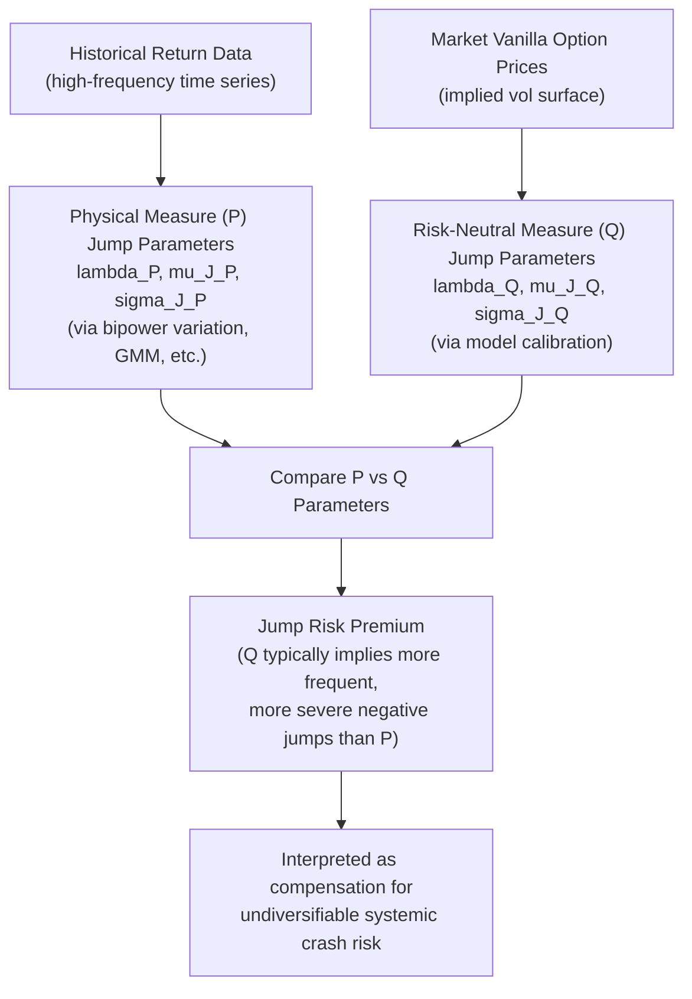

## Fat Tails and Jump Risk Premia

### Overview

Fat tails refer to the empirically observed excess probability of extreme returns relative to the Gaussian distribution assumed by Black-Scholes, while jump risk premia describe the additional compensation investors demand for bearing the risk of sudden, discontinuous price moves that cannot be diversified away. Together these concepts explain both *why* jump-diffusion and Lévy models are needed to fit option prices, and *why* the risk-neutral (option-implied) distribution of jumps differs systematically from the physical (realized, historical) distribution — a gap that is itself a tradeable and empirically measurable quantity.

### Fat Tails: Empirical Motivation

**Kurtosis excess**: empirical daily equity return distributions exhibit kurtosis significantly above the Gaussian value of 3 (often in the range of 5-10+ for individual stocks and indices over various sample periods), meaning extreme moves (both up and down) occur far more frequently than a normal distribution would predict. [Inference] Exact kurtosis estimates are highly sample-period and frequency dependent (e.g., much higher at intraday frequencies, lower after aggregation to monthly returns), so no single universal number applies across all assets and horizons.

**Sources of fat tails**:

- **Discontinuous jumps**: earnings surprises, macroeconomic announcements, geopolitical shocks, and market crashes produce discrete large moves that a continuous diffusion process cannot generate at any finite variance.
- **Stochastic volatility clustering**: periods of high volatility clustering together (volatility mean-reversion with persistence) produces unconditional fat tails even without explicit jumps, since the return distribution becomes a *mixture* of different volatility regimes.
- **Both effects compound**: models combining jumps and stochastic volatility (Bates, SVJ) generally fit the full empirical kurtosis/skewness profile better than either jumps or stochastic volatility alone, particularly across multiple return horizons simultaneously.

### Physical vs. Risk-Neutral Jump Distributions

A central and often counterintuitive finding in the jump-risk literature is that the **risk-neutral (Q-measure) jump distribution inferred from option prices differs substantially from the physical (P-measure) jump distribution estimated from historical return data** — and this difference is not an estimation artifact but reflects genuine risk compensation (a jump risk premium).

- **Risk-neutral jump intensity and severity** (inferred from option-implied skew/smile) are typically found to be **larger** than what historical time-series of realized jumps alone would suggest — i.e., option prices embed a *premium* for jump/crash risk beyond the historically realized frequency and severity of jumps.
- This is analogous to (and related to) the well-documented **variance risk premium**: the risk-neutral (implied) variance-swap rate typically trades above the subsequently realized variance on average, reflecting compensation for bearing variance risk; the jump risk premium is a related, but distinct, higher-moment analog focused specifically on the tail/skewness/kurtosis risk compensation rather than the overall variance level.

### Key Points

- **Jump risk is generally undiversifiable** for systemic (market-wide) jumps such as crashes — unlike idiosyncratic single-stock jump risk (e.g., an earnings surprise for one company), which *can* in principle be diversified across a large portfolio, consistent with Merton's (1976) original zero-risk-premium assumption for idiosyncratic jumps.
- **Systemic/market jump risk carries a premium** precisely because it cannot be diversified away and tends to be correlated with bad states of the world (crashes coincide with high marginal utility of wealth for a representative investor) — this is the standard asset-pricing rationale (consistent with the broader equity/variance risk premium literature) for why risk-neutral crash probabilities exceed physical ones.
- **Term structure of the jump risk premium**: the wedge between risk-neutral and physical jump risk is generally most pronounced at **short maturities** (where the pronounced OTM put skew is most visible) and tends to narrow, though not disappear, at longer maturities.
- **Measurement challenge**: because jumps are rare, physical-measure jump parameters ($\lambda, \mu_J, \sigma_J$ under Merton, or the Lévy measure under a general Lévy specification) are difficult to estimate precisely from historical data — a long history is needed to observe enough jump events for reliable inference, creating inherent estimation uncertainty that itself complicates cleanly separating "risk premium" from "estimation noise."

### Decomposing the Jump Risk Premium

A standard framework (drawing on the equity/variance premium literature applied to jumps) decomposes the wedge between $Q$-measure and $P$-measure jump parameters into:

$$\underbrace{\lambda^Q}_{\text{risk-neutral intensity}} = \lambda^P \times \underbrace{\eta_\lambda}_{\text{intensity risk premium multiplier}}$$

$$\underbrace{\mu_J^Q}_{\text{risk-neutral mean jump size}} = \mu_J^P - \underbrace{\eta_\mu}_{\text{jump-size risk premium shift}}$$

where the multipliers/shifts $\eta_\lambda, \eta_\mu$ are typically found empirically to imply $\lambda^Q > \lambda^P$ (more frequent jumps priced in than historically observed) and $\mu_J^Q$ more negative than $\mu_J^P$ (larger downward jumps priced in than historically realized) for equity index options. [Inference] The specific functional form and magnitude of this decomposition varies across academic studies and calibration methodologies; the qualitative direction (Q-measure more "pessimistic" than P-measure) is the more robust and widely replicated finding.

### Example: The "Volatility Smirk as Crash Insurance" Interpretation

Consider SPX index options: the pronounced negative skew (OTM puts trading at markedly higher implied volatility than OTM calls) can be interpreted through this lens as follows:

- If $\lambda^P, \mu_J^P$ (historically estimated crash frequency and severity) were plugged directly into a risk-neutral pricing formula, the resulting OTM put prices would generally be **lower** than what is actually observed in the market.
- The gap between model-implied (using $P$-measure parameters naively) and market-observed OTM put prices is often interpreted as investors paying a premium for **crash insurance** — the put option pays off precisely in the states investors most want to be protected (market crashes), so they are willing to pay more than the "actuarially fair" (historically-estimated) price for that protection.
- This is one of several standard explanations offered in the literature for the **post-1987 persistent equity index volatility skew** ("volatility smirk"), alongside leverage effects and stochastic volatility risk premia; these explanations are generally viewed as complementary rather than mutually exclusive. [Inference] The relative quantitative contribution of jump risk premia versus leverage effects versus stochastic volatility risk premia to the total observed skew remains an active empirical research question without full consensus.

### Estimating Jump Parameters: Physical Measure Methods

| Method | Approach | Key limitation |
| --- | --- | --- |
| Bipower variation (Barndorff-Nielsen & Shephard) | Decomposes realized variance into continuous and jump components using high-frequency returns | Requires high-frequency (intraday) data; sensitive to microstructure noise |
| Threshold/truncation methods | Classifies returns exceeding a volatility-scaled threshold as jumps | Threshold choice is somewhat arbitrary; sensitive to time-varying volatility |
| GMM/MLE on historical return time series | Fits a jump-diffusion model directly to a long history of returns | Rare jump events mean long samples needed; parameter estimates can be unstable |
| Cross-sectional/panel approaches | Pools jump identification across many assets to increase effective sample size | Assumes some commonality in jump processes across assets, which may not hold |

### Estimating Jump Parameters: Risk-Neutral Measure Methods

Risk-neutral jump parameters are recovered by **calibrating a jump-diffusion or Lévy model to the observed vanilla implied volatility surface** (as covered in the Merton, VG/NIG, and Fourier-pricing material) — this directly yields $\lambda^Q, \mu_J^Q, \sigma_J^Q$ (or the equivalent Lévy measure parameters) as the "market-implied" jump risk parameters, which can then be compared against independently estimated physical-measure parameters to quantify the premium.

### Diagram: Physical vs. Risk-Neutral Jump Distribution Comparison

### SVG: Physical vs. Risk-Neutral Tail Comparison

<svg xmlns="http://www.w3.org/2000/svg" viewBox="0 0 640 320">
<text x="320" y="22" font-size="15" text-anchor="middle" font-family="sans-serif" font-weight="bold">Physical vs. Risk-Neutral Left-Tail Probability (svg_diagram)</text>
<line x1="60" y1="270" x2="580" y2="270" stroke="black" stroke-width="1.5" />
<line x1="60" y1="270" x2="60" y2="50" stroke="black" stroke-width="1.5" />
<text x="320" y="295" font-size="12" text-anchor="middle" font-family="sans-serif">Return (negative tail region highlighted)</text>
<text x="30" y="160" font-size="12" text-anchor="middle" font-family="sans-serif" transform="rotate(-90 30 160)">Density</text>

<path d="M 100 260 Q 200 240 280 100 Q 340 60 400 100 Q 480 240 560 260" fill="none" stroke="`#888888`" stroke-width="2" />

<text x="440" y="80" font-size="11" fill="`#888888`" font-family="sans-serif">Physical (P) density</text>

<path d="M 100 262 Q 180 250 220 150 Q 260 90 320 68 Q 380 90 420 150 Q 480 235 560 262" fill="none" stroke="`#d62728`" stroke-width="2.5" />

<text x="130" y="200" font-size="11" fill="`#d62728`" font-family="sans-serif">Risk-neutral (Q) density</text>

<text x="130" y="215" font-size="11" fill="`#d62728`" font-family="sans-serif">(fatter left tail = jump premium)</text>

<rect x="90" y="255" width="150" height="15" fill="#d62728" opacity="0.15" />
<text x="165" y="250" font-size="10" fill="#d62728" text-anchor="middle" font-family="sans-serif">Premium region</text>
</svg>

### Trading and Risk Management Implications

- **Variance/volatility risk premium strategies**: systematically selling variance swaps or OTM options to harvest the wedge between risk-neutral and physical volatility/jump expectations is a well-known (though far from riskless — subject to occasional severe drawdowns precisely when crashes occur) strategy category, directly motivated by this premium.
- **Tail hedging cost assessment**: understanding that OTM put prices embed a risk premium (not just an "actuarially fair" crash probability) helps desks and risk managers correctly interpret why systematic tail-hedging programs have a persistent negative expected carry cost in most periods, punctuated by large payoffs in crash states.
- **Model risk in exotic pricing**: since jump risk premia mean that risk-neutral (pricing-relevant) jump parameters differ from physical (real-world simulation/scenario-relevant) parameters, using the wrong measure for the wrong purpose (e.g., using Q-measure parameters for physical-measure stress testing, or vice versa) is a documented source of modeling error.
- **Credit-equity linkage**: jump risk premia in equity options have documented linkages to credit spreads (via structural credit models), since both reflect compensation for the same underlying systemic default/crash risk from different market angles.

### Related Topics

- The variance risk premium and variance swap pricing
- Bipower variation and jump detection from high-frequency data
- The Bates (SVJ) model as a framework combining stochastic volatility and jump risk premia
- Structural credit models and the credit-equity jump risk linkage
- Tail-hedging strategy design and cost-of-carry analysis
- Equilibrium asset pricing explanations for the equity variance/jump risk premium