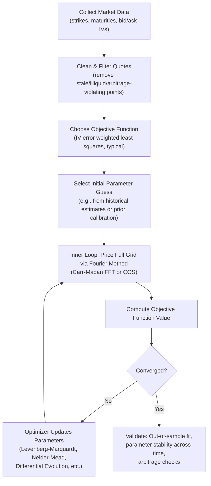

## Calibrating Jump Models to Market Data

### Overview

Calibrating jump-diffusion and Lévy models to market data is the process of finding model parameters that make theoretical option prices match observed market prices as closely as possible, across a grid of strikes and maturities. Unlike local volatility calibration (which can, in principle, exactly reproduce the full vanilla surface via Dupire's formula), jump/Lévy model calibration is a **numerical optimization problem**: the parameter set is typically small (3-5 parameters), so an exact fit to every quoted strike/maturity is generally impossible, and calibration instead minimizes a pricing or implied-volatility error metric.

### The Calibration Problem, Formally

Given a set of market-observed option prices (or implied volatilities) $\{IV_i^{mkt}\}_{i=1}^{N}$ across strikes $K_i$ and maturities $T_i$, and a model with parameter vector $\Theta$ (e.g., $\Theta = (\sigma, \lambda, \mu_J, \sigma_J)$ for Merton, or $(\sigma,\nu,\theta)$ for VG), calibration solves:

$$\hat\Theta = \arg\min_{\Theta} \sum_{i=1}^{N} w_i \left( IV_i^{model}(\Theta) - IV_i^{mkt} \right)^2$$

where $w_i$ are weights (often based on vega, bid-ask spread inverse, or liquidity), and $IV_i^{model}(\Theta)$ requires first computing the model price $C_i^{model}(\Theta)$ (via Fourier/Carr-Madan or COS methods) and then inverting Black-Scholes to obtain an implied volatility for comparison — since raw price errors across strikes are not directly comparable due to vastly different vega sensitivities at different moneyness levels.

### Key Points

- **Objective function choice matters**: calibrating to raw price errors overweights near-the-money, high-vega options; calibrating to implied volatility errors gives more balanced weight across the smile, and is the more standard practice for skew-sensitive jump model calibration.
- **Non-convex optimization**: the mapping from model parameters to option prices is generally non-convex and can exhibit multiple local minima, particularly for models with 4+ parameters (Bates, CGMY, NIG) — calibration robustness (via multi-start optimization, global optimizers, or good initial guesses) is a first-order practical concern, not an afterthought.
- **Speed dependency on Fourier methods**: because a single calibration run typically requires hundreds to thousands of objective function evaluations (each requiring re-pricing the entire strike/maturity grid), the practical feasibility of jump model calibration depends directly on fast Fourier-based pricing (Carr-Madan FFT or COS method) rather than slower alternatives like Monte Carlo or PDE methods for the inner pricing loop.
- **Parameter identifiability**: some parameter combinations can be weakly identified from a single-maturity smile alone (e.g., in Merton's model, $\lambda$ and $\sigma_J$ can trade off against each other to produce similar aggregate kurtosis) — calibrating across **multiple maturities simultaneously** generally improves identifiability, since jump and diffusion effects separate more cleanly across the term structure (jumps dominate short maturities, diffusion dominates via the CLT at longer maturities).

### Calibration Workflow



### Data Preparation Considerations

- **Bid-ask filtering**: options with wide bid-ask spreads (typically deep OTM or far-dated illiquid strikes) carry unreliable price signals and are often excluded or down-weighted.
- **Arbitrage checks before calibration**: the input implied volatility surface should itself be checked for static arbitrage (calendar spread arbitrage, butterfly arbitrage) before calibration, since fitting a model to an internally inconsistent surface produces a calibration that inherits and potentially amplifies those inconsistencies.
- **Forward and discount curve consistency**: jump/Lévy model calibration requires accurate forward prices (dividend yield or repo-adjusted) and discount factors as inputs; errors here can be misattributed to jump/vol parameters by the optimizer, producing spurious calibration results.
- **Maturity and moneyness range selection**: including a wide range of maturities (from short-dated, jump-dominated to longer-dated, diffusion-dominated) is important for pinning down all model parameters; calibrating only to a single short maturity risks parameter non-identifiability discussed above.

### Optimization Algorithm Choices

| Algorithm | Characteristics | When to use |
| --- | --- | --- |
| Levenberg-Marquardt | Fast local convergence for smooth least-squares problems; gradient-based | Good initial guess available; smooth, well-behaved objective |
| Nelder-Mead (simplex) | Derivative-free, robust to mild non-smoothness | Small parameter count (3-4); moderate robustness needs |
| Differential Evolution / Genetic Algorithms | Global search, avoids local minima | Higher-dimensional models (Bates, CGMY); uncertain initial guess |
| Simulated Annealing | Global search via probabilistic acceptance of worse solutions | Alternative global method; can be slower to converge than DE |
| Multi-start local optimization | Runs local optimizer (e.g., L-M) from many random starting points | Practical compromise: combines local speed with some global robustness |

[Inference] The specific algorithm choice in production systems is often driven as much by existing infrastructure and desk conventions as by a rigorous head-to-head performance comparison; multi-start local optimization is a commonly cited practical compromise in the literature.

### Example: Merton Model Calibration in Python

```python
import numpy as np
from scipy.optimize import minimize
from scipy.stats import norm

def bs_call_price(S, K, T, r, sigma):
    d1 = (np.log(S/K) + (r + 0.5*sigma**2)*T) / (sigma*np.sqrt(T))
    d2 = d1 - sigma*np.sqrt(T)
    return S*norm.cdf(d1) - K*np.exp(-r*T)*norm.cdf(d2)

def merton_call_price(S, K, T, r, sigma, lam, mu_J, sigma_J, n_terms=30):
    """Merton's convergent series formula."""
    k = np.exp(mu_J + 0.5*sigma_J**2) - 1
    lam_prime = lam * (1 + k)
    price = 0.0
    for n in range(n_terms):
        poisson_weight = np.exp(-lam_prime*T) * (lam_prime*T)**n / np.math.factorial(n)
        sigma_n = np.sqrt(sigma**2 + n*sigma_J**2/T)
        r_n = r - lam*k + n*np.log(1+k)/T
        price += poisson_weight * bs_call_price(S, K, T, r_n, sigma_n)
    return price

def implied_vol_from_price(price, S, K, T, r):
    """Simple bisection to invert Black-Scholes for IV."""
    lo, hi = 1e-4, 5.0
    for _ in range(100):
        mid = 0.5*(lo+hi)
        if bs_call_price(S, K, T, r, mid) > price:
            hi = mid
        else:
            lo = mid
    return mid

def calibration_objective(params, S, strikes, maturities, market_ivs, r):
    sigma, lam, mu_J, sigma_J = params
    if sigma <= 0 or lam < 0 or sigma_J <= 0:
        return 1e6  # penalize infeasible region
    errors = []
    for K, T, iv_mkt in zip(strikes, maturities, market_ivs):
        model_price = merton_call_price(S, K, T, r, sigma, lam, mu_J, sigma_J)
        iv_model = implied_vol_from_price(model_price, S, K, T, r)
        errors.append((iv_model - iv_mkt)**2)
    return np.sum(errors)

# Multi-start approach for robustness
best_result, best_obj = None, np.inf
initial_guesses = [
    [0.15, 0.5, -0.10, 0.10],
    [0.20, 1.0, -0.15, 0.15],
    [0.12, 0.3, -0.05, 0.08],
]
for x0 in initial_guesses:
    result = minimize(calibration_objective, x0,
                       args=(S0, strikes, maturities, market_ivs, r),
                       method='Nelder-Mead')
    if result.fun < best_obj:
        best_obj, best_result = result.fun, result
```

[Inference] The bisection-based implied volatility inversion above favors clarity over speed; production systems typically use a faster Newton-Raphson-with-fallback approach or a closed-form rational approximation (e.g., Jäckel's "Let's Be Rational") for high-throughput calibration loops.

### Validation and Diagnostics Post-Calibration

- **In-sample fit quality**: root-mean-square implied volatility error across the calibration grid, typically reported in volatility points (e.g., "RMSE of 0.3 vol points").
- **Out-of-sample/holdout testing**: calibrating to a subset of strikes/maturities and checking fit quality on held-out quotes tests genuine generalization versus overfitting to noise in the calibration set.
- **Parameter stability over time**: re-calibrating daily/weekly and tracking parameter drift; wildly unstable parameters from one day to the next often indicate identifiability problems, data quality issues, or a genuinely poor model fit for the current market regime rather than a "true" change in underlying dynamics.
- **Arbitrage-freeness of the fitted surface**: verifying the calibrated model doesn't imply, at intermediate strikes/maturities not directly in the calibration grid, prices that violate no-arbitrage bounds (particularly relevant for models with fewer parameters than degrees of freedom in the market surface).

### SVG: Calibration Fit Diagnostic

<svg xmlns="http://www.w3.org/2000/svg" viewBox="0 0 640 320">
<text x="320" y="22" font-size="15" text-anchor="middle" font-family="sans-serif" font-weight="bold">Calibrated Model Smile vs. Market Quotes (svg_diagram)</text>
<line x1="60" y1="270" x2="580" y2="270" stroke="black" stroke-width="1.5" />
<line x1="60" y1="270" x2="60" y2="50" stroke="black" stroke-width="1.5" />
<text x="320" y="295" font-size="12" text-anchor="middle" font-family="sans-serif">Strike (Moneyness)</text>
<text x="30" y="160" font-size="12" text-anchor="middle" font-family="sans-serif" transform="rotate(-90 30 160)">Implied Vol</text>
<path d="M 100 150 Q 230 90 320 100 Q 420 130 540 200" fill="none" stroke="#1f77b4" stroke-width="2.5" />
<text x="420" y="115" font-size="11" fill="#1f77b4" font-family="sans-serif">Calibrated model smile</text>
<circle cx="100" cy="145" r="4" fill="#d62728" />
<circle cx="160" cy="105" r="4" fill="#d62728" />
<circle cx="230" cy="92" r="4" fill="#d62728" />
<circle cx="320" cy="103" r="4" fill="#d62728" />
<circle cx="420" cy="135" r="4" fill="#d62728" />
<circle cx="480" cy="165" r="4" fill="#d62728" />
<circle cx="540" cy="195" r="4" fill="#d62728" />
<text x="480" y="220" font-size="11" fill="#d62728" font-family="sans-serif">Market quotes</text>
</svg>

### Common Calibration Pitfalls

- **Overfitting with too few maturities**: fitting a 4-5 parameter model to a single maturity's smile can produce a seemingly excellent in-sample fit that fails badly out-of-sample or when extrapolated to a nearby maturity, since the parameters are absorbing noise rather than genuine structural features.
- **Ignoring vega weighting or IV conversion**: calibrating directly to raw prices without converting to implied volatility (or applying vega-based weights) systematically biases the fit toward at-the-money options, producing poor tail/wing fit — problematic precisely for jump models, whose entire value proposition is capturing wing behavior.
- **Using a single local optimizer without multi-start**: given the non-convexity discussed above, a single Nelder-Mead or Levenberg-Marquardt run from one starting point risks landing in a poor local minimum without any indication that a better fit exists elsewhere in parameter space.
- **Neglecting numerical Fourier-method pitfalls**: as discussed in Fourier/characteristic function pricing, damping factor or truncation range misspecification in the pricing sub-routine can silently corrupt the calibration objective function, leading the optimizer to "calibrate around" a numerical artifact rather than genuine market features.
- **Mismatched forward/discount inputs**: as noted above, inconsistent forward or discounting assumptions between the calibration routine and the market's actual quoting convention are a frequently underappreciated source of calibration error, sometimes larger than errors from the jump model specification itself. [Unverified] The relative frequency of this particular error source versus optimizer/algorithm-related errors in practice is not something with a well-quantified industry-wide statistic, though it is commonly flagged as a practical concern in practitioner discussions.

### Related Topics

- Implied volatility surface arbitrage checks (calendar and butterfly spread conditions)
- Fourier and characteristic function pricing (Carr-Madan, COS method)
- Global optimization methods for non-convex calibration problems
- Jäckel's "Let's Be Rational" method for fast implied volatility inversion
- Multi-maturity term structure calibration for Bates/SVJ models
- Model risk reserves and calibration uncertainty quantification