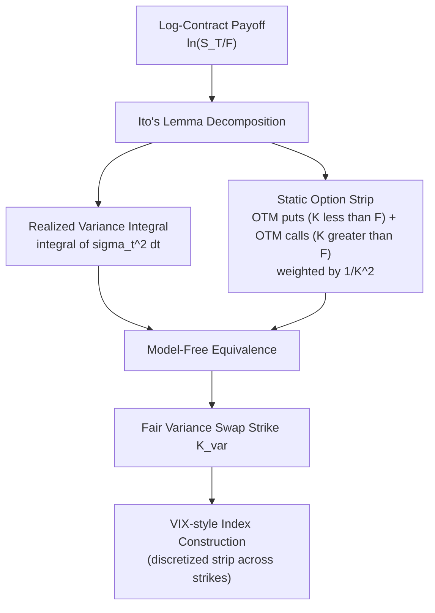

## Variance Swaps and Volatility Swaps

### Overview

Variance swaps and volatility swaps are over-the-counter derivatives that provide direct, pure exposure to the realized volatility (or variance) of an underlying asset over a specified period, without the path-dependent delta exposure embedded in a delta-hedged option position. Variance swaps, in particular, occupy a special place in derivatives theory because they admit a **model-free replication** in terms of a static strip of vanilla options — a property volatility swaps notably lack, making variance swaps the more fundamental and widely traded instrument of the two.

### Payoff Definitions

**Variance swap payoff** at maturity $T$:

$$\text{Payoff}_{VarSwap} = N_{var} \times \left( \sigma_{realized}^2 - K_{var} \right)$$

where $\sigma_{realized}^2$ is the annualized realized variance over the swap's life (computed from a discretely sampled set of returns, typically daily closes), $K_{var}$ is the fixed variance strike agreed at inception, and $N_{var}$ is the variance notional.

**Realized variance** is typically computed as:

$$\sigma_{realized}^2 = \frac{252}{n} \sum_{i=1}^{n} \left( \ln \frac{S_i}{S_{i-1}} \right)^2$$

(annualized using 252 trading days, with the mean return term usually omitted by market convention since its contribution is negligible at daily sampling frequency).

**Volatility swap payoff** at maturity $T$:

$$\text{Payoff}_{VolSwap} = N_{vol} \times \left( \sigma_{realized} - K_{vol} \right)$$

where $\sigma_{realized} = \sqrt{\sigma_{realized}^2}$ is realized *volatility* (not variance), and $K_{vol}$ is the volatility strike.

### Key Points

- **Variance is additive in time; volatility is not**: because variance (not volatility) is the quantity that adds linearly across independent sub-periods (variance of a sum of independent increments equals the sum of variances), variance swaps have a much cleaner theoretical replication and term-structure decomposition than volatility swaps.
- **Variance notional vs. vega notional**: variance swaps are typically quoted with a "vega notional" $N_{vega}$ that converts to variance notional via $N_{var} = N_{vega} / (2 K_{var})$, so that a small change in volatility around the strike produces approximately $N_{vega}$ dollars of P&L per volatility point — a convention that makes the trade's risk more intuitive to volatility traders accustomed to thinking in vega terms.
- **Convexity between variance and volatility**: since $\sigma = \sqrt{\sigma^2}$ is a concave function, Jensen's inequality implies $\mathbb{E}[\sigma_{realized}] \le \sqrt{\mathbb{E}[\sigma_{realized}^2]}$, meaning the fair volatility swap strike is generally slightly **below** the square root of the fair variance swap strike — this gap is often called **convexity adjustment** and depends on the volatility-of-volatility of the underlying process.
- **Model-free replication (variance swaps only)**: the fair variance swap strike can be computed from a static, model-independent portfolio of vanilla options across all strikes — this is the theoretical foundation underlying the VIX and other variance-based volatility indices.

### Model-Free Replication of Variance Swaps

The key result (derived from Itô's lemma applied to $\ln S_T$, then integrating the resulting log-payoff over a continuum of strikes) is:

$$\mathbb{E}^Q\left[\int_0^T \sigma_t^2 \, dt\right] = 2 \left[ \int_0^{F} \frac{P(K)}{K^2} \, dK + \int_{F}^{\infty} \frac{C(K)}{K^2} \, dK \right] \times \frac{1}{T} \times \text{(appropriate discounting)}$$

where $F$ is the forward price, $P(K)$ and $C(K)$ are out-of-the-money put and call prices respectively. This shows that the **fair variance swap strike is a weighted average of all OTM option prices**, weighted by $1/K^2$ — a genuinely model-free result requiring no assumption about the underlying's dynamics (diffusion, jumps, or otherwise), beyond the assumption that the underlying doesn't jump *across* the barrier used for the put/call split, and standard technical continuity conditions.

**This is the theoretical basis for the VIX index**: the CBOE VIX methodology directly implements a discretized version of this replication formula using a strip of S&P 500 index option prices across a wide range of strikes for near-term and next-term expirations.

### Why Volatility Swaps Lack Clean Replication

Because $\sqrt{x}$ is a nonlinear (concave) transformation of variance, there is no static strip of vanilla options that replicates $\mathbb{E}[\sigma_{realized}]$ directly — pricing a volatility swap requires either:

- A **convexity adjustment** applied to the variance swap fair strike, requiring an assumption about the volatility of realized variance itself (i.e., a model for vol-of-vol, such as an SV or SVJ model), or
- Direct **model-based pricing** (e.g., under Heston or another stochastic volatility model where the joint distribution of $\sigma_{realized}$ is tractable or Monte-Carlo-simulable).

This structural difference is the primary reason variance swaps are far more liquid and standardized than volatility swaps in most markets — the model-free replication makes variance swaps easier to hedge, price consistently, and mark to market using only observable vanilla prices.

### Comparison Table

| Feature | Variance Swap | Volatility Swap |
| --- | --- | --- |
| Payoff variable | Realized variance $\sigma^2$ | Realized volatility $\sigma$ |
| Model-free replication | Yes (static OTM option strip) | No |
| Additive across time | Yes | No |
| Convexity relative to the other | N/A (base case) | Strike below $\sqrt{\text{variance strike}}$ |
| Hedging | Static replication + dynamic delta-hedge of the replicating portfolio | Requires a volatility-of-volatility model |
| Liquidity | Higher; standard in equity index markets | Lower; less standardized |
| Relation to VIX-style indices | Direct theoretical basis | Not directly used for index construction |
| P&L convexity to large moves | Convex (quadratic in returns) — benefits from large realized moves in either direction, magnified | Less convex than variance swap |

### Trading Applications

- **Pure volatility view**: taking a view that realized volatility will exceed (long) or fall short of (short) the level implied by the variance swap strike, without any directional exposure to the underlying (unlike a delta-hedged straddle, which requires continuous rebalancing and incurs path-dependent P&L from gamma trading, not just a clean realized-vs-implied variance comparison).
- **Volatility risk premium harvesting**: since the variance swap strike (risk-neutral expected variance) has been empirically found to typically trade above subsequently realized variance on average, systematically **selling variance swaps** is a documented (though periodically loss-making, particularly during volatility spikes/crashes) strategy for harvesting the variance risk premium.
- **Dispersion trading**: trading the variance swap on an index against a basket of variance swaps on its constituents to express a view on **correlation** (since index variance is a correlation-weighted function of constituent variances and pairwise correlations) — this is one of the primary uses of variance swaps beyond outright volatility views.
- **Hedging exotic desks' vega/volga exposure**: variance swaps provide a cleaner, more linear vega hedge than vanilla options (whose vega changes with spot and time), useful for exotic derivatives desks managing residual volatility exposure from client structured products.

### Example: Dispersion Trade Structure

Consider an equity index with $n$ constituents. Index variance relates to constituent variances and pairwise correlations via:

$$\sigma_{index}^2 = \sum_{i=1}^n w_i^2 \sigma_i^2 + \sum_{i \neq j} w_i w_j \rho_{ij} \sigma_i \sigma_j$$

A **dispersion trade** typically involves *selling* index variance swaps while *buying* a weighted basket of single-stock variance swaps, expressing a view that **realized correlation will be lower** than what's implied by the relative pricing of index versus single-stock variance (since higher assumed correlation raises the fair index variance strike relative to the weighted sum of single-stock strikes, for a given set of single-stock volatilities). [Inference] The precise weighting scheme (vega-weighted, notional-weighted) and the exact correlation sensitivity of the trade depend on the specific basket construction and are typically fine-tuned by the desk structuring the trade.

### Diagram: Variance Swap Replication Structure

### SVG: Variance Swap Payoff Diagram

<svg xmlns="http://www.w3.org/2000/svg" viewBox="0 0 640 320">
<text x="320" y="22" font-size="15" text-anchor="middle" font-family="sans-serif" font-weight="bold">Variance Swap Payoff vs. Realized Volatility (svg_diagram)</text>
<line x1="60" y1="270" x2="580" y2="270" stroke="black" stroke-width="1.5" />
<line x1="60" y1="270" x2="60" y2="50" stroke="black" stroke-width="1.5" />
<text x="320" y="295" font-size="12" text-anchor="middle" font-family="sans-serif">Realized Volatility</text>
<text x="30" y="160" font-size="12" text-anchor="middle" font-family="sans-serif" transform="rotate(-90 30 160)">P&amp;L</text>
<line x1="60" y1="200" x2="580" y2="200" stroke="#dddddd" stroke-width="1" stroke-dasharray="3,3" />
<text x="590" y="204" font-size="10" font-family="sans-serif">0</text>
<path d="M 100 260 Q 200 235 280 200 Q 350 165 420 110 Q 480 65 540 30" fill="none" stroke="#1f77b4" stroke-width="2.5" />
<text x="440" y="90" font-size="11" fill="#1f77b4" font-family="sans-serif">Variance swap (convex, quadratic)</text>
<path d="M 100 250 L 280 200 L 540 90" fill="none" stroke="#d62728" stroke-width="2.5" stroke-dasharray="6,3" />
<text x="440" y="150" font-size="11" fill="#d62728" font-family="sans-serif">Volatility swap (approx. linear)</text>
<line x1="280" y1="60" x2="280" y2="270" stroke="black" stroke-width="0.5" stroke-dasharray="2,2" />
<text x="280" y="290" font-size="10" text-anchor="middle" font-family="sans-serif">Strike level</text>
</svg>

### Risk Management Considerations

- **Skew/tail risk exposure**: because variance swap replication weights OTM puts and calls by $1/K^2$, the strike is sensitive to the entire smile, including far-wing prices — a variance swap seller carries meaningful exposure to a sudden steepening of the skew or a jump in far OTM option prices, not just to ATM volatility moves.
- **Jump risk**: the model-free replication formula assumes continuous monitoring/no large discontinuous jumps crossing multiple strikes between observations; in practice with discrete daily sampling, a large single-day jump contributes disproportionately to realized variance (since it's squared), creating a documented **jump risk exposure** for variance swap sellers that is distinct from, and generally larger than, the equivalent exposure in a delta-hedged vanilla option book.
- **Correlation risk in dispersion trades**: dispersion trades carry residual correlation risk that can behave in a highly nonlinear, regime-dependent way, particularly during systemic market stress when correlations tend to spike toward 1 across most assets simultaneously.
- **Cap/floor conventions**: many traded variance swaps include a **variance cap** (limiting the payoff in extreme jump scenarios) precisely to manage the seller's exposure to the jump risk noted above, since uncapped variance swap sellers faced severe losses during historical volatility spikes.

### Related Topics

- VIX index construction and the CBOE methodology
- Dispersion trading and implied correlation indices
- The variance risk premium (relation to jump risk premia)
- Volga and vanna hedging for volatility derivatives desks
- Gamma swaps and corridor variance swaps as variants
- Static replication theory for exotic payoffs (Carr-Madan spanning formula)