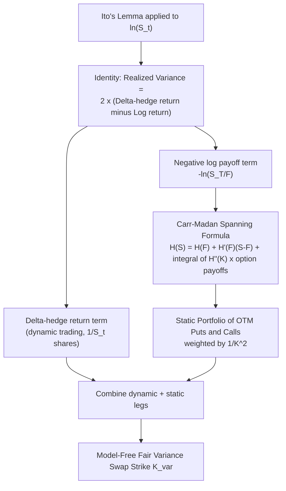

## Replicating Variance Swaps With Options

### Overview

The static replication of variance swaps with a portfolio of vanilla options is one of the foundational model-free results in derivatives pricing theory, first developed by Neuberger (1994) and later popularized in its modern form by Demeterfi, Derman, Kamal, and Zou (1999) and Carr and Madan (1998). This result shows that the fair strike of a variance swap can be computed exactly from a static, continuously-weighted portfolio of out-of-the-money puts and calls across all strikes — without assuming any particular model for the underlying's dynamics (diffusion, jumps, or stochastic volatility), making it one of the rare genuinely **model-independent** pricing results in the field.

### The Log-Contract: The Key Building Block

The replication rests on the observation that a specific payoff — the **log contract** — has a payoff whose expected value under the risk-neutral measure is directly related to expected realized variance. Applying Itô's lemma to $\ln S_T$:

$$d(\ln S_t) = \left(\mu - \frac{1}{2}\sigma_t^2\right)dt + \sigma_t \, dW_t$$

Comparing this to the process for $S_t$ itself:

$$\frac{dS_t}{S_t} = \mu \, dt + \sigma_t \, dW_t$$

Subtracting and integrating from $0$ to $T$ gives the fundamental identity:

$$\int_0^T \sigma_t^2 \, dt = 2 \left[ \int_0^T \frac{dS_t}{S_t} - \ln\frac{S_T}{S_0} \right]$$

This says: **total realized variance equals twice the difference between the continuously-compounded return of a "delta-hedge" strategy (buying $1/S_t$ shares at each instant) and the log return.** The right-hand side is replicable — the first term via continuous dynamic trading in the underlying, and the second (negative log payoff) via a **static portfolio of options**, which is the key insight enabling replication without needing to know the volatility process itself.

### Static Replication of the Log Payoff

The negative log payoff $-\ln(S_T/F)$ (where $F$ is the forward price) can itself be spanned by a continuum of vanilla option payoffs via the **Carr-Madan spanning formula**, which decomposes any sufficiently smooth payoff function $H(S_T)$ as:

$$H(S_T) = H(F) + H'(F)(S_T - F) + \int_0^F H''(K)(K-S_T)^+ dK + \int_F^\infty H''(K)(S_T-K)^+ dK$$

Applying this to $H(S) = -\ln(S/F)$, where $H''(K) = 1/K^2$:

$$-\ln\frac{S_T}{F} = -\frac{S_T - F}{F} + \int_0^F \frac{1}{K^2}(K-S_T)^+ dK + \int_F^\infty \frac{1}{K^2}(S_T-K)^+ dK$$

Taking risk-neutral expectations, the linear term $-\frac{S_T-F}{F}$ has zero expectation (since $\mathbb{E}^Q[S_T] = F$), leaving:

$$\mathbb{E}^Q\left[-\ln\frac{S_T}{F}\right] = \int_0^F \frac{P(K)}{K^2} \, dK + \int_F^\infty \frac{C(K)}{K^2} \, dK$$

where $P(K)$ and $C(K)$ are today's OTM put and call prices at strike $K$. This is precisely the **model-free variance swap replication formula**, and combined with the log-contract identity above, gives:

$$K_{var} = \mathbb{E}^Q\left[\frac{1}{T}\int_0^T \sigma_t^2 \, dt\right] = \frac{2}{T}\left[ \int_0^F \frac{P(K)}{K^2} \, dK + \int_F^\infty \frac{C(K)}{K^2} \, dK \right]$$

### Key Points

- **The $1/K^2$ weighting is the central structural feature**: each OTM option is weighted inversely proportional to the square of its strike, meaning far-OTM options (which are individually cheap) still contribute meaningfully to the portfolio, particularly for far-OTM puts capturing crash/tail risk.
- **The replication requires a continuum of strikes**: the theoretical formula is an integral over *all* strikes from $0$ to $\infty$; in practice, only a discrete, finite set of strikes trade, requiring **discretization and truncation**, which introduces a small but real approximation error relative to the theoretical ideal.
- **No assumption on the volatility process**: critically, this derivation never assumed anything about how $\sigma_t$ evolves — it could be constant (Black-Scholes), a diffusion (Heston), or subject to jumps — the replication holds under quite general conditions, provided the underlying process has no jumps that would invalidate the continuous Itô calculus step (a caveat addressed further below).
- **The dynamic component is genuinely dynamic**: the $\int \frac{dS_t}{S_t}$ term requires continuously rebalancing a position of $1/S_t$ shares at each instant (a "$1/S$-weighted" or "delta-one" trading strategy) — in practice this is implemented via discrete daily rebalancing, another source of small replication error relative to the continuous-time ideal.

### The Demeterfi-Derman-Kamal-Zou (DDKZ) Practical Implementation

The 1999 Goldman Sachs paper by Demeterfi, Derman, Kamal, and Zou made this replication practically implementable by:

1. **Discretizing the strike continuum** into a finite grid of traded strikes, weighting each by an approximation to $1/K^2$ scaled by the strike spacing $\Delta K$.
2. **Handling the boundary/truncation** at the lowest and highest available traded strikes, since the theoretical integral extends to $0$ and $\infty$.
3. Providing a practical formula for the number of contracts to hold at each strike:

$$n(K_i) = \frac{2}{T} \times \frac{\Delta K_i}{K_i^2}$$

where $\Delta K_i$ is the (typically averaged, distance-to-neighbor) strike spacing around $K_i$.

### Example: Discretized Replication Table

| Strike ($K$) | Option Type | Weight $\approx \Delta K/K^2$ | Contribution to Fair Variance |
| --- | --- | --- | --- |
| 80% of spot | Put | Higher (small $K$ amplifies $1/K^2$) | Larger — captures downside tail |
| 90% of spot | Put | Moderate | Moderate |
| 100% of spot (ATM) | Put/Call split | Moderate | Core ATM variance contribution |
| 110% of spot | Call | Moderate | Moderate |
| 130% of spot | Call | Lower | Smaller — captures upside tail |

[Inference] The exact numerical weights depend on the specific strike grid spacing available in a given market and the truncation points chosen; the qualitative pattern (far-OTM puts weighted more heavily per-option than far-OTM calls, due to $1/K^2$ evaluated at a smaller $K$) is the general structural feature of the formula.

### Impact of Jumps on the Replication

The derivation above relies on Itô's lemma, which assumes a continuous diffusion process. When the underlying can **jump**, the identity requires a correction term:

$$\int_0^T \sigma_t^2 \, dt = 2\left[\int_0^T \frac{dS_t}{S_t} - \ln\frac{S_T}{S_0}\right] - 2\sum_{\text{jumps}}\left[\frac{\Delta S}{S} - \ln\left(1+\frac{\Delta S}{S}\right)\right]$$

The extra term is always non-negative (by convexity of $x - \ln(1+x)$) and represents the contribution of jumps to the total quadratic variation beyond the pure diffusive component. In practice, this means:

- The vanilla-option-based replication formula still correctly recovers the risk-neutral expectation of **total quadratic variation** (diffusive plus jump contributions combined) as priced into option prices, since the option prices themselves already reflect the market's jump-risk-adjusted view.
- However, market participants must distinguish between the **theoretical continuous-monitoring variance swap payoff** (which most traded variance swaps approximate via discrete daily sampling) and the model-free replicated quantity — a large discrete jump between sampling dates contributes disproportionately to the realized variance calculation (since squared), a distinct practical risk from the smooth replication theory. [Inference] The magnitude of this discrete-jump-vs-continuous-monitoring discrepancy is generally small for typical daily-sampled equity index variance swaps outside of crash events, but becomes material during large single-day moves.

### Diagram: Replication Derivation Flow

### SVG: The 1/K² Weighting Profile

<svg xmlns="http://www.w3.org/2000/svg" viewBox="0 0 640 320">
<text x="320" y="22" font-size="15" text-anchor="middle" font-family="sans-serif" font-weight="bold">Option Weight in Replicating Portfolio: 1/K^2 (svg_diagram)</text>
<line x1="60" y1="270" x2="580" y2="270" stroke="black" stroke-width="1.5" />
<line x1="60" y1="270" x2="60" y2="50" stroke="black" stroke-width="1.5" />
<text x="320" y="295" font-size="12" text-anchor="middle" font-family="sans-serif">Strike K</text>
<text x="30" y="160" font-size="12" text-anchor="middle" font-family="sans-serif" transform="rotate(-90 30 160)">Weight (1/K^2)</text>

<path d="M 90 70 Q 150 130 200 175 Q 260 220 320 240 Q 380 250 440 258 Q 500 262 560 265" fill="none" stroke="`#1f77b4`" stroke-width="2.5" />

<rect x="90" y="70" width="150" height="1" fill="none" />
<line x1="320" y1="240" x2="320" y2="270" stroke="black" stroke-width="0.5" stroke-dasharray="2,2" />
<text x="320" y="290" font-size="10" text-anchor="middle" font-family="sans-serif">Forward / ATM</text>

<text x="130" y="90" font-size="11" fill="`#d62728`" font-family="sans-serif">OTM Puts</text>

<text x="450" y="245" font-size="11" fill="`#d62728`" font-family="sans-serif">OTM Calls</text>

<text x="130" y="105" font-size="10" fill="`#666666`" font-family="sans-serif">(high weight, small K)</text>

<text x="450" y="260" font-size="10" fill="`#666666`" font-family="sans-serif">(lower weight, large K)</text>

</svg>

### Practical Hedging: The Replicating Portfolio in Trading

A dealer who has sold a variance swap to a client typically hedges by:

1. **Buying the static option strip**: purchasing the theoretical (discretized) portfolio of OTM puts and calls across available strikes, weighted per the $1/K^2$ formula.
2. **Delta-hedging the option strip dynamically**: as spot moves, the aggregate delta of the option portfolio changes, requiring ongoing delta-hedging via the underlying (or futures) — this dynamic hedging is where the "dynamic trading" leg of the replication (the $\int dS_t/S_t$ term) is actually implemented in practice, since the static option portfolio's *delta* evolves even though its *composition* (which options are held) does not change.
3. **Managing residual basis risk**: from strike-grid discretization, truncation at available strike boundaries, discrete (vs. continuous) rebalancing, and any jump risk beyond what the vanilla smile prices in — the sum of these effects constitutes the **residual hedging error** the dealer bears despite the theoretically model-free nature of the core replication result.

### Limitations and Practical Caveats

- **Strike continuum assumption breaks down** in less liquid underlyings (single stocks, many commodities) where only a sparse set of strikes trade, making the discretization error larger and potentially significant relative to the theoretical fair value.
- **Truncation error at the tails**: since far-OTM options beyond the most extreme traded strikes are unavailable, the replicating portfolio necessarily truncates the theoretical integral, generally leading to a slight **underestimate** of the true fair variance strike (since the omitted tail contributions, particularly from far-OTM puts, are always weighted positively in the formula).
- **Discrete monitoring vs. continuous monitoring**: real-world variance swaps specify a discrete sampling schedule (e.g., daily closes), which only approximates the continuous quadratic variation the theory is built around — the approximation is generally very good outside of extreme jump scenarios, as noted above.
- **Dividend and corporate action adjustments**: real-world index/equity variance swap contracts require careful handling of ex-dividend jumps and corporate actions in the realized variance calculation, a practical complexity not present in the idealized theoretical derivation.

### Related Topics

- The log contract and its role in variance/volatility index construction
- VIX methodology as an applied instance of this replication
- Carr-Madan spanning formula for general payoff replication
- Jump risk and its impact on discretely-monitored realized variance
- Dynamic delta-hedging of static option replicating portfolios
- Corridor variance swaps (replication restricted to a strike sub-range)