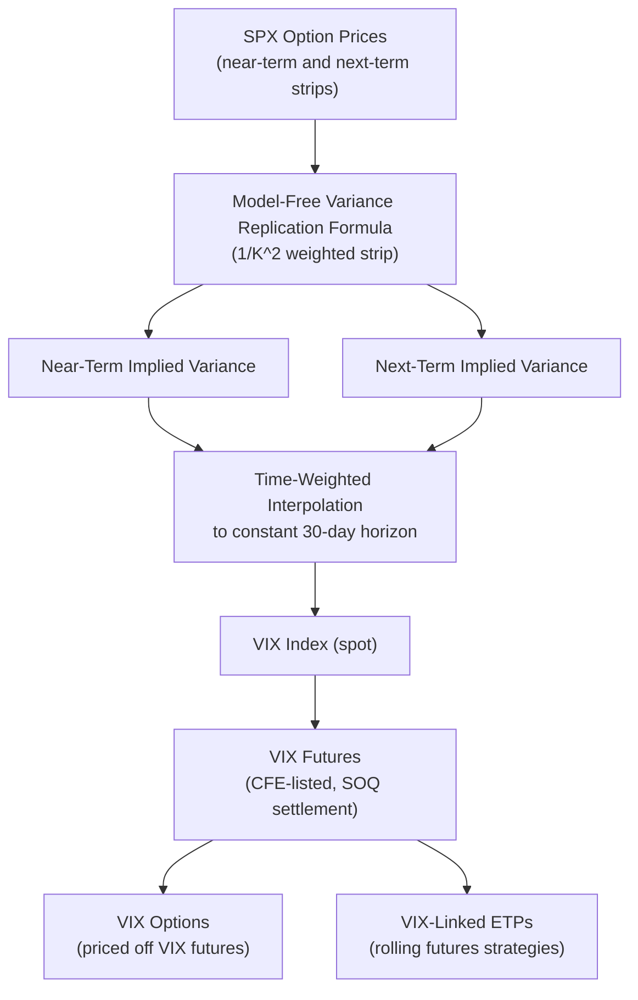

## The VIX Index and Volatility Futures

### Overview

The VIX Index (CBOE Volatility Index) is the market's benchmark measure of expected 30-day forward-looking volatility of the S&P 500, calculated in real time from a wide strip of listed S&P 500 index option prices using the model-free variance swap replication methodology. Volatility futures (VIX futures) and options on the VIX (VIX options) extend this benchmark into a tradable derivatives ecosystem, allowing direct exposure to expected future volatility levels — though with structural nuances (the "VIX is not directly tradable" problem, futures term structure, roll costs) that meaningfully separate the spot index from the tradable products built on it.

### VIX Index Construction

**Core formula**: the VIX applies a discretized version of the model-free variance replication formula (see variance swap replication) to a strip of near-term and next-term S&P 500 (SPX) option prices:

$$\sigma^2 = \frac{2}{T}\sum_i \frac{\Delta K_i}{K_i^2} e^{RT} Q(K_i) - \frac{1}{T}\left[\frac{F}{K_0}-1\right]^2$$

where $T$ is time to expiration, $F$ is the forward index level derived from put-call parity, $K_0$ is the first strike below the forward, $K_i$ are the strikes of all included OTM options, $\Delta K_i$ is the interval between strikes, $Q(K_i)$ is the midpoint of the bid-ask spread for each option, and $R$ is the risk-free rate.

**Two-maturity interpolation**: the VIX targets a constant 30-calendar-day horizon, but listed SPX options only expire on specific dates. The CBOE computes this formula separately for the **near-term** options (the nearest expiration with at least some minimum number of days to expiry) and the **next-term** options (the following expiration), then **interpolates** between the two implied variances to synthesize a constant 30-day expected variance:

$$VIX = 100 \times \sqrt{\left[T_1 \sigma_1^2 \frac{N_{T2}-N_{30}}{N_{T2}-N_{T1}} + T_2\sigma_2^2\frac{N_{30}-N_{T1}}{N_{T2}-N_{T1}}\right] \times \frac{N_{365}}{N_{30}}}$$

where $N_{T1}, N_{T2}, N_{30}, N_{365}$ represent minutes to each respective horizon (the CBOE methodology uses minute-level precision).

### Key Points

- **VIX is a variance-swap-style construction, not an implied-volatility average**: the VIX is not simply "the average implied volatility of ATM options" — it is the square root of a **strike-weighted (1/K²) portfolio of OTM puts and calls**, precisely mirroring the model-free variance replication formula, which is why the VIX is often described as "the price of a 30-day variance swap on the SPX, expressed in volatility terms."
- **Both weekly and monthly SPX options are used** in the current CBOE methodology, allowing the near-term/next-term bracketing to more precisely target the 30-day constant maturity (this was a notable methodology enhancement after the VIX's original 1993 introduction, which used only S&P 100 options and a narrower calculation).
- **The VIX itself is not directly tradable**: since it is an index computed from a formula, one cannot buy or sell "the VIX" directly — exposure is obtained via VIX futures, VIX options, or VIX-linked exchange-traded products (ETPs), each with distinct payoff and risk characteristics relative to the spot index.
- **Inverse relationship with equity markets**: the VIX exhibits a strong, well-documented negative correlation with S&P 500 returns (the "fear gauge" characterization), consistent with the leverage effect and negative equity-volatility correlation discussed in stochastic volatility modeling, and spikes sharply during market stress episodes.

### VIX Futures

VIX futures are exchange-traded contracts (CBOE Futures Exchange, CFE) whose settlement value is tied to a **special opening quotation (SOQ)** of the VIX calculated at expiration, based on the opening trade prices of the constituent SPX options. Key structural features:

- **Futures price ≠ spot VIX**: because a VIX future's price reflects the market's expectation of what the VIX will be at the future's expiration date (itself a 30-day-forward-looking volatility measure calculated at that future date), the futures price is generally **not equal** to the current spot VIX — it reflects the market's expectation of *future* 30-day expected volatility, not current volatility.
- **Term structure (VIX futures curve)**: VIX futures across different expirations trace out a term structure, typically in **contango** (upward-sloping, longer-dated futures priced higher) during calm market periods, and can flip into **backwardation** (downward-sloping) during acute market stress, when near-term volatility expectations spike above longer-term expectations.
- **No direct underlying to arbitrage against**: unlike commodity futures (which can be arbitraged against physical storage) or equity index futures (arbitraged via the cash-and-carry relationship with the underlying stocks), VIX futures cannot be statically arbitraged against "the VIX" because the VIX itself is not a directly tradable/storable asset — the linkage between VIX futures and spot VIX relies instead on the replication properties of the *underlying SPX variance swap market*, not a simple cost-of-carry relationship.

### VIX Options

Options on the VIX are also listed on CFE, but their pricing has distinctive features relative to standard equity options:

- **Underlying is the VIX futures, effectively**: because VIX options settle against the same SOQ as VIX futures at the corresponding expiration, and because VIX itself isn't directly tradable/hedgeable, VIX options are more naturally priced and hedged relative to the corresponding-maturity VIX future rather than the spot VIX index.
- **VIX options exhibit their own smile**: implied volatilities of VIX options (i.e., "vol of vol") trade with their own skew and term structure, reflecting the market's view on the volatility of volatility itself — VIX option skew has historically often been **positively skewed** (upside calls trading at higher IV than downside puts), roughly the opposite shape of the equity index skew, consistent with volatility spikes tending to be sudden and large (positive jumps) followed by more gradual mean-reversion declines.

### Comparison Table: VIX-Related Instruments

| Instrument | What it tracks | Directly tradable | Key risk feature |
| --- | --- | --- | --- |
| VIX Index (spot) | Real-time 30-day model-free implied variance (as volatility) | No | Reference benchmark only |
| VIX Futures | Market expectation of VIX level at future expiration | Yes | Term structure roll cost/gain (contango/backwardation) |
| VIX Options | Optionality on VIX futures/SOQ at expiration | Yes | "Vol of vol" smile, often positively skewed |
| VIX ETPs (e.g., short-term futures-tracking products) | A rolling futures strategy (not spot VIX) | Yes | Structural roll decay in contango; well-documented long-term value erosion for long products |

### Volatility Risk Premium and the VIX Futures Curve

The typical **contango** shape of the VIX futures curve is closely related to the variance/volatility risk premium discussed in the fat-tails/jump-risk-premia material: since risk-neutral (option-implied) expected future volatility tends to exceed subsequently realized volatility on average, longer-dated VIX futures (further removed from current spot conditions, more purely reflecting this embedded premium) tend to price at a premium to near-term futures and spot VIX during calm periods.

This structural contango is the primary driver of the well-documented **negative long-term roll yield** in products that maintain a constant rolling long exposure to near-dated VIX futures (continuously selling the cheaper near-month future and buying the more expensive next-month future as futures approach expiration) — a phenomenon widely discussed in the context of some VIX-linked exchange-traded products' poor long-term buy-and-hold performance. [Inference] The magnitude and persistence of this roll cost varies over time with the shape of the VIX futures curve, which itself shifts between contango and backwardation depending on market conditions.

### Diagram: VIX Construction and Product Ecosystem

### SVG: Typical VIX Futures Term Structure Shapes

<svg xmlns="http://www.w3.org/2000/svg" viewBox="0 0 640 320">
<text x="320" y="22" font-size="15" text-anchor="middle" font-family="sans-serif" font-weight="bold">VIX Futures Curve: Contango vs. Backwardation (svg_diagram)</text>
<line x1="60" y1="270" x2="580" y2="270" stroke="black" stroke-width="1.5" />
<line x1="60" y1="270" x2="60" y2="50" stroke="black" stroke-width="1.5" />
<text x="320" y="295" font-size="12" text-anchor="middle" font-family="sans-serif">Futures Expiration (near to far)</text>
<text x="30" y="160" font-size="12" text-anchor="middle" font-family="sans-serif" transform="rotate(-90 30 160)">Futures Price</text>
<path d="M 100 220 L 200 195 L 300 170 L 400 150 L 500 135" fill="none" stroke="#1f77b4" stroke-width="2.5" />
<circle cx="100" cy="220" r="4" fill="#1f77b4" />
<circle cx="200" cy="195" r="4" fill="#1f77b4" />
<circle cx="300" cy="170" r="4" fill="#1f77b4" />
<circle cx="400" cy="150" r="4" fill="#1f77b4" />
<circle cx="500" cy="135" r="4" fill="#1f77b4" />
<text x="500" y="115" font-size="11" fill="#1f77b4" font-family="sans-serif">Contango (calm markets)</text>
<path d="M 100 90 L 200 130 L 300 165 L 400 190 L 500 205" fill="none" stroke="#d62728" stroke-width="2.5" />
<circle cx="100" cy="90" r="4" fill="#d62728" />
<circle cx="200" cy="130" r="4" fill="#d62728" />
<circle cx="300" cy="165" r="4" fill="#d62728" />
<circle cx="400" cy="190" r="4" fill="#d62728" />
<circle cx="500" cy="205" r="4" fill="#d62728" />
<text x="180" y="75" font-size="11" fill="#d62728" font-family="sans-serif">Backwardation (stress/crisis periods)</text>
</svg>

### Example: Contango Roll Cost Illustration

Suppose the spot VIX is at 15, the front-month future trades at 16, and the second-month future trades at 17 (a typical mild contango shape). A strategy that maintains constant exposure by continuously rolling from the front to the second month as expiration approaches will, all else equal, sell the cheaper (16) future and buy the more expensive (17) future repeatedly — realizing a **structural drag** on returns each roll period if the VIX curve remains in contango and spot VIX doesn't rise enough to offset it. [Inference] Whether this roll drag is realized as an actual loss depends on the subsequent path of the VIX curve and spot VIX; in a sustained low-volatility, persistent-contango regime, this has historically produced substantial cumulative value erosion for constant-maturity long volatility exposure, but backwardation periods (typically coinciding with volatility spikes) can produce the opposite (roll gain) effect for the same structural strategy.

### Practical Applications and Risk Management

- **Portfolio hedging**: VIX futures/options provide a way to hedge equity portfolio tail/crash risk given the VIX's strong negative correlation with equities, though basis risk (VIX futures vs. actual portfolio) and roll costs are important practical considerations.
- **Volatility risk premium harvesting**: systematically shorting VIX futures (or equivalent structured short-volatility products) to harvest the contango/risk-premium, subject to substantial and well-documented tail risk during volatility spikes (several historical episodes of severe, rapid losses in short-volatility strategies have been widely discussed following major market stress events).
- **Term structure trading**: relative value trades across the VIX futures curve (e.g., calendar spreads) express views on the shape evolution of the term structure itself, independent of an outright directional volatility view.
- **Cross-asset volatility benchmarking**: the VIX methodology has been extended to other asset classes (e.g., VXN for Nasdaq, OVX for oil, GVZ for gold), each constructed analogously from the respective option market's strike-weighted strip.

### Related Topics

- Model-free variance swap replication (theoretical basis for VIX construction)
- Contango/backwardation dynamics and roll yield in futures markets generally
- Short-volatility strategy risk and historical stress episodes
- The variance and volatility risk premium
- VIX option skew and "volatility of volatility" modeling
- Dispersion trading and implied correlation relative to the VIX