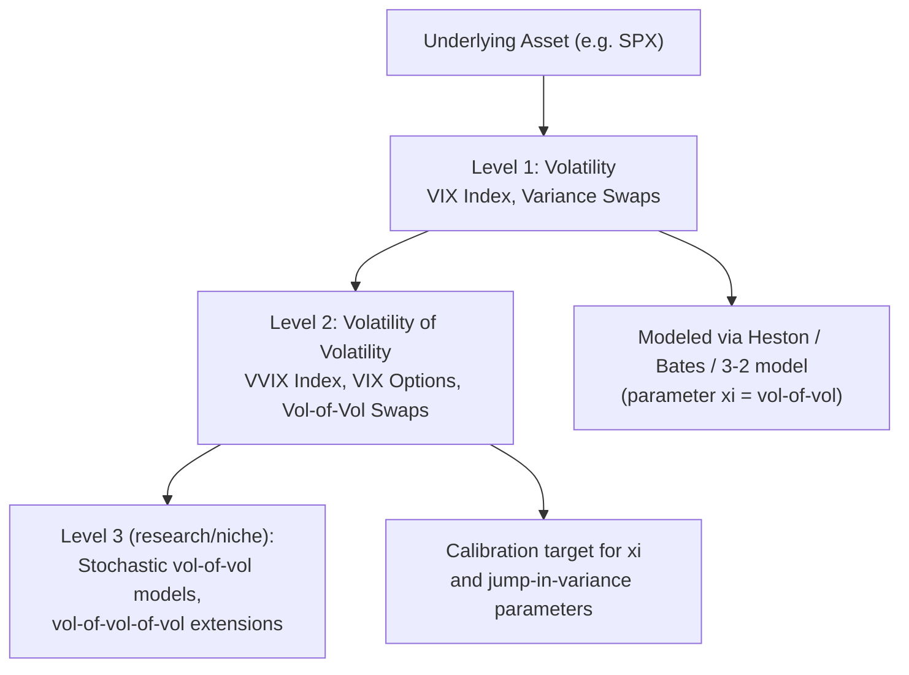

## Volatility of Volatility Products

### Overview

Volatility of volatility (vol-of-vol) products are derivatives whose payoffs depend on the second-order uncertainty in the market — the randomness of volatility itself, rather than the level of volatility or the underlying asset price directly. These instruments emerged as the natural next step once variance swaps and VIX futures made "volatility" itself a tradable underlying: once volatility is treated as an asset, it becomes natural to ask what its own volatility is, and to build products (VIX options, forward-starting vol products, vol-of-vol swaps, and "vovix"-style indices) that isolate exposure to this quantity.

### Why Vol-of-Vol Matters

**Direct connection to stochastic volatility models**: the parameter $\xi$ (vol-of-vol) in the Heston model directly governs the volatility of the variance process $v_t$. A higher $\xi$ produces a wider, more convex implied volatility smile for options *on volatility itself* (VIX options), and also affects the curvature (wings) of the *underlying's* smile via the standard SV mechanisms. Vol-of-vol products thus provide a **direct market-observable calibration target** for this otherwise hard-to-pin-down parameter, complementing the underlying's own vanilla smile in model calibration.

**Distinct risk factor from spot vol**: an investor can be right about the *direction* of volatility (e.g., correctly predicting the VIX will rise) but wrong about *how much it will move*, or right about the magnitude but exposed to path-dependent risk in getting there. Vol-of-vol products isolate this "convexity of volatility" risk, which is not spanned by simply holding variance swaps or VIX futures alone.

### Key Instruments

**VIX Options** (already introduced as VIX-linked instruments): the most liquid and widely traded vol-of-vol product. Their implied volatility — sometimes informally called "vol of VIX" or, loosely, "vol-of-vol" — reflects the market's expectation of how much the VIX itself will fluctuate over the option's life.

**Volatility-of-volatility swaps ("vol-of-vol swaps")**: analogous in structure to variance swaps, but written on the realized variance of the VIX (or another volatility index/variance-swap rate) rather than on the realized variance of an equity price. Payoff structure:

$$\text{Payoff} = N \times \left(\sigma^2_{realized,\,VIX} - K_{vvol}\right)$$

where $\sigma^2_{realized,\,VIX}$ is computed from realized returns of the VIX index (or a VIX futures contract) rather than the underlying equity index.

**"VVIX" Index**: CBOE publishes the VVIX index, constructed using the identical model-free methodology as the VIX itself, but applied to the strip of **VIX options** rather than SPX options — making VVIX the "VIX of the VIX," a direct real-time benchmark of expected 30-day volatility of the VIX.

**Forward-starting volatility products**: structures whose payoff depends on the volatility realized over a *future* period (analogous to forward-starting options and cliquets in the equity space) — these are sensitive to vol-of-vol because the uncertainty about future volatility levels compounds the uncertainty already present in forward variance.

### Key Points

- **VVIX behaves analogously to VIX but one level removed**: just as VIX spikes during equity market stress, VVIX tends to spike when there is heightened uncertainty about *future volatility itself* — e.g., ahead of major known event risk (elections, central bank decisions) where the market anticipates a large but direction-uncertain volatility move.
- **Vol-of-vol is itself mean-reverting and exhibits clustering**, similar to the underlying variance process it derives from — periods of high VVIX tend to cluster, consistent with the broader empirical pattern of volatility clustering extending to "second-order" volatility measures.
- **VIX option skew shape reflects vol-of-vol dynamics**: as noted in the VIX material, VIX options have historically tended to exhibit a **positive skew** (calls more expensive than puts, in IV terms) — this is a direct empirical signature consistent with sharp, sudden upward jumps in volatility (crash-driven vol spikes) followed by more gradual mean-reverting declines, an asymmetry naturally captured within jump-augmented or CEV-type extensions of Heston-style models applied to the VIX itself.
- **Market incompleteness compounds**: hedging vol-of-vol exposure typically requires trading in VIX options/futures themselves (since the underlying equity index vanillas do not fully span vol-of-vol risk), adding another layer to the incompleteness already present in basic stochastic volatility hedging.

### Modeling Vol-of-Vol: Extensions to Standard SV Models

**Stochastic-vol-of-vol models**: rather than treating $\xi$ (vol-of-vol) as a constant parameter in Heston, some extensions allow $\xi_t$ itself to be a mean-reverting stochastic process, creating a "vol-of-vol-of-vol" hierarchy — while theoretically appealing for matching VIX option smiles precisely, this introduces substantial additional model complexity and parameter estimation burden. [Inference] The incremental practical benefit of such higher-order extensions versus simpler jump-augmented single-factor vol-of-vol specifications is debated in the literature and likely depends on the specific calibration target.

**Jump-diffusion on the VIX/variance process directly**: adding jumps to the variance process itself (as in the "SVJJ" — stochastic volatility with jumps in both price and variance — extension of Bates' model) is a common and more tractable way to generate the sharp positive skew observed in VIX options without requiring a fully stochastic vol-of-vol parameter.

**3/2 model**: an alternative to Heston's square-root variance process, the 3/2 stochastic volatility model specifies:

$$dv_t = \kappa v_t(\theta - v_t)\,dt + \xi v_t^{3/2}\,dW_t^v$$

The $v_t^{3/2}$ diffusion coefficient (versus Heston's $\sqrt{v_t}$) makes volatility-of-volatility increase more sharply with the variance level itself, which has been found in some studies to better match the observed **positively-skewed VIX option smile** and the empirical tendency for vol-of-vol to rise disproportionately during high-volatility regimes, compared to standard Heston.

### Comparison Table: Vol-of-Vol Modeling Approaches

| Approach | Mechanism | Strength | Limitation |
| --- | --- | --- | --- |
| Constant $\xi$ (standard Heston) | Fixed vol-of-vol parameter | Simple, well-understood, fast calibration | Cannot independently fit VIX option skew shape |
| Bates/SVJJ (jumps in variance) | Adds jump component to variance process | Captures sharp positive VIX skew | Additional parameters; calibration complexity |
| 3/2 model | Nonlinear ($v^{3/2}$) vol-of-vol scaling | Naturally generates positive skew; matches vol-of-vol rising with vol level | Less standard; fewer closed-form pricing tools than Heston |
| Stochastic vol-of-vol ($\xi_t$ itself random) | Adds a third stochastic factor | Maximum flexibility for VIX option surface fit | High complexity, harder identifiability/calibration |

### Example: VVIX-VIX Relationship Interpretation

Consider a period where VIX rises from 15 to 25 due to an escalating macro event, while VVIX simultaneously rises from 85 to 110. This joint move can be interpreted as:

- The **VIX increase** reflects the market pricing in higher expected 30-day realized volatility of the S&P 500.
- The **VVIX increase** reflects the market additionally pricing in greater *uncertainty about how volatility itself will evolve* from here — e.g., uncertainty about whether the event resolves quickly (VIX could fall back sharply) or escalates further (VIX could spike much higher), a genuinely distinct source of risk from the VIX level alone.
- [Inference] The empirical correlation between VIX level and VVIX level is generally documented as positive but imperfect, meaning VVIX carries incremental information beyond simply "VIX is high" — though the precise statistical relationship varies across sample periods and market regimes.

### Diagram: Vol-of-Vol Product Hierarchy

### SVG: VIX vs. VVIX Illustrative Co-Movement

<svg xmlns="http://www.w3.org/2000/svg" viewBox="0 0 640 320">
<text x="320" y="22" font-size="15" text-anchor="middle" font-family="sans-serif" font-weight="bold">Illustrative VIX and VVIX Co-Movement (svg_diagram)</text>
<line x1="60" y1="270" x2="580" y2="270" stroke="black" stroke-width="1.5" />
<line x1="60" y1="270" x2="60" y2="50" stroke="black" stroke-width="1.5" />
<text x="320" y="295" font-size="12" text-anchor="middle" font-family="sans-serif">Time</text>
<text x="30" y="160" font-size="12" text-anchor="middle" font-family="sans-serif" transform="rotate(-90 30 160)">Index Level</text>

<path d="M 80 230 L 150 225 L 220 220 L 280 150 L 320 100 L 360 130 L 420 190 L 480 210 L 550 220" fill="none" stroke="`#1f77b4`" stroke-width="2.5" />

<text x="380" y="90" font-size="11" fill="`#1f77b4`" font-family="sans-serif">VIX</text>

<path d="M 80 190 L 150 185 L 220 178 L 280 130 L 320 70 L 360 105 L 420 150 L 480 172 L 550 180" fill="none" stroke="`#d62728`" stroke-width="2.5" />

<text x="380" y="60" font-size="11" fill="`#d62728`" font-family="sans-serif">VVIX (amplified move at stress peak)</text>

</svg>

### Trading and Risk Management Applications

- **Tail-risk overlay refinement**: since VIX call options (long vol-of-vol exposure via the convexity of VIX itself) can offer a more capital-efficient crash hedge than outright VIX futures in some scenarios, understanding vol-of-vol dynamics helps size and structure such overlays appropriately.
- **Relative value between VIX options and variance swaps**: discrepancies between the vol-of-vol implied by VIX option prices and the vol-of-vol parameter calibrated from the underlying equity smile (via a joint SPX + VIX options calibration) can reveal relative value trading opportunities, subject to the practical difficulty of hedging basis risk between the two markets.
- **Exotic derivatives desk risk management**: desks running large books of autocallables, cliquets, and other structured products with significant volga (vol-of-vol) exposure use the VIX options/VVIX market as an external benchmark to sanity-check their internal vol-of-vol assumptions against what is observable in a liquid, exchange-traded market.
- **Event-driven vol-of-vol trading**: ahead of known binary event risk (elections, major central bank meetings), traders sometimes take explicit views on vol-of-vol (e.g., via VIX option structures) distinct from an outright directional VIX view, reflecting genuine uncertainty about the *magnitude* of the anticipated volatility reaction rather than its direction.

### Limitations and Open Questions

- **Liquidity concentration**: outside of VIX options (comparatively liquid) and VVIX (an index, not directly tradable), most genuinely bespoke vol-of-vol swap products are relatively illiquid OTC instruments, limiting price discovery and increasing transaction costs relative to standard variance swaps.
- **Model risk compounds at each level**: since vol-of-vol products are, in a sense, "derivatives of derivatives of derivatives" (options on volatility of the volatility of the underlying), model risk compounds across each layer, making robust risk management and independent price validation particularly important for desks trading these products.
- [Unverified] The degree to which VVIX-implied vol-of-vol and directly-calibrated Heston/3-2-model vol-of-vol parameters agree in practice, and how persistent any observed basis is, appears to vary across studies and time periods without a single settled consensus figure.

### Related Topics

- The 3/2 stochastic volatility model as an alternative to Heston
- SVJJ (jumps in both price and variance) model extensions
- The VIX Index and volatility futures (Level 1 volatility products)
- Model calibration using joint SPX and VIX options data
- Tail-risk hedging strategy design and cost-efficiency comparisons
- Volga and vanna as the underlying Greeks driving vol-of-vol sensitivity