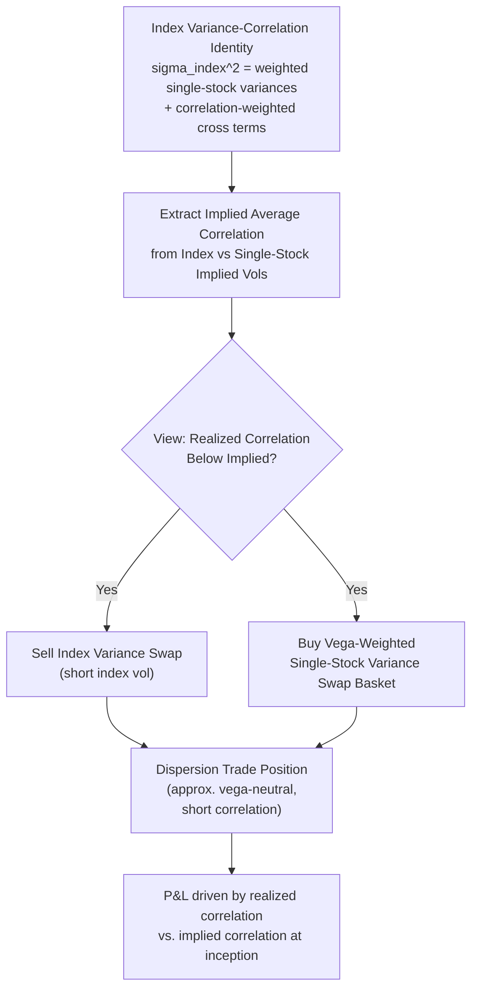

## Correlation Swaps and Dispersion Trading

### Overview

Correlation swaps and dispersion trading are closely related strategies that isolate exposure to the **realized correlation** among a basket of assets (typically the constituents of an equity index), rather than exposure to the volatility or direction of any single asset. These instruments exploit the mathematical relationship linking index variance to the variances of its constituents and their pairwise correlations, allowing traders to express a pure view on whether stocks will move together (high correlation, low dispersion) or independently (low correlation, high dispersion).

### The Variance-Correlation Relationship

For an index composed of $n$ constituents with weights $w_i$, the index return variance decomposes as:

$$\sigma_{index}^2 = \sum_{i=1}^n w_i^2 \sigma_i^2 + \sum_{i \neq j} w_i w_j \rho_{ij} \sigma_i \sigma_j$$

Using a simplifying **average correlation assumption** ($\rho_{ij} = \bar\rho$ for all pairs), this becomes:

$$\sigma_{index}^2 \approx \bar\rho \left(\sum_i w_i \sigma_i\right)^2 + (1-\bar\rho)\sum_i w_i^2 \sigma_i^2$$

Rearranging to solve for **implied average correlation**:

$$\bar\rho_{implied} = \frac{\sigma_{index}^2 - \sum_i w_i^2 \sigma_i^2}{\left(\sum_i w_i \sigma_i\right)^2 - \sum_i w_i^2 \sigma_i^2}$$

This shows that **implied correlation can be backed out directly from the ratio of index variance to a weighted basket of single-stock variances**, using only observable (or implied, via variance swaps or options) volatility inputs — no separate direct market for "correlation" is strictly needed to define this quantity, though correlation swaps and correlation indices make it directly tradable.

### Key Instruments

**Correlation swaps**: pay the difference between realized average pairwise correlation over the swap's life and a fixed correlation strike:

$$\text{Payoff} = N \times \left(\bar\rho_{realized} - K_{corr}\right)$$

where $\bar\rho_{realized}$ is computed as the average of all pairwise realized correlations among the specified basket of stocks over the observation period. Correlation swaps are the most direct instrument for pure correlation exposure but are comparatively illiquid and largely traded OTC.

**Dispersion trades**: rather than trading correlation directly, a dispersion trade **sells index variance (or volatility) and buys a basket of single-stock variance (or volatility)** in offsetting notional amounts (typically vega-weighted), such that the position is close to flat with respect to the *level* of volatility but retains sensitivity to the **relative pricing gap** between index-implied and constituent-implied volatility — which, per the variance-correlation identity above, is driven substantially by implied correlation.

**Correlation indices** (e.g., CBOE's implied correlation indices): published benchmarks that apply the implied-correlation-extraction formula above to standardized index and single-stock option data, providing a real-time, model-free-in-spirit gauge of the market's implied average correlation, analogous to how the VIX benchmarks implied volatility.

### Key Points

- **A short correlation position is the natural stance of a dispersion trade** (sell index variance / buy single-stock variance) — if realized correlation subsequently comes in **lower** than what was implied in the initial relative pricing, the position profits, since the constituent variance overweights an unrealized excess in the index leg relative to actual co-movement.
- **The correlation risk premium**: similar to the variance risk premium, implied correlation (extracted from index versus single-stock option pricing) has been empirically documented to typically trade **above** subsequently realized correlation on average — making systematic short-correlation (long dispersion) strategies a documented, though periodically loss-making, source of risk premium harvesting, particularly vulnerable during systemic stress episodes when realized correlations tend to spike toward 1.
- **Correlation spikes during market stress**: a well-documented empirical regularity is that realized correlations across most assets rise sharply during systemic market downturns (the "correlation goes to 1 in a crash" phenomenon), meaning short-correlation/long-dispersion positions carry meaningful **tail risk** that is directly analogous to, and often correlated with, short-volatility tail risk.
- **Basket composition and weighting choices matter significantly**: the specific single-stock basket (full index replication vs. a subset of liquid names), the vega-weighting scheme, and whether the trade uses variance swaps, straddles, or a combination all affect the trade's precise correlation sensitivity and its residual exposure to idiosyncratic single-stock volatility moves.

### Constructing a Dispersion Trade

**Step 1 — Select the basket**: choose index constituents (often the most liquid, largest-weight names, or a representative subset if trading the full index basket is impractical) and determine notional weights, typically aiming to match the index weighting or a vega-neutral scheme.

**Step 2 — Determine relative notional sizing**: size the index variance swap notional against the aggregate single-stock variance swap notionals such that the position has (approximately) **zero net vega** to a parallel shift in all volatilities — isolating the trade's sensitivity to the *relative* movement between index and single-stock implied vols (i.e., to correlation) rather than to the overall volatility level.

**Step 3 — Execute and monitor**: enter offsetting variance swap (or straddle-based) positions; monitor realized correlation evolution and implied correlation index levels (e.g., CBOE's implied correlation indices) as a real-time gauge of the position's theoretical mark-to-market direction.

### Example: Simplified Dispersion Trade Illustration

Suppose an index has implied volatility of 18%, and a vega-weighted basket of its constituents has an average implied volatility of 25%, with weights summing appropriately in the variance-correlation formula to imply an average correlation of roughly 55%. A trader believing that realized correlation over the coming quarter will fall meaningfully below 55% (e.g., due to increased stock-specific news flow, differentiated earnings outcomes, or sector rotation dynamics reducing broad co-movement) would:

- **Sell** the index variance swap (short index vol)
- **Buy** the vega-weighted single-stock variance swap basket (long constituent vol)

If realized correlation comes in at, say, 40% instead of 55%, the actual realized index variance will be **lower** relative to the realized single-stock variances than what the initial relative pricing implied, generating a profit on the position. [Inference] The exact P&L depends on the precise realized paths of both index and constituent volatilities, not just the average correlation outcome, since dispersion trades retain some residual sensitivity to the *level* of volatility and to individual stock idiosyncratic moves beyond the simplified average-correlation framework presented here.

### Comparison Table

| Feature | Correlation Swap | Dispersion Trade |
| --- | --- | --- |
| Direct payoff variable | Realized average pairwise correlation | Relative index vs. basket variance (correlation-driven) |
| Liquidity | Low; mostly bespoke OTC | Higher; built from more liquid variance swaps/options |
| Implementation complexity | Simple in payoff, hard to source/hedge | More complex (multi-leg basket construction, rebalancing) |
| Residual risk beyond correlation | Minimal, if correlation swap is cleanly structured | Basket composition risk, idiosyncratic vol risk, notional drift |
| Typical direction of trade | Explicit correlation view | Usually short correlation (sell index, buy constituents) |
| Common risk premium harvested | Correlation risk premium directly | Combination of correlation risk premium and relative variance risk premium |

### Diagram: Dispersion Trade Structure

### SVG: Correlation and the Variance Decomposition

<svg xmlns="http://www.w3.org/2000/svg" viewBox="0 0 640 320">
<text x="320" y="22" font-size="15" text-anchor="middle" font-family="sans-serif" font-weight="bold">Index Variance as a Function of Average Correlation (svg_diagram)</text>
<line x1="60" y1="270" x2="580" y2="270" stroke="black" stroke-width="1.5" />
<line x1="60" y1="270" x2="60" y2="50" stroke="black" stroke-width="1.5" />
<text x="320" y="295" font-size="12" text-anchor="middle" font-family="sans-serif">Average Correlation (0 to 1)</text>
<text x="30" y="160" font-size="12" text-anchor="middle" font-family="sans-serif" transform="rotate(-90 30 160)">Index Variance</text>
<path d="M 80 240 Q 200 200 320 150 Q 440 100 560 60" fill="none" stroke="#1f77b4" stroke-width="2.5" />
<text x="420" y="90" font-size="11" fill="#1f77b4" font-family="sans-serif">Index variance rises with correlation</text>
<line x1="80" y1="180" x2="560" y2="180" stroke="#888888" stroke-width="1.5" stroke-dasharray="4,4" />
<text x="500" y="175" font-size="10" fill="#888888" font-family="sans-serif">Weighted avg. single-stock variance (rho=1 upper bound reference)</text>
<circle cx="320" cy="150" r="5" fill="#d62728" />
<text x="330" y="140" font-size="10" fill="#d62728" font-family="sans-serif">Typical implied correlation level</text>
</svg>

### Risk Management Considerations

- **Tail risk asymmetry**: because realized correlations tend to spike toward 1 precisely during systemic market stress (when single-stock and index volatilities also typically both rise sharply), short-correlation/long-dispersion positions can experience **losses concentrated in exactly the market states where broader portfolio risk is already elevated** — a documented risk clustering concern for desks running dispersion books alongside other short-volatility exposures.
- **Basket drift and rebalancing risk**: as index constituent weights change over time (index reconstitutions, corporate actions, weight drift from price changes), a static dispersion trade's effective correlation exposure can drift from its initially intended profile, requiring periodic rebalancing and associated transaction costs.
- **Liquidity and execution costs across many single names**: constructing the single-stock leg of a dispersion trade typically requires executing variance swaps or option straddles across many individual names simultaneously, incurring cumulative bid-ask and market-impact costs that can be substantial relative to the single, more liquid index leg.
- **Model risk in correlation estimation**: the "average pairwise correlation" simplification embedded in the standard variance-correlation identity is itself an approximation to the true, full pairwise correlation matrix; in practice, this approximation is generally considered reasonable for well-diversified, large-cap indices but [Inference] its accuracy may degrade for baskets with unusual sector concentration or a small number of dominant-weight constituents.

### Related Topics

- Variance swap replication and the model-free variance formula
- The VIX and CBOE implied correlation indices
- Volatility risk premium and its relationship to correlation risk premium
- Basket and index option pricing under correlation assumptions
- Tail risk clustering across short-volatility and short-correlation strategies
- Multi-asset stochastic volatility models incorporating stochastic correlation