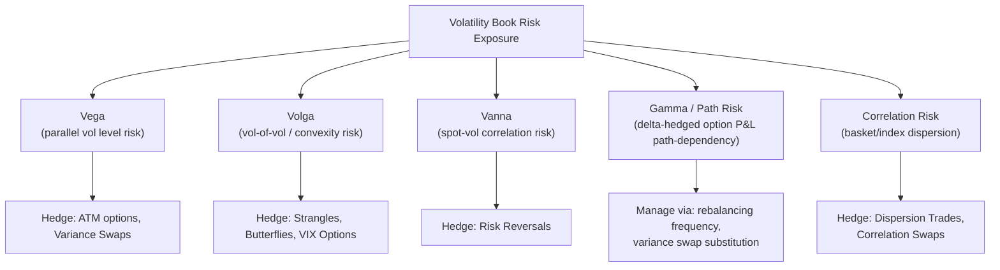

## Trading and Hedging Volatility Exposure

### Overview

Trading and hedging volatility exposure encompasses the practical toolkit derivatives desks and volatility traders use to isolate, size, and manage exposure to volatility as an asset class in its own right — spanning delta-hedged option positions, variance and volatility swaps, VIX-linked instruments, and the Greeks (vega, volga, vanna, gamma) that quantify these exposures. This synthesizes the instruments and models covered throughout stochastic volatility, jump-diffusion, and variance derivatives material into the operational practice of running a volatility book.

### The Core Volatility Greeks

**Vega** ($\partial V/\partial \sigma$): sensitivity of an option's value to a parallel shift in implied volatility. The foundational volatility risk measure, but insufficient alone for managing a book exposed to skew and smile dynamics.

**Volga (vomma)** ($\partial^2 V/\partial \sigma^2$): sensitivity of vega itself to changes in implied volatility — i.e., the convexity of an option's value with respect to volatility. Positive for both calls and puts, volga is largest for OTM options and captures a position's exposure to vol-of-vol.

**Vanna** ($\partial^2 V/\partial S \partial \sigma$, equivalently $\partial \Delta/\partial \sigma$): cross-sensitivity between spot and volatility — how an option's delta changes as volatility changes (or equivalently, how vega changes as spot moves). Vanna is the Greek most directly connected to the correlation ($\rho$) parameter in stochastic volatility models, since it captures the P&L impact of spot and vol moving together.

**Gamma** ($\partial^2 V/\partial S^2$): while primarily a spot-price Greek, gamma is intimately connected to volatility trading because a **delta-hedged option position's P&L is driven by the gamma-theta tradeoff**: realized volatility above the level implied at the option's purchase generates positive P&L from gamma trading (rebalancing the hedge captures more value than theta decay costs), and vice versa — this is the classical mechanism by which a delta-hedged option position expresses a pure volatility view.

### Key Points

- **Delta-hedged options are a "noisy" way to trade volatility**: unlike variance swaps, a delta-hedged option's P&L depends on the *path* of realized volatility (due to gamma being a nonlinear, spot-level-dependent function), not just its average level — two paths with identical total realized variance but different volatility-of-realized-volatility patterns can produce different delta-hedged P&L outcomes, a well-known "path-dependency" complication relative to variance swaps' clean linearity in realized variance.
- **Variance swaps offer purer volatility exposure**: as covered in variance swap material, they pay linearly in realized variance regardless of the path taken to get there, making them the preferred instrument when a trader wants clean, path-independent exposure to the volatility level itself.
- **Skew and smile trading requires managing the full Greek surface**: a book with options across many strikes and maturities has vega, volga, and vanna exposure that varies by strike and tenor — desks typically manage this via **bucketed vega** (vega exposure by maturity bucket) and **skew/smile risk reports** (sensitivity to specific parametric shifts in the skew, such as a "25-delta risk reversal" shock) rather than a single aggregate vega number.
- **Hedging instrument selection depends on the risk being managed**: parallel vega shifts can be hedged with ATM options or variance swaps; skew risk requires risk reversals or out-of-the-money option combinations; vol-of-vol/convexity risk requires VIX options or strangles/butterflies with the right convexity profile.

### Hedging Approaches by Risk Type

| Risk exposure | Typical hedging instrument | Rationale |
| --- | --- | --- |
| Parallel vega (level of ATM vol) | ATM straddles, variance swaps | Directly matches the risk factor; variance swaps avoid path-dependency |
| Skew (risk reversal risk) | Risk reversals (long OTM call/short OTM put or vice versa) | Isolates the relative pricing of calls vs. puts |
| Volga/convexity (wing risk) | Strangles, butterflies, VIX options | Captures nonlinear vega sensitivity to large vol moves |
| Vanna (spot-vol correlation) | Risk reversals, or explicit vanna-matched combinations | Manages P&L from spot and vol moving together |
| Forward/term-structure skew | Calendar spreads, forward-starting options | Manages exposure to how the skew evolves across tenors |
| Correlation (basket/index dispersion) | Dispersion trades, correlation swaps | Isolates co-movement risk distinct from outright vol level |
| Jump/tail risk | Deep OTM puts, VIX calls | Convex payoff structures that capture discontinuous moves |

### Delta-Hedging Mechanics: The Gamma-Theta Tradeoff

For a delta-hedged long option position, the instantaneous P&L over a small time step $dt$ (ignoring higher-order terms) is approximately:

$$dP\&L \approx \frac{1}{2}\Gamma S^2 \left(\frac{dS}{S}\right)^2 - \Theta \, dt$$

Rearranging in terms of the local realized variance $(\frac{dS}{S})^2$ versus the implied variance embedded in the option's theta decay:

$$dP\&L \approx \frac{1}{2}\Gamma S^2 \left[ \sigma_{realized,local}^2 - \sigma_{implied}^2 \right] dt$$

This shows explicitly that a delta-hedged long option position **profits when realized volatility (locally) exceeds the implied volatility at which the option was purchased**, and loses when realized volatility falls short — the fundamental mechanism underlying "long gamma" and "short gamma" trading strategies, and the reason delta-hedged options are viewed as an (imperfect, path-dependent) way to take a view on the realized-vs-implied volatility spread.

### Example: Comparing Two Approaches to a Long-Volatility View

Suppose a trader believes 1-month realized volatility on an index will substantially exceed the currently implied 15% level.

**Approach 1 — Long delta-hedged ATM straddle**: buy an ATM straddle and rebalance delta daily. If realized volatility does come in higher than 15%, the position profits from the gamma-theta mechanism above, but the **exact P&L depends on the path** — volatility that is front-loaded (large moves early, quiet later) versus back-loaded produces different total P&L even for identical total realized variance, due to how gamma exposure evolves with time-to-expiry and moneyness drift.

**Approach 2 — Long a 1-month variance swap**: struck at, say, 15.5% (accounting for the variance/volatility convexity discussed in the variance swap material). The payoff depends **only on total realized variance** over the period, with no path-dependency — a cleaner instrument for a pure "volatility will be higher than X" view, at the cost of losing the optionality-like convexity/flexibility (e.g., the ability to actively trade around the straddle position, adjust rebalancing frequency to add alpha, or the defined maximum loss of a bought option) that a straddle position offers.

[Inference] Whether the straddle or the variance swap produces the better outcome in any specific realized scenario depends entirely on the realized path, not just the average realized volatility level — this genuine path-dependency, not a strict superiority of one instrument, is the standard framing in the literature comparing these approaches.

### Diagram: Volatility Risk Management Framework

### SVG: Delta-Hedged P&L Path Dependency

<svg xmlns="http://www.w3.org/2000/svg" viewBox="0 0 640 320">
<text x="320" y="22" font-size="15" text-anchor="middle" font-family="sans-serif" font-weight="bold">Path Dependency: Same Total Variance, Different P&amp;L Paths (svg_diagram)</text>
<line x1="60" y1="270" x2="580" y2="270" stroke="black" stroke-width="1.5" />
<line x1="60" y1="270" x2="60" y2="50" stroke="black" stroke-width="1.5" />
<text x="320" y="295" font-size="12" text-anchor="middle" font-family="sans-serif">Time</text>
<text x="30" y="160" font-size="12" text-anchor="middle" font-family="sans-serif" transform="rotate(-90 30 160)">Cumulative Delta-Hedged P&amp;L</text>
<line x1="60" y1="200" x2="580" y2="200" stroke="#dddddd" stroke-width="1" stroke-dasharray="3,3" />
<path d="M 80 200 Q 150 100 220 90 Q 320 100 400 130 Q 480 150 550 155" fill="none" stroke="#1f77b4" stroke-width="2.5" />
<text x="180" y="80" font-size="11" fill="#1f77b4" font-family="sans-serif">Front-loaded realized vol</text>
<path d="M 80 200 Q 150 195 220 190 Q 320 170 400 110 Q 480 60 550 45" fill="none" stroke="#d62728" stroke-width="2.5" />
<text x="420" y="90" font-size="11" fill="#d62728" font-family="sans-serif">Back-loaded realized vol</text>
<path d="M 80 200 L 550 90" fill="none" stroke="#888888" stroke-width="2" stroke-dasharray="6,3" />
<text x="480" y="130" font-size="11" fill="#888888" font-family="sans-serif">Variance swap (path-independent)</text>
</svg>

### Practical Trading Frameworks

- **Skew trading via risk reversals**: a risk reversal (long OTM call, short OTM put, or vice versa) isolates the relative implied volatility of calls versus puts, allowing a trader to express a view on skew steepening/flattening independent of the overall vol level, provided the position is vega-matched at inception.
- **Volga trading via strangles/butterflies**: since strangles and butterflies have significant positive volga (their value is convex in volatility), they are natural instruments for expressing a view that implied volatility will move by *more* than the market currently prices, regardless of direction.
- **Cross-instrument relative value**: comparing the vol-of-vol implied by VIX options against the vol-of-vol parameter calibrated from the underlying equity smile (as discussed in vol-of-vol products) is a standard relative-value framework for identifying mispricings between related volatility markets.
- **Systematic volatility risk premium strategies**: many institutional strategies systematically harvest the variance, correlation, and volatility risk premia discussed throughout this chapter by maintaining a persistent short-volatility or short-correlation bias, typically overlaid with explicit tail-risk hedges (deep OTM puts, VIX calls) to manage the well-documented left-tail exposure such strategies carry.

### Risk Management and Governance Considerations

- **Stress testing for volatility spikes**: given the well-documented tendency for realized volatility, correlation, and vol-of-vol to all spike simultaneously during systemic stress (compounding losses across multiple short-volatility-related positions held concurrently), robust stress testing scenarios explicitly modeling simultaneous spikes across these risk factors are standard practice for books running multiple volatility strategies together.
- **Liquidity risk in stressed markets**: bid-ask spreads on options, variance swaps, and even VIX futures/options can widen dramatically during volatility spikes, precisely when a short-volatility book may need to reduce or hedge exposure most urgently — a well-known practical constraint that pure theoretical Greek-based risk management can understate.
- **Model risk aggregation**: since managing a volatility book draws on multiple models (SV, SVJ, local vol, VG/NIG for different instruments) potentially calibrated with different conventions or on different snapshots, aggregating risk across the book requires care to ensure Greeks computed under different models are genuinely comparable, a practical challenge distinct from any single model's theoretical soundness. [Unverified] The specific governance frameworks and model risk reserve methodologies used to address this vary meaningfully across institutions and are not standardized industry-wide.

### Related Topics

- Variance and volatility swaps (path-independent volatility exposure)
- The VIX index and volatility futures for index-level hedging
- Correlation swaps and dispersion trading for co-movement risk
- Stochastic volatility model Greeks (vega, volga, vanna) derivation
- Tail-risk hedging program design and cost-efficiency analysis
- Model risk reserves and governance for multi-model volatility books