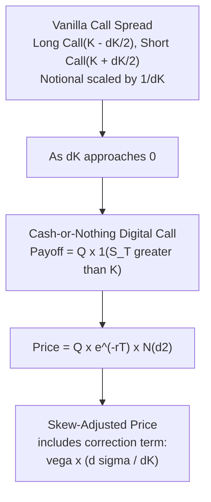

## Digital and Binary Options

### Overview

Digital options (also called binary options) are derivatives that pay a fixed, predetermined amount if a specified condition on the underlying asset is met at (or by) expiration, and pay nothing otherwise. Unlike vanilla options, whose payoff scales continuously with how far the underlying finishes in-the-money, digital options have a **discontinuous, all-or-nothing payoff structure** — this discontinuity is the defining feature that drives their distinctive pricing, hedging, and risk-management challenges, particularly their acute sensitivity to the implied volatility skew near the strike.

### Payoff Structures

**Cash-or-nothing call**: pays a fixed cash amount $Q$ if $S_T > K$ at expiration, zero otherwise:

$$\text{Payoff} = Q \times \mathbb{1}_{\{S_T > K\}}$$

**Cash-or-nothing put**: pays $Q$ if $S_T < K$, zero otherwise:

$$\text{Payoff} = Q \times \mathbb{1}_{\{S_T < K\}}$$

**Asset-or-nothing call**: pays the underlying asset itself (or its cash value) if $S_T > K$, zero otherwise:

$$\text{Payoff} = S_T \times \mathbb{1}_{\{S_T > K\}}$$

**One-touch / no-touch options** (path-dependent variants, common in FX): pay a fixed amount if the underlying **ever touches** (one-touch) or **never touches** (no-touch) a barrier level during the option's life, rather than only checking the condition at expiration — these are technically path-dependent but are grouped with digitals due to their shared discontinuous payoff character.

### Black-Scholes Pricing of Cash-or-Nothing Options

Under Black-Scholes, a cash-or-nothing call paying $Q$ has the closed-form price:

$$V_{CoN\,call} = Q \, e^{-rT} \, N(d_2)$$

where $N(d_2)$ is precisely the risk-neutral probability that $S_T > K$ at expiration:

$$d_2 = \frac{\ln(S_0/K) + (r - \frac{1}{2}\sigma^2)T}{\sigma\sqrt{T}}$$

This elegant result — the digital price is just the discounted risk-neutral probability of finishing in-the-money times the fixed payout — makes cash-or-nothing digitals conceptually the simplest possible derivative: a pure bet on probability, discounted.

The corresponding cash-or-nothing put price is $V_{CoN\,put} = Q\,e^{-rT}(1-N(d_2))$, consistent with put-call parity for digitals: $V_{CoN\,call} + V_{CoN\,put} = Q e^{-rT}$.

### Key Points

- **Digital options are, in the constant-volatility Black-Scholes world, mathematically the derivative of a vanilla call price with respect to strike** (up to sign and the payout scaling): $\frac{\partial C_{BS}}{\partial K} = -e^{-rT}N(d_2)$, meaning a cash-or-nothing digital is closely related to an infinitesimally tight **call spread** in the limit.
- **The call-spread replication is the standard practical hedging approach**: a cash-or-nothing call struck at $K$ paying $Q$ can be approximately replicated by a tight vanilla call spread — long $Q/\Delta K$ calls struck at $K - \Delta K/2$ and short the same quantity struck at $K + \Delta K/2$ — which converges to the exact digital payoff as $\Delta K \to 0$, but which is itself a **directly tradable, model-free replication strategy** using standard listed vanilla options.
- **Extreme gamma/vega near the strike at expiration**: because the payoff is discontinuous, a digital option's delta, gamma, and vega all become extremely large (theoretically infinite in the idealized continuous limit) as time to expiration approaches zero with spot near the strike — this is the central practical risk management challenge for digital option desks and is often described informally as "pin risk" (analogous to, but generally more severe than, the pin risk of vanilla options struck exactly at spot at expiration).
- **Skew sensitivity is disproportionately large**: because the digital price is directly the risk-neutral probability $N(d_2)$ (a function of the *local* slope of the implied volatility skew at the strike, not just its level), digital option prices are highly sensitive to the shape of the skew near the strike — a steeper local skew slope directly increases or decreases the digital's fair value beyond what a naive flat-vol Black-Scholes price would suggest.

### The Skew Adjustment to Digital Pricing

Because market-implied volatility varies by strike (the skew), a digital option's fair price under a smile-consistent framework differs from the flat-vol Black-Scholes formula. Using the call-spread replication logic with market-observed vanilla prices $C(K)$ at nearby strikes:

$$V_{CoN\,call}(K) \approx -\frac{\partial C(K)}{\partial K} \bigg|_{\text{market smile}} \times Q \, e^{-rT} \text{ (per unit of } Q\text{, discounted)}$$

Differentiating the vanilla call price with respect to strike *while accounting for the fact that implied volatility itself is a function of strike* (via the chain rule) gives:

$$\frac{\partial C(K)}{\partial K} = \frac{\partial C_{BS}}{\partial K}\bigg|_{\sigma \text{ fixed}} + \frac{\partial C_{BS}}{\partial \sigma} \times \frac{\partial \sigma(K)}{\partial K}$$

The second term — **vega times the local skew slope** — is the key correction: a **negative skew slope** (typical for equity indices, where implied vol decreases as strike increases) makes this correction term reduce the effective $-\partial C/\partial K$, meaning cash-or-nothing calls are generally priced **lower** than the flat-vol formula would suggest in a negatively-skewed market (and correspondingly, cash-or-nothing puts are priced **higher**) — directly linking the shape of the vanilla skew to a first-order digital pricing adjustment.

### Comparison Table

| Feature | Vanilla Option | Cash-or-Nothing Digital |
| --- | --- | --- |
| Payoff continuity | Continuous (linear beyond strike) | Discontinuous (step function) |
| Sensitivity to strike-level skew | Standard vega/skew exposure | Amplified — depends on local *slope* of skew, not just level |
| Near-expiry Greeks at-the-money | Well-behaved | Explosive (delta/gamma blow up near strike) |
| Standard hedge | Delta-hedging the option itself | Tight call/put spread replication |
| Closed-form BS price | Yes | Yes (even simpler — just $N(d_2)$ scaled) |
| Typical use case | General directional/volatility views | Event-driven bets, structured note components, FX barrier-adjacent products |

### Example: Skew Impact on a Digital Call

Consider an equity index with spot at 100, a 1-year cash-or-nothing call struck at 110 paying $1, flat implied volatility of 20% (hypothetically), risk-free rate 3%. The flat-vol Black-Scholes price would be:

$$V = e^{-0.03} N(d_2), \quad d_2 = \frac{\ln(100/110) + (0.03 - 0.5\times0.04)(1)}{0.20}$$

Now suppose the actual market has a negative skew such that implied volatility at strike 110 is only 18% (lower than ATM, typical for calls in an equity skew) — recomputing $d_2$ with $\sigma=0.18$ shifts $N(d_2)$ higher (since lower volatility concentrates the distribution, and with $K$ above the forward, this typically **raises** the probability-based digital call value relative to using the higher ATM vol). [Inference] The precise direction and magnitude of this adjustment depends on where the strike sits relative to the forward and the specific local shape of the skew; the qualitative point — that using the *correct local strike's* implied volatility rather than a flat or ATM volatility materially changes the digital price — is the general lesson, more than any single universal directional rule.

### Diagram: Digital as the Limit of a Call Spread

### SVG: Digital Payoff vs. Call Spread Approximation

<svg xmlns="http://www.w3.org/2000/svg" viewBox="0 0 640 320">
<text x="320" y="22" font-size="15" text-anchor="middle" font-family="sans-serif" font-weight="bold">Digital Payoff and Call Spread Replication (svg_diagram)</text>
<line x1="60" y1="270" x2="580" y2="270" stroke="black" stroke-width="1.5" />
<line x1="60" y1="270" x2="60" y2="50" stroke="black" stroke-width="1.5" />
<text x="320" y="295" font-size="12" text-anchor="middle" font-family="sans-serif">Terminal Spot Price S_T</text>
<text x="30" y="160" font-size="12" text-anchor="middle" font-family="sans-serif" transform="rotate(-90 30 160)">Payoff</text>
<path d="M 100 240 L 300 240 L 300 90 L 560 90" fill="none" stroke="#1f77b4" stroke-width="2.5" />
<text x="400" y="75" font-size="11" fill="#1f77b4" font-family="sans-serif">Ideal digital payoff (step function)</text>
<path d="M 100 240 L 270 240 L 330 90 L 560 90" fill="none" stroke="#d62728" stroke-width="2.5" stroke-dasharray="6,3" />
<text x="180" y="150" font-size="11" fill="#d62728" font-family="sans-serif">Call spread approximation\n(finite dK, smooth ramp)</text>
<line x1="300" y1="60" x2="300" y2="270" stroke="black" stroke-width="0.5" stroke-dasharray="2,2" />
<text x="300" y="290" font-size="10" text-anchor="middle" font-family="sans-serif">Strike K</text>
</svg>

### Hedging Challenges: Pin Risk in Practice

- **Near-expiry, near-the-money hedging instability**: as a digital option approaches expiration with spot trading close to the strike, the hedge ratio required (via the call-spread replication) becomes extremely large and highly sensitive to small spot moves — a dealer holding a large digital position near this point faces genuine execution risk in maintaining an adequate hedge.
- **Practical mitigation — the tenor/width tradeoff**: dealers typically hedge digitals using a call spread with a **deliberately wider** $\Delta K$ than the theoretical infinitesimal limit, accepting a small basis/replication error in exchange for a materially more stable, executable hedge — the choice of spread width is a direct risk-versus-precision tradeoff made explicit in trading desk practice.
- **Barrier proximity effects (one-touch/no-touch variants)**: for path-dependent one-touch digitals, hedging additionally requires managing the risk of the underlying approaching the barrier itself, compounding standard digital pin risk with barrier-specific hedging considerations (addressed further in barrier option material).
- **Add-on reserves for pin risk**: many trading desks maintain an explicit **pin risk reserve** or add-on charge for large digital positions near expiration, reflecting the genuine cost of the hedging instability described above, beyond what the theoretical Black-Scholes/skew-adjusted price alone would suggest.

### Applications

- **Structured note components**: digitals are frequently embedded within structured notes (e.g., "if the index is above X on date Y, receive an enhanced coupon") as a cost-efficient way to create a step-function payoff profile.
- **Event-driven directional bets**: digitals allow investors to express a pure "will this threshold be crossed" view without the magnitude-scaling of a vanilla option, useful around known binary catalysts (earnings, regulatory decisions, elections).
- **FX one-touch/no-touch products**: particularly common in FX markets, where corporate and institutional clients use one-touch structures for scenario-specific hedging (e.g., "pay out if EUR/USD touches a specific rate, to offset a contingent liability tied to that level").
- **Building block for more complex exotics**: digitals and their call-spread replication logic underpin the pricing intuition for range accruals, barrier options, and other threshold-based payoff structures covered elsewhere in the exotic options curriculum.

### Related Topics

- Call-spread and static replication techniques for discontinuous payoffs
- Barrier options and one-touch/no-touch structures
- Skew-consistent pricing adjustments (local volatility, SLV application to digitals)
- Range accrual notes and threshold-based structured products
- Pin risk management and hedge-width tradeoffs in exotic derivatives desks
- Static hedging theory for path-dependent and discontinuous payoffs