## Compound Options

### Definition and Structure

A compound option is an option on an option — the underlying asset of the derivative is itself a derivative contract. The holder of a compound option has the right, but not the obligation, to buy or sell an underlying option at a predetermined strike price on or before a specified expiration date.

Compound options involve two strike prices and two expiration dates:

- $K_1$: strike price of the compound (outer) option
- $K_2$: strike price of the underlying (inner) option
- $T_1$: expiration date of the compound option
- $T_2$: expiration date of the underlying option, with $T_2 > T_1$

At time $T_1$, the holder decides whether to exercise the compound option. Exercising means paying $K_1$ to receive the underlying option, which itself has value based on the possibility of exercising at $K_2$ at time $T_2$.

### The Four Basic Types

Since there are two option types (call/put) at two levels (outer/inner), there are four standard compound options:

1. **Call on a call (CoC)** — right to buy a call option
2. **Call on a put (CoP)** — right to buy a put option
3. **Put on a call (PoC)** — right to sell a call option
4. **Put on a put (PoP)** — right to sell a put option

**Key Points**

- The payoff at $T_1$ for a call-on-call is $\max(C(S_{T_1}, K_2, T_2 - T_1) - K_1, 0)$, where $C(\cdot)$ is the Black-Scholes value of the underlying call
- The payoff at $T_1$ for a put-on-call is $\max(K_1 - C(S_{T_1}, K_2, T_2 - T_1), 0)$
- Analogous expressions hold for options on puts, substituting $P(\cdot)$ for the inner option value

### Economic Motivation and Use Cases

Compound options arise naturally in several contexts:

- **Contingent deals**: A firm bidding on a project (e.g., an M&A transaction or a construction contract) may want the right to hedge currency or commodity exposure only if it wins the bid — a compound option lets it pay a small premium now for the right to enter a full hedge later
- **Leverage**: Compound options offer higher leverage than vanilla options for a given premium outlay, since the premium on the outer option is small relative to the notional exposure of the inner option
- **Corporate finance applications**: Real options analysis frequently models sequential investment decisions (e.g., R&D followed by a plant-construction decision) as compound options, where each stage of investment is the strike price of an option on the next stage
- **Employee stock options with vesting tranches**: Sometimes approximated as compound structures
- **Callable/putable bonds with embedded compound features**, and rights issues, can also be modeled this way

### Valuation: Geske's Formula

The most widely cited closed-form solution for compound options under Black-Scholes assumptions was derived by Robert Geske (1979) for a call on a call. The valuation requires bivariate cumulative normal distributions because there are two sequential random outcomes to account for: whether $S_{T_1}$ exceeds the critical price $S^*$ (making exercise of the compound option worthwhile), and whether $S_{T_2}$ exceeds $K_2$ (making the inner option finish in the money).

**Call on a Call**

$$C_{CoC} = S_0 e^{-qT_2} M(a_1, b_1; \rho) - K_2 e^{-rT_2} M(a_2, b_2; \rho) - K_1 e^{-rT_1} N(a_2)$$

where:

$$a_1 = \frac{\ln(S_0/S^*) + (r - q + \sigma^2/2)T_1}{\sigma\sqrt{T_1}}, \quad a_2 = a_1 - \sigma\sqrt{T_1}$$

$$b_1 = \frac{\ln(S_0/K_2) + (r - q + \sigma^2/2)T_2}{\sigma\sqrt{T_2}}, \quad b_2 = b_1 - \sigma\sqrt{T_2}$$

$$\rho = \sqrt{T_1/T_2}$$

- $M(x, y; \rho)$ is the bivariate cumulative standard normal distribution function with correlation $\rho$
- $N(\cdot)$ is the univariate cumulative standard normal distribution
- $S^*$ is the critical stock price at $T_1$ such that the value of the inner call option exactly equals $K_1$; found by solving $C(S^*, K_2, T_2 - T_1) - K_1 = 0$ numerically (e.g., via Newton-Raphson)
- $q$ is the continuous dividend yield, $r$ is the risk-free rate, $\sigma$ is volatility of the underlying asset

**Put on a Call**

$$P_{PoC} = K_2 e^{-rT_2} M(-a_2, b_2; -\rho) - S_0 e^{-qT_2} M(-a_1, b_1; -\rho) + K_1 e^{-rT_1} N(-a_2)$$

**Call on a Put and Put on a Put** follow by analogous substitutions, flipping the payoff structure of the inner option; the correlation and critical-price logic carries through with sign adjustments (see Haug, *The Complete Guide to Option Pricing Formulas*, for the fully worked-out closed forms of all four variants).

[Inference] The bivariate normal terms in Geske's model are computationally sensitive to the algorithm used for $M(x,y;\rho)$; different implementations (Drezner's approximation vs. numerical integration) can yield small discrepancies in the fourth decimal place, which matters for very short-dated compound options near the critical price.

### Worked Numerical Example

Consider a call on a call with:

- $S_0 = 100$, $\sigma = 25\%$, $r = 5\%$, $q = 0\%$
- $K_1 = 5$ (outer strike, cost to acquire the inner call)
- $T_1 = 0.25$ years (outer expiry)
- $K_2 = 105$ (inner strike)
- $T_2 = 0.75$ years (inner expiry)

**Step 1 — Solve for $S^*$:** Find the stock price at $T_1$ where a European call with strike 105 and 0.5 years remaining ($T_2 - T_1$) is worth exactly 5. Numerically, this converges to approximately $S^* \approx 98.7$.

**Step 2 — Compute $a_1, a_2, b_1, b_2, \rho$:**

- $\rho = \sqrt{0.25/0.75} \approx 0.577$
- $a_1 \approx \frac{\ln(100/98.7) + (0.05 + 0.03125)(0.25)}{0.25\sqrt{0.25}} \approx 0.216$
- $a_2 \approx 0.216 - 0.125 = 0.091$
- $b_1 \approx \frac{\ln(100/105) + (0.05+0.03125)(0.75)}{0.25\sqrt{0.75}} \approx 0.081$
- $b_2 \approx 0.081 - 0.2165 = -0.135$

**Step 3 — Evaluate bivariate normals and combine per Geske's formula.**

[Unverified] The exact numerical output depends on the bivariate normal approximation algorithm; a full computation typically yields a compound call premium in the range of $3.00–$3.50 for these inputs, but this should be confirmed with a direct numerical solver (e.g., QuantLib's `AnalyticCompoundOptionEngine`) rather than taken as exact by hand.

### Greeks and Risk Sensitivities

Compound options exhibit richer, more nonlinear Greek behavior than vanilla options because sensitivity compounds across two option layers:

- **Delta**: The compound option's delta is the product-like chain of the outer option's delta with respect to the inner option's value, and the inner option's own delta with respect to $S$. This can produce delta values that behave discontinuously near $S^*$
- **Vega**: Highly elevated relative to vanilla options of similar moneyness, since volatility affects both the probability of the outer exercise and the value of the inner option — compound options are often used explicitly as leveraged volatility plays
- **Theta**: Time decay is non-monotonic; value can be sensitive to the interaction between $T_1$ and $T_2 - T_1$, particularly as $T_1$ approaches and the market prices in the discrete "exercise or lapse" decision
- **Rho**: Two separate discounting horizons ($T_1$ and $T_2$) mean rho exposure has a term-structure-like character rather than a single scalar sensitivity

**Example**

A trader long a call-on-call compound option benefits disproportionately from a volatility spike shortly after inception (before $T_1$), because increased volatility raises both the probability that $S_{T_1} > S^*$ and the expected payoff of the inner call conditional on exercise.

### Put-Call Parity for Compound Options

A parity relationship analogous to vanilla put-call parity holds between compound options sharing the same underlying option, strikes, and dates:

$$C_{CoC} - P_{PoC} = C(S_0, K_2, T_2) - K_1 e^{-rT_1}$$

This states that a long call-on-call and short put-on-call replicates a forward-like position: paying $K_1 e^{-rT_1}$ (the present value of the outer strike) at $T_1$ to unconditionally acquire the underlying call option, which has present value $C(S_0, K_2, T_2)$.

### Numerical Methods Beyond Closed-Form

While Geske's formula covers the European, single-underlying, constant-volatility case, practitioners commonly need numerical approaches for:

- **American-style compound options**: Early exercise of the outer option requires a nested numerical procedure — typically a PDE grid or binomial tree solved backward from $T_2$ to generate inner option values at each node, then a second backward induction from $T_1$ to determine the compound option's early-exercise boundary
- **Stochastic volatility or jump-diffusion underlyings**: Monte Carlo simulation with nested valuation (simulate to $T_1$, then either revalue the inner option analytically at each path if a closed form exists under the model, or run a nested Monte Carlo to price the inner option — the classic "simulation within simulation" problem)
- **Local volatility surfaces**: PDE-based two-step schemes are preferred over nested Monte Carlo for computational efficiency

```mermaid
flowchart TD
    A[Time 0: Price Compound Option] --> B[Simulate/Solve to T1]
    B --> C{Is Inner Option Value at T1 greater than K1?}
    C -->|Yes| D[Exercise Compound Option: Pay K1, Receive Inner Option]
    C -->|No| E[Compound Option Expires Worthless]
    D --> F[Hold Inner Option to T2]
    F --> G{Is S at T2 in-the-money vs K2?}
    G -->|Yes| H[Exercise Inner Option: Payoff = max&#40;S_T2 - K2, 0&#41;]
    G -->|No| I[Inner Option Expires Worthless]
```

### Relationship to Chooser Options and Other Exotics

Compound options are conceptually related to but distinct from several other path-independent exotics:

- **Chooser options**: Give the holder the right to choose, at $T_1$, whether the position becomes a call or a put (both with the same strike/maturity) — this can be shown to be a special case decomposable into compound options (a call on a call plus a put on a put with matched parameters), making chooser option pricing derivable from Geske-style formulas
- **Installment options**: A generalization where the premium is paid in multiple installments over time, with the holder retaining the right to stop paying (and forfeit the option) at each installment date — effectively a chain of compound options
- **Extendible options**: Give the right to extend maturity at a cost, which shares mathematical machinery with compound option valuation (bivariate/multivariate normal integrals)

### Model Risk and Practical Considerations

- **Volatility skew sensitivity**: Since compound options embed exposure to the volatility of the inner option's *value* (not just the underlying asset), they are particularly sensitive to how volatility skew/smile is modeled; Black-Scholes-based Geske pricing with a single flat $\sigma$ can materially misprice compound options in markets with pronounced skew
- **Correlation parameter $\rho = \sqrt{T_1/T_2}$**: This is a modeling artifact of the shared driving Brownian motion, not a market-observable correlation, but it plays a role in the bivariate normal integral identical to a true correlation parameter — misunderstanding this can lead to confusion when adapting the formula to other diffusion assumptions
- **Numerical instability near $S^*$**: The Newton-Raphson search for $S^*$ can fail to converge or converge to spurious roots when the inner option's value as a function of $S$ is very flat (e.g., far out-of-the-money inner strike combined with short $T_2 - T_1$) — practical implementations often need bounds-checking and bisection fallback
- [Inference] Trading desks that run compound options books often prefer PDE-based two-factor grids (state variables: $S$ and time) over closed-form Geske pricing once American features, skew, or discrete dividends are introduced, since these can be handled uniformly within the same numerical framework rather than requiring separate closed-form adjustments for each feature

### Related Topics

- Chooser Options
- Installment Options
- Geske-Johnson Compound Option Model for American Options
- Bivariate and Multivariate Normal Distribution Functions in Option Pricing
- Real Options Analysis in Corporate Finance
- Nested Monte Carlo Simulation Techniques
- Volatility Skew and Its Impact on Exotic Option Pricing
- Extendible and Rolling Options