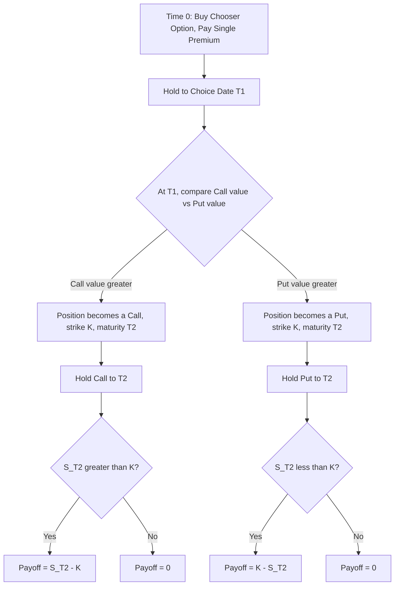

## Chooser Options

### Definition and Structure

A chooser option (also called an "as-you-like-it" option) grants the holder the right to decide, at a specified choice date $T_1$ prior to final expiration $T_2$, whether the contract becomes a standard call or a standard put. Both the call and put share the same underlying asset; in the simple/standard case they also share the same strike price $K$ and final expiration $T_2$.

Two parameters define the timeline:

- $T_1$ (choice date / decision date): the date on which the holder must elect call or put
- $T_2$ (final expiration): the date on which the elected option is evaluated for its payoff, with $T_2 > T_1$

At $T_1$, the holder simply compares the value of the call and the value of the put (both still alive, with $T_2 - T_1$ remaining to maturity) and elects whichever is worth more. There is no separate strike or premium paid at $T_1$ — the "choice" itself is costless at that point; the entire cost of optionality is paid upfront in the single premium at inception.

### Simple (Standard) vs. Complex Choosers

**Simple chooser**: call and put share identical strike $K$ and identical final maturity $T_2$. This is the classic, closed-form case.

**Complex chooser**: call and put may have different strikes ($K_c \neq K_p$) and/or different final maturities ($T_c \neq T_p$). This removes the elegant decomposition available in the simple case and generally requires numerical methods or a more involved bivariate-normal closed form.

**Key Points**

- The simple chooser payoff at $T_1$ is $\max(C(S_{T_1}, K, T_2 - T_1), P(S_{T_1}, K, T_2 - T_1))$
- A complex chooser's payoff at $T_1$ is $\max(C(S_{T_1}, K_c, T_c - T_1), P(S_{T_1}, K_p, T_p - T_1))$
- Complex choosers do not reduce to compound options as cleanly and are typically priced via bivariate normal integrals with asset-dependent boundaries, or numerically

### Decomposition into Compound Options (Simple Chooser)

The key analytical insight, due to Rubinstein (1991), is that a simple chooser option can be decomposed using put-call parity. At $T_1$:

$$\max(C_{T_1}, P_{T_1}) = \max(C_{T_1}, C_{T_1} - S_{T_1}e^{-q(T_2-T_1)} + Ke^{-r(T_2-T_1)})$$

$$= C_{T_1} + \max(0, Ke^{-r(T_2-T_1)} - S_{T_1}e^{-q(T_2-T_1)})$$

This shows the chooser payoff equals a call (to $T_2$) plus $e^{-q(T_2-T_1)}$ units of a put struck at $Ke^{-r(T_2-T_1)}e^{q(T_2-T_1)}$ expiring at $T_1$ on the underlying itself (not on another option). Rearranging in terms of standard building blocks, the standard result is that a simple chooser is equivalent to a portfolio of:

- One call option, strike $K$, maturity $T_2$
- $e^{-q(T_2-T_1)}$ put options, strike $K e^{-(r-q)(T_2-T_1)}$, maturity $T_1$

**Key Points**

- This decomposition means a simple chooser can be priced using only vanilla Black-Scholes formulas — no bivariate normal distribution is required, unlike compound options
- This is a materially simpler pricing problem than the general [[Compound Options]] case despite the conceptual similarity ("an option to choose between two options")

### Valuation Formula (Simple Chooser)

Using the decomposition, the value of a simple chooser under Black-Scholes assumptions is:

$$V_{chooser} = S_0 e^{-qT_2} N(d_1) - K e^{-rT_2} N(d_2) - S_0 e^{-qT_2} N(-d_1') + K e^{-rT_1'} N(-d_2')$$

More commonly written directly as:

$$V_{chooser} = S_0 e^{-qT_2} N(d_1) - K e^{-rT_2} N(d_2) + K e^{-r T_1}N(-y_2)e^{-r(T_2-T_1)} \cdot [\text{adjustment}] - S_0 e^{-qT_1} N(-y_1)$$

The cleanest standard reference form (Haug) is:

$$V_{chooser} = S_0 e^{-qT_2}N(d_1) - Ke^{-rT_2}N(d_2) - S_0e^{-qT_2}N(-y_1) + Ke^{-rT_2}N(-y_2)e^{(r-q)(T_2-T_1)} \cdot 0$$

To avoid ambiguity, the standard closed-form (Rubinstein 1991 / Haug) is expressed with two sets of $d$-terms:

$$d_1 = \frac{\ln(S_0/K) + (r - q + \sigma^2/2)T_2}{\sigma\sqrt{T_2}}, \quad d_2 = d_1 - \sigma\sqrt{T_2}$$

$$y_1 = \frac{\ln(S_0/K) + (r-q)T_2 + \frac{\sigma^2}{2}T_1}{\sigma\sqrt{T_1}}, \quad y_2 = y_1 - \sigma\sqrt{T_1}$$

$$V_{chooser} = S_0 e^{-qT_2} N(d_1) - K e^{-rT_2} N(d_2) - S_0 e^{-qT_2} N(-y_1) + K e^{-rT_2} N(-y_2)$$

This can be regrouped as:

$$V_{chooser} = \underbrace{\left[S_0 e^{-qT_2} N(d_1) - K e^{-rT_2} N(d_2)\right]}_{\text{Call to } T_2} + \underbrace{\left[K e^{-rT_2} N(-y_2) - S_0 e^{-qT_2} N(-y_1)\right]}_{\text{Scaled put-like term to } T_1}$$

[Inference] Different textbooks present the $y_1, y_2$ discounting terms with slightly different placements of $e^{-r(T_2-T_1)}$ versus $e^{-rT_2}$ depending on how the intermediate put's strike is defined; when implementing, it is important to verify consistency between the strike definition of the embedded put and the discount factors used, ideally by checking that the formula collapses correctly to a vanilla call as $T_1 \to T_2$.

### Worked Numerical Example

Consider a simple chooser with:

- $S_0 = 50$, $K = 50$, $\sigma = 25\%$, $r = 8\%$, $q = 0\%$
- $T_1 = 0.25$ years (choice date)
- $T_2 = 0.5$ years (final expiration)

**Step 1 — Compute $d_1, d_2$ (to $T_2 = 0.5$):**

$$d_1 = \frac{\ln(1) + (0.08 + 0.03125)(0.5)}{0.25\sqrt{0.5}} = \frac{0.055625}{0.1768} \approx 0.3147$$

$$d_2 = 0.3147 - 0.1768 = 0.1379$$

**Step 2 — Compute $y_1, y_2$ (to $T_1 = 0.25$):**

$$y_1 = \frac{\ln(1) + (0.08)(0.5) + \frac{0.0625}{2}(0.25)}{0.25\sqrt{0.25}} = \frac{0.04 + 0.0078125}{0.125} \approx 0.3825$$

$$y_2 = 0.3825 - 0.125 = 0.2575$$

**Step 3 — Evaluate normal CDFs:**

- $N(0.3147) \approx 0.6236$, $N(0.1379) \approx 0.5548$
- $N(-0.3825) \approx 0.3510$, $N(-0.2575) \approx 0.3984$

**Step 4 — Combine:**

$$V_{chooser} \approx 50(0.6236) - 50e^{-0.04}(0.5548) - 50(0.3510) + 50e^{-0.04}(0.3984)$$

$$\approx 31.18 - 26.65 - 17.55 + 19.13 \approx 6.11$$

This yields an approximate premium of $6.11 for this simple chooser. [Unverified] This hand-calculation should be cross-checked against a numerical library (e.g., QuantLib's `SimpleChooserOption`) since rounding through the intermediate normal CDF evaluations compounds error.

### Greeks and Risk Profile

- **Delta**: Near $T_1$, delta transitions in a distinctive way — well before $T_1$, the chooser behaves like a straddle-ish position (positive delta from call exposure, negative delta contribution from the embedded put), and as $T_1$ approaches with $S_{T_1}$ far from $K$, delta collapses toward whichever single vanilla option will clearly be "chosen"
- **Vega**: Chooser options have elevated vega versus a single vanilla option of the same strike, particularly for $T_1$ well before $T_2$, since volatility increases the value of *both* potential branches (the call-like and put-like scenarios) before the choice is locked in
- **Gamma**: Peaks near $S_0 = K$ as $T_1$ approaches, reflecting maximal uncertainty about which option will be chosen
- **Theta**: Non-monotonic — decay differs meaningfully before versus after $T_1$, since before $T_1$ the position still carries full optionality over the choice, while after $T_1$ it decays exactly like whichever vanilla option was selected

**Example**

An investor uncertain about the *direction* of a binary event (e.g., an earnings announcement or regulatory decision expected around $T_1$) but confident that volatility will be elevated can use a simple chooser to gain convex exposure to the event without committing capital to a directional call or put, paying one premium for the right to decide after observing the market's initial reaction — cheaper than buying both a call and a put outright (a straddle), since the chooser exploits the correlation between the two potential payoffs.

### Comparison: Chooser vs. Straddle

A chooser option is frequently compared to a straddle since both offer exposure to large moves without direction. The distinction is timing of commitment:

| Feature | Straddle | Simple Chooser |
| --- | --- | --- |
| Positions held | Call + put simultaneously, both to $T_2$ | Effectively call + (scaled) put, but put exposure only to $T_1$ |
| Premium | Higher — full optionality on both sides through $T_2$ | Lower — put-like exposure "expires" (in a decision sense) at $T_1$ |
| Post-choice payoff | Retains both legs to maturity | Only surviving leg matters after $T_1$ |

**Key Points**

- Because the chooser's embedded put-like exposure only extends to $T_1$ rather than $T_2$, a simple chooser is strictly cheaper than a straddle with the same strike and $T_2$ maturity, for any $T_1 < T_2$
- As $T_1 \to T_2$, the chooser value converges to the straddle value
- As $T_1 \to 0$, the chooser value converges to the greater of an immediate call/put decision, approaching the value of a single vanilla option struck at $K$ (since there is essentially no residual optionality on the choice itself)

### Complex Choosers: Pricing Approach

For complex choosers (differing strikes and/or maturities between the potential call and put), Rubinstein's original 1991 paper provides an extended closed-form using bivariate normal distributions, structurally similar to Geske's compound option formula, because the decision boundary at $T_1$ is no longer a simple analytic split — it depends on solving for the critical asset price $S^*$ at which the candidate call and candidate put have equal value.

$$V_{complex\ chooser} = S_0 e^{-qT_c} N_2(d_1, z_1; \rho_1) - K_c e^{-rT_c} N_2(d_2, z_2; \rho_1) - S_0 e^{-qT_p} N_2(-d_1', -z_1'; \rho_2) + K_p e^{-rT_p} N_2(-d_2', -z_2'; \rho_2)$$

with $\rho_1 = \sqrt{T_1/T_c}$, $\rho_2 = \sqrt{T_1/T_p}$, and $S^*$ solved numerically such that $C(S^*, K_c, T_c - T_1) = P(S^*, K_p, T_p - T_1)$.

[Inference] Because complex choosers require solving for $S^*$ via root-finding embedded inside a bivariate normal evaluation, they are considerably more compute-intensive than simple choosers and are less commonly quoted with a single "standard" closed form across textbooks — implementations should be validated against Monte Carlo before production use.

### Model Risk and Practical Considerations

- **Volatility surface consistency**: Since the chooser locks in a "call or put" decision based on relative value at $T_1$, and both legs reference the same underlying volatility assumption in the simple Black-Scholes closed form, real-world skew (different implied vols for calls vs. puts at different strikes) can materially affect which side is "effectively chosen" and thus mispricing risk is nontrivial for desks using a flat-vol closed form
- **American/Bermudan choosers**: Some traded structures allow choice over a *window* of dates rather than a single instant; these require lattice or PDE methods since the analytic decomposition breaks down
- **Correlation with compound options**: The mathematical machinery (bivariate normals, critical asset price via root-finding) is shared with [[Compound Options]] valuation — a complex chooser can, in fact, be represented as a portfolio of a call-on-a-call-like structure and a put-on-a-put-like structure, reinforcing the conceptual link between these two exotic families
- [Inference] In practice, trading desks rarely quote pure vanilla choosers as standalone products; they appear more often embedded in structured notes (e.g., "you will receive a call or a put depending on market conditions at reset date") where the chooser mechanics are wrapped inside a larger payoff structure, making standalone Greek hedging less common than for straddles or strangles

### Related Topics

- Compound Options
- Straddles and Strangles (Volatility Strategies)
- Rubinstein (1991) Original Chooser and Complex Chooser Derivations
- Bivariate Normal Distribution in Exotic Option Pricing
- American/Bermudan-Style Chooser Structures
- Structured Notes with Embedded Optionality Switches
- Put-Call Parity and Its Role in Exotic Decomposition