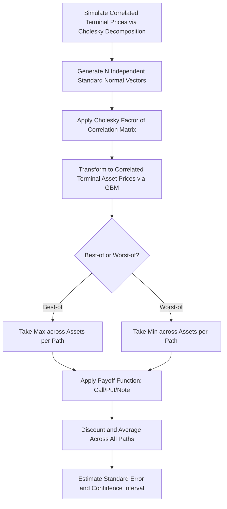

## Rainbow Best Of and Worst Of Options

### Definition and Structure

Rainbow options are multi-asset derivatives whose payoff depends on the relative or combined performance of two or more underlying assets. "Best of" and "worst of" options are the two canonical rainbow structures: their payoffs are determined by, respectively, the maximum or the minimum performing asset among a basket at maturity.

For $n$ underlying assets $S^{(1)}, S^{(2)}, \ldots, S^{(n)}$ with respective strikes (or a common strike $K$), the two base structures are:

- **Best-of option**: payoff based on $\max(S_T^{(1)}, S_T^{(2)}, \ldots, S_T^{(n)})$
- **Worst-of option**: payoff based on $\min(S_T^{(1)}, S_T^{(2)}, \ldots, S_T^{(n)})$

These are frequently combined with call/put structures and strikes to produce four common variants for two assets ($n=2$):

1. **Call on the max**: $\max(\max(S_T^{(1)}, S_T^{(2)}) - K, 0)$
2. **Call on the min**: $\max(\min(S_T^{(1)}, S_T^{(2)}) - K, 0)$
3. **Put on the max**: $\max(K - \max(S_T^{(1)}, S_T^{(2)}), 0)$
4. **Put on the min**: $\max(K - \min(S_T^{(1)}, S_T^{(2)}), 0)$

A related, strikeless variant simply pays the best or worst performer outright:

- **Outperformance/"best of" note**: pays $\max(S_T^{(1)}, S_T^{(2)}, \ldots, S_T^{(n)})$ directly
- **"Worst of" note**: pays $\min(S_T^{(1)}, S_T^{(2)}, \ldots, S_T^{(n)})$ directly

**Key Points**

- Rainbow options are path-independent because only the terminal values of the underlyings matter, not the paths taken to reach them (this distinguishes them from path-dependent multi-asset structures like Asian baskets on a rolling average)
- The correlation structure between underlyings is the dominant, often counterintuitive, driver of value and is the central risk-management challenge for this product family
- These are also referred to as "options on the maximum/minimum of several risky assets," following Stulz's foundational 1982 paper

### Economic Motivation and Use Cases

- **Diversified upside exposure**: A best-of-two-indices call lets an investor gain upside participation in whichever of two markets (e.g., S&P 500 vs. EuroStoxx 50) performs better, without having to forecast which will outperform
- **Worst-of structured notes**: Extremely common in retail/private-banking structured products (autocallables, reverse convertibles) where the note's coupon or capital protection depends on the worst-performing stock in a basket — this design allows issuers to offer higher headline coupons because worst-of payoffs are cheaper to the buyer (more valuable to the issuer as short exposure) than single-stock equivalents
- **M&A and relative value hedging**: A firm hedging exposure to whichever of two currencies or commodities moves more adversely can use worst-of puts
- **Portfolio insurance with basket diversification credit**: Institutional investors seeking basket-level protection who want to avoid over-hedging any single name

### Valuation: Two-Asset Closed-Form (Stulz 1982 / Johnson 1987)

For the two-asset case under joint lognormal dynamics with correlation $\rho$, closed-form solutions exist. Define:

- $\sigma^2 = \sigma_1^2 + \sigma_2^2 - 2\rho\sigma_1\sigma_2$ (volatility of the ratio $S^{(1)}/S^{(2)}$)
- $d = \frac{\ln(S_0^{(1)}/S_0^{(2)}) + (\text{drift adjustment})T}{\sigma\sqrt{T}}$

**Call on the Maximum of Two Assets** (Stulz 1982):

$$C_{max} = S_0^{(1)} e^{-q_1 T} M(y_1, d; \rho_1) + S_0^{(2)} e^{-q_2 T} M(y_2, -d + \sigma\sqrt{T}; \rho_2) - K e^{-rT}\left[1 - M(-y_1 + \sigma_1\sqrt{T}, -y_2 + \sigma_2\sqrt{T}; \rho)\right]$$

where $M(\cdot,\cdot;\cdot)$ is the bivariate cumulative normal, and $y_1, y_2$ are individual Black-Scholes-type $d_1$ terms for each asset against strike $K$, with $\rho_1 = \frac{\sigma_1 - \rho\sigma_2}{\sigma}$ and $\rho_2 = \frac{\sigma_2 - \rho\sigma_1}{\sigma}$.

**Call on the Minimum of Two Assets**: Related to the call on the maximum via the identity:

$$C_{max}(S^{(1)}, S^{(2)}, K) + C_{min}(S^{(1)}, S^{(2)}, K) = C(S^{(1)}, K) + C(S^{(2)}, K)$$

This parity relationship — the sum of the max-call and min-call equals the sum of the two individual vanilla calls — is one of the most useful practical identities in rainbow option pricing, since it means only one of the two closed forms needs to be derived/implemented directly; the other follows algebraically.

**Key Points**

- An analogous parity holds for puts: $P_{max} + P_{min} = P(S^{(1)}, K) + P(S^{(2)}, K)$
- At $\rho = 1$ (perfect correlation), $C_{max}$ and $C_{min}$ collapse toward degenerate cases resembling a single-asset option (since the max and min become deterministically ordered or equal in relative terms)
- At $\rho = -1$, the max and min payoffs diverge maximally, and value is highly sensitive to the individual volatilities

[Inference] For $n > 2$ assets, no simple closed-form bivariate-normal solution exists in general; practitioners rely on Monte Carlo simulation or, in specific cases, multivariate normal integration (computationally expensive beyond 3–4 dimensions) or analytic approximations (e.g., moment-matching methods).

### Worked Numerical Example (Two-Asset Call on the Max)

Consider:

- $S_0^{(1)} = 100$, $S_0^{(2)} = 100$, $K = 100$
- $\sigma_1 = 20\%$, $\sigma_2 = 30\%$, $\rho = 0.5$
- $r = 5\%$, $q_1 = q_2 = 0\%$, $T = 1$ year

**Step 1 — Compute $\sigma$ (volatility of the spread):**

$$\sigma = \sqrt{0.04 + 0.09 - 2(0.5)(0.2)(0.3)} = \sqrt{0.13 - 0.06} = \sqrt{0.07} \approx 0.2646$$

**Step 2 — Compute $\rho_1, \rho_2$:**

$$\rho_1 = \frac{0.20 - 0.5(0.30)}{0.2646} = \frac{0.05}{0.2646} \approx 0.189$$

$$\rho_2 = \frac{0.30 - 0.5(0.20)}{0.2646} = \frac{0.20}{0.2646} \approx 0.756$$

**Step 3 — Compute $y_1, y_2$ and $d$** (standard Black-Scholes $d_1$ terms for each asset against $K=100$, plus the ratio term), then evaluate the trivariate combination of bivariate normal CDFs per Stulz's formula.

[Unverified] Completing this by hand through the full bivariate normal evaluations is error-prone; using these inputs in a validated implementation (e.g., QuantLib's `EverestOption`-adjacent utilities or a custom Stulz formula implementation) typically produces a call-on-the-max premium noticeably higher than either individual vanilla call (approximately 15–20% above the higher-volatility asset's standalone ATM call price is a reasonable order of magnitude for this correlation level), reflecting the diversification benefit embedded in the max payoff — but the exact figure should be computed numerically rather than approximated by hand.

### Correlation Sensitivity — The Central Risk Factor

Correlation, sometimes called "correlation vega" or simply the rainbow option's dominant risk factor, behaves in economically intuitive but operationally tricky ways:

- **Call on the max**: value *decreases* as correlation increases. Lower correlation means the two assets are more likely to diverge, increasing the chance that at least one posts a large gain — exactly the scenario a max-call is designed to capture
- **Call on the min**: value *increases* as correlation increases. Higher correlation means the two assets move together, reducing the risk that one drags the min down while the other rises — worst-of payoffs are penalized precisely by low/negative correlation
- **Worst-of puts** (common in structured notes): value *increases* sharply as correlation *decreases*, since low correlation raises the probability that at least one asset in the basket falls sharply even if others do not — this is why worst-of autocallable notes carry elevated implied correlation risk for issuers

**Key Points**

- Correlation risk is not directly hedgeable with liquid instruments in most markets — there is no standard "correlation swap" market depth comparable to volatility markets — making rainbow/worst-of books a significant source of model and hedging risk on trading desks
- Implied correlation is often backed out from the relative pricing of index options versus single-stock options (dispersion trading), and desks frequently mark correlation conservatively (higher for long-correlation-risk positions) to build in a risk premium
- [Inference] Historical/realized correlation during market stress (crises) tends to spike toward 1 across risky assets ("correlation breakdown" in the diversification sense), meaning worst-of structures sold with normal-regime correlation assumptions can be significantly mismarked heading into a systemic shock — a well-documented risk in the structured products literature following the 2008 financial crisis

### Greeks and Risk Profile

- **Delta (per underlying)**: Each asset has its own delta, and the sign/magnitude depends on whether it is currently the best or worst performer — a "worst-of" option's delta with respect to the currently-worst asset dominates, while deltas to better-performing assets shrink toward zero as the gap widens
- **Cross-gamma**: Rainbow options have significant cross-gamma (sensitivity of one asset's delta to moves in another asset), which is largely absent in single-asset options and is a major source of hedging complexity, since hedging one leg changes the effective exposure to the other
- **Vega (per asset)**: Similarly asset-specific; volatility of the currently-leading (for best-of) or currently-lagging (for worst-of) asset matters most, but this can flip discontinuously as relative performance shifts
- **Correlation sensitivity ("cega" or "correlation vega")**: As described above, this is often the largest single risk driver and is typically reported separately from individual asset vegas in risk systems

**Example**

A worst-of put embedded in an autocallable note on three bank stocks will have its risk profile dominated by whichever stock is currently trading furthest below its initial reference level; if that stock experiences a sudden idiosyncratic drop, the note's sensitivity concentrates almost entirely on that name, even though the note was originally structured as "diversified" across three names.

### Extension to Multiple Assets ($n > 2$)

For $n \geq 3$ underlyings, exact closed-form solutions require $(n-1)$-dimensional or $n$-dimensional multivariate normal integration, which becomes numerically expensive and is rarely used beyond 3–4 assets in practice. Standard industry approaches include:

- **Monte Carlo simulation**: The dominant method in practice — simulate correlated terminal asset values via a Cholesky-decomposed correlation matrix applied to correlated Brownian increments, then compute $\max$ or $\min$ across simulated paths and average discounted payoffs
- **Moment-matching / analytic approximations**: Approximate the distribution of the max or min with a simpler analytic distribution (e.g., a shifted lognormal) matched on the first two moments — computationally fast but introduces approximation error, particularly in the tails
- **Copula-based approaches**: Used when joint lognormality is considered too restrictive (e.g., fat-tailed or asymmetric dependence structures); a copula (e.g., Gaussian, Student-t, or Clayton) is used to join the marginal distributions of each asset before extracting max/min statistics

### Basket Options vs. Rainbow Options — Key Distinction

Rainbow (best-of/worst-of) options are frequently confused with basket options but differ fundamentally in payoff mechanics:

| Feature | Basket Option | Rainbow (Best/Worst-of) |
| --- | --- | --- |
| Payoff basis | Weighted average/sum of underlyings | Max or min of underlyings |
| Correlation effect on call value | Increases with correlation (less diversification benefit) | Max-call decreases with correlation; min-call increases |
| Typical closed-form availability | Approximate only (sum of lognormals is not lognormal) | Exact closed-form exists for $n=2$ |

**Key Points**

- Despite the closed-form advantage for two-asset rainbows, basket options are actually harder to price analytically because a weighted sum of correlated lognormal variables is not itself lognormal, whereas the max/min of lognormals has a more tractable joint distribution via order statistics
- Both product families share Monte Carlo as the practical industry-standard method once dimensionality increases

### Model Risk and Practical Considerations

- **Correlation matrix estimation**: For $n > 2$ assets, the full correlation matrix must be positive semi-definite; naively estimated historical correlation matrices from asynchronous or illiquid data can fail this property and require adjustment (e.g., eigenvalue clipping or shrinkage methods) before use in Monte Carlo simulation
- **Dividend and funding cost asymmetries**: When underlyings have different dividend yields or financing costs, the "fair" forward-adjusted comparison changes which asset is more likely to be the best/worst performer independent of volatility — this is often mis-modeled in simplified retail structured product marketing materials
- **Jump risk and idiosyncratic events**: A worst-of structure's exposure to the single worst-performing name means idiosyncratic jump risk (earnings shocks, M&A, credit events) in any one constituent disproportionately drives the payoff — this tail risk is often underpriced by models calibrated only to continuous diffusion dynamics
- [Inference] Regulatory and internal model validation scrutiny of worst-of autocallable books has increased substantially since 2008–2012, particularly regarding correlation assumptions used at inception versus realized correlation during stress periods, making these among the more heavily reviewed exotic derivatives desks in many institutions

### Related Topics

- Basket Options and Approximate Pricing Methods
- Autocallable Notes and Structured Product Design
- Correlation Swaps and Dispersion Trading
- Copula Methods in Multi-Asset Derivative Pricing
- Monte Carlo Simulation with Correlated Brownian Motion (Cholesky Decomposition)
- Exchange Options (Margrabe's Formula) as a Special Case
- Compound Options
- Chooser Options