## Quanto and Composite Options

### Definition and Structure

Quanto and composite options are cross-currency derivatives where the underlying asset is denominated in one currency (the foreign currency) but the option's payoff, premium, or settlement occurs in a different currency (the domestic currency). The distinction between the two structures lies in how the currency conversion is handled:

- **Quanto option** (Quantity-Adjusting Option, also called a "guaranteed exchange rate" or "fixed exchange rate foreign equity" option): The payoff is calculated in the foreign currency, then converted to the domestic currency at a **fixed, pre-agreed exchange rate**. The holder is fully insulated from currency risk — exchange rate movements have no effect on the payoff.
- **Composite option** (also called a "foreign equity option, struck in domestic currency"): The underlying asset price is converted to the domestic currency **at the prevailing (floating) exchange rate at maturity**, and the strike is also expressed in the domestic currency. The holder retains full currency exposure — payoff depends on both the asset price and the exchange rate at expiration.

**Key Points**

- Quanto options eliminate FX risk in the payoff mechanics but embed FX risk in the *pricing* via a correlation adjustment to the drift
- Composite options keep FX risk fully live in the payoff, making them equivalent to a compound exposure to both the foreign asset and the FX rate simultaneously
- Both are distinguished from a simple "FX-hedged" position by the fact that the option's optionality itself interacts with the currency conversion mechanism, not merely a static hedge overlay

### Quanto Options — Payoff and Mechanics

For a call quanto option on a foreign asset $S$ (denominated in foreign currency), with strike $K$ also in foreign currency units, and a fixed exchange rate $\bar{X}$ (domestic currency per unit of foreign currency) agreed at inception:

$$\text{Payoff} = \bar{X} \cdot \max(S_T - K, 0)$$

The payoff is computed entirely in foreign-currency terms and then translated at the fixed rate $\bar{X}$ — the actual spot FX rate at maturity, $X_T$, never enters the payoff formula.

**Common real-world quanto products:**

- **Quanto equity index options**: e.g., a USD-based investor buying a call on the Nikkei 225 with a fixed JPY/USD conversion rate baked in, so the investor's USD payoff depends only on the Nikkei's yen-denominated performance
- **Quanto swaps**: interest rate or total return swaps where cash flows are computed in one currency's rate/index but paid in another currency at a fixed notional exchange rate
- **Quanto CDS**: credit default swaps where the reference obligation is in one currency but protection payments settle in another

### Composite Options — Payoff and Mechanics

For a call composite option, the strike $K$ is set in domestic currency, and the foreign asset price is converted using the actual (floating) exchange rate $X_T$ prevailing at maturity:

$$\text{Payoff} = \max(X_T \cdot S_T - K, 0)$$

This is economically equivalent to holding an option on the *domestic-currency-denominated value* of the foreign asset, $Y_T = X_T \cdot S_T$, treating $Y_T$ as a single underlying process.

**Key Points**

- Since $Y_T$ is the product of two (correlated) lognormal processes, $Y_T$ is itself lognormally distributed under standard geometric Brownian motion assumptions for both $S$ and $X$ — this is what makes the composite option tractable with a modified Black-Scholes formula
- Composite options are the natural product for an investor who *wants* combined equity and currency exposure (e.g., "I want unhedged exposure to Japanese equities as a USD investor")

### Valuation: Quanto Option Formula

The pricing insight for quantos is that although the payoff formula doesn't reference the exchange rate, the correlation between the underlying asset and the exchange rate **does** affect the risk-neutral drift of the asset under the domestic measure. This is the central and most commonly tested concept in quanto option theory.

Under the domestic risk-neutral measure, the foreign asset's drift must be adjusted by a **quanto correction term**:

$$\mu_{quanto} = r_f - q_S - \rho \sigma_S \sigma_X$$

where:

- $r_f$ = foreign risk-free rate
- $q_S$ = dividend yield on the foreign asset
- $\rho$ = correlation between the foreign asset's returns and the exchange rate's returns
- $\sigma_S$ = volatility of the foreign asset
- $\sigma_X$ = volatility of the exchange rate (domestic currency per unit of foreign currency)

The quanto call option value (in domestic currency, using the fixed rate $\bar{X}$) is:

$$C_{quanto} = \bar{X}\left[S_0 e^{(r_f - q_S - \rho\sigma_S\sigma_X - r_f)T} N(d_1) - K e^{-r_f T} N(d_2)\right]$$

More precisely, using domestic discounting at the *domestic* rate $r_d$ (since the payoff is guaranteed in domestic currency) with the adjusted foreign drift:

$$C_{quanto} = \bar{X}e^{-r_d T}\left[S_0 e^{(r_f - q_S - \rho\sigma_S\sigma_X)T} N(d_1) - K N(d_2)\right]$$

$$d_1 = \frac{\ln(S_0/K) + (r_f - q_S - \rho\sigma_S\sigma_X + \sigma_S^2/2)T}{\sigma_S\sqrt{T}}, \quad d_2 = d_1 - \sigma_S\sqrt{T}$$

**Key Points**

- The domestic risk-free rate $r_d$ is used for discounting because the payoff is fixed/guaranteed in domestic currency, but the *drift* of the underlying asset process uses the foreign rate $r_f$ adjusted by the quanto correction — this asymmetry (domestic discounting, foreign-plus-correction drift) is the defining structural feature of quanto pricing
- When $\rho = 0$ (asset and FX uncorrelated), the correction term vanishes and the formula reduces to a standard Black-Scholes call scaled by the fixed exchange rate
- The sign and magnitude of $\rho$ directly changes the effective forward price of the underlying as seen by the domestic investor, even though the payoff itself never touches the exchange rate

[Inference] The quanto correlation adjustment is one of the more conceptually subtle results in derivatives pricing because it demonstrates that eliminating an exposure from a *payoff* does not eliminate that exposure's effect on *pricing* — the correlation risk is priced in via the drift even though it never appears in the realized cash flow, which is a frequent source of confusion for practitioners new to the product.

### Valuation: Composite Option Formula

For a composite option, since $Y_T = X_T S_T$ is lognormal (product of two correlated lognormals), a modified Black-Scholes/Garman-Kohlhagen-style formula applies directly to $Y$:

$$C_{composite} = Y_0 e^{-q_Y T} N(d_1) - K e^{-r_d T} N(d_2)$$

where $Y_0 = X_0 S_0$ is today's domestic-currency value of the foreign asset, and the combined volatility is:

$$\sigma_Y = \sqrt{\sigma_S^2 + \sigma_X^2 + 2\rho\sigma_S\sigma_X}$$

$$d_1 = \frac{\ln(Y_0/K) + (r_d - q_Y + \sigma_Y^2/2)T}{\sigma_Y\sqrt{T}}, \quad d_2 = d_1 - \sigma_Y\sqrt{T}$$

with the effective dividend/carry yield on $Y$ given by $q_Y = q_S + r_f - r_d + \ldots$ (adjusted so that the risk-neutral drift of $Y$ under the domestic measure is consistent with no-arbitrage; precise derivation depends on whether $S$ pays a continuous dividend yield and the specific convention used).

**Key Points**

- Note the *addition* of correlation in the composite volatility formula ($+2\rho\sigma_S\sigma_X$) versus its *subtraction* in the quanto drift correction — positive correlation between the asset and currency increases composite option volatility (and value) but *decreases* the quanto-adjusted drift, an important sign distinction to keep straight
- Composite options are structurally simpler once $\sigma_Y$ and $Y_0$ are computed, since the problem reduces to a single vanilla Black-Scholes-type calculation on the combined process

### Worked Numerical Comparison

Consider a USD-based investor with exposure to a Japanese equity, with:

- $S_0 = 10{,}000$ JPY (foreign asset), $K = 10{,}000$ JPY (for the quanto) or domestic-equivalent strike for the composite
- $\sigma_S = 20\%$ (equity volatility), $\sigma_X = 10\%$ (JPY/USD FX volatility)
- $\rho = -0.3$ (typical negative correlation between Japanese equities and JPY strength, i.e., yen tends to weaken when Nikkei rallies)
- $r_f = 0.1\%$ (JPY rate), $r_d = 5\%$ (USD rate), $q_S = 1\%$, $T = 1$ year
- Fixed quanto rate $\bar{X} = 0.0067$ (USD per JPY, illustrative)

**Quanto drift correction:**

$$\mu_{quanto} = 0.001 - 0.01 - (-0.3)(0.20)(0.10) = 0.001 - 0.01 + 0.006 = -0.003$$

The negative correlation *increases* the effective drift correction term added back (since $-\rho\sigma_S\sigma_X$ becomes positive when $\rho$ is negative), partially offsetting the low foreign rate and dividend drag — [Inference] this directionally means the quanto call would be priced somewhat higher than a naive calculation ignoring correlation would suggest, given this specific negative correlation regime, though the exact premium requires full evaluation of $d_1, d_2$ through the normal CDF.

**Composite combined volatility:**

$$\sigma_Y = \sqrt{0.04 + 0.01 + 2(-0.3)(0.20)(0.10)} = \sqrt{0.05 - 0.012} = \sqrt{0.038} \approx 0.195$$

Interestingly, with negative correlation between the equity and the currency, the composite volatility ($\approx 19.5\%$) is *lower* than the equity's standalone volatility (20%) in this case, because currency moves partially offset equity moves from the unhedged USD investor's perspective — a diversification effect. [Unverified] Whether this diversification benefit dominates depends sensitively on the exact correlation and volatility inputs; a positive correlation regime would instead increase composite volatility above the standalone equity volatility, and both scenarios occur in practice depending on the currency pair and market regime.

### Greeks and Risk Sensitivities

- **Quanto options**:
  - **Delta (to $S$)**: Similar in shape to a vanilla option's delta but scaled by the fixed rate $\bar{X}$
  - **Correlation risk ("quanto correlation" or "cross-gamma to correlation")**: A unique Greek not present in vanilla options — sensitivity of option value to the assumed $\rho$ between the asset and FX rate; since correlation is not directly observable or easily hedged, this is a significant model risk factor
  - **Vega (to $\sigma_S$ and $\sigma_X$)**: Both asset volatility and FX volatility affect value (via the drift correction term), even though FX rate movements don't appear in the payoff — a subtle but critical risk to monitor
  - **No direct FX delta**: Since the payoff is fixed-rate converted, the option has no first-order sensitivity to the spot FX rate itself, only to its volatility and correlation with the asset
- **Composite options**:
  - **Delta (to $S$) and Delta (to $X$)**: Full exposure to both the underlying asset and the exchange rate, similar to holding an option on a basket of two components
  - **Cross-gamma (S, X)**: Meaningful cross-sensitivity between asset price and exchange rate moves
  - **Vega**: Driven by the combined volatility $\sigma_Y$, with sensitivity split between $\sigma_S$, $\sigma_X$, and $\rho$

**Example**

A pension fund with USD liabilities investing in Japanese equities might choose a quanto structure specifically to eliminate yen depreciation risk from its equity return stream, accepting that the quanto premium embeds a (potentially unfavorable) correlation assumption set by the dealer — whereas a hedge fund expressing a combined "yen will weaken and Nikkei will rally" view would prefer the composite structure precisely because it wants both exposures to compound.

### Hedging Considerations

- **Quanto hedging**: Dealers hedge quanto exposure using a combination of the underlying asset, FX forwards/options, and — critically — correlation exposure that is difficult to hedge directly. In practice, dealers often use a "quanto forward" or cross-currency swap overlay combined with delta-hedging the underlying in its local market, but the residual correlation risk typically remains warehoused and managed at a portfolio level
- **Composite hedging**: More straightforward conceptually — since the composite payoff is a function of a single tradeable-in-principle process $Y_T = X_T S_T$, hedging can be decomposed into hedging the foreign asset (in foreign currency) and separately hedging the currency exposure via FX forwards, adjusted dynamically as the option's combined delta to $Y$ changes
- [Inference] In practice, quanto correlation risk is one of the more persistently difficult risk categories for derivatives desks because realized correlation between equities and FX rates is regime-dependent (e.g., "risk-on/risk-off" dynamics can cause correlations to shift abruptly during market stress), making static correlation assumptions embedded in quanto pricing models a recurring source of P&L volatility

```mermaid
flowchart TD
    A[Foreign Underlying Asset S in Foreign Currency] --> B{Quanto or Composite?}
    B -->|Quanto| C[Payoff computed in Foreign Currency: max&#40;S_T - K, 0&#41;]
    C --> D[Convert at FIXED pre-agreed rate X-bar]
    D --> E[Domestic Currency Payoff - No FX Risk in Payoff]
    B -->|Composite| F[Convert Asset Price to Domestic Currency at FLOATING rate X_T]
    F --> G[Y_T = X_T times S_T treated as single lognormal underlying]
    G --> H[Payoff = max&#40;Y_T - K, 0&#41; where K is in Domestic Currency]
    H --> I[Domestic Currency Payoff - Full FX Risk Retained]
    E --> J[Pricing: Domestic discounting, drift adjusted by -rho times sigma_S times sigma_X]
    I --> K[Pricing: Combined volatility sigma_Y with plus 2 rho sigma_S sigma_X]
```

### Comparison Table

| Feature | Quanto Option | Composite Option |
| --- | --- | --- |
| FX risk in payoff | Eliminated (fixed rate) | Retained (floating rate) |
| Strike currency | Foreign currency | Domestic currency |
| Key pricing adjustment | Drift correction: $-\rho\sigma_S\sigma_X$ | Volatility combination: $+2\rho\sigma_S\sigma_X$ |
| Discounting rate | Domestic rate ($r_d$), since payoff guaranteed in domestic currency | Domestic rate ($r_d$), applied to combined process $Y$ |
| Primary unique Greek | Correlation sensitivity (no direct FX delta) | FX delta and cross-gamma (S, X) |
| Typical investor motivation | Wants foreign asset exposure, no currency risk | Wants combined foreign asset + currency exposure |

### Model Risk and Practical Considerations

- **Correlation estimation and stability**: Both products depend on $\rho$ between the asset and FX rate, but this correlation is frequently unstable, regime-dependent, and difficult to hedge with liquid instruments — historical correlation, implied correlation (where available from correlation swaps or cross-asset options), and stressed correlation scenarios are all commonly used inputs, and model validation groups typically require sensitivity analysis across a range of correlation assumptions
- **Volatility surface consistency across currencies**: Quanto and composite pricing requires consistent volatility inputs for both the underlying asset (in its local market/currency) and the FX rate — inconsistent or stale FX volatility surfaces are a common source of mispricing, particularly for less liquid currency pairs
- **Quanto CDS and quanto basis**: In credit markets, "quanto CDS basis" refers to the pricing difference between CDS contracts on the same reference entity denominated in different currencies, which reflects market-implied correlation between the reference entity's credit risk and the relevant exchange rate — a specialized application of quanto theory with its own dedicated literature
- [Inference] Since the 2008 financial crisis and subsequent regulatory reforms (e.g., FRTB), correlation risk in cross-currency exotic products has received increased scrutiny in regulatory capital calculations, as standardized approaches often struggle to capture the nuanced correlation dependencies inherent in quanto structures, sometimes resulting in capital charges that trading desks view as not fully reflective of the economic risk

### Related Topics

- Garman-Kohlhagen Model for FX Options
- Cross-Currency Swaps and Quanto Swaps
- Quanto CDS and Quanto Basis in Credit Markets
- Correlation Swaps and Implied Correlation Estimation
- Rainbow Best Of and Worst Of Options
- Multi-Asset Monte Carlo Simulation with FX-Equity Correlation
- Volatility Surface Construction Across Currency Pairs
- FRTB and Regulatory Capital for Exotic Correlation Products