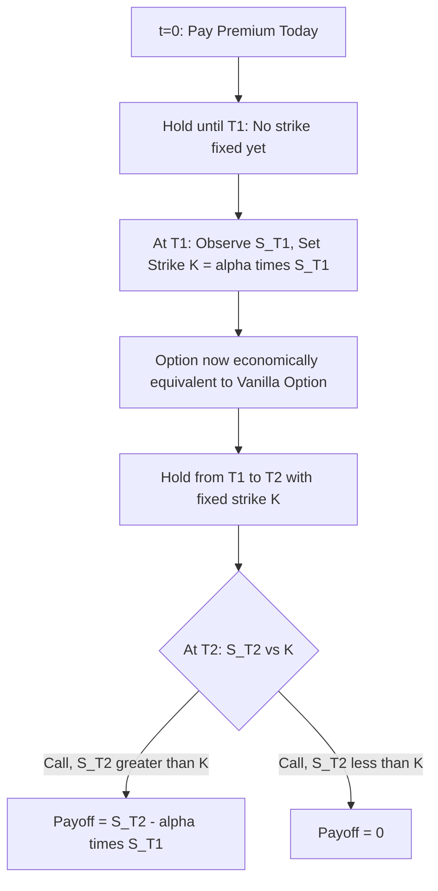

## Forward Start Options

### Definition and Structure

A forward start option is an option that comes into existence at a future date $T_1$ (the "forward start date" or "grant date"), with a strike price that is not fixed at inception but instead set at $T_1$ as a specified percentage of the underlying asset price prevailing at that time. The option itself then expires at a later date $T_2 > T_1$, giving it a life of $T_2 - T_1$ once "activated."

Key timeline parameters:

- $t = 0$: inception — the option premium is paid today
- $T_1$: forward start (strike-setting) date
- $T_2$: final expiration date, with $T_2 > T_1$
- $\alpha$: the moneyness parameter, such that the strike is set at $K = \alpha \cdot S_{T_1}$

When $\alpha = 1$, the option becomes at-the-money at $T_1$ — this is the most common convention and is often what is meant by "forward start option" without further qualification. Values of $\alpha \neq 1$ produce a forward-starting option that will be a fixed percentage in- or out-of-the-money at the moment it activates.

**Key Points**

- The premium is paid at $t=0$, but the strike-setting event happens at $T_1$ — this decoupling of premium payment from strike determination is the defining feature
- Forward start options are path-independent in the sense that the final payoff depends only on $S_{T_1}$ (which sets $K$) and $S_{T_2}$ (which determines the payoff), not on the path between them
- Sometimes called "delayed strike options" in trading desk parlance

### Payoff Structure

For a forward start call option with moneyness parameter $\alpha$:

$$\text{Payoff at } T_2 = \max(S_{T_2} - \alpha S_{T_1}, 0)$$

For a forward start put:

$$\text{Payoff at } T_2 = \max(\alpha S_{T_1} - S_{T_2}, 0)$$

**Key Points**

- At $T_1$, once $S_{T_1}$ is observed and $K = \alpha S_{T_1}$ is fixed, the forward start option becomes economically identical to an ordinary vanilla option with strike $K$ and remaining maturity $T_2 - T_1$
- This means the forward start option's value at $T_1$ is simply the Black-Scholes value $V(S_{T_1}, \alpha S_{T_1}, T_2 - T_1)$ — a scaled version of an at-the-money (or fixed-moneyness) vanilla option

### Valuation: Rubinstein's Forward Start Formula

The elegant result underlying forward start option pricing (Rubinstein 1990) exploits the **homogeneity property** of the Black-Scholes formula: since the Black-Scholes call/put value is a linear homogeneous function of degree 1 in $(S, K)$ jointly — that is, $V(\lambda S, \lambda K, \tau) = \lambda V(S, K, \tau)$ for any $\lambda > 0$ — the value of the option at $T_1$ can be written as:

$$V(S_{T_1}, \alpha S_{T_1}, T_2 - T_1) = S_{T_1} \cdot V(1, \alpha, T_2 - T_1)$$

This means the $T_1$-value of the forward start option is simply $S_{T_1}$ multiplied by a constant — the value of a unit-underlying option with strike $\alpha$ and maturity $T_2 - T_1$. Since $S_{T_1}$ itself is a traded asset, valuing the forward start option today reduces to valuing $V(1, \alpha, T_2-T_1)$ forward-priced units of the underlying, discounted appropriately.

Under Black-Scholes assumptions with continuous dividend yield $q$, the forward start call value at $t=0$ is:

$$C_{fwd} = S_0 e^{-qT_1} \left[e^{-q(T_2-T_1)} N(d_1) - \alpha e^{-r(T_2-T_1)} N(d_2)\right]$$

$$d_1 = \frac{-\ln(\alpha) + (r - q + \sigma^2/2)(T_2 - T_1)}{\sigma\sqrt{T_2 - T_1}}, \quad d_2 = d_1 - \sigma\sqrt{T_2-T_1}$$

For the standard at-the-money-forward-start case ($\alpha = 1$), this simplifies since $\ln(\alpha) = 0$:

$$C_{fwd,\alpha=1} = S_0 e^{-qT_1}\left[e^{-q(T_2-T_1)}N(d_1) - e^{-r(T_2-T_1)}N(d_2)\right]$$

$$d_1 = \frac{(r-q+\sigma^2/2)(T_2-T_1)}{\sigma\sqrt{T_2-T_1}}, \quad d_2 = d_1 - \sigma\sqrt{T_2-T_1}$$

**Key Points**

- The $e^{-qT_1}$ prefactor is the only place $T_1$ enters explicitly (aside from through $T_2 - T_1$) in the $\alpha=1$ case — this reflects the fact that only the dividend leakage between $0$ and $T_1$ affects the forward-starting option's value relative to an immediately-issued option of the same tenor $T_2 - T_1$
- When $q = 0$ (no dividends), the value of an at-the-money forward start option is **identical** to the value of an immediately-struck at-the-money option with maturity equal to $T_2 - T_1$, scaled by $S_0$ — a widely cited and important simplification
- This is a direct consequence of Black-Scholes homogeneity and does not require solving any new PDE — forward start pricing is fundamentally a scaling argument applied to the vanilla formula

[Inference] The homogeneity-based simplification is specific to models where the Black-Scholes-style scaling property holds (i.e., where the underlying follows geometric Brownian motion with proportional/percentage strikes); under local volatility, stochastic volatility, or jump-diffusion models, this exact scaling breaks down because volatility (or jump intensity) is generally not itself scale-invariant in $S$, and forward start options must instead be valued via nested numerical methods or model-specific extensions (see below).

### Worked Numerical Example

Consider an at-the-money ($\alpha = 1$) forward start call with:

- $S_0 = 100$, $\sigma = 22\%$, $r = 4\%$, $q = 1\%$
- $T_1 = 0.5$ years (forward start date)
- $T_2 = 1.5$ years (final expiration), so $T_2 - T_1 = 1$ year

**Step 1 — Compute $d_1, d_2$ using $\tau = T_2 - T_1 = 1$:**

$$d_1 = \frac{(0.04 - 0.01 + 0.0242)(1)}{0.22\sqrt{1}} = \frac{0.0542}{0.22} \approx 0.2464$$

$$d_2 = 0.2464 - 0.22 = 0.0264$$

**Step 2 — Evaluate normal CDFs:**

- $N(0.2464) \approx 0.5973$
- $N(0.0264) \approx 0.5105$

**Step 3 — Combine:**

$$C_{fwd} = 100 \cdot e^{-0.01(0.5)}\left[e^{-0.01(1)}(0.5973) - e^{-0.04(1)}(0.5105)\right]$$

$$= 100 \cdot 0.9950 \left[0.9900(0.5973) - 0.9608(0.5105)\right]$$

$$= 99.50\left[0.5913 - 0.4905\right] = 99.50 \times 0.1008 \approx 10.03$$

This yields an approximate forward start call premium of $10.03. [Unverified] This should be validated against a numerical Black-Scholes calculator, but the order of magnitude is consistent with an at-the-money vanilla call of 1-year tenor on a $100 stock at this volatility, scaled down slightly by the dividend drag over the $T_1 = 0.5$ year deferral period, as the homogeneity relationship predicts.

### Cliquet Options: The Natural Extension

Forward start options form the fundamental building block of **cliquet options** (also called ratchet options), which are structured as a series of consecutive forward start options chained together:

$$\text{Cliquet payoff} = \sum_{i=1}^{n} \max(R_i, \text{floor}) \quad \text{where } R_i = \frac{S_{t_i} - S_{t_{i-1}}}{S_{t_{i-1}}}$$

Each period $[t_{i-1}, t_i]$ resets the strike to the then-prevailing spot price, exactly as in a single forward start option, and the payoffs (often subject to local caps/floors per period, and sometimes a global cap/floor on the sum) are typically accumulated and paid at final maturity.

**Key Points**

- A cliquet is economically a strip of forward start options with $\alpha = 1$ at each reset, though the presence of local caps/floors and global aggregation features means cliquets generally require Monte Carlo simulation or PDE grids rather than a simple sum of closed-form forward start values, since the caps/floors introduce path dependency across periods (technically making cliquets path-dependent exotics, unlike the single forward start option)
- Cliquets are extremely popular in retail structured products (e.g., "guaranteed minimum return with monthly reset and upside participation") specifically because the forward-starting reset mechanism locks in gains period by period
- Because each forward-starting leg is sensitive primarily to *forward volatility* (the volatility priced into the market for the future period $[t_{i-1}, t_i]$) rather than spot volatility, cliquets are a classic example of a **forward-starting volatility product** and are notoriously sensitive to the assumed forward volatility skew/term structure — a major source of model risk

### Greeks and Risk Sensitivities

- **Delta**: Before $T_1$, delta to $S_0$ is close to the homogeneity-implied ratio $V(1,\alpha,T_2-T_1)$ itself (since the $T_1$-value scales linearly with $S_{T_1}$, and by extension with $S_0$ under the risk-neutral measure) — this gives forward start options a notably stable, close-to-linear delta profile relative to vanilla options, which have delta highly dependent on moneyness
- **Vega**: Sensitivity is concentrated on the *forward volatility* between $T_1$ and $T_2$ rather than on volatility over $[0, T_1]$ — this is a crucial distinction: a forward start option (with $\alpha=1$, $q=0$) has essentially zero sensitivity to the volatility realized before $T_1$, since the strike simply resets to whatever $S_{T_1}$ turns out to be, and priced value depends only on the volatility assumption for the $T_2-T_1$ leg
- **Theta**: Behaves like the time decay of a vanilla option with tenor $T_2 - T_1$, but "shifted" in time — decay is effectively dormant in a sense during $[0, T_1]$ except for dividend-related drift effects, then behaves like standard vanilla theta from $T_1$ onward
- **Rho**: Similarly split between a discounting effect over $[0,T_1]$ and rate sensitivity over $[T_1, T_2]$ embedded in $d_1, d_2$

**Example**

A structurer building a cliquet note explains to a client that the product's cost is driven primarily not by today's implied volatility (which the client can observe on a screen) but by the market's *forward volatility* for future reset periods — a quantity that is model-dependent and not directly observable, which is why two dealers can quote meaningfully different prices for the same cliquet structure despite agreeing on the current volatility surface.

### Model Risk and the Forward Volatility Problem

Because forward start (and especially cliquet) valuation isolates exposure to forward volatility rather than spot volatility, the choice of volatility model has an outsized impact — far more so than for vanilla options:

- **Black-Scholes / flat volatility**: Assumes forward volatility equals current implied volatility for the same tenor, ignoring any term structure or skew evolution — generally understates or overstates cliquet value depending on the market's skew dynamics
- **Local volatility models (Dupire)**: Produce forward volatility that "flattens" over time in a specific, model-determined way as the option moves forward — local volatility models are well known to produce forward skews that decay unrealistically fast relative to what is observed in the market, a widely documented limitation
- **Stochastic volatility models (Heston, SABR)**: Better able to sustain a persistent forward skew, generally considered more appropriate for pricing forward-starting and cliquet-style products, though calibration to both the current vanilla surface and the (largely unobservable) forward skew remains genuinely difficult
- [Inference] Because there is no liquid, directly observable market for forward-starting volatility (unlike the vanilla options market, which pins down current implied volatility), the "correct" forward skew is fundamentally a modeling choice rather than a market-observable input, making cliquet and forward-start desks reliant on internal model calibration philosophy — this is frequently cited as one of the most significant sources of cross-dealer pricing dispersion in the exotics market

### Relationship to Compound and Chooser Options

Forward start options are conceptually distinct from, but sometimes confused with, [[Compound Options]] and [[Chooser Options]]:

| Feature | Forward Start Option | Compound Option | Chooser Option |
| --- | --- | --- | --- |
| What is decided at $T_1$ | Nothing decided — strike mechanically set as $\alpha \cdot S_{T_1}$ | Holder actively decides whether to exercise into the inner option | Holder actively decides call vs. put |
| Holder action required at $T_1$ | None | Pay $K_1$ or let lapse | Choose call or put |
| Pricing tractability | Simple closed form via homogeneity (Black-Scholes case) | Requires bivariate normal (Geske) | Simple closed form via decomposition (simple chooser) |

**Key Points**

- Forward start options require **no active decision** by the holder at $T_1$ — the strike-setting is entirely mechanical/formulaic, which is what makes the homogeneity-based closed form possible without any bivariate normal terms
- This is the key structural difference from compound and chooser options, both of which embed a genuine decision point (and correspondingly richer, more complex closed-form or numerical solutions)

### Practical Applications

- **Employee stock options and executive compensation**: Forward-starting structures are used to model at-the-money options that will be granted at a future vesting-related date, with the strike to be set at the future grant date's market price
- **Cliquet / ratchet notes**: The dominant retail/institutional application, embedding a series of forward start options with caps/floors, described above
- **Napoleon and other exotic cliquet variants**: More complex structured products (e.g., "Napoleon" options that pay based on the best or worst monthly return within a period) build further path-dependent features on top of the basic forward-starting mechanism
- **Employee/executive option repricing analysis**: Forward start valuation techniques are sometimes used to analyze the economics of stock option repricing or "reload" provisions, where a new at-the-money strike is set at a future date contingent on prior conditions

### Model Risk and Practical Considerations

- **Homogeneity assumption breakdown**: The elegant Rubinstein closed form relies on Black-Scholes homogeneity; as soon as a desk moves to local or stochastic volatility (standard practice for any real skew-sensitive book), forward start values must be computed via Monte Carlo or PDE, and the simple "identical to vanilla option scaled by $S_0$" intuition no longer holds exactly — it becomes only a useful first-order approximation
- **Dividend assumption sensitivity**: The $e^{-qT_1}$ term means uncertain or discrete (rather than continuous) dividend assumptions over $[0, T_1]$ can materially affect pricing, particularly for single-stock forward start options where discrete dividend dates and amounts are known but do not fit cleanly into the continuous-yield closed form
- **Forward skew calibration risk**: As discussed above, this is the dominant risk factor for any forward-starting product and the primary reason cliquet books require careful, often proprietary, model calibration frameworks
- [Inference] Trading desks that run active cliquet books often maintain a dedicated "forward skew" calibration process distinct from their standard vanilla surface calibration, explicitly because standard local volatility calibration to the current vanilla surface is widely known to misrepresent forward skew dynamics — this is a well-established point of divergence between vanilla options desks and exotic/structured products desks in terms of modeling infrastructure

### Related Topics

- Cliquet (Ratchet) Options and Local/Global Caps and Floors
- Compound Options
- Chooser Options
- Forward Volatility and Forward Skew Modeling
- Local Volatility (Dupire) vs. Stochastic Volatility (Heston, SABR) Models
- Napoleon and Himalaya Exotic Cliquet Structures
- Employee Stock Option Valuation
- Black-Scholes Homogeneity Properties in Derivative Pricing