## Power and Leveraged Options

### Definition and Structure

Power options are exotic derivatives whose payoff is based on the underlying asset price raised to a power $n$, rather than the asset price itself. This structure amplifies the sensitivity of the payoff to movements in the underlying, providing embedded leverage without requiring additional margin or borrowing. Leveraged options is a broader, sometimes loosely used term that encompasses power options as well as other structures (e.g., simple notional-multiplied options) designed to magnify payoff sensitivity relative to a standard vanilla option.

Two principal sub-types are distinguished in the literature:

- **Standard/asymmetric power option**: payoff based on $S_T^n$ directly compared to a strike, e.g., $\max(S_T^n - K, 0)$
- **Symmetric/powered power option**: payoff based on $(S_T - K)^n$, i.e., the standard vanilla payoff itself raised to a power, which preserves the zero-payoff region below the strike while amplifying the payoff above it

**Key Points**

- Power options are path-independent: the payoff depends only on the terminal asset price $S_T$, not on the path taken
- The exponent $n$ is typically an integer $\geq 2$ (most commonly $n=2$, "quadratic" or "squared" power options), though non-integer powers are also used in some structured products
- These products are sometimes called "leverage options," "turbo options" (informally, though "turbo" more often refers to knock-out barrier products in retail markets), or simply "powered options"

### Payoff Structures

**Type 1 — Standard (asymmetric) power call:**

$$\text{Payoff} = \max(S_T^n - K, 0)$$

**Type 2 — Symmetric (powered) power call:**

$$\text{Payoff} = \left[\max(S_T - K, 0)\right]^n$$

For $n = 2$, the symmetric version becomes $\max(S_T - K, 0)^2$ — the payoff is zero below the strike (preserving optionality) but grows quadratically above it, producing dramatically amplified gains for large upward moves relative to a standard call.

**Key Points**

- The standard power option (Type 1) can produce a nonzero payoff even when $S_T < K^{1/n}$ is false in ways that don't map intuitively onto "in-the-money" in the vanilla sense once $n \neq 1$ — practitioners must be careful that the strike $K$ in a Type 1 power option is compared against $S_T^n$, not $S_T$, which can create unintuitive breakeven levels
- The symmetric (Type 2) power option retains the familiar "worthless below strike, monotonically increasing above" shape of a vanilla option, just with a convex power-law amplification — this is generally the more commonly traded and more intuitively understood variant
- Both types can be structured as calls or puts, with the put analogues reversing the direction of the inequality

### Valuation: Closed-Form Formulas

Under standard Black-Scholes assumptions (geometric Brownian motion for $S$), closed-form solutions exist for both power option types because $S_T^n$ and $(S_T - K)^n$ remain analytically tractable given the lognormal distribution of $S_T$.

**Standard Power Call (Type 1)**, following Haug's formulation, with payoff $\max(S_T^n - K, 0)$:

$$C_{power} = S_0^n e^{[(n-1)(r-q+n\sigma^2/2) - r]T} N(d_1) - K e^{-rT} N(d_2)$$

$$d_1 = \frac{\ln(S_0^n/K) + (n(r-q) + \frac{n(2n-1)}{2}\sigma^2)T}{n\sigma\sqrt{T}}, \quad d_2 = d_1 - n\sigma\sqrt{T}$$

**Symmetric (Powered) Power Call (Type 2)**, for integer $n$, with payoff $[\max(S_T-K,0)]^n$:

For $n=2$ specifically, the closed form (sometimes attributed to Heynen and Kat, 1996, or Zhang's exotic options text) is:

$$C_{power,n=2} = S_0^2 e^{[(2r-2q+\sigma^2)]T} N(d_1) - 2Ke^{(r-q)T}S_0 e^{-rT}N(d_1 - \sigma\sqrt{T})+ ...$$

More precisely, the general result for the $n$-th power of a call payoff can be derived by expanding $[\max(S_T-K,0)]^n$ and taking risk-neutral expectations of each resulting term using the moments of the truncated lognormal distribution, since:

$$\mathbb{E}^Q\left[(S_T-K)^n \mathbb{1}_{S_T>K}\right] = \sum_{k=0}^{n} \binom{n}{k}(-K)^{n-k}\mathbb{E}^Q\left[S_T^k \mathbb{1}_{S_T>K}\right]$$

and each $\mathbb{E}^Q[S_T^k \mathbb{1}_{S_T>K}]$ has a known closed form involving $N(d)$ terms with $d$ shifted by $k\sigma^2 T$ in the exponent (a standard result from the moments of a lognormal distribution truncated at $K$).

[Inference] While closed forms exist for small integer $n$ (particularly $n=2$), the algebra becomes increasingly unwieldy for $n \geq 3$, and in practice most trading desks implement power option pricing either via the truncated-moment summation formula above (which generalizes cleanly to any integer $n$) or via direct numerical integration/Monte Carlo rather than deriving a fully expanded closed form by hand for each specific $n$.

### Worked Numerical Example (Standard Power Call, n=2)

Consider a standard power call with payoff $\max(S_T^2 - K, 0)$:

- $S_0 = 100$, $K = 11{,}000$ (chosen so the option is roughly at-the-money since $100^2 = 10{,}000$)
- $\sigma = 20\%$, $r = 5\%$, $q = 0\%$, $T = 1$ year, $n=2$

**Step 1 — Compute the modified drift term:**

$$(n-1)(r - q + n\sigma^2/2) - r = (1)(0.05 + 0.02) - 0.05 = 0.02$$

**Step 2 — Compute $d_1$:**

$$d_1 = \frac{\ln(10{,}000/11{,}000) + (2(0.05) + \frac{2(3)}{2}(0.04))(1)}{2(0.20)(1)} = \frac{-0.0953 + (0.10+0.12)}{0.40} = \frac{0.1247}{0.40} \approx 0.3118$$

$$d_2 = 0.3118 - 0.40 = -0.0882$$

**Step 3 — Evaluate normal CDFs:**

- $N(0.3118) \approx 0.6224$
- $N(-0.0882) \approx 0.4649$

**Step 4 — Combine:**

$$C_{power} = 10{,}000 \cdot e^{0.02(1)}(0.6224) - 11{,}000 e^{-0.05}(0.4649)$$

$$\approx 10{,}000(1.0202)(0.6224) - 11{,}000(0.9512)(0.4649)$$

$$\approx 6{,}350.9 - 4{,}863.9 \approx 1{,}487.0$$

This yields an approximate power call premium of $1,487. [Unverified] Given the payoff is in units of $S^2$ (i.e., "dollars-squared," conceptually), this premium should be interpreted carefully relative to the notional/contract multiplier convention used by the specific product — this hand calculation should be cross-checked against a validated numerical implementation before being relied upon for actual trading decisions.

### Greeks and Risk Sensitivities

Power options exhibit dramatically amplified and highly convex Greek profiles relative to vanilla options:

- **Delta**: Scales with $n \cdot S_0^{n-1}$ in the leading-order sensitivity, meaning delta itself grows with the underlying price for $n > 1$ — a power option's delta is not bounded between 0 and 1 (or -1 and 0) as with vanilla options, since the payoff itself is unbounded in a super-linear way
- **Gamma**: Substantially elevated and grows even faster than delta as $S$ increases, since gamma involves the second derivative of an already-convex ($n$-th power) function — power options are frequently used specifically to gain concentrated, amplified gamma exposure
- **Vega**: Also significantly amplified since the $n\sigma$ terms appear throughout the modified $d_1, d_2$ formulas — small changes in implied volatility produce outsized changes in power option value relative to a vanilla option of similar notional
- **Theta**: Time decay is amplified in absolute terms proportionally to the overall higher premium and convexity, though the qualitative "decay accelerates near expiry" pattern of vanilla options generally persists

**Example**

A trader with a strong conviction that a stock will make a large move (but is agnostic on exact magnitude beyond "large") might prefer a power call over buying many vanilla calls, because the power structure provides convex, amplified exposure to large moves specifically, whereas an equivalent-premium vanilla call position provides more linear exposure across the full range of possible outcomes — though this comes at the cost of the power option being disproportionately worthless if the move is only modest.

### Leverage Comparison: Power Option vs. Vanilla Option Position

The core economic rationale for power options is capital-efficient leverage. Consider two ways to gain amplified upside exposure to a 10% stock move:

1. **Buy $N$ vanilla calls**: linear payoff scaling — doubling the number of contracts doubles the payoff for any given move
2. **Buy one power option** ($n=2$): payoff scales with the *square* of the move, so a move that is twice as large produces roughly four times the payoff (holding other factors constant), without requiring additional capital deployed proportionally to the desired leverage

**Key Points**

- This leverage is "free" in the sense that no margin or borrowing is required (unlike leveraging via borrowed capital to buy more vanilla options or stock), but it is not free in an economic sense — the power option's premium already reflects the embedded convexity, and the premium-to-payoff ratio is calibrated by the market/model to be fair under the risk-neutral measure
- The amplification cuts both ways: a power call also loses value disproportionately fast as the underlying moves against the position or as time passes without a large move materializing, since a large fraction of the premium is attributable to tail scenarios
- [Inference] Because the payoff can grow without the natural bound of "cannot lose more than 100% of the underlying" that applies to a simple stock position, power options are generally considered higher-risk instruments primarily suited to sophisticated investors or as small components of a diversified structured product, rather than standalone retail investments — though the specific regulatory and suitability treatment varies by jurisdiction

### Capped Power Options

Because the unlimited convexity of a pure power option can create unbounded payoff (and correspondingly extreme tail risk for the option writer), **capped power options** are common in practice, imposing a maximum payoff:

$$\text{Payoff} = \min\left(\max(S_T^n - K, 0), \text{Cap}\right)$$

This can be decomposed as a long power call minus a power call spread (a short position in a power call struck such that the payoff equals the cap level), analogous to how a vanilla capped call is a call spread. Pricing follows directly from the closed-form power option formula applied twice (once for each effective strike) and subtracted.

**Key Points**

- Capping is standard practice for any power option sold to end investors or embedded in structured notes, since an uncapped power option represents essentially unlimited liability for the option seller
- The cap significantly reduces the premium relative to an uncapped power option, since it removes exactly the extreme-tail payoffs that drive most of the uncapped power option's value

```mermaid
flowchart TD
    A[Underlying Asset Price S_T at Maturity] --> B{Power Option Type?}
    B -->|Standard Type 1| C[Compute S_T raised to power n]
    C --> D[Payoff = max&#40;S_T^n - K, 0&#41;]
    B -->|Symmetric Type 2| E[Compute vanilla payoff max&#40;S_T - K, 0&#41;]
    E --> F[Raise vanilla payoff to power n]
    F --> G[Payoff = &#40;max&#40;S_T-K,0&#41;&#41;^n]
    D --> H{Capped Variant?}
    G --> H
    H -->|Yes| I[Apply min&#40;Payoff, Cap&#41;]
    H -->|No| J[Uncapped Payoff Paid in Full]
```

### Relationship to Other Convexity Products

Power options sit within a broader family of products designed to trade convexity and higher-moment exposure:

- **Variance and volatility swaps**: Also provide convex exposure, but to *realized volatility* rather than the terminal asset price directly — power options are terminal-price-based (path-independent), while variance swaps are path-dependent (depend on the full realized variance path)
- **Vanilla option spreads and ratio spreads**: Can approximate some convexity characteristics of power options using only vanilla instruments, but cannot replicate the smooth, continuous convexity of a true power payoff without a very large number of strikes (in the limit, a continuum of vanilla option strikes can theoretically replicate any twice-differentiable payoff function, including a power payoff, per the Breeden-Litzenberger / static replication framework)
- **Leveraged ETFs and ETPs**: Provide leveraged exposure via daily rebalancing rather than an option-embedded convex payoff — economically distinct from power options despite the shared "leverage" branding, since leveraged ETFs exhibit path-dependent volatility decay ("beta slippage") that power options (being terminal-payoff-based) do not

**Key Points**

- The Breeden-Litzenberger insight — that any European-style payoff can be statically replicated using a continuum of vanilla calls/puts — means that in principle, a dealer could hedge a power option's risk using a portfolio of vanilla options weighted according to the second derivative of the power payoff function, providing an important theoretical link between power options and the vanilla options market even though power options themselves are not commonly exchange-traded

### Model Risk and Practical Considerations

- **Volatility skew sensitivity**: Because power options concentrate value in tail/extreme scenarios (especially for higher $n$), their pricing is highly sensitive to how the volatility skew/smile is modeled in the tails — a flat Black-Scholes volatility assumption can materially misprice power options relative to a model that properly captures skew, since the effective "average" volatility relevant to a power option's convex payoff differs from the at-the-money implied volatility typically quoted in the market
- **Tail risk and hedging difficulty**: The amplified gamma/vega of power options makes them difficult to hedge dynamically, particularly for uncapped versions, since large, rapid moves in the underlying can produce discontinuous-feeling changes in hedge ratios — capped variants mitigate but do not eliminate this
- **Liquidity and OTC nature**: Power options are almost exclusively traded over-the-counter (not exchange-listed) and are typically embedded within structured notes rather than traded as standalone flow products, meaning liquidity, standardized quoting conventions, and independent price verification are generally more limited than for vanilla options
- [Inference] Because of their pronounced sensitivity to tail assumptions and volatility skew, power options are often used by trading desks and academics as pedagogical or diagnostic tools for stress-testing volatility models — a model that produces an unreasonable power option price relative to market intuition may be signaling a broader problem with how the model handles tail behavior, even if that same model performs adequately for vanilla option pricing

### Related Topics

- Variance and Volatility Swaps
- Breeden-Litzenberger Static Replication Theorem
- Capped and Collared Option Structures
- Leveraged and Inverse ETF Mechanics (Path Dependency Comparison)
- Volatility Skew and Smile Modeling in the Tails
- Rainbow Best Of and Worst Of Options
- Structured Notes with Embedded Convex Payoffs