## Barrier Option Types and Payoffs

### Definition and Structure

Barrier options are path-dependent derivatives whose existence or activation depends on whether the underlying asset price touches, breaches, or fails to breach a predetermined level (the "barrier") at any point during the option's life (or, in discrete-monitoring variants, at specified observation dates). Unlike the path-independent exotics covered previously, barrier options are fundamentally sensitive to the *path* taken by the underlying, not merely its terminal value.

Every barrier option is defined by:

- An underlying vanilla payoff (call or put, with strike $K$)
- A barrier level $H$
- A barrier direction (up or down, relative to spot $S_0$)
- A knock type (in or out), determining whether crossing the barrier activates or extinguishes the option
- A monitoring convention (continuous vs. discrete)
- Optionally, a rebate paid if the option is knocked out (or fails to knock in) before expiration

**Key Points**

- Barrier options are generally cheaper than the equivalent vanilla option because the barrier feature removes or restricts some portion of the payoff distribution, reducing the option's expected value under the risk-neutral measure
- The combination of (up/down) × (in/out) × (call/put) produces eight standard single-barrier option types, each with its own closed-form Black-Scholes solution
- Barrier options are among the most heavily traded exotic derivatives in FX and commodity markets, and are foundational building blocks for more complex structures (double barriers, window barriers, and barrier-embedded structured notes)

### The Eight Standard Single-Barrier Types

Barrier options are classified along three binary dimensions:

**1. Direction — Up or Down**

- **Up barrier** ($H > S_0$): the barrier sits above current spot
- **Down barrier** ($H < S_0$): the barrier sits below current spot

**2. Knock type — In or Out**

- **Knock-in**: the option starts "dormant" (worthless) and only becomes a live vanilla option if the barrier is breached during its life
- **Knock-out**: the option starts "live" (like a vanilla option) and is extinguished (becomes worthless, or pays a rebate) if the barrier is breached

**3. Option type — Call or Put**

Combining these dimensions yields the eight canonical single-barrier options:

| Type | Barrier vs. Spot | Behavior |
| --- | --- | --- |
| Down-and-Out Call (DOC) | $H < S_0$ | Call, extinguished if $S$ falls to $H$ |
| Down-and-In Call (DIC) | $H < S_0$ | Call, activated only if $S$ falls to $H$ |
| Up-and-Out Call (UOC) | $H > S_0$ | Call, extinguished if $S$ rises to $H$ |
| Up-and-In Call (UIC) | $H > S_0$ | Call, activated only if $S$ rises to $H$ |
| Down-and-Out Put (DOP) | $H < S_0$ | Put, extinguished if $S$ falls to $H$ |
| Down-and-In Put (DIP) | $H < S_0$ | Put, activated only if $S$ falls to $H$ |
| Up-and-Out Put (UOP) | $H > S_0$ | Put, extinguished if $S$ rises to $H$ |
| Up-and-In Put (UIP) | $H > S_0$ | Put, activated only if $S$ rises to $H$ |

**Key Points**

- Not all eight combinations are equally economically meaningful for a given strike/barrier relationship — e.g., an up-and-out call with $H \leq K$ is nearly worthless at inception since the barrier would extinguish the option before it could ever be meaningfully in the money, while an up-and-out call with $H > K$ is the economically interesting, commonly traded case
- The choice of which type to use is driven by the investor's view: a down-and-out call is popular for an investor who is bullish but wants to pay a reduced premium by accepting that the position is voided if the market first drops to a specified support level

### The In-Out Parity Relationship

A fundamental and widely used identity links knock-in and knock-out options with the same barrier, strike, and maturity:

$$\text{Knock-In} + \text{Knock-Out} = \text{Vanilla}$$

More specifically, for a fixed direction (e.g., down) and option type (e.g., call):

$$C_{DI} + C_{DO} = C_{vanilla}$$

This holds because, at any point during the option's life, the underlying either does or does not touch the barrier — these two events are mutually exclusive and exhaustive, and exactly one of the knock-in or knock-out option will be "live and equal to a vanilla option" at expiry while the other pays zero (in the no-rebate case).

**Key Points**

- This parity relationship means that once a closed-form solution for one of the eight barrier types is known, the corresponding in/out counterpart follows immediately by subtracting from the vanilla Black-Scholes value — this halves the practical derivation burden
- In-out parity holds exactly only when there is no rebate, or when rebate structures are handled symmetrically; rebate payments (paid at the moment of knock-out, or at expiry) require separate valuation terms added to each side
- This parity is a special case of the broader principle that a barrier event partitions the sample space of paths into two mutually exclusive, exhaustive sets

### Valuation: Reiner-Rubinstein Closed-Form Formulas

Reiner and Rubinstein (1991) derived closed-form solutions for all eight standard single-barrier options under Black-Scholes assumptions with continuous monitoring. The formulas share a common building-block structure using several auxiliary terms:

$$\mu = \frac{r - q - \sigma^2/2}{\sigma^2}, \quad \lambda = \sqrt{\mu^2 + \frac{2r}{\sigma^2}}$$

$$x_1 = \frac{\ln(S_0/K)}{\sigma\sqrt{T}} + (1+\mu)\sigma\sqrt{T}, \quad x_2 = \frac{\ln(S_0/H)}{\sigma\sqrt{T}} + (1+\mu)\sigma\sqrt{T}$$

$$y_1 = \frac{\ln(H^2/(S_0 K))}{\sigma\sqrt{T}} + (1+\mu)\sigma\sqrt{T}, \quad y_2 = \frac{\ln(H/S_0)}{\sigma\sqrt{T}} + (1+\mu)\sigma\sqrt{T}$$

Six standard terms (labeled $A$ through $F$ in Haug's notation) are constructed from combinations of $S_0$, $K$, $H$, and these $x, y$ terms with $N(\cdot)$, and each of the eight barrier types is expressed as a specific linear combination of these six terms, depending on the sign relationships between $K$ and $H$ (i.e., whether the strike is above or below the barrier).

**Example — Down-and-Out Call, case $H \leq K$** (barrier below strike, a common configuration):

$$C_{DO} = S_0 e^{-qT}N(x_1) - Ke^{-rT}N(x_1 - \sigma\sqrt{T}) - S_0e^{-qT}\left(\frac{H}{S_0}\right)^{2(\mu+1)}N(y_1) + Ke^{-rT}\left(\frac{H}{S_0}\right)^{2\mu}N(y_1 - \sigma\sqrt{T})$$

**Key Points**

- The term $\left(\frac{H}{S_0}\right)^{2\mu}$ and its variants arise from the **reflection principle** for Brownian motion — the mathematical technique used to compute the probability that a geometric Brownian motion path touches a barrier before expiry, by "reflecting" the paths that cross the barrier and adjusting probabilities accordingly
- The precise formula used depends on whether $H \leq K$ or $H > K$, since the region of integration for the terminal payoff changes relative to the barrier — Haug's reference text tabulates all necessary case distinctions explicitly for each of the eight types
- [Inference] Because there are numerous case distinctions (barrier above/below strike, in/out, up/down, call/put), implementing the full Reiner-Rubinstein formula set correctly is a common source of production bugs in pricing libraries; extensive unit testing against known boundary cases (e.g., $H \to 0$ recovering the vanilla price, $H \to S_0$ approaching an immediate knock event) is standard practice

### Worked Numerical Example (Down-and-Out Call)

Consider a down-and-out call with:

- $S_0 = 100$, $K = 100$, $H = 90$ (barrier below both spot and strike)
- $\sigma = 25\%$, $r = 5\%$, $q = 0\%$, $T = 1$ year

**Step 1 — Compute $\mu$:**

$$\mu = \frac{0.05 - 0 - 0.03125}{0.0625} = \frac{0.01875}{0.0625} = 0.30$$

**Step 2 — Compute $x_1$:**

$$x_1 = \frac{\ln(100/100)}{0.25} + (1.30)(0.25) = 0 + 0.325 = 0.325$$

**Step 3 — Compute $y_1$:**

$$y_1 = \frac{\ln(90^2/(100 \times 100))}{0.25} + 0.325 = \frac{\ln(0.81)}{0.25} + 0.325 = \frac{-0.2107}{0.25} + 0.325 = -0.8428 + 0.325 = -0.5178$$

**Step 4 — Evaluate the barrier scaling factor:**

$$\left(\frac{H}{S_0}\right)^{2(\mu+1)} = (0.9)^{2.6} \approx 0.7676, \quad \left(\frac{H}{S_0}\right)^{2\mu} = (0.9)^{0.6} \approx 0.9384$$

**Step 5 — Evaluate normal CDFs and combine per the formula above.**

[Unverified] Completing the full evaluation requires careful tracking of each $N(\cdot)$ term; using validated software, a down-and-out call with these parameters typically prices somewhat below the equivalent vanilla ATM call (which would be roughly $11.50 at these inputs), since the 90-barrier removes meaningful downside-touching scenarios from the payoff distribution — the precise reduction should be confirmed numerically rather than estimated by hand.

### Rebates

Many barrier options include a **rebate** — a fixed cash payment made if the barrier is breached in a way unfavorable to the holder (for a knock-out, this means paid upon knock-out; for a knock-in, this typically means paid if the option expires without ever knocking in).

**Key Points**

- Rebates can be paid **immediately upon barrier breach** or **deferred to expiration** — these two conventions have different closed-form valuation terms, since immediate-payment rebates require valuing the discounted probability of hitting the barrier at the (random) hitting time, while deferred rebates only require the probability of hitting the barrier at all, discounted to today at the risk-free rate for the full original maturity
- Rebate valuation also relies on the reflection principle and produces closed-form expressions structurally similar to a binary/digital barrier option
- Rebates are commonly used in FX barrier options to make an otherwise "all-or-nothing" knock-out product more palatable by guaranteeing some minimum payment if the barrier is triggered

### Monitoring Frequency: Continuous vs. Discrete

The Reiner-Rubinstein formulas assume **continuous monitoring** — the barrier is checked at every instant during the option's life. In practice, many traded barrier options use **discrete monitoring** (e.g., checking only at daily closing prices), which affects both the probability of triggering the barrier and, consequently, the option's value.

- **Continuous monitoring**: Higher probability of triggering the barrier (since any intraday touch counts), all else equal
- **Discrete monitoring**: Lower probability of triggering (a price could spike through the barrier intraday and revert before the next observation), generally making discretely-monitored knock-out options *more valuable* than their continuously-monitored counterparts (and knock-in options correspondingly *less* valuable)

**Broadie-Glasserman-Kou correction**: A widely used analytical approximation adjusts the continuous-monitoring barrier level to account for discrete monitoring, by shifting the barrier by a factor proportional to $\sigma\sqrt{\Delta t}$ (where $\Delta t$ is the time between monitoring dates):

$$H_{adjusted} = H \cdot e^{\pm 0.5826\sigma\sqrt{\Delta t}}$$

(sign depends on barrier direction: $+$ for up-barriers, $-$ for down-barriers), where $0.5826 \approx -\zeta(1/2)/\sqrt{2\pi}$ is a constant derived from the Riemann zeta function in the original Broadie-Glasserman-Kou (1997) derivation.

**Key Points**

- This correction allows discretely-monitored barrier options to be priced using the standard continuous-monitoring closed-form formulas, simply by substituting the adjusted barrier $H_{adjusted}$
- [Inference] The approximation is generally considered accurate for reasonably frequent monitoring (e.g., daily) but degrades for very infrequent monitoring (e.g., monthly), where direct numerical methods (Monte Carlo with discrete barrier checks, or a discretely-monitored PDE grid) are typically preferred for production pricing

```mermaid
flowchart TD
    A[Underlying Path from t=0 to T] --> B{Barrier H touched during monitoring?}
    B -->|Yes| C{Knock-In or Knock-Out?}
    B -->|No| D{Knock-In or Knock-Out?}
    C -->|Knock-Out| E[Option Extinguished - Pay Rebate if applicable]
    C -->|Knock-In| F[Option Activated - Becomes Vanilla Option]
    D -->|Knock-Out| G[Option Remains Live - Behaves as Vanilla to Expiry]
    D -->|Knock-In| H[Option Never Activated - Expires Worthless, Rebate if applicable]
    F --> I[Payoff at T = max&#40;S_T - K, 0&#41; or put equivalent]
    G --> I
```

### Extensions: Double Barriers and Window Barriers

- **Double barrier options**: Feature both an upper barrier $H_u$ and a lower barrier $H_l$, with knock-in/knock-out triggered by touching *either* barrier — closed-form solutions exist (Kunitomo-Ikeda 1992) but require infinite series expansions (using the method of images applied repeatedly between the two barriers) rather than the simple closed forms of single-barrier options
- **Window barrier (partial barrier) options**: The barrier is only "live" (monitored) during a specified sub-period of the option's full life, rather than the entire life — e.g., monitored only during the first three months of a one-year option — requiring specialized closed-form solutions (Heynen and Kat) or numerical methods
- **Outside barrier options**: The barrier is monitored on one asset while the payoff is based on a different asset — a two-asset extension combining barrier mechanics with rainbow-style multi-asset dependency

**Key Points**

- These extensions are common in practice specifically because pure single, continuously-monitored, full-life barrier options are often too restrictive for the risk profile a structurer wants to embed in a note — window barriers, for example, let a structurer isolate the barrier risk to a specific period of expected volatility (e.g., around an earnings date or macro event)

### Practical Applications

- **FX risk management**: Corporates commonly use knock-out forwards and barrier options to reduce hedging premium costs, accepting the risk that the hedge disappears if the market moves favorably past the barrier before reverting unfavorably
- **Structured notes**: Barrier features are ubiquitous in retail structured products — e.g., "autocallable" notes typically embed a down-and-in put (the investor's principal protection is knocked in, i.e., removed, if the underlying falls through a barrier), making down-and-in puts one of the most heavily replicated barrier structures in the retail structured products industry
- **Cost reduction in directional views**: An investor confident that a rally will not be preceded by a significant dip can meaningfully reduce option premium by selecting a down-and-out call rather than a vanilla call

### Model Risk and Practical Considerations

- **Volatility skew sensitivity near the barrier**: Barrier option values are acutely sensitive to the implied volatility used specifically near the barrier level (not just at-the-money), since the barrier-touching probability depends on the volatility along the path near $H$ — flat Black-Scholes volatility can significantly mis-price barrier options in markets with pronounced skew, and this is one of the most well-documented model risk issues in the exotics literature, often addressed via local volatility models calibrated to the full skew
- **Discrete monitoring and hedging discontinuities**: Barrier options exhibit large, discontinuous changes in delta and gamma as the underlying approaches the barrier — the so-called "hedging blow-up" problem — making risk management operationally difficult near the barrier, particularly for knock-out options where delta can flip sign abruptly at the barrier
- **Barrier shifting for risk management**: Because of the hedging discontinuity problem, trading desks commonly apply an internal "barrier shift" (pricing and risk-managing as though the barrier were slightly more conservative than the contractual barrier) to smooth out the hedging discontinuity and account for slippage risk when the underlying gaps through the barrier rather than touching it continuously
- [Inference] The combination of skew sensitivity and hedging discontinuity makes barrier options, despite their closed-form tractability under Black-Scholes, considerably more operationally challenging to risk-manage in practice than their analytical elegance might suggest — this gap between "pricing tractability" and "hedging practicality" is a recurring theme across the broader exotic options literature

### Related Topics

- Reflection Principle for Brownian Motion in Barrier Pricing
- Double and Window Barrier Options (Kunitomo-Ikeda Formulas)
- Broadie-Glasserman-Kou Discrete Monitoring Correction
- Autocallable Notes and Embedded Barrier Structures
- Local Volatility Models and Skew-Consistent Barrier Pricing
- Digital and Binary Barrier Options
- Rainbow Best Of and Worst Of Options
- Lookback Options (Path-Dependent Extrema)