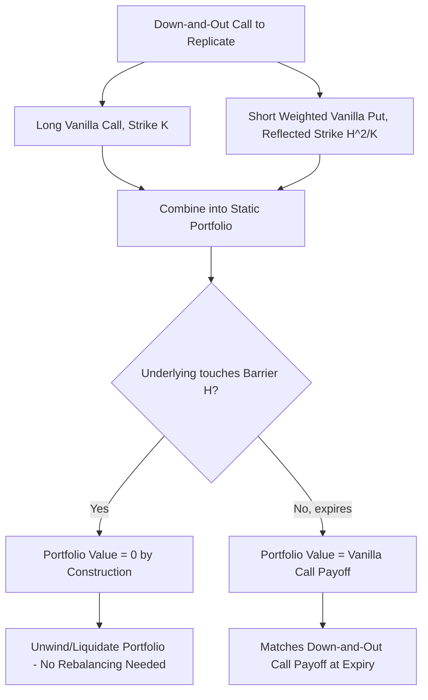

## Barrier Option Pricing and Static Replication

### Overview and Motivation

Beyond the closed-form Black-Scholes valuation of barrier options covered previously, an important and practically significant body of theory addresses **static replication**: constructing a portfolio of simpler, standard instruments (vanilla options) that reproduces a barrier option's payoff at all relevant times without requiring continuous dynamic rebalancing. This matters because barrier options exhibit severe hedging discontinuities near the barrier (as noted in the discussion of barrier option types), and static replication offers an alternative, model-robust approach to risk management that sidesteps much of this difficulty.

**Key Points**

- "Static" replication means the replicating portfolio, once constructed, requires no further trading (or only trading at the barrier-touch event itself) — contrasted with "dynamic" replication/hedging, which requires continuous delta-rebalancing as in standard Black-Scholes hedging
- Static replication techniques are particularly valuable for barrier options because they can, in certain cases, provide **model-independent** hedges — the replication holds under any volatility model consistent with the observed vanilla smile, not just under the flat-volatility Black-Scholes assumption
- This section builds directly on the closed-form pricing and reflection-principle machinery from [[Barrier Option Types and Payoffs]]

### The Reflection Principle Revisited

The mathematical foundation for both closed-form barrier pricing and static replication is the **reflection principle** for Brownian motion, which states that for a standard Brownian motion $W_t$ starting at 0, the probability of the path reaching a barrier level $b > 0$ before time $T$ relates to the terminal distribution via:

$$P(\max_{0\le t\le T} W_t \geq b) = 2P(W_T \geq b)$$

For geometric Brownian motion (the underlying asset price process under Black-Scholes), an analogous but more involved reflection argument produces the barrier-crossing probabilities embedded in the Reiner-Rubinstein formulas, using a **change of measure** that accounts for the nonzero drift of $\ln S_t$.

**Key Points**

- The reflection principle only holds *exactly* under continuous, driftless (or constant-drift) diffusion processes — this is precisely why it applies cleanly to Black-Scholes-style geometric Brownian motion but fails to generalize simply to jump-diffusion or general local/stochastic volatility processes, where paths can "jump over" a barrier without technically "touching" it in the continuous sense, invalidating the reflection argument
- The barrier-scaling terms seen in the Reiner-Rubinstein formulas, such as $(H/S_0)^{2\mu}$, are direct algebraic consequences of applying the reflection principle under the risk-neutral measure with the Black-Scholes drift

### Static Replication of Down-and-Out Options: The Carr-Ellis-Gupta Method

The most celebrated static replication result for barrier options, due to Carr, Ellis, and Gupta (1998), applies specifically to **down-and-out calls under the assumption that the volatility smile is symmetric around the barrier** (or, in the simplest textbook case, under flat Black-Scholes volatility). The technique constructs a static hedge using a small number of vanilla put and call options.

**The core insight**: Under the Black-Scholes assumption with $r = q$ (zero net cost of carry), a down-and-out call with strike $K > H$ can be statically replicated by:

$$C_{DO}(S_0, K, H, T) = C(S_0, K, T) - \frac{H}{K} \cdot P\left(S_0, \frac{H^2}{K}, T\right)$$

where $C(\cdot)$ and $P(\cdot)$ are standard vanilla Black-Scholes call and put prices, and $H^2/K$ is the "reflected strike" — a put struck at the barrier squared divided by the original strike.

**Key Points**

- This says: a long vanilla call struck at $K$, combined with a short position of $H/K$ units of a vanilla put struck at $H^2/K$, exactly replicates the down-and-out call's value **and its boundary behavior at the barrier** — specifically, the portfolio's value equals zero precisely when $S_t = H$, which is the defining condition a hedge must satisfy to replicate a knock-out
- Because the vanilla put and call values automatically go to zero together as $S \to H$ under the $r=q$ symmetry condition, the replicating portfolio can be **liquidated at the moment of barrier breach** without further adjustment — this is what makes the hedge "static" rather than requiring continuous rebalancing
- The condition $r = q$ is a significant simplifying assumption; in FX markets (where $r$ and $q$ are the domestic and foreign risk-free rates respectively), this condition rarely holds exactly, requiring generalized versions of the formula

### Generalized Static Replication (General Carry Cost)

For the general case $r \neq q$, the replication requires a **power-scaled put** rather than a simple $H/K$-weighted put:

$$C_{DO}(S_0, K, H, T) = C(S_0, K, T) - \left(\frac{S_0}{H}\right)^{1-2(r-q)/\sigma^2} \cdot P\left(S_0, \frac{H^2}{K}, T\right)$$

**Key Points**

- The exponent $1 - 2(r-q)/\sigma^2$ generalizes the simple $H/K$ ratio from the symmetric case and reduces to it when $r=q$
- This generalized formula still relies on the assumption of **flat (or at least symmetric) volatility** — it does not automatically extend to markets with a pronounced, asymmetric volatility skew, which is the primary limitation addressed by the smile-consistent extensions discussed next

### Smile-Consistent Static Replication

The Carr-Ellis-Gupta approach was extended by subsequent researchers (notably Carr and collaborators, and separately by Derman, Ergener, and Kani in earlier related work on **barrier option replication using a strip of vanilla options across multiple strikes**) to markets with a volatility skew. Two main approaches are used in practice:

**1. Derman-Ergener-Kani (DEK) discrete-time replication**: Rather than a single reflected put, this method constructs a static portfolio using a **series of vanilla options at different strikes and maturities**, calibrated so that the portfolio's value matches the barrier option's value (specifically, equals zero) at the barrier level at each of several discrete future time points. The replicating portfolio is built backward from expiry, adding vanilla options at successively earlier maturities to enforce the zero-value-at-barrier condition at each monitoring date.

**2. Symmetric-smile reflected-strike method**: An extension of Carr-Ellis-Gupta that uses the market's actual implied volatility at both the original strike $K$ and the reflected strike $H^2/K$, rather than assuming a single flat volatility — this improves accuracy when the smile is roughly symmetric (in log-moneyness) around the barrier, but the replication is no longer exact when the smile is asymmetric across that reflection.

**Key Points**

- The DEK method is more general and can, in principle, handle arbitrary (non-symmetric) smiles, but requires solving a system of equations across multiple strikes/maturities and is computationally more involved than the simple closed-form reflected-put formula
- [Inference] In practice, many trading desks use a hybrid approach: the simple reflected-put static hedge as a first-order approximation and starting point for risk management, supplemented by dynamic vega/skew hedges using additional vanilla options to correct for the residual model risk introduced by the flat-or-symmetric-volatility assumption underlying the basic static replication formula

### Worked Numerical Example: Simple Static Replication

Consider a down-and-out call with $r = q$ (symmetric carry case):

- $S_0 = 100$, $K = 110$, $H = 90$
- $\sigma = 20\%$, $r = q = 3\%$, $T = 1$ year

**Step 1 — Compute the reflected strike:**

$$\frac{H^2}{K} = \frac{8100}{110} \approx 73.64$$

**Step 2 — Compute the replication weight:**

$$\frac{H}{K} = \frac{90}{110} \approx 0.818$$

**Step 3 — Price the two vanilla legs using standard Black-Scholes:**

- $C(100, 110, 1)$ at $\sigma=20\%, r=3\%$: a slightly out-of-the-money call, [Unverified] approximately $4.50–5.00 depending on precise calculation
- $P(100, 73.64, 1)$ at the same parameters: a deep out-of-the-money put, [Unverified] likely worth well under $1.00 given how far out-of-the-money the reflected strike sits

**Step 4 — Combine:**

$$C_{DO} \approx C(100,110,1) - 0.818 \times P(100, 73.64, 1)$$

Given the reflected put is both deep out-of-the-money and scaled down by the 0.818 factor, its contribution is small, so [Inference] the down-and-out call value in this example should sit only modestly below the plain vanilla call value of the same strike — consistent with the intuition that a barrier at 90 (10% below spot) has a relatively low probability of being touched within a year at 20% volatility, making the "out" feature only mildly discount the premium relative to the vanilla equivalent. Exact figures require full numerical evaluation rather than the approximate reasoning shown here.

### Why Static Replication Matters: The Hedging Discontinuity Problem

As discussed under barrier option types, dynamically hedging a barrier option (using continuously-rebalanced delta hedging as in standard Black-Scholes practice) suffers from severe practical problems near the barrier:

- **Delta discontinuity at the barrier**: For a knock-out option, delta can change abruptly (in the continuous-time limit, discontinuously) as $S_t$ crosses $H$, since the option's entire value can jump to zero at that instant
- **Gap risk**: If the underlying "gaps" through the barrier (e.g., overnight, or during a fast market) rather than touching it continuously, a dynamic hedge calibrated to continuous rebalancing can suffer significant slippage, since the hedge cannot be adjusted at the exact moment of crossing
- **Vega/gamma blow-up near the barrier**: As the underlying approaches the barrier close to expiry, gamma and vega can become extremely large in magnitude and unstable in sign, making conventional Greek-based risk limits difficult to apply meaningfully

Static replication addresses these problems directly: because the replicating portfolio (of vanilla options) is constructed so that its value already equals zero at the barrier (by design of the reflected strike), the hedge can simply be **unwound** — sold — at the moment of a barrier touch, with no discontinuous rebalancing required, and no reliance on continuous monitoring assumptions for the hedge itself (only for the barrier contract's own monitoring convention).

**Key Points**

- This is why static replication is often described as providing a **model-independent hedge** for the flat/symmetric-volatility case: the hedge portfolio's zero-value-at-barrier property is a *model-free geometric fact* about vanilla option values under the reflection symmetry, not dependent on getting the volatility dynamics exactly right, as long as the symmetry assumption itself holds reasonably well
- In practice, perfect model independence is rarely achieved because real markets exhibit skew that breaks the exact symmetry the simplest replication formulas rely on — this is precisely the gap the DEK and smile-consistent methods attempt to close

### Extension to Other Barrier Types

The Carr-Ellis-Gupta framework and its generalizations extend, with appropriate sign and structural modifications, to the other seven standard barrier types:

- **Up-and-out puts**: Analogous reflected-strike replication using a scaled vanilla call above the barrier
- **Knock-in variants**: Since knock-in options can be derived from knock-out options via the in-out parity relationship ($\text{Knock-In} = \text{Vanilla} - \text{Knock-Out}$), a static replication for the knock-out automatically yields one for the knock-in by combining with a long vanilla position
- **Double barrier options**: Static replication becomes substantially more involved, typically requiring an infinite (or truncated finite) series of reflected strikes back and forth between the two barriers, mirroring the infinite series structure of the Kunitomo-Ikeda closed-form pricing formula for double barriers

**Key Points**

- The in-out parity relationship is what makes static replication of knock-out options the foundational building block — once a robust knock-out hedge is established, the corresponding knock-in hedge is simply "vanilla minus knock-out replication," requiring no separate derivation

### Model Risk and Practical Considerations

- **Symmetry assumption breakdown**: The simplest and most elegant static replication formulas rely on volatility symmetry (or flatness) around the barrier in log-moneyness space; real markets — especially equity markets with pronounced negative skew — routinely violate this assumption, meaning the basic reflected-put hedge leaves meaningful residual risk that must be managed via supplementary dynamic hedging or the more complex DEK-style multi-strike replication
- **Transaction costs and strike availability**: Practical implementation of static replication (particularly DEK-style multi-strike portfolios) requires trading vanilla options at specific strikes and maturities that may not correspond to liquid, exchange-listed contracts — over-the-counter execution or interpolation across the available listed strike grid introduces additional basis risk
- **Discrete monitoring mismatch**: Static replication formulas are generally derived under continuous-monitoring assumptions; when the actual barrier contract uses discrete monitoring, the same discrete-monitoring barrier adjustment techniques (e.g., Broadie-Glasserman-Kou) discussed under barrier option types must be layered on top of the static replication framework, introducing additional approximation error
- **Liquidation risk at barrier touch**: The static hedge's effectiveness depends on being able to actually unwind the vanilla option portfolio at or near the moment of barrier breach at fair value — in stressed or illiquid markets, the bid-ask spread and market impact of unwinding a sizeable options position exactly when the underlying is making a large move (which is often correlated with reduced liquidity) can erode the theoretical benefit of the static hedge
- [Inference] Despite these practical limitations, static replication remains a foundational conceptual tool in the exotics literature and is frequently used by trading desks as a risk-management overlay or sanity check alongside dynamic Black-Scholes-style Greeks, precisely because it exposes which risks (skew asymmetry, discrete monitoring, liquidity at the barrier) are not captured by naive delta-gamma hedging, even when the static hedge itself is not used as the sole hedging mechanism in production

### Related Topics

- Barrier Option Types and Payoffs
- Reflection Principle and Change of Measure Techniques
- Derman-Ergener-Kani Multi-Strike Static Replication
- Breeden-Litzenberger Static Replication of European Payoffs
- Volatility Skew and Smile-Consistent Exotic Pricing
- Double and Window Barrier Options
- Local Volatility Models (Dupire) for Barrier Pricing
- Gap Risk and Discrete Hedging in Exotic Derivatives