## Asian Options and Average Price Structures

### Definition and Structure

Asian options (also called average options or average rate/price options) are path-dependent derivatives whose payoff depends on the **average** price of the underlying asset over some portion of the option's life, rather than on the terminal price alone. This averaging feature is the defining characteristic and gives Asian options fundamentally different risk and valuation properties from both vanilla and barrier options.

The name originates from the product's early development at a Tokyo trading desk of Bankers Trust in the late 1980s, though the products are now traded globally, particularly in commodity and FX markets.

**Key Points**

- Averaging can be computed over the **entire life** of the option or over a specified **averaging window** (e.g., only the final month before expiry)
- Averaging can use **arithmetic** or **geometric** means — this distinction has major implications for pricing tractability, since geometric averages of lognormal variables remain lognormal, while arithmetic averages do not
- The averaging can be applied to either **discrete** observations (daily, weekly, or monthly fixings) or, in theory, **continuous** sampling — discrete sampling is overwhelmingly the market standard in practice

### Average Price vs. Average Strike Options

Two structurally distinct families of Asian options exist, differentiated by where the average enters the payoff:

**Average Price (Rate) Options**: The average replaces the terminal asset price in the payoff, compared against a fixed strike $K$:

$$\text{Call payoff} = \max(A_T - K, 0), \quad \text{Put payoff} = \max(K - A_T, 0)$$

where $A_T$ is the average of the underlying over the averaging period.

**Average Strike Options**: The average replaces the strike itself, compared against the terminal asset price $S_T$:

$$\text{Call payoff} = \max(S_T - A_T, 0), \quad \text{Put payoff} = \max(A_T - S_T, 0)$$

**Key Points**

- Average price options are far more commonly traded in practice, particularly in commodity hedging (e.g., an oil producer hedging against average price received over a quarter) and FX (hedging average conversion rates for a stream of foreign currency receipts)
- Average strike options are used less frequently but appear in some employee compensation and guaranteed-minimum-return structured products, where the average strike effectively provides a "smoothed" reference point that reduces the impact of a single unlucky terminal observation date
- Both families can be structured with either arithmetic or geometric averaging

### Economic Motivation

Asian options are widely used specifically because averaging naturally matches many real-world hedging needs and reduces certain risks relative to vanilla options:

- **Commodity hedging**: A company that purchases oil, or receives revenue from oil sales, continuously throughout a quarter is naturally exposed to the *average* price over that period, not the price on any single terminal date — an Asian option hedges this exposure more precisely than a vanilla option referencing only a single expiration price
- **Reduced manipulation/pinning risk**: Because the payoff depends on an average of many observations rather than a single terminal price, Asian options are much harder to manipulate (e.g., through a large trade designed to move the price briefly at expiry) and are less susceptible to the "pin risk" that can affect vanilla options with large open interest near expiry
- **Lower premium than vanilla equivalents**: Averaging reduces the effective volatility of the payoff-relevant quantity (since averaging smooths out short-term fluctuations), which generally makes Asian options cheaper than an equivalent vanilla option with the same strike and final maturity — an attractive cost-reduction feature for hedgers

### Valuation: Geometric Average — Exact Closed Form

Because the geometric average of a set of lognormally distributed variables is itself lognormally distributed, geometric Asian options admit an **exact closed-form solution** structurally similar to Black-Scholes, using an adjusted volatility and drift.

For continuous geometric averaging over $[0,T]$, define the adjusted parameters:

$$\sigma_{geo} = \frac{\sigma}{\sqrt{3}}, \quad b_{geo} = \frac{1}{2}\left(r - q - \frac{\sigma^2}{6}\right)$$

The geometric Asian call value is then given by a Black-Scholes-type formula using $\sigma_{geo}$ in place of $\sigma$ and $b_{geo}$ in place of the standard cost-of-carry term:

$$C_{geo} = S_0 e^{(b_{geo}-r)T}N(d_1) - Ke^{-rT}N(d_2)$$

$$d_1 = \frac{\ln(S_0/K) + (b_{geo}+\sigma_{geo}^2/2)T}{\sigma_{geo}\sqrt{T}}, \quad d_2 = d_1 - \sigma_{geo}\sqrt{T}$$

**Key Points**

- The reduced effective volatility $\sigma_{geo} = \sigma/\sqrt{3}$ (for continuous averaging over the full life) is the direct mathematical expression of the "averaging reduces volatility" intuition — the geometric average of the price path has a lower variance than the terminal price itself
- For discrete geometric averaging over $n$ fixings, the adjusted volatility formula changes to reflect the finite number of observations, converging to the continuous formula as $n \to \infty$
- Geometric Asian options are rarely traded in their pure form in practice (real-world hedging needs almost always call for arithmetic averaging), but the geometric closed form is extremely important as a **building block for approximating arithmetic Asian option prices**, since geometric and arithmetic averages are closely related and the geometric price provides a useful, tractable reference point

### Valuation: Arithmetic Average — The Core Challenge

Arithmetic Asian options are of far greater practical importance but present a fundamental mathematical difficulty: **the arithmetic average of lognormally distributed variables is not itself lognormally distributed**, so no simple closed-form Black-Scholes-style solution exists. The literature has developed several complementary approaches:

**1. Moment-Matching Approximations (Turnbull-Wakeman, Levy)**

The most widely used practical approach approximates the true (unknown) distribution of the arithmetic average with a simpler distribution (typically lognormal) whose first two moments — mean and variance — are matched to the true moments of the arithmetic average, which **can** be computed exactly even though the full distribution cannot.

$$M_1 = \mathbb{E}[A_T], \quad M_2 = \mathbb{E}[A_T^2]$$

Both moments have known closed-form expressions under geometric Brownian motion (as sums/integrals of exponential terms). Once matched, a modified Black-Scholes formula is applied using an effective volatility $\sigma_{eff}$ derived from $M_1, M_2$:

$$\sigma_{eff}^2 = \frac{1}{T}\ln\left(\frac{M_2}{M_1^2}\right)$$

$$C_{Turnbull-Wakeman} \approx e^{-rT}\left[M_1 N(d_1) - K N(d_2)\right]$$

$$d_1 = \frac{\ln(M_1/K) + \sigma_{eff}^2 T/2}{\sigma_{eff}\sqrt{T}}, \quad d_2 = d_1 - \sigma_{eff}\sqrt{T}$$

**Key Points**

- The Turnbull-Wakeman (1991) approximation is widely used in industry precisely because of its simplicity and speed — it requires only the two exact moments of the arithmetic average and a single Black-Scholes-style evaluation
- The approximation tends to perform reasonably well for at-the-money options and moderate volatilities but can lose accuracy for deep in/out-of-the-money options or very high volatility, where the true distribution of the arithmetic average deviates more substantially from lognormal
- Levy's (1992) approximation is a closely related, slightly refined moment-matching technique that is also widely cited and used

**2. Geometric-Arithmetic Control Variate (Kemna-Vorst)**

Kemna and Vorst (1990) proposed using the **exact geometric Asian option price as a control variate** in a Monte Carlo simulation of the arithmetic Asian option, since the two are highly correlated (both are averages of the same underlying path) but the geometric price is known exactly. This dramatically reduces the variance of the Monte Carlo estimator for the arithmetic option:

$$\hat{C}_{arith} = \hat{C}_{arith}^{MC} - \hat{C}_{geo}^{MC} + C_{geo}^{exact}$$

where $\hat{C}_{arith}^{MC}$ and $\hat{C}_{geo}^{MC}$ are simulated (using the *same* underlying paths) Monte Carlo estimates of the arithmetic and geometric Asian options respectively, and $C_{geo}^{exact}$ is the known closed-form geometric value.

**Key Points**

- This control variate technique is one of the most effective and widely taught variance reduction methods in the entire options pricing literature, because the correlation between the arithmetic and geometric averages (computed on the same simulated path) is extremely high, often exceeding 0.99, leading to dramatic reductions in the number of simulation paths required for a given accuracy level
- This remains a standard, production-grade technique for arithmetic Asian option pricing at many institutions, valued for combining Monte Carlo's flexibility (handling any payoff variant, discrete fixing schedules, and non-Black-Scholes dynamics) with a large variance reduction benefit

**3. PDE Methods**

Arithmetic Asian options can also be priced via a PDE approach by introducing an auxiliary state variable representing the running average (or running sum), producing a **two-dimensional PDE** (in $S$ and the running average $A$) rather than the one-dimensional Black-Scholes PDE. This is more computationally intensive than the one-dimensional vanilla case but avoids Monte Carlo sampling error entirely, providing an alternative for applications requiring very high precision or smooth Greeks.

[Inference] In practice, most trading desks rely on the Turnbull-Wakeman/Levy-style analytic approximation for fast indicative pricing and risk estimates, reserving Monte Carlo with the Kemna-Vorst control variate for final, precise pricing and for cases where the approximation's known weaknesses (far from at-the-money, high volatility, unusual fixing schedules) make the analytic shortcut unreliable.

### Worked Numerical Example (Turnbull-Wakeman Approximation)

Consider an arithmetic average price Asian call with continuous averaging over the full option life:

- $S_0 = 100$, $K = 100$, $\sigma = 25\%$, $r = 5\%$, $q = 0\%$, $T = 1$ year

**Step 1 — Compute the geometric-style effective volatility as an approximation input.** For continuous arithmetic averaging, a commonly used simplified rule of thumb approximates the variance reduction similarly to the geometric case, giving an effective volatility roughly:

$$\sigma_{eff} \approx \sigma \sqrt{\frac{1}{3}} \approx 0.25 \times 0.577 \approx 0.1443$$

[Inference] This simplified rule is an approximation to the more precise Turnbull-Wakeman moment-matching calculation, which technically requires computing $M_1$ and $M_2$ from their exact integral formulas rather than borrowing the geometric-average scaling factor directly — the geometric scaling is used here only to illustrate the order of magnitude of volatility reduction, and a production implementation should use the exact arithmetic moments.

**Step 2 — Apply the modified Black-Scholes-style formula** using $\sigma_{eff} \approx 14.4\%$ in place of the full 25% volatility, which will produce a materially lower premium than the equivalent vanilla ATM call — [Unverified] roughly on the order of 40–50% lower, reflecting the substantial variance reduction from averaging over the full year, though the precise figure requires the full Turnbull-Wakeman calculation using exact moments rather than the illustrative approximation shown here.

### Greeks and Risk Sensitivities

Asian options exhibit Greek profiles that evolve meaningfully as the averaging period progresses:

- **Delta**: Starts similar in shape to a vanilla option's delta before the averaging period begins or early in it, but **decays toward zero as the averaging period progresses** and more of the average has already been "locked in" by past fixings — late in the averaging period, the option's sensitivity to the current spot price diminishes because most of the average is already determined
- **Vega**: Similarly diminishes as the averaging period progresses, since realized (already-fixed) observations are no longer subject to future volatility — an Asian option's vega decays in a predictable, calendar-driven way that has no direct analogue in vanilla options
- **Gamma**: Generally much lower in magnitude than a vanilla option's gamma, particularly as the averaging window progresses, reflecting the smoothing effect of averaging on the payoff's sensitivity to the underlying
- **Theta**: More complex than vanilla theta due to the interaction between time decay and the accumulation of the running average

**Example**

A risk manager overseeing a book of commodity Asian options explains that an Asian call three-quarters of the way through its averaging period, with the average currently well above the strike, has already "locked in" much of its intrinsic value and behaves more like a small deposit certificate than an actively traded option — its delta and vega have shrunk considerably compared to when it was written, even if the underlying's spot volatility hasn't changed at all.

```mermaid
flowchart TD
    A[Averaging Period Begins] --> B[Fixing 1: Record S_t1]
    B --> C[Fixing 2: Record S_t2]
    C --> D[... Continue Recording Fixings ...]
    D --> E[Fixing n: Record S_tn at or near Expiry]
    E --> F[Compute Average A_T: Arithmetic or Geometric]
    F --> G{Average Price or Average Strike Structure?}
    G -->|Average Price| H[Payoff = max&#40;A_T - K, 0&#41; or put equivalent]
    G -->|Average Strike| I[Payoff = max&#40;S_T - A_T, 0&#41; or put equivalent]
```

### Discrete Fixing Schedules and Practical Conventions

Real-world Asian options almost always specify a **discrete fixing schedule** rather than continuous averaging, with conventions varying by market:

- **Commodity markets**: Often use daily or monthly average settlement prices, tied to a specific published benchmark (e.g., an average of daily settlement prices on a futures exchange over the contract month)
- **FX markets**: Commonly use daily fixes at a specified time (e.g., the WM/Reuters 4pm London fix), averaged over the relevant period
- **Weighting conventions**: Some structures use equal weighting across all fixings; others use weighted averages that place more emphasis on fixings closer to expiry, or exclude certain observation dates (e.g., skipping known illiquid days)

**Key Points**

- The number and spacing of discrete fixings materially affects both the option's value (fewer/more widely spaced fixings reduce the averaging effect, moving the option's behavior closer to a vanilla option) and the precision of moment-matching or Monte Carlo pricing approaches, both of which must explicitly account for the discrete fixing dates rather than assuming continuous averaging
- As the number of discrete fixings increases toward continuous sampling, discretely-monitored Asian option values converge to the continuous-averaging closed/approximate forms described above

### Relationship to Other Path-Dependent Structures

- **Cliquet options**: Both Asian options and cliquets involve path-dependent averaging/accumulation mechanics, but cliquets accumulate a *sum of period returns* (each potentially capped/floored) rather than averaging the *level* of the underlying — a structural distinction with significant valuation implications, since cliquets are far more exposed to forward volatility and skew than Asian options
- **Barrier options**: Asian options and barrier options are both path-dependent, but the path-dependency mechanisms are fundamentally different — barrier options depend on whether an extreme (a touch of a specific level) occurs, while Asian options depend on the average of the entire path, making Asian options generally far *less* sensitive to any single extreme move and correspondingly easier to hedge with less discontinuous Greek behavior
- **Asian barrier hybrids**: Some structured products combine both features (e.g., an Asian option that also knocks out if the average, or the spot, breaches a barrier), requiring numerical methods that track both the running average and barrier-touch status as joint state variables

### Model Risk and Practical Considerations

- **Approximation error in moment-matching methods**: The Turnbull-Wakeman and Levy approximations, while fast and widely used, are known to be less accurate for options that are significantly in- or out-of-the-money, or under high volatility — production risk management at many institutions supplements these approximations with periodic Monte Carlo validation (often using the Kemna-Vorst control variate) to bound the approximation error
- **Volatility skew and Asian options**: Because the effective volatility relevant to an Asian option is a blend of the volatility across the entire averaging path (not just the terminal date), Asian option pricing is somewhat less sensitive to the shape of the terminal-date skew than vanilla or barrier options are, but is correspondingly more sensitive to the **volatility term structure** across the whole averaging window — inconsistent term structure assumptions can introduce material mispricing
- **Fixing date data quality and disruption events**: Because Asian option payoffs depend on a series of discrete fixings tied to published benchmarks, contractual "disruption event" provisions (specifying what happens if a fixing source is unavailable on a scheduled date) are an important legal/operational risk consideration, particularly in commodity and FX markets where benchmark reforms (e.g., LIBOR transition analogues) can affect legacy fixing conventions
- [Inference] Given their widespread use in commodity hedging and relatively benign Greek profiles compared to barrier options, Asian options are often considered a lower-model-risk exotic relative to barrier or cliquet products, though the arithmetic averaging tractability problem means that pricing accuracy still depends meaningfully on the choice and calibration of the approximation or numerical method used, particularly for less standard fixing schedules or extreme moneyness

### Related Topics

- Kemna-Vorst Control Variate Monte Carlo Methods
- Turnbull-Wakeman and Levy Moment-Matching Approximations
- Cliquet (Ratchet) Options and Path-Dependent Accumulation
- Barrier Option Types and Payoffs
- PDE Methods for Path-Dependent Derivatives with Auxiliary State Variables
- Commodity Derivatives and Average Price Settlement Conventions
- Variance Reduction Techniques in Monte Carlo Option Pricing
- Volatility Term Structure Modeling