## Lookback Options

### Definition and Structure

Lookback options are path-dependent derivatives whose payoff depends on the **extremum (maximum or minimum)** of the underlying asset price observed over the option's life, rather than on the terminal price alone. The defining feature is that the holder's payoff benefits from the ability to "look back" over the entire price history and effectively transact at the most favorable historical price — a form of embedded perfect hindsight.

Two principal families exist, distinguished by where the extremum enters the payoff:

- **Floating strike lookback**: the strike is set retrospectively to the most favorable observed price (the minimum for a call, the maximum for a put), and the payoff is computed against the terminal price
- **Fixed strike lookback**: the strike is fixed at inception as usual, but the payoff is computed against the extremum (maximum for a call, minimum for a put) rather than the terminal price

**Key Points**

- Lookback options are always at least as valuable as the corresponding vanilla option, since the extremum used in the payoff is, by construction, at least as favorable to the holder as the terminal price alone — this makes lookback options meaningfully more expensive than vanilla equivalents
- Both floating and fixed strike variants exist as calls and puts, giving four principal standard lookback types
- Lookback options are conceptually related to barrier options (both depend on path extrema) but differ critically: a barrier option cares only about *whether* a level was crossed, while a lookback option's payoff depends on the *exact value* of the extremum reached

### Floating Strike Lookback Options

**Floating strike lookback call**: strike is set to the minimum price observed over the option's life; payoff is:

$$\text{Payoff} = S_T - S_{min}, \quad S_{min} = \min_{0 \le t \le T} S_t$$

**Floating strike lookback put**: strike is set to the maximum price observed; payoff is:

$$\text{Payoff} = S_{max} - S_T, \quad S_{max} = \max_{0 \le t \le T} S_t$$

**Key Points**

- The floating strike lookback call effectively guarantees the holder can "buy at the lowest price and sell at the terminal price" — it is never worth less than zero since $S_T \geq S_{min}$ by definition of the minimum
- Similarly, the floating strike lookback put guarantees "selling at the highest price observed," always yielding a nonnegative payoff since $S_{max} \geq S_T$
- Because the payoff is always nonnegative by construction, floating strike lookback options might seem like they should always be exercised, but this is precisely the source of their higher cost — the "guaranteed favorable extremum" feature is exactly what makes the embedded optionality so valuable relative to a vanilla option

### Fixed Strike Lookback Options

**Fixed strike lookback call**: strike $K$ is fixed at inception; payoff uses the *maximum* observed price:

$$\text{Payoff} = \max(S_{max} - K, 0)$$

**Fixed strike lookback put**: strike $K$ is fixed at inception; payoff uses the *minimum* observed price:

$$\text{Payoff} = \max(K - S_{min}, 0)$$

**Key Points**

- The fixed strike lookback call is at least as valuable as a vanilla call with the same strike, since $S_{max} \geq S_T$ always, meaning the lookback payoff dominates the vanilla payoff pathwise
- The fixed strike lookback put is analogously at least as valuable as a vanilla put with the same strike, since $S_{min} \leq S_T$ always
- Fixed strike lookbacks are somewhat less commonly traded than floating strike lookbacks in practice, but both types share the same underlying mathematical machinery (distributions of running maxima/minima of Brownian motion)

### Valuation: Closed-Form Solutions (Goldman-Sosin-Gatto / Conze-Viswanathan)

Closed-form solutions for continuously-monitored lookback options under Black-Scholes assumptions were derived by Goldman, Sosin, and Gatto (1979) for floating strike lookbacks, and extended by Conze and Viswanathan (1991) to the fixed strike case. Both rely on known closed-form expressions for the joint distribution of a geometric Brownian motion's terminal value and its running maximum/minimum (again, a consequence of the reflection principle).

**Floating Strike Lookback Call**, assuming the minimum-to-date at inception equals $S_0$ (i.e., pricing a freshly-issued lookback):

$$C_{float} = S_0 e^{-qT} N(a_1) - S_0 e^{-qT}\frac{\sigma^2}{2(r-q)}N(-a_1) - S_{min}e^{-rT}\left[N(a_2) - \frac{\sigma^2}{2(r-q)}e^{Y_1}N(-a_3)\right]$$

where:

$$a_1 = \frac{\ln(S_0/S_{min}) + (r-q+\sigma^2/2)T}{\sigma\sqrt{T}}, \quad a_2 = a_1 - \sigma\sqrt{T}$$

$$a_3 = \frac{\ln(S_0/S_{min}) + (-r+q+\sigma^2/2)T}{\sigma\sqrt{T}}, \quad Y_1 = -\frac{2(r-q-\sigma^2/2)\ln(S_0/S_{min})}{\sigma^2}$$

**Fixed Strike Lookback Call** (Conze-Viswanathan), for the case $S_{max,0} \le K$ (barrier/max-to-date has not yet exceeded strike):

$$C_{fixed} = S_0e^{-qT}N(d_1) - Ke^{-rT}N(d_2) + S_0e^{-rT}\frac{\sigma^2}{2(r-q)}\left[-\left(\frac{S_0}{K}\right)^{-2(r-q)/\sigma^2}N(d_1 - \frac{2(r-q)}{\sigma}\sqrt{T}) + e^{(r-q)T}N(d_1)\right]$$

with $d_1, d_2$ following the standard Black-Scholes definitions relative to strike $K$.

**Key Points**

- These formulas assume **continuous monitoring** of the extremum — discrete monitoring (e.g., daily observations only) reduces the effective range of the observed extremum and requires the same type of discrete-monitoring correction techniques (analogous to Broadie-Glasserman-Kou for barrier options) discussed in the barrier options context
- The formulas involve a term structurally similar to $(S_0/S_{min})^{-2(r-q)/\sigma^2}$ or $(S_0/K)^{-2(r-q)/\sigma^2}$ — the same reflection-principle-derived power-law scaling seen in barrier option formulas, underscoring the shared mathematical DNA between lookback and barrier pricing
- [Inference] Because these formulas are algebraically involved and highly sensitive to the correct handling of the $(r-q)$ term in the denominator (which can cause numerical instability if $r \approx q$), production implementations typically include special-case handling for near-zero cost-of-carry scenarios to avoid division-by-near-zero errors

### Worked Numerical Example (Floating Strike Lookback Call)

Consider a floating strike lookback call issued at-the-money with the running minimum equal to spot at inception:

- $S_0 = S_{min} = 100$, $\sigma = 25\%$, $r = 5\%$, $q = 0\%$, $T = 1$ year

**Step 1 — Compute $a_1$:**

$$a_1 = \frac{\ln(1) + (0.05+0.03125)(1)}{0.25} = \frac{0.08125}{0.25} = 0.325$$

$$a_2 = 0.325 - 0.25 = 0.075$$

**Step 2 — Compute $a_3$:**

$$a_3 = \frac{0 + (-0.05+0+0.03125)(1)}{0.25} = \frac{-0.01875}{0.25} = -0.075$$

**Step 3 — Compute $Y_1$:**

$$Y_1 = -\frac{2(0.05-0-0.03125)(0)}{0.0625} = 0 \quad (\text{since } \ln(S_0/S_{min})=0 \text{ at inception})$$

**Step 4 — Evaluate normal CDFs:**

- $N(0.325) \approx 0.6274$, $N(-0.325) \approx 0.3726$
- $N(0.075) \approx 0.5299$, $N(0.075) \approx 0.5299$ (used for the $-a_3$ term since $-a_3 = 0.075$)

**Step 5 — Combine:**

$$C_{float} \approx 100(0.6274) - 100\left(\frac{0.0625}{0.10}\right)(0.3726) - 100e^{-0.05}\left[0.5299 - 0.625(1)(0.5299)\right]$$

$$\approx 62.74 - 23.29 - 95.12\left[0.5299 - 0.3312\right] \approx 62.74 - 23.29 - 18.90 \approx 20.55$$

This yields an approximate floating strike lookback call premium of $20.55 — [Unverified] notably higher than a comparable at-the-money vanilla call (which would be roughly $11–12 at these inputs), consistent with the intuition that the guaranteed-minimum-purchase-price feature adds substantial value, though this hand calculation should be validated against a numerical implementation given the formula's algebraic complexity.

### Greeks and Risk Sensitivities

- **Delta**: Lookback option delta behaves differently from vanilla delta because the payoff already embeds a "locked-in" favorable reference point (the extremum to date); as time progresses and a new extremum is set, delta profiles reset in a path-dependent way not seen in vanilla options
- **Vega**: Generally elevated relative to vanilla options, since higher volatility increases the expected magnitude of the favorable extremum reached — lookback options are among the most volatility-sensitive path-dependent structures precisely because their entire value proposition rests on capturing extreme, volatility-driven price excursions
- **Gamma**: Can be significant and evolves in a path-dependent manner tied to how far current spot is from the running extremum
- **Theta**: More complex than vanilla theta; as time passes without a new extremum being set, the "locked-in" reference level becomes increasingly fixed, changing the option's remaining sensitivity profile

**Example**

A trader long a floating strike lookback call recognizes that once a very low minimum has been set early in the option's life (e.g., during a sharp early sell-off), much of the option's value is already effectively locked in regardless of subsequent price action, since the strike (the minimum) can only decrease further, never reset upward — this creates a distinctive "ratcheting" value profile that a vanilla option does not exhibit.

```mermaid
flowchart TD
    A[Option Life Begins: Track S_t continuously] --> B[Update Running Maximum S_max and Running Minimum S_min]
    B --> C{Floating or Fixed Strike?}
    C -->|Floating| D[At Expiry: Strike = S_min for Call or S_max for Put]
    D --> E[Payoff = S_T - S_min for Call, or S_max - S_T for Put]
    C -->|Fixed| F[Strike K set at inception]
    F --> G[At Expiry: Compare S_max to K for Call, or S_min to K for Put]
    G --> H[Payoff = max&#40;S_max - K, 0&#41; for Call, or max&#40;K - S_min, 0&#41; for Put]
```

### Relationship to Barrier Options: Shared Mathematical Foundation

Lookback and barrier options are both built on the distribution of extrema of Brownian motion, but apply this machinery differently:

| Feature | Barrier Option | Lookback Option |
| --- | --- | --- |
| What matters about the extremum | Whether it crossed a *fixed, pre-specified* level $H$ | The *actual value* of the extremum reached |
| Payoff dependency | Binary trigger (in/out), then vanilla-like payoff | Extremum value enters the payoff formula directly |
| Relative cost vs. vanilla | Generally cheaper (barrier restricts payoff) | Always more expensive (extremum feature adds value) |
| Underlying math | Reflection principle for hitting-time probabilities | Reflection principle for the *distribution* of the running max/min |

**Key Points**

- This distinction — "did it cross a level" versus "what was the best/worst level reached" — is the fundamental conceptual difference between these two families of path-dependent extremum-based options, despite their shared reliance on reflection-principle mathematics
- A lookback option can be thought of, loosely, as a continuum of barrier-triggering events across all possible levels, integrated together to produce the extremum's full distribution, rather than a single trigger at one specific level

### Discrete Monitoring and Practical Considerations

As with barrier options, continuously-monitored lookback closed-form solutions represent an idealization; actual traded lookback contracts typically specify **discrete monitoring** (e.g., daily closing prices) for determining the running maximum/minimum.

**Key Points**

- Discrete monitoring reduces the expected range of the observed extremum relative to continuous monitoring (since intraday extremes that revert before the close are not captured), which **reduces** the value of a lookback option relative to its continuously-monitored theoretical price
- Discrete-monitoring corrections analogous to the Broadie-Glasserman-Kou adjustment used for barrier options can be applied, though the specific correction formulas for lookback options differ in detail from the barrier case
- [Inference] Given the computational complexity of the exact discrete-monitoring lookback formulas, many practitioners rely on Monte Carlo simulation with the actual discrete monitoring schedule explicitly modeled, rather than attempting to apply an analytic continuous-to-discrete correction, particularly for lookback options with non-standard monitoring frequencies

### Partial Lookback Options

A common variant restricts the "look-back window" to only part of the option's total life, similar in spirit to window barrier options:

- **Partial-time floating strike lookback**: the minimum/maximum is only recorded during a specified sub-period (e.g., only during the first six months of a one-year option), after which the option behaves like a vanilla option relative to the extremum already established
- **Partial-time fixed strike lookback**: analogously restricts the extremum-tracking window while keeping the strike fixed throughout

**Key Points**

- Partial lookback options are generally cheaper than full-life lookback options, since restricting the observation window reduces the range of possible extrema and therefore the value of the embedded "perfect hindsight" feature
- These structures are used when a structurer wants to provide some lookback-style benefit without the full cost of a continuously-tracked, full-life lookback feature — a common cost-reduction technique similar in spirit to window barriers

### Practical Applications

- **Currency and commodity risk management**: A treasurer wanting to guarantee "the best rate achieved during the period" for a foreign currency conversion or commodity purchase can use a lookback structure, though the substantial premium relative to vanilla or forward-based hedges limits widespread corporate use
- **Structured retail products**: Lookback-style features (often in a diluted or capped form) appear in some guaranteed-return retail notes, marketed on the appeal of "you get the best price during the period" — though issuers typically cap or otherwise modify the pure lookback payoff to control cost
- **Performance benchmarking structures**: Some employee or executive compensation structures reference a lookback-style "best price during vesting period" mechanism, conceptually related to lookback option payoff structures

### Model Risk and Practical Considerations

- **Volatility sensitivity and skew**: Because lookback option value depends heavily on the *tail* behavior of the underlying's path (the extreme excursions), lookback options are particularly sensitive to how tail risk and volatility skew are modeled — a flat Black-Scholes volatility assumption can significantly misprice lookback options in markets with fat-tailed return distributions or pronounced skew, since real markets often exhibit more extreme moves than lognormal dynamics would predict
- **Discrete monitoring frequency mismatch**: As with barrier options, using continuous-monitoring formulas to price discretely-monitored lookback contracts (without appropriate correction) systematically overstates their value, since discrete monitoring cannot capture the full range of intraday price extremes
- **High premium as a practical barrier to adoption**: Because lookback options are, by construction, always worth at least as much as the corresponding vanilla option, their relatively high cost is a significant practical constraint on their use — this is why partial lookback and other cost-reducing variants are common in practice, and why pure full-life lookback options, while theoretically elegant, are less frequently traded in large notional size compared to vanilla or barrier alternatives
- [Inference] Given their pronounced sensitivity to tail/extremum behavior, lookback options are sometimes used within trading and academic contexts as a diagnostic tool for evaluating how well a given volatility model captures extreme path behavior, similar to the diagnostic role power options play for tail sensitivity in the terminal-price-only (path-independent) context

### Related Topics

- Barrier Option Types and Payoffs
- Reflection Principle and Distributions of Brownian Motion Extrema
- Window and Partial-Time Barrier and Lookback Options
- Asian Options and Average Price Structures
- Discrete Monitoring Corrections for Path-Dependent Options
- Volatility Skew and Tail Risk Modeling
- Power and Leveraged Options (Tail Sensitivity Comparison)
- Monte Carlo Simulation of Path-Dependent Extrema