## Ladder and Shout Options

### Definition and Structure

Ladder and shout options are path-dependent derivatives that allow the holder to **lock in** favorable intrinsic value during the option's life, rather than being exposed only to the terminal payoff or a fully path-determined extremum as in lookback options. Both structures represent a middle ground between vanilla options (no path dependency) and lookback options (full extremum-based path dependency), differing in *how* the locking-in mechanism is triggered.

- **Ladder options**: Predetermined price levels ("rungs") are set at inception; whenever the underlying crosses a rung, a minimum guaranteed payoff is locked in automatically, with no action required from the holder
- **Shout options**: The holder actively chooses (by "shouting") a single moment during the option's life at which to lock in the then-current intrinsic value as a minimum guaranteed payoff

**Key Points**

- Both structures share the goal of letting the holder capture and protect gains achieved during the option's life without needing the gain to still be present at final expiration
- The key distinction is **automaticity versus holder discretion**: ladder rungs trigger mechanically when crossed, while a shout option requires an active, irrevocable decision by the holder
- Both are considerably cheaper than a full lookback option (which effectively locks in the *best possible* level automatically) since they only guarantee specific, pre-set, or holder-chosen levels rather than the true path extremum

### Ladder Options

A ladder option specifies a series of rungs $L_1 < L_2 < \ldots < L_n$ (for a call, above the strike; analogous levels below the strike for a put). As the underlying price crosses each rung during the option's life, the guaranteed minimum payoff resets upward to reflect that rung having been reached, and this guarantee is retained regardless of subsequent price action, even if the underlying later falls back below the rung.

**Ladder call payoff at expiry:**

$$\text{Payoff} = \max(S_T - K, \, L_j - K, \, 0)$$

where $L_j$ is the highest rung crossed during the option's life (or $K$ itself, if no rung was crossed, reducing to the standard vanilla payoff floor of zero).

**Key Points**

- Ladder options are sometimes described as a **discretized lookback option** — instead of locking in the true continuous maximum, only discrete pre-specified rungs are eligible to be locked in, which reduces both the cost and the path-dependency computational burden relative to a full lookback
- As the number of rungs increases and their spacing shrinks toward zero, a ladder option converges toward the corresponding lookback option
- Ladder options are also related to a series of down-and-out or up-and-out barrier options with rebates, since each rung crossing can be thought of as triggering a rebate-like locked-in minimum payment — this structural relationship is a useful way to reason about ladder option replication and pricing intuition

### Valuation Approach for Ladder Options

Because each rung crossing is a barrier-touching event, ladder options can be decomposed and valued using techniques closely related to (multiple) barrier option pricing:

$$V_{ladder} = V_{vanilla} + \sum_{j=1}^{n} (L_j - K) \cdot P(\text{rung } L_j \text{ is touched before } T)$$

where $P(\text{rung } L_j \text{ touched})$ is the risk-neutral probability of the underlying reaching rung $L_j$ at some point during $[0,T]$, which is computable in closed form under Black-Scholes using the same reflection-principle machinery used for barrier hitting probabilities.

**Key Points**

- This decomposition is only an approximation in some formulations since it must carefully avoid double-counting the interaction effects between multiple rungs (e.g., the option value contributed by reaching rung 2 already implies rung 1 was reached first, given rungs are ordered) — precise closed-form multi-rung ladder pricing (following, e.g., extensions in Haug's reference text) accounts for this using techniques similar to the multivariate normal integrals seen in double barrier option pricing
- In practice, ladder options with more than a small number of rungs are frequently priced via Monte Carlo simulation, tracking whether each rung has been crossed as the path is simulated, since this avoids the combinatorial complexity of extending closed-form barrier-style formulas to many rungs
- [Inference] The closed-form approach remains valuable for ladder options with few rungs (e.g., one or two) or as a sanity-check/control variate for Monte Carlo implementations with many rungs, similar in spirit to how the geometric Asian closed form serves as a control variate for arithmetic Asian Monte Carlo pricing

### Worked Numerical Illustration (Single-Rung Ladder Call)

Consider a simplified single-rung ladder call, which reduces to a vanilla call plus a rebate-like term for crossing one rung above the strike:

- $S_0 = 100$, $K = 100$, single rung $L_1 = 120$
- $\sigma = 25\%$, $r = 5\%$, $q = 0\%$, $T = 1$ year

**Step 1 — Price the vanilla component:** A standard at-the-money call with these parameters would be priced using standard Black-Scholes at approximately $11.50 (illustrative order of magnitude).

**Step 2 — Compute the probability of touching $L_1 = 120$ before $T$:** Using the reflection-principle-based hitting probability formula for an up-barrier (structurally identical to the barrier-touch probability embedded in the Reiner-Rubinstein up-and-in formulas), [Unverified] this probability for a 20% out-of-the-money barrier at 25% volatility over one year would need to be computed via the standard closed-form hitting-time probability formula rather than estimated by hand.

**Step 3 — Add the rung contribution:** The rung contributes $(L_1 - K) \times P(\text{touch } L_1) = 20 \times P(\text{touch } L_1)$, discounted appropriately, to the vanilla call value.

[Inference] The combined ladder call value would exceed the vanilla call value by an amount proportional to both the rung's "step size" ($20 above the strike) and the probability of reaching that level — a full numerical evaluation using validated barrier-probability formulas is required for a precise figure, but the qualitative mechanism (vanilla value plus a discounted rung-crossing bonus) illustrates the structure's core economics.

### Shout Options

A shout option grants the holder the right to "shout" — an irrevocable, one-time notification — at any point during the option's life, locking in the intrinsic value at that moment as a guaranteed minimum floor for the final payoff, while retaining full further upside participation.

**Shout call payoff at expiry**, given a shout at time $\tau$ with underlying price $S_\tau$:

$$\text{Payoff} = \max(S_T - K, \, S_\tau - K, \, 0)$$

If the holder never shouts, the payoff reduces to the standard vanilla call payoff $\max(S_T - K, 0)$.

**Key Points**

- The shout decision is analogous to the early exercise decision in an American option, but rather than terminating the option (as exercise does), shouting **locks in a floor while the option continues to live** — this makes shout options structurally similar to a form of "one-time American-style floor-setting," a genuinely distinct exercise-style feature from standard American exercise
- Because the shout decision is optimal-stopping in nature (the holder must decide, without knowing the future, whether the current price represents a good moment to lock in), shout options require the same type of **optimal exercise boundary** analysis used for American options, making them meaningfully more complex to value than ladder options (which have no holder discretion)

### Valuation Approach for Shout Options: Optimal Stopping and PDE Methods

Because the shout decision is an optimal stopping problem (the holder wants to shout at the moment that maximizes the expected value of the resulting position, without knowing future price movements), shout options generally require numerical methods analogous to those used for American options:

- **Binomial/trinomial trees**: At each node, compare the value of "shouting now" (locking in current intrinsic value as a floor, then continuing to hold the resulting floored option to expiry) against the value of "continuing to hold without shouting" — this is directly analogous to the early-exercise comparison in an American option binomial tree, but with a "reset the floor" action instead of an "exercise and terminate" action
- **PDE methods with a free boundary**: A finite-difference PDE approach with a moving optimal-shout boundary, structurally similar to the free-boundary PDE formulation used for American option pricing (e.g., via the Brennan-Schwartz algorithm or a penalty method), but with the boundary condition reflecting the "reset floor" mechanic rather than immediate exercise-and-termination
- **Monte Carlo with Least-Squares (Longstaff-Schwartz)**: The regression-based approach originally developed for American option pricing via Monte Carlo can be adapted to the shout option's optimal stopping problem, estimating the continuation value at each simulated time step to determine whether shouting is optimal

**Key Points**

- Once the holder shouts at time $\tau$ with price $S_\tau$, the remaining position is economically equivalent to a portfolio of: (a) a guaranteed payment of $S_\tau - K$ at expiry (a fixed cash flow, if $S_\tau > K$), plus (b) a fresh vanilla call struck at $S_\tau$ with the remaining time $T - \tau$ to expiry — this decomposition is useful both for understanding the payoff mechanics and for validating numerical implementations at the shout boundary
- The optimal shout boundary is generally **not** simply "shout as soon as the option is in the money" — similar to American option early exercise, the optimal timing balances the certainty of locking in a floor against the potential value of continuing to hold unshouted optionality, and the boundary must be solved for numerically
- [Inference] Because shout options embed a genuine optimal stopping problem, they are generally considered meaningfully harder to price robustly than ladder options (which have no such discretion) or lookback options (which have a closed-form solution despite full path dependency) — this makes shout options a useful pedagogical bridge between path-dependent exotic pricing and American-style optimal exercise theory

```mermaid
flowchart TD
    A[Option Life Begins] --> B{Ladder or Shout?}
    B -->|Ladder| C[Monitor underlying against predetermined rungs L1, L2, ... Ln]
    C --> D[Automatic: Rung crossed triggers locked-in minimum payoff]
    D --> E[Continue holding to expiry with updated floor]
    B -->|Shout| F[Holder actively monitors position]
    F --> G{Holder decides: Shout now?}
    G -->|Yes, at time tau| H[Lock in S_tau - K as floor - irrevocable]
    G -->|No, continue| F
    H --> I[Continue holding to expiry with floor locked in]
    E --> J[At Expiry: Payoff = max&#40;S_T - K, Floor, 0&#41;]
    I --> J
```

### Greeks and Risk Sensitivities

**Ladder options:**

- **Delta/Gamma**: Exhibit discontinuities at each rung level, similar in character to the discontinuities seen in barrier options at the barrier level, since crossing a rung causes a discrete jump in the guaranteed floor
- **Vega**: Elevated relative to vanilla options, since higher volatility increases the probability of reaching each rung, but the effect is more muted than for a full lookback option since only the discrete pre-set rungs matter, not the true continuous extremum

**Shout options:**

- **Delta**: Prior to shouting, delta reflects a blend of standard vanilla-option delta and the optimal-stopping value of the shout right itself, similar in spirit to how American option delta near the exercise boundary reflects both continuation and exercise value
- **Vega**: Generally elevated compared to vanilla options, since volatility increases both the value of the underlying vanilla-like payoff and the value of the shout timing option itself
- **Post-shout behavior**: Once the shout has occurred, the remaining position's Greeks are simply those of a vanilla call struck at the shout price $S_\tau$ combined with the fixed locked-in cash flow — Greeks become fully standard and vanilla-like from that point forward, a useful simplification for risk management once the shout event has occurred

**Example**

A structurer explains to a client that a shout option is attractive to an investor who believes the market may be volatile but wants the discipline of a single, deliberate "lock in my gains" decision rather than relying on either a fully automatic (ladder) mechanism or hoping the terminal price alone is favorable (vanilla option) — the tradeoff is that choosing the optimal shout moment requires either sophisticated timing judgment or reliance on a model-derived optimal exercise boundary, and shouting too early forfeits potential further upside that would have been captured by waiting.

### Comparison Across the Path-Dependent Extremum Family

| Feature | Vanilla Option | Ladder Option | Shout Option | Lookback Option |
| --- | --- | --- | --- | --- |
| Path dependency | None | Discrete, at pre-set rungs | Single holder-chosen point | Full continuous extremum |
| Holder discretion required | None | None (automatic) | Yes (one shout decision) | None (automatic) |
| Relative cost | Lowest | Moderate | Moderate-to-high | Highest |
| Pricing complexity | Closed form | Closed form (few rungs) or Monte Carlo (many rungs) | Optimal stopping (trees/PDE/Longstaff-Schwartz) | Closed form (continuous monitoring) |

**Key Points**

- This family of products forms a natural spectrum of "locking in favorable levels," ranging from no lock-in (vanilla) through partial, discrete lock-in (ladder), to holder-controlled single lock-in (shout), to full automatic lock-in of the true extremum (lookback)
- Understanding this spectrum is useful for structuring conversations with clients who want *some* degree of gain-protection path-dependency but are cost-sensitive relative to the most expensive full lookback structure

### Multiple-Shout and Extended Variants

Some traded and structured variants extend the single-shout mechanic:

- **Multiple-shout options**: Allow the holder several shout opportunities (e.g., shout up to twice during the option's life), each resetting the floor if the new shout level exceeds the previous floor — pricing requires an extended optimal stopping framework with multiple exercise-like opportunities, analogous to Bermudan-style multiple-exercise problems
- **Shout options with cliquet-like reset periods**: Some structures combine periodic (cliquet-style) mandatory resets with an additional shout right within each period, blending the mechanics of forward-starting/cliquet structures with holder-discretion shout features

**Key Points**

- [Inference] Multiple-shout structures increase both the option's cost and its pricing/hedging complexity considerably, since the optimal stopping problem must now account for the interaction between successive shout decisions (shouting early uses up a shout opportunity that might have been more valuably deployed later) — this makes multi-shout options a relatively specialized, less commonly traded structure compared to single-shout or ladder variants

### Practical Applications

- **Structured retail notes with "profit lock-in" features**: Ladder structures are commonly marketed to retail investors under labels like "step-up" or "cliquet-ladder" notes, appealing to the intuitive concept of automatically banking gains as the market rises through specified levels
- **Employee and executive compensation**: Shout-style mechanics occasionally appear in bespoke compensation arrangements where an executive might have a one-time right to "lock in" a reference price for subsequent equity-linked payouts
- **Cost-conscious alternatives to lookback hedges**: A treasurer or portfolio manager who finds a full lookback option's premium prohibitive might choose a ladder option instead, accepting a coarser (rung-based) approximation to the true extremum-capturing benefit in exchange for a meaningfully lower cost

### Model Risk and Practical Considerations

- **Rung/level double-counting risk (ladder)**: As noted above, naive summation of independent rung-crossing probabilities can overstate ladder option value if the interaction between rungs (the fact that reaching a higher rung implies a lower rung was already reached) is not handled correctly — this is a well-known pitfall in ladder option implementation that requires careful multivariate probability treatment or Monte Carlo validation
- **Optimal exercise boundary calibration risk (shout)**: Since the shout decision depends on an optimal stopping boundary that is itself model-dependent (sensitive to the assumed volatility, rates, and dividend assumptions), a shout option's value and the client's perceived "correct" shout timing can diverge meaningfully from the model's prescribed optimal boundary if the model's inputs are miscalibrated — this creates a practical risk that a holder may shout suboptimally relative to what the pricing model assumed, though this is a feature of the holder's decision-making rather than a pricing error per se
- **Discrete monitoring for ladder rungs**: As with barrier and lookback options, real-world ladder contracts typically specify discrete monitoring for rung crossings (e.g., daily closing prices), requiring the same type of discrete-monitoring adjustment techniques discussed for barrier and lookback options to avoid systematically overstating the continuously-monitored theoretical value
- [Inference] Given the optimal-stopping complexity of shout options, many trading desks that offer them rely heavily on Longstaff-Schwartz-style least-squares Monte Carlo for production pricing and risk management, since this approach naturally extends to multiple-shout variants and can be integrated within a broader Monte Carlo risk framework already used for other American-style and path-dependent exotic positions on the same book

### Related Topics

- Lookback Options
- Barrier Option Types and Payoffs
- American Option Optimal Exercise and Free Boundary Problems
- Longstaff-Schwartz Least-Squares Monte Carlo Method
- Cliquet (Ratchet) Options and Forward-Starting Structures
- Bermudan Options and Multiple-Exercise Optimal Stopping
- Binomial and Trinomial Tree Methods for Path-Dependent Options
- Structured Notes with Profit Lock-In Features