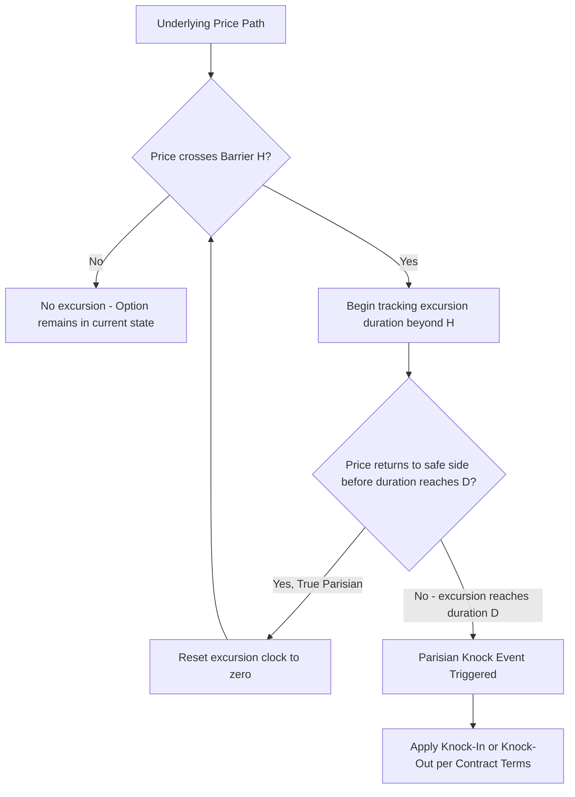

## Parisian and Double Barrier Options

### Definition and Structure

Parisian options and double barrier options are both extensions of the standard single-barrier framework covered in [[Barrier Option Types and Payoffs]], each addressing a different limitation of the simple touch-based barrier mechanism. Parisian options modify the *triggering condition* (requiring sustained, not merely instantaneous, breach of the barrier), while double barrier options modify the *barrier structure* (adding a second barrier on the opposite side of spot).

**Key Points**

- Both structures were developed substantially to address specific practical shortcomings of standard single-barrier options: Parisian options address the "instantaneous touch" triggering problem (vulnerability to brief spikes or manipulation), while double barriers address the need to define a **range** within which the option remains live or dormant
- Both require more involved mathematics than standard single-barrier options: Parisian options require the theory of Brownian excursions, while double barriers require infinite series solutions
- Both are actively used in practice — Parisian features particularly in FX and commodity barrier products designed to reduce triggering from momentary spikes, and double barriers in range-bound or corridor-style structured products

### Parisian Options: Motivation

Standard barrier options trigger on the **first instant** the underlying touches or crosses the barrier level $H$, even if that touch is momentary (e.g., a brief intraday spike that reverses within seconds). This creates two practical problems:

1. **Manipulation/pinning risk**: A large market participant could theoretically execute a brief, deliberate trade to push the price momentarily through the barrier, triggering (or avoiding) a knock event, then let the price revert
2. **Discontinuous "unlucky" triggering**: A holder can lose a valuable knock-out option (or fail to activate a knock-in option) due to a single fleeting price excursion that has no lasting economic significance

Parisian options address this by requiring the underlying to remain **continuously beyond the barrier for a specified minimum window of time** (the "Parisian window," often denoted $D$) before the knock event is triggered — a momentary touch that reverts before the window elapses does not trigger the barrier event.

**Key Points**

- The name derives from the option's development, associated with research conducted in Paris (Chesney, Jeanblanc-Picqué, and Yor, 1997, being the foundational academic reference)
- Parisian options are meaningfully harder to manipulate than standard barrier options, since a manipulator would need to sustain an artificial price level for the full window duration $D$, which is generally far more costly and detectable than a single momentary trade
- The Parisian window $D$ is a key contractual parameter — larger $D$ makes knock-out (or knock-in) events progressively harder to trigger, since the underlying must remain beyond the barrier for longer

### Parisian Option Variants

Two principal categories of Parisian triggering conditions exist:

**Standard (cumulative excursion) Parisian**: The barrier event triggers when the underlying has spent a *cumulative* total time of $D$ beyond the barrier, not necessarily consecutively — i.e., the clock accumulates across multiple separate excursions beyond the barrier, resetting only when the underlying returns to the "safe" side.

**True (consecutive excursion) Parisian**: The barrier event triggers only when the underlying remains *continuously* beyond the barrier for an uninterrupted period of $D$ — any return to the safe side resets the excursion clock to zero, requiring a fresh, uninterrupted $D$-length excursion to trigger.

**Key Points**

- "True" Parisian options (requiring a single continuous excursion) are more commonly referenced in the core academic literature and are somewhat more analytically tractable than the cumulative variant, though both are used in practice depending on the specific contractual intent
- The choice between cumulative and consecutive excursion definitions has meaningful economic implications: cumulative Parisian barriers are somewhat easier to trigger (since multiple shorter excursions can accumulate) than the equivalent consecutive/true Parisian barrier with the same window $D$

### Valuation: Parisian Options via Brownian Excursion Theory

Parisian option pricing relies on the mathematics of **Brownian excursion theory** — specifically, the distribution of the length of time a Brownian motion (or geometric Brownian motion, after the standard log-transform) spends continuously above or below a given level before returning to it. This is a substantially more advanced probabilistic tool than the simple reflection principle used for standard barriers.

The Chesney-Jeanblanc-Picqué-Yor (1997) closed-form solution for Parisian options involves **Laplace transforms** of the relevant excursion-time distributions, which must then be numerically inverted to obtain the option price — there is generally no simple closed-form expression directly in terms of standard normal CDFs, unlike the Reiner-Rubinstein formulas for standard barriers.

**Key Points**

- The Laplace transform approach means Parisian option pricing typically requires **numerical Laplace inversion** as an intermediate computational step — a nontrivial numerical procedure in its own right, distinct from evaluating closed-form normal distribution functions
- [Inference] Given this computational complexity, many practical Parisian option pricing implementations rely on Monte Carlo simulation (tracking, along each simulated path, the running duration of any continuous excursion beyond the barrier) rather than implementing the full Laplace-transform-based analytic machinery, particularly for less standard Parisian variants (e.g., double Parisian barriers, or Parisian options combined with other exotic features)
- Finite-difference PDE methods with an auxiliary state variable tracking elapsed excursion time are also used, analogous to how Asian options add a running-average state variable to the standard one-dimensional PDE

### Worked Conceptual Example (Parisian Barrier)

Consider a down-and-out Parisian call with barrier $H = 90$ and Parisian window $D = 5$ trading days, versus a standard (non-Parisian) down-and-out call with the same barrier:

**Scenario**: the underlying briefly touches 89 intraday, then closes at 91 the same day and remains above 90 for the rest of the option's life.

- **Standard barrier**: this option would be **knocked out immediately** upon the intraday touch of 89, regardless of the subsequent recovery
- **Parisian barrier**: since the excursion below 90 lasted only a fraction of a single day — far short of the 5-day window $D$ — the Parisian barrier is **not triggered**, and the option remains fully alive

[Inference] This example illustrates why Parisian barriers are generally more valuable to the holder of a knock-out option than standard barriers with the same nominal barrier level (since fewer paths trigger the knock-out event), but the precise valuation difference depends on the volatility of the underlying and the specific Parisian window length — higher volatility and shorter windows bring Parisian option values closer to standard barrier option values, while lower volatility and longer windows increase the gap.

### Double Barrier Options: Motivation and Structure

Double barrier options extend the single-barrier framework by introducing **two** barriers — an upper barrier $H_u$ and a lower barrier $H_l$, with $H_l < S_0 < H_u$ — creating a "corridor" within which the underlying must remain (for knock-out structures) or outside of which it must venture (for knock-in structures).

**Double knock-out**: the option is extinguished if the underlying touches **either** $H_u$ or $H_l$ during its life — the option survives only if the underlying stays within the corridor $(H_l, H_u)$ throughout.

**Double knock-in**: the option is activated only if the underlying touches **either** barrier — it remains dormant as long as the underlying stays within the corridor.

**Key Points**

- Double barrier options are generally cheaper than single-barrier options with a comparably-positioned single barrier, since there are now two ways to trigger a knock-out (or two ways to fail to knock in), increasing the probability of the unfavorable-to-the-holder outcome
- Double knock-out options are popular in range-bound or "corridor" market views — an investor confident the underlying will trade within a specific range can significantly reduce option premium by accepting double-sided knock-out risk
- Double barrier options are also called "corridor options" in some contexts, though this term is sometimes used more specifically for range accrual-style products that pay based on time spent within a corridor rather than a simple knock-in/out trigger

### Valuation: Double Barrier Options — Kunitomo-Ikeda Method

Kunitomo and Ikeda (1992) derived closed-form solutions for double barrier options under Black-Scholes assumptions using the **method of images applied repeatedly** between the two barriers. Because a single reflection (as used for a single barrier) is insufficient when there are two barriers to account for — reflecting off one barrier can create an "image" path that then needs to be reflected again off the other barrier, and so on — the exact solution takes the form of an **infinite series**.

For a double knock-out call (using Haug's notation), the price is given by a series of the form:

$$C_{DKO} = S_0 e^{-qT}\sum_{n=-\infty}^{\infty}\left[\left(\frac{H_u}{H_l}\right)^{n}\left\{N(d_1(n)) - N(d_2(n))\right\} - \left(\frac{H_l}{S_0}\right)^{2n+2}\left(\frac{S_0}{H_u}\right)\left\{N(d_3(n)) - N(d_4(n))\right\}\right]$$

$$-Ke^{-rT}\sum_{n=-\infty}^{\infty}\left[\left(\frac{H_u}{H_l}\right)^{n}\left\{N(d_1(n)-\sigma\sqrt{T}) - N(d_2(n)-\sigma\sqrt{T})\right\} - \ldots\right]$$

where each $d_i(n)$ term is a shifted version of the standard Black-Scholes $d$ terms, with the shift depending on powers of $H_u/H_l$ and the index $n$, reflecting the repeated back-and-forth image reflections between the two barriers.

**Key Points**

- The infinite series **converges rapidly** in practice — typically, only a small number of terms (often fewer than 10, sometimes even 3-5) are needed to achieve high numerical precision, since each successive term in the series is scaled by increasing powers of the ratio $H_u/H_l$, which is generally well away from 1 for economically sensible corridor widths
- The narrower the corridor (the closer $H_u$ and $H_l$ are to each other, and to spot), the more terms are typically required for the series to converge to a given precision, since the "distance" between the two barriers (relative to volatility and time to expiry) governs how many reflections meaningfully contribute to the probability of hitting either barrier
- [Inference] Given the series' generally rapid convergence for reasonably-spaced barriers, closed-form (truncated series) pricing of double barrier options is more commonly implemented directly in production pricing libraries than is the case for Parisian options, where the Laplace-inversion step is comparatively more cumbersome

### Worked Numerical Example (Double Knock-Out, Conceptual)

Consider a double knock-out call with:

- $S_0 = 100$, $K = 100$, $H_l = 85$, $H_u = 120$
- $\sigma = 20\%$, $r = 5\%$, $q = 0\%$, $T = 0.5$ years

Since the corridor $(85, 120)$ is reasonably wide relative to the volatility and short half-year tenor, [Inference] the probability of touching either barrier before expiry is likely to be moderate, and the double knock-out call value should sit noticeably — but not overwhelmingly — below the equivalent vanilla call value, since both a substantial downside move (to 85, a 15% decline) and a substantial upside move (to 120, a 20% rally) would need to be excluded from the payoff distribution. [Unverified] A precise valuation requires summing the Kunitomo-Ikeda series with a validated numerical implementation, since the multi-term series structure makes reliable hand calculation impractical.

### Greeks and Risk Sensitivities

**Parisian Options:**

- **Delta and Gamma near the barrier**: Substantially **smoother** than standard barrier options near the barrier level, since the Parisian window requires sustained breach before triggering — this is precisely the practical hedging advantage Parisian structures offer over standard barriers, mitigating the "hedging blow-up" problem discussed in the context of standard barrier options
- **Sensitivity to the window length $D$**: A unique risk dimension not present in standard barriers — how the option value changes as the contractual Parisian window is varied, relevant for structuring and negotiating window length as a pricing lever

**Double Barrier Options:**

- **Delta**: More complex than single-barrier delta, since the option's sensitivity to the underlying must account for proximity to *both* barriers simultaneously — delta can change sign or magnitude substantially depending on which barrier is closer
- **Gamma**: Can exhibit pronounced behavior near either barrier, with the corridor's width relative to volatility and remaining time governing how "barrier-dominated" the risk profile becomes as expiry approaches
- **Vega**: Double barrier knock-out options generally have **reduced vega** relative to single-barrier equivalents (and can even exhibit negative vega in some configurations), since higher volatility increases the probability of touching *either* barrier, which is unambiguously unfavorable to a double knock-out holder — this contrasts with vanilla options, which always have positive vega

**Example**

A risk manager notes that a double knock-out option can, counterintuitively, decrease in value if implied volatility rises — the opposite of the textbook "higher volatility, higher option value" relationship taught for vanilla options — because higher volatility primarily increases the likelihood of triggering one of the two knock-out barriers, dominating any increase in the underlying vanilla payoff's expected value.

### Combining Parisian and Double Barrier Features

Some structured products combine both features — a **double Parisian barrier option** — requiring sustained breach of either an upper or lower barrier before triggering, providing both the manipulation-resistance of Parisian triggering and the range-bound cost efficiency of a double barrier structure.

**Key Points**

- [Inference] Double Parisian barriers combine the analytical complexity of both underlying techniques (Brownian excursion theory and the method of images), meaning closed-form solutions become substantially more involved, and in practice these hybrid structures are most commonly valued via Monte Carlo simulation rather than an extended analytic approach, given the combinatorial growth in complexity when layering both features together

### Model Risk and Practical Considerations

- **Parisian window calibration and discreteness**: Real-world monitoring is discrete (e.g., checking prices at set intervals rather than continuously), which interacts with the Parisian window definition in a way that requires careful contractual specification — whether the window is measured in calendar time, trading days, or discrete observation counts materially affects both the economic meaning and the valuation of the Parisian feature
- **Double barrier series truncation risk**: While the Kunitomo-Ikeda series converges rapidly for typical corridor widths, production implementations must include appropriate truncation and convergence-checking logic, since prematurely truncating the series (especially for narrow corridors) can introduce material pricing errors
- **Volatility skew sensitivity**: Both structures, like standard barrier options, are sensitive to the volatility assumed near the relevant barrier levels — double barriers are sensitive to skew/smile behavior at **both** ends of the corridor simultaneously, compounding the skew-calibration challenge relative to single-barrier options
- **Reduced (or negative) vega complicates standard risk frameworks**: Because double barrier options can exhibit negative vega in some configurations, risk systems and traders accustomed to the "more volatility, more option value" heuristic must apply particular care when interpreting and limit-managing vega exposure on double barrier books
- [Inference] Given the specialized mathematics underlying both Parisian excursion theory and multi-reflection double barrier series solutions, these products are more likely to be handled by dedicated exotics desks with access to validated, purpose-built pricing libraries, rather than being priced ad hoc — the barrier to correct in-house implementation is meaningfully higher than for standard single-barrier options

### Related Topics

- Barrier Option Types and Payoffs
- Barrier Option Pricing and Static Replication
- Brownian Excursion Theory and Laplace Transform Methods
- Kunitomo-Ikeda Double Barrier Formulas and Method of Images
- Window and Partial-Time Barrier Options
- Range Accrual and Corridor Structured Products
- Volatility Skew Modeling Near Multiple Barrier Levels
- Monte Carlo Simulation of Path-Dependent Excursion Times