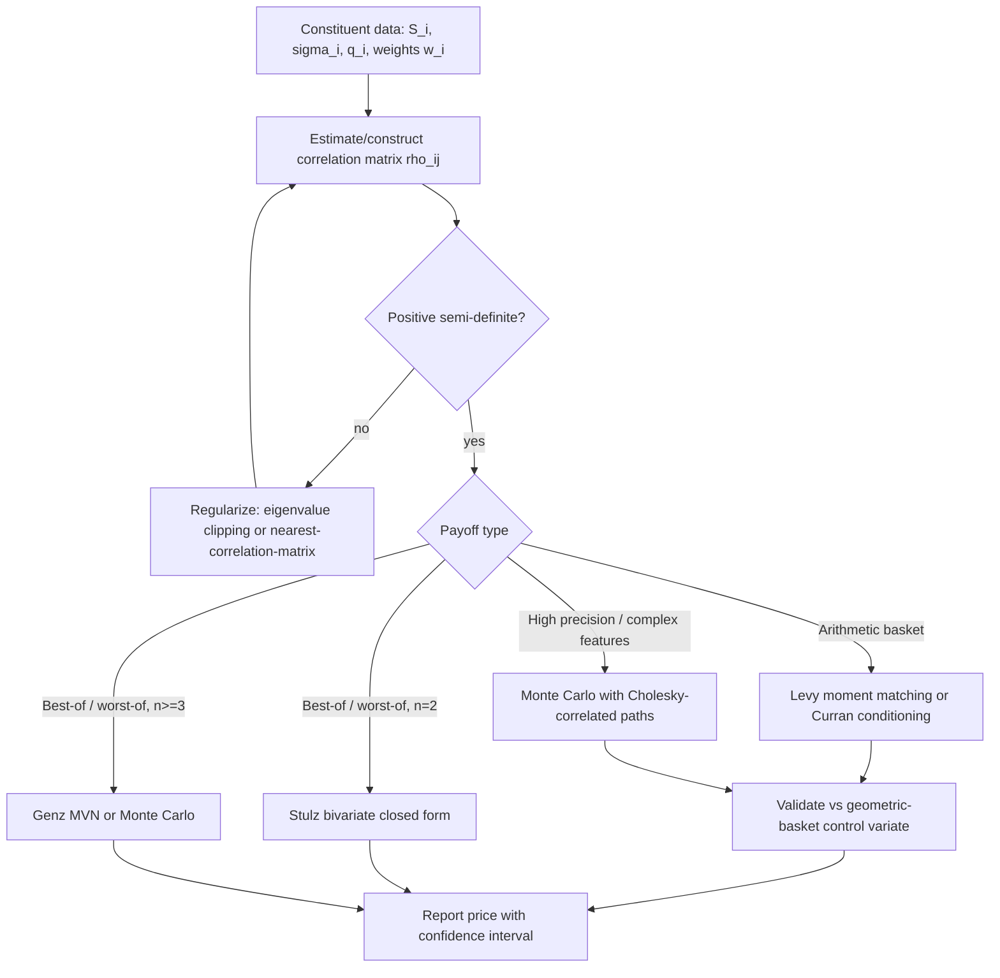

## Basket Options and Index Options


### Overview

Basket and index options are derivatives whose payoff depends on a weighted combination of multiple underlying assets rather than a single asset. An index option (e.g., on the S&P 500) is a special case of a basket option where the weights are fixed by the index construction methodology (typically market-cap weighting) and the constituent set is large and standardized. A basket option is the more general instrument, where the weights, constituents, and often the currency denomination of each leg are custom to the trade. Both share the central pricing challenge: the weighted sum (or product) of correlated lognormal (or otherwise distributed) variables is not itself lognormal, so no exact closed-form analog to Black-Scholes exists for the arithmetic basket case, and approximation or numerical methods are required.

### Payoff Structures

**Key Points**

- **Basket call**: $\left(\sum_{i=1}^n w_i S_i(T) - K\right)^+$ — the standard arithmetic-weighted basket
- **Basket put**: $\left(K - \sum_{i=1}^n w_i S_i(T)\right)^+$
- **Index option**: identical structure to a basket call/put, but $w_i$ are the index's published constituent weights (often float-adjusted market-cap weights, rebalanced periodically) and $n$ can be in the hundreds
- **Best-of / worst-of basket**: $\left(\max_i S_i(T)/S_i(0) - K\right)^+$ or using $\min_i$ — payoff depends on order statistics of the returns rather than a linear combination, and is priced very differently (see below)
- **Spread option** (n=2 special case): $\left((S_1(T) - S_2(T)) - K\right)^+$ — technically a basket with weights $(+1,-1)$, but its near-zero or negative "strike-like" behavior and frequent near-the-money structure make it a distinct pricing sub-literature (Kirk's approximation, Bjerksund-Stensland)
- **Rainbow options**: a broader family including best-of/worst-of and "$k$-th best of $n$" payoffs

### Why Basket Options Resist Closed-Form Pricing

Under a multivariate GBM assumption for the constituents,

$$dS_i = (r - q_i) S_i\, dt + \sigma_i S_i\, dW_i, \quad d\langle W_i, W_j\rangle = \rho_{ij}\, dt$$

each $S_i(T)$ is individually lognormal. However, the basket value

$$B(T) = \sum_{i=1}^n w_i S_i(T)$$

is a **sum of correlated lognormals**, and the sum of lognormal random variables has no known closed-form density. This is the fundamental obstacle: Black-Scholes' tractability relies on the terminal distribution being lognormal, and that property does not survive linear combination (unlike, say, the sum of independent normals, which stays normal).

By contrast, a **geometric basket** $G(T) = \prod_i S_i(T)^{w_i}$ (with $\sum w_i = 1$) *is* lognormal, since sums of Brownian motions remain Gaussian and the geometric basket's log is a weighted sum of the individual log-price processes. This is why geometric basket options have an exact Black-Scholes-type closed form and serve as the natural control variate / building block for arithmetic basket approximations — directly analogous to the geometric-vs-arithmetic Asian option relationship.

### Method 1: Moment-Matching Approximations

The dominant practical approach approximates the unknown basket distribution with a simpler parametric family whose first few moments match the true basket's moments, computed exactly under the joint lognormal assumption.

#### Basket Moments Under Joint GBM

The first two moments of the arithmetic basket at maturity have closed forms under joint GBM:

$$\mathbb{E}[B(T)] = \sum_{i=1}^n w_i S_i(0) e^{(r-q_i)T}$$


$$\mathbb{E}[B(T)^2] = \sum_{i=1}^n \sum_{j=1}^n w_i w_j S_i(0) S_j(0) e^{(r-q_i)T}e^{(r-q_j)T} e^{\rho_{ij}\sigma_i\sigma_j T}$$

From these, the basket's variance is $\text{Var}[B(T)] = \mathbb{E}[B(T)^2] - \mathbb{E}[B(T)]^2$.

#### Levy's Lognormal Moment-Matching Approximation

The most widely used practitioner approximation (Levy, 1992) fits a single lognormal distribution to $B(T)$ by matching its first two moments:

$$B(T) \approx \tilde{B}(0)\, e^{\left(\mu_B - \frac{1}{2}\sigma_B^2\right)T + \sigma_B \sqrt{T} Z}, \quad Z \sim \mathcal{N}(0,1)$$

where $\sigma_B^2$ and the effective drift are backed out by matching:

$$\mathbb{E}[\tilde B(T)] = \mathbb{E}[B(T)], \qquad \mathbb{E}[\tilde B(T)^2] = \mathbb{E}[B(T)^2]$$

Given the matched lognormal parameters, the basket call price follows a direct Black-Scholes-style formula:

$$C_{\text{Levy}} = e^{-rT}\left[\mathbb{E}[B(T)]\,\Phi(d_1) - K\,\Phi(d_2)\right]$$


$$d_{1,2} = \frac{\ln(\mathbb{E}[B(T)]/K) \pm \frac{1}{2}\sigma_B^2 T}{\sigma_B\sqrt{T}}$$

**Key Points**

- This approximation is fast (closed-form) and reasonably accurate for baskets with low-to-moderate dispersion in constituent volatilities and moderate correlation
- It systematically misprices deep out-of-the-money and deep in-the-money basket options because a single lognormal cannot capture the fatter/thinner tails and skew that arise from summing multiple lognormals with heterogeneous vols and correlations [Inference: the direction of the pricing error depends on the specific correlation and volatility structure and is not uniform across all baskets]
- Extensions match higher moments (skewness, kurtosis) using more flexible distributions — e.g., the Johnson family, shifted lognormal, or Edgeworth expansions — trading closed-form simplicity for improved tail accuracy

#### Reciprocal Gamma / Other Distributional Fits

Alternative approximations replace the lognormal target with distributions offering more flexible tail behavior — for instance, fitting an inverse gamma distribution to the basket sum. These typically improve accuracy for baskets with high dispersion in individual volatilities or strongly skewed correlation structures, at the cost of a more complex pricing formula (often still closed-form or quasi-closed-form via special functions).

### Method 2: Conditioning / Curran's Approximation

Curran's (1994) method conditions the arithmetic basket payoff on the geometric basket value, exploiting the fact that the geometric basket is lognormal and highly correlated with the arithmetic basket:

$$C = e^{-rT}\,\mathbb{E}\left[\left(\sum_i w_i S_i(T) - K\right)^+\right] = e^{-rT}\,\mathbb{E}\left[\mathbb{E}\left[\left(\sum_i w_i S_i(T) - K\right)^+ \,\middle|\, G(T)\right]\right]$$

By conditioning on $G(T) = \prod_i S_i(T)^{w_i}$ and using the fact that $S_i(T)$ conditional on $G(T)$ remains (approximately/exactly, depending on formulation) lognormal, the inner conditional expectation can be evaluated in closed form, and the outer expectation reduces to a 1-D integral against $G(T)$'s lognormal density — a substantial dimensionality reduction relative to the original $n$-dimensional integral.

**Key Points**

- Curran's method is generally more accurate than simple moment matching, particularly for baskets with high dispersion, since it captures more of the true joint structure rather than collapsing everything into two moments
- It remains an approximation because the exact conditional distribution of $S_i(T) | G(T)$ under the true joint model is not exactly lognormal in general — the method uses a tractable approximation to this conditional law
- Various refinements (Deelstra et al., Ju's Taylor expansion, Milevsky-Posner) improve on the base conditioning approach with correction terms

### Method 3: Monte Carlo Simulation with Correlated Paths

For baskets with many constituents, best-of/worst-of structures, path-dependent basket features (e.g., Asian baskets), or when high precision is required for risk/regulatory purposes, Monte Carlo remains the most general and robust tool.

#### Simulating Correlated GBM Paths

Given a correlation matrix $\Sigma$ (or covariance matrix built from $\sigma_i, \sigma_j, \rho_{ij}$), the standard approach uses a **Cholesky decomposition** $\Sigma = LL^\top$ to transform independent standard normals into correlated ones:

$$\mathbf{Z}_{\text{corr}} = L\,\mathbf{Z}_{\text{indep}}$$

Each asset then evolves as:

$$S_i(t+\Delta t) = S_i(t)\exp\left[\left(r - q_i - \tfrac{1}{2}\sigma_i^2\right)\Delta t + \sigma_i\sqrt{\Delta t}\,(Z_{\text{corr}})_i\right]$$

**Example**

```python
import numpy as np

def mc_basket_call(S0, weights, K, r, q, sigma, corr, T, N_paths, seed=7):
    """
    S0, weights, q, sigma: arrays of length n
    corr: n x n correlation matrix
    """
    n = len(S0)
    rng = np.random.default_rng(seed)

    cov = np.outer(sigma, sigma) * corr
    L = np.linalg.cholesky(cov)  # Cholesky of the covariance (not correlation) matrix

    Z_indep = rng.standard_normal((N_paths, n))
    Z_corr = Z_indep @ L.T  # each row now has covariance 'cov' after scaling by sqrt(T)

    drift = (r - q - 0.5 * sigma**2) * T
    log_ST = np.log(S0) + drift + np.sqrt(T) * Z_corr
    ST = np.exp(log_ST)

    basket_val = ST @ weights
    payoff = np.maximum(basket_val - K, 0.0)
    discounted = np.exp(-r * T) * payoff

    price = discounted.mean()
    stderr = discounted.std(ddof=1) / np.sqrt(N_paths)
    return price, stderr
```

**Key Points**

- The correlation matrix $\Sigma$ must be positive semi-definite for the Cholesky decomposition to exist; empirically estimated correlation matrices (especially from short/noisy histories, or assembled piecewise from pairwise estimates) can fail this property and require regularization (eigenvalue clipping, shrinkage toward a target matrix, or nearest-correlation-matrix algorithms)
- Geometric basket control variates work identically here as in the single-asset Asian case: since $G(T)$ has a closed-form price, using it as a control variate on the arithmetic basket MC estimator substantially reduces variance
- For very large baskets (index options with hundreds of constituents), full $n \times n$ correlation matrix simulation becomes computationally and data-intensive; **factor models** (e.g., a single-factor or multi-factor structure $R_i = \beta_i F + \epsilon_i$) are commonly used to approximate the correlation structure with far fewer parameters, trading some correlation fidelity for tractability

### Method 4: PDE Methods for Baskets

The basket pricing PDE for $n$ assets extends Black-Scholes to $n$ spatial dimensions:

$$\frac{\partial V}{\partial t} + \sum_{i=1}^n (r-q_i)S_i\frac{\partial V}{\partial S_i} + \frac{1}{2}\sum_{i=1}^n\sum_{j=1}^n \rho_{ij}\sigma_i\sigma_j S_i S_j \frac{\partial^2 V}{\partial S_i \partial S_j} - rV = 0$$

**Key Points**

- Grid-based finite difference methods scale as $O(m^n)$ in memory/computation for $m$ grid points per dimension, making direct PDE solution practical only for $n \le 3$ (i.e., basket options on 2-3 underlyings, or spread options)
- For $n=2$ (spread options, 2-asset baskets), alternating-direction implicit (ADI) schemes (Peaceman-Rachford, Craig-Sneyd) are the standard efficient approach, splitting the 2-D PDE into a sequence of 1-D implicit solves per time step
- Beyond 3 dimensions, PDE methods are effectively abandoned in favor of Monte Carlo — this dimensional threshold is the primary reason MC dominates in basket/index option pricing practice despite its slower convergence rate

### Best-Of / Worst-Of Options: A Distinct Pricing Regime

**Key Points**

- Unlike arithmetic baskets, best-of/worst-of payoffs depend on **order statistics** of the correlated terminal values, not a linear combination — this changes both the mathematical structure and the sensitivity profile
- For 2 assets, Stulz's (1982) formula gives an exact closed-form price for options on the maximum or minimum of two lognormal assets using the bivariate normal CDF
- For $n \ge 3$, the multivariate normal CDF (required for closed-form extensions) has no simple closed form and must itself be evaluated numerically (e.g., via Genz's algorithm), so in practice $n \ge 3$ best-of/worst-of options are priced via Monte Carlo
- Best-of/worst-of options exhibit markedly different correlation sensitivity than standard baskets: a worst-of call **decreases in value as correlation increases** (since higher correlation means the worst performer tracks the others more closely, reducing the "penalty" of selecting the minimum), while an arithmetic basket call's value moves in the **opposite** direction (higher correlation increases basket variance, so a basket call's value generally rises with correlation, all else equal) — this divergence is a critical distinction for correlation risk management on multi-asset desks
- This structure makes best-of/worst-of options and dispersion products effectively pure-play instruments on implied correlation, and they are the primary vehicle by which correlation risk is traded and hedged on exotics desks

### Index Options — Practical Considerations

**Key Points**

- Because index weights are typically float-adjusted market-cap weights that drift as constituent prices move and are periodically rebalanced (quarterly for most major equity indices), the "basket" underlying an index option is not static over its life — pricing models generally treat this rebalancing as a second-order effect and price against the observed index level and its own implied volatility surface rather than reconstructing constituent-level dynamics
- **Implied correlation** is often backed out from the relationship between the index's implied volatility (traded directly, e.g., via SPX options / VIX) and the weighted-average implied volatilities of index constituents (traded via single-stock options):


  $$\sigma_{\text{index}}^2 \approx \sum_i w_i^2 \sigma_i^2 + \sum_{i \ne j} w_i w_j \rho_{ij} \sigma_i \sigma_j$$

  Assuming a single average implied correlation $\bar\rho$ across all pairs allows solving this relationship for $\bar\rho$ given observed index and single-stock implied vols — this is the standard definition underlying tradable "implied correlation indices" (e.g., CBOE's implied correlation indices)
- Dispersion trading (long single-stock volatility / short index volatility, or vice versa) is fundamentally a trade on the spread between realized/implied correlation and the correlation priced into the index options market, directly leveraging the basket-vs-constituent relationship above
- For most liquid equity indices, the practical pricing approach for **vanilla** index options is to treat the index itself as a single underlying with its own directly observed/quoted implied volatility surface (calibrated to the smile from listed index options), sidestepping the basket-of-lognormals problem entirely — the multi-asset basket machinery above becomes essential specifically for **custom baskets** (bespoke weighted combinations without a liquid options market of their own) and for cross-asset or cross-currency baskets lacking a standardized index

### Method Comparison Summary

| Method | Best suited for | Weakness | Dimensionality limit |
| --- | --- | --- | --- |
| Levy moment-matching | Fast approximate pricing, risk system sensitivity screens | Tail/skew inaccuracy for high dispersion or extreme correlation | Scales to any $n$ (moments are closed-form) |
| Curran conditioning | Higher-accuracy semi-analytic pricing | Still an approximation; more complex to implement | Scales to any $n$, reduces to 1-D integral |
| Monte Carlo | General baskets, best-of/worst-of, path-dependent baskets, large $n$ | Slower convergence, correlation matrix estimation risk | Effectively unlimited $n$ |
| PDE / Finite Difference | High-precision pricing for 2-3 asset baskets/spreads | Curse of dimensionality | $n \le 3$ practical limit |
| Stulz / Genz multivariate | Exact best-of/worst-of for small $n$ | Multivariate normal CDF cost grows with $n$; impractical beyond small $n$ | $n=2$ closed-form; $n\ge3$ numerically via Genz |

### Correlation Structure and Basket Value (svg_diagram)

<svg xmlns="http://www.w3.org/2000/svg" viewBox="0 0 720 300" font-family="Helvetica, Arial, sans-serif">
<text x="360" y="24" text-anchor="middle" font-size="16" font-weight="bold" fill="#1a1a1a">Correlation Sensitivity: Basket Call vs. Worst-Of Call (svg_diagram)</text>
<line x1="80" y1="250" x2="640" y2="250" stroke="#333" stroke-width="1.5" />
<text x="650" y="254" font-size="12" fill="#333">Correlation ρ</text>
<line x1="80" y1="250" x2="80" y2="50" stroke="#333" stroke-width="1.5" />
<text x="55" y="45" font-size="12" fill="#333">Option Value</text>

<text x="90" y="264" font-size="11" fill="#555">ρ = -1</text>

<text x="350" y="264" font-size="11" fill="#555">ρ = 0</text>

<text x="610" y="264" font-size="11" fill="#555">ρ = +1</text>

<path d="M 80 200 C 250 190, 450 130, 620 90" fill="none" stroke="#2b6cb0" stroke-width="2.5" />
<text x="430" y="115" font-size="12" fill="#2b6cb0" font-weight="bold">Arithmetic basket call (value ↑ with ρ)</text>
<path d="M 80 90 C 250 130, 450 190, 620 220" fill="none" stroke="#c0392b" stroke-width="2.5" />
<text x="380" y="205" font-size="12" fill="#c0392b" font-weight="bold">Worst-of call (value ↓ with ρ)</text>

<text x="360" y="288" text-anchor="middle" font-size="12" fill="#555">Opposite correlation exposure is the core reason dispersion trades pair basket/index and worst-of structures.</text>

</svg>

### Basket Pricing Decision Flow (svg_diagram)

<svg xmlns="http://www.w3.org/2000/svg" viewBox="0 0 760 320" font-family="Helvetica, Arial, sans-serif">
<text x="380" y="24" text-anchor="middle" font-size="16" font-weight="bold" fill="#1a1a1a">Basket / Index Option Pricing Method Selection (svg_diagram)</text>
<rect x="310" y="45" width="150" height="45" rx="6" fill="#eaf2fb" stroke="#2b6cb0" />
<text x="385" y="72" text-anchor="middle" font-size="12">Payoff type?</text>
<rect x="60" y="140" width="180" height="55" rx="6" fill="#fdf3ea" stroke="#c0781b" />
<text x="150" y="163" text-anchor="middle" font-size="11">Linear weighted sum</text>
<text x="150" y="178" text-anchor="middle" font-size="11">(arithmetic basket)</text>
<rect x="300" y="140" width="180" height="55" rx="6" fill="#fdf3ea" stroke="#c0781b" />
<text x="390" y="163" text-anchor="middle" font-size="11">Max/min of assets</text>
<text x="390" y="178" text-anchor="middle" font-size="11">(best-of / worst-of)</text>
<rect x="540" y="140" width="180" height="55" rx="6" fill="#fdf3ea" stroke="#c0781b" />
<text x="630" y="163" text-anchor="middle" font-size="11">Liquid index with own</text>
<text x="630" y="178" text-anchor="middle" font-size="11">quoted vol surface</text>
<rect x="30" y="240" width="220" height="55" rx="6" fill="#eafbea" stroke="#2f8f4e" />
<text x="140" y="260" text-anchor="middle" font-size="11">n small: Levy / Curran</text>
<text x="140" y="275" text-anchor="middle" font-size="11">n large: MC + factor corr</text>
<rect x="290" y="240" width="220" height="55" rx="6" fill="#eafbea" stroke="#2f8f4e" />
<text x="400" y="260" text-anchor="middle" font-size="11">n=2: Stulz closed-form</text>
<text x="400" y="275" text-anchor="middle" font-size="11">n≥3: Genz MVN / Monte Carlo</text>
<rect x="550" y="240" width="170" height="55" rx="6" fill="#eafbea" stroke="#2f8f4e" />
<text x="635" y="260" text-anchor="middle" font-size="11">Price off index's own</text>
<text x="635" y="275" text-anchor="middle" font-size="11">implied vol surface directly</text>
<line x1="385" y1="90" x2="150" y2="140" stroke="#333" marker-end="url(#arrow2)" />
<line x1="385" y1="90" x2="390" y2="140" stroke="#333" marker-end="url(#arrow2)" />
<line x1="385" y1="90" x2="630" y2="140" stroke="#333" marker-end="url(#arrow2)" />
<line x1="150" y1="195" x2="140" y2="240" stroke="#333" marker-end="url(#arrow2)" />
<line x1="390" y1="195" x2="400" y2="240" stroke="#333" marker-end="url(#arrow2)" />
<line x1="630" y1="195" x2="635" y2="240" stroke="#333" marker-end="url(#arrow2)" />
</svg>

### Basket Pricing Pipeline (Mermaid)



### Greeks and Risk Management Considerations

**Key Points**

- **Delta** for a basket option is a vector across all $n$ constituents ($\partial V/\partial S_i$ for each $i$); for large index options, desks often approximate constituent-level delta via the index weight times an aggregate index delta rather than computing $n$ separate sensitivities, especially when constituent-level hedging is impractical
- **Cross-gamma** ($\partial^2 V/\partial S_i \partial S_j$) is unique to multi-asset products and captures how a move in one asset changes the delta of another — this term is absent in single-asset options and is a key driver of basket option hedging cost/complexity
- **Vega** decomposes into sensitivity to each constituent's individual volatility and sensitivity to the correlation matrix itself (**correlation vega** or "cega") — correlation risk cannot be hedged with single-name options alone and typically requires trading correlation-sensitive instruments (variance swaps, dispersion trades, or other baskets) [Inference: hedging effectiveness depends heavily on the liquidity of correlation-sensitive instruments in the specific asset class, which varies significantly across equity, FX, and commodity markets]
- Because basket/index correlation risk cannot be perfectly statically hedged with vanilla single-name instruments, banks typically carry residual correlation risk on their books and manage it via correlation limits, stress scenarios (correlation shocks to 1 or -1), and periodic rebalancing of the dispersion book

**Next Steps**

- Spread option pricing in depth: Kirk's approximation, Bjerksund-Stensland formula, and PDE/ADI schemes for two-asset spreads
- Implied correlation extraction methodology and construction of tradable correlation indices
- Dispersion trading strategy mechanics: variance swap replication, delta-hedged single-stock vs. index straddles
- Multivariate normal CDF numerical evaluation (Genz's algorithm) for higher-dimensional best-of/worst-of pricing
- Copula-based dependence modeling as an alternative to the joint-lognormal/linear-correlation assumption for basket pricing
- Factor models for large-basket correlation structure (single-factor, PCA-based, sector/style factor models)
- Quanto basket options and cross-currency correlation effects
- Local/stochastic correlation models and their role in smile-consistent multi-asset pricing