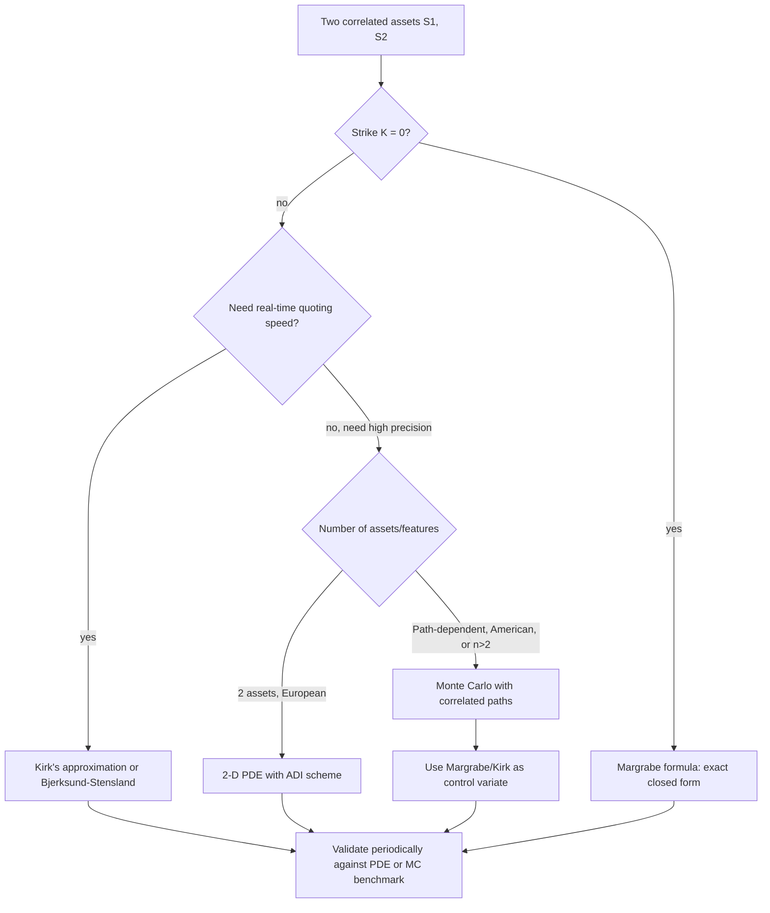

## Spread Options and Exchange Options

### Overview

Spread options and exchange options are two-asset derivatives whose payoff depends on the difference between two underlying prices rather than either price in isolation. An exchange option is the special case of a spread option with zero strike: it gives the holder the right to exchange one asset for another. Spread options generalize this by adding a non-zero strike, breaking the scale-invariance that makes the exchange option case exactly solvable and forcing the general spread option into approximation or numerical territory. These instruments are the two-asset workhorse of commodity markets (crack spreads, spark spreads, calendar spreads), fixed income (yield curve spreads), and equity relative-value trading.

### Payoff Structures

**Key Points**

- **Spread call**: $\left((S_1(T) - S_2(T)) - K\right)^+$
- **Spread put**: $\left(K - (S_1(T) - S_2(T))\right)^+$
- **Exchange option (Margrabe)**: spread option with $K=0$: $\left(S_1(T) - S_2(T)\right)^+$ — the right to exchange asset 2 for asset 1
- **Crack spread option** (energy): payoff on the spread between refined product price and crude price, e.g., $\left((3\times\text{Gasoline} + 2\times\text{Heating Oil} - 5\times\text{Crude}) - K\right)^+$ scaled by conversion ratios — technically a 3-asset basket-spread hybrid
- **Calendar spread option**: spread between the same underlying at two different maturities/delivery dates, common in commodity futures curves
- **Quality/location spreads**: spread between two grades or delivery points of the same commodity (e.g., WTI vs. Brent)

### Why the Zero-Strike Case Is Special

For the exchange option ($K=0$), the payoff $\left(S_1(T) - S_2(T)\right)^+$ can be rewritten by dividing through by $S_2(T)$:

$$\left(S_1(T) - S_2(T)\right)^+ = S_2(T)\left(\frac{S_1(T)}{S_2(T)} - 1\right)^+$$

The ratio $S_1(T)/S_2(T)$, under joint GBM dynamics for $S_1$ and $S_2$, is **itself lognormally distributed** — because the log of a ratio of two correlated GBMs is a linear combination of two Gaussian processes, hence Gaussian. This is the critical structural fact that makes the exchange option exactly solvable: the problem reduces to pricing a call on a lognormal "numeraire-relative" asset struck at 1, which is a Black-Scholes-type problem using $S_2(T)$ as a numeraire (a direct application of the change-of-numéraire technique). Once $K \ne 0$, this ratio trick no longer eliminates the strike term, the payoff no longer collapses to a single lognormal variable, and no exact closed-form solution exists in general — this is precisely analogous to why the geometric basket is exactly solvable while the arithmetic basket is not.

### Margrabe's Formula (Exchange Options)

Under joint GBM with $dS_i = (r-q_i)S_i\,dt + \sigma_i S_i\,dW_i$ and $d\langle W_1,W_2\rangle = \rho\,dt$, Margrabe's (1978) formula gives the exact price of the exchange option:

$$V = S_1(0)e^{-q_1 T}\Phi(d_1) - S_2(0)e^{-q_2 T}\Phi(d_2)$$


$$d_{1,2} = \frac{\ln\left(\frac{S_1(0)e^{-q_1T}}{S_2(0)e^{-q_2T}}\right) \pm \frac{1}{2}\sigma_{\text{sp}}^2 T}{\sigma_{\text{sp}}\sqrt{T}}$$

with the combined "spread volatility"

$$\sigma_{\text{sp}}^2 = \sigma_1^2 + \sigma_2^2 - 2\rho\,\sigma_1\sigma_2$$

**Key Points**

- Notice this is structurally identical to Black-Scholes with $S_1(0)e^{-q_1T}$ playing the role of the forward spot, $S_2(0)e^{-q_2T}$ playing the role of the discounted strike, and $\sigma_{\text{sp}}$ replacing the single-asset volatility — the risk-free rate $r$ drops out entirely because both legs are discounted at the same rate and the payoff is homogeneous of degree 1
- $\sigma_{\text{sp}}^2$ decreasing in $\rho$ means **higher correlation between the two assets reduces exchange option value** — intuitively, if $S_1$ and $S_2$ move together, the spread $S_1 - S_2$ is more stable and less likely to move deep in/out of the money, so the option is worth less. This is the same qualitative direction as worst-of-option correlation sensitivity and the opposite direction of standard basket call sensitivity
- Margrabe's formula requires no correlation-driven numerical integration — it is exact and closed-form given $\sigma_1, \sigma_2, \rho$, making it a cornerstone building block and a natural check case for validating numerical spread-option code

### The General Spread Option Problem ($K \neq 0$)

Once $K \neq 0$, the payoff cannot be reduced to a single lognormal via the numeraire trick, since:

$$\left(S_1(T) - S_2(T) - K\right)^+ = S_2(T)\left(\frac{S_1(T)}{S_2(T)} - 1 - \frac{K}{S_2(T)}\right)^+$$

The term $K/S_2(T)$ is itself random, breaking the clean reduction to a fixed-strike option on a lognormal ratio. This is the mathematical root of why general spread options require approximation methods.

### Method 1: Kirk's Approximation

Kirk's (1995) approximation is the industry-standard closed-form approximation for spread options, widely used in commodity and energy markets. It treats the "quasi-strike" $K + S_2(T)$ as approximately lognormal, and applies a Margrabe-style formula to $S_1(T)$ versus this synthetic lognormal quantity:

$$C_{\text{Kirk}} \approx e^{-rT}\left[F_1\,\Phi(d_1) - (F_2+K)\,\Phi(d_2)\right]$$


$$d_{1,2} = \frac{\ln\left(\frac{F_1}{F_2+K}\right) \pm \frac{1}{2}\sigma_K^2 T}{\sigma_K \sqrt{T}}$$

where $F_1, F_2$ are the forward prices of the two assets, and the approximate combined volatility is:

$$\sigma_K^2 = \sigma_1^2 + \left(\sigma_2\frac{F_2}{F_2+K}\right)^2 - 2\rho\,\sigma_1\sigma_2 \frac{F_2}{F_2+K}$$

**Key Points**

- Kirk's formula reduces to Margrabe's formula exactly when $K=0$ (since $F_2/(F_2+0)=1$), confirming consistency at the boundary
- Accuracy degrades as $K$ becomes large relative to $F_2$ or as volatilities become large, since the lognormality approximation of $S_2(T)+K$ becomes progressively worse the more the additive constant $K$ distorts the underlying lognormal shape
- Widely used in energy markets (crack spreads, spark spreads) due to its speed and closed-form Greeks, despite known accuracy limitations in high-volatility or deep-in/out-of-the-money regimes

**Example**

```python
import numpy as np
from scipy.stats import norm

def kirk_spread_call(F1, F2, K, sigma1, sigma2, rho, r, T):
    denom = F2 + K
    sigma_K2 = sigma1**2 + (sigma2 * F2 / denom)**2 - 2*rho*sigma1*sigma2*(F2/denom)
    sigma_K = np.sqrt(sigma_K2)

    d1 = (np.log(F1/denom) + 0.5*sigma_K2*T) / (sigma_K*np.sqrt(T))
    d2 = d1 - sigma_K*np.sqrt(T)

    price = np.exp(-r*T) * (F1*norm.cdf(d1) - denom*norm.cdf(d2))
    return price
```

### Method 2: Bjerksund-Stensland Approximation

The Bjerksund-Stensland (2006) approximation improves on Kirk's method by using a more refined lower-bound-based approach and generally achieves tighter accuracy across a wider range of strikes and volatility regimes, particularly for options that are significantly in- or out-of-the-money. It is derived using an exponential/exercise-boundary argument analogous to techniques used for American option approximations, adapted to the spread-option setting, and typically requires only modestly more computation than Kirk's formula while remaining closed-form or quasi-closed-form.

**Key Points**

- Preferred over Kirk's approximation in many modern commodity derivatives desks specifically because of improved tail accuracy
- Still an approximation, not exact — for high-precision or regulatory pricing (e.g., end-of-day marks feeding into VaR), numerical benchmarking against Monte Carlo or PDE methods remains standard practice
- Both Kirk's and Bjerksund-Stensland formulas provide closed-form (or near closed-form) sensitivities, which is a major practical advantage over Monte Carlo for real-time quoting and hedging desks that need instantaneous Greeks

### Method 3: Two-Dimensional PDE / Finite Difference

The exact spread option price under joint GBM solves a 2-D Black-Scholes-type PDE in $(S_1, S_2, t)$:

$$\frac{\partial V}{\partial t} + (r-q_1)S_1\frac{\partial V}{\partial S_1} + (r-q_2)S_2\frac{\partial V}{\partial S_2} + \frac{1}{2}\sigma_1^2S_1^2\frac{\partial^2V}{\partial S_1^2} + \frac{1}{2}\sigma_2^2S_2^2\frac{\partial^2V}{\partial S_2^2} + \rho\sigma_1\sigma_2S_1S_2\frac{\partial^2V}{\partial S_1\partial S_2} - rV = 0$$

with terminal condition $V(S_1,S_2,T) = (S_1-S_2-K)^+$.

**Key Points**

- The **mixed cross-derivative term** ($\partial^2V/\partial S_1\partial S_2$, driven by $\rho$) is the key structural difference from a 1-D PDE and is the numerically delicate part of the scheme — naive finite differencing of cross terms can introduce instability, so schemes typically use rotated/transformed coordinates or specialized cross-derivative stencils
- **Alternating Direction Implicit (ADI)** schemes (Craig-Sneyd, Hundsdorfer-Verwer, Peaceman-Rachford variants extended for cross terms) are the standard numerical approach: they split the 2-D implicit solve into a sequence of 1-D implicit solves per time step, each computationally cheap (tridiagonal solves), while explicitly handling the cross-derivative term to preserve stability and reasonable accuracy
- A common and effective simplification: transform to log-coordinates $x_i = \ln S_i$ and further rotate to align with the principal axes of the covariance structure, which can reduce or eliminate the cross-derivative term at the cost of a more complex domain/boundary geometry
- 2-D PDE methods are exact up to discretization error (no distributional approximation, unlike Kirk/Bjerksund-Stensland) and are commonly used as the benchmark against which analytic approximations are validated

### Method 4: Monte Carlo Simulation

The most general and robust approach, especially once American-style exercise, more than two assets, or path-dependent spread features (e.g., Asian spread options, spread options on futures with rolling delivery) are introduced.

**Example**

```python
import numpy as np

def mc_spread_call(F1, F2, K, sigma1, sigma2, rho, r, T, N_paths, seed=11):
    rng = np.random.default_rng(seed)
    Z1 = rng.standard_normal(N_paths)
    Zi = rng.standard_normal(N_paths)
    Z2 = rho * Z1 + np.sqrt(1 - rho**2) * Zi  # correlated standard normal

    S1T = F1 * np.exp(-0.5 * sigma1**2 * T + sigma1 * np.sqrt(T) * Z1)
    S2T = F2 * np.exp(-0.5 * sigma2**2 * T + sigma2 * np.sqrt(T) * Z2)

    payoff = np.maximum(S1T - S2T - K, 0.0)
    discounted = np.exp(-r * T) * payoff

    price = discounted.mean()
    stderr = discounted.std(ddof=1) / np.sqrt(N_paths)
    return price, stderr
```

**Key Points**

- Using $F_1, F_2$ (forwards) directly as the simulated terminal-drift anchors (as above) sidesteps carrying $q_1, q_2, r$ explicitly and matches standard commodity-market convention where forward curves are the primary quoted/calibrated objects rather than spot plus a cost-of-carry decomposition
- The exact Margrabe or Kirk price serves as an excellent **control variate** for the MC spread option estimator, since both are highly correlated with the true (unknown, in the general-$K$ case) price and Margrabe is exact at $K=0$
- For calendar spread options (same commodity, two delivery dates), care must be taken with the **term structure of volatility and correlation** — near-dated futures typically have both higher volatility and different correlation to far-dated futures than a naive flat-parameter assumption would suggest (Samuelson effect), and using stale or flat parameters materially misprices calendar spreads [Inference: the magnitude of mispricing from ignoring the Samuelson effect depends on the specific commodity and delivery date proximity, and is not a fixed universal correction]

### Correlation and Volatility Sensitivity

**Key Points**

- Spread option value **decreases as correlation increases**, mirroring exchange options and worst-of options — this is the opposite sign of a standard basket call's correlation sensitivity, and is one of the most important qualitative facts to internalize when moving between basket-type and spread-type multi-asset products
- Because $\sigma_{\text{sp}}^2 = \sigma_1^2+\sigma_2^2-2\rho\sigma_1\sigma_2$ combines two individual vegas and a correlation vega, a spread option's sensitivity to correlation ("correlation vega" or "cega") can be substantial even when $\sigma_1$ and $\sigma_2$ individually are moderate — correlation risk in spread books is frequently the dominant, and hardest to hedge, risk factor since liquid correlation-hedging instruments are far scarcer than liquid single-name vega hedges
- In commodity markets, spread option correlation is often strongly regime-dependent (e.g., crude-refined product correlations shift materially around supply shocks or refinery outages), making static historical-correlation calibration a known source of model risk for these books [Unverified: the precise regime-shift magnitude is commodity- and event-specific and requires case-by-case empirical calibration rather than a general formula]

### Method Comparison Summary

| Method | Best suited for | Weakness | Accuracy character |
| --- | --- | --- | --- |
| Margrabe (exact) | Exchange options ($K=0$) only | Not applicable once $K\neq0$ | Exact under joint GBM |
| Kirk's approximation | Fast commodity spread pricing, real-time quoting | Degrades for large $\|K\|$ or high vol | Good near-the-money, weaker in tails |
| Bjerksund-Stensland | Improved accuracy over Kirk's across strikes | Still an approximation | Tighter than Kirk's, especially away from ATM |
| 2-D PDE / ADI | Benchmark-quality pricing, American-style spread options | Cross-derivative handling complexity, limited to ~2-3 assets | Exact up to discretization error |
| Monte Carlo | General $n$-asset spreads, path-dependent/American features, benchmarking | Slower convergence | Unbiased, controllable via variance reduction |

### Exchange Option Reduction (svg_diagram)

<svg xmlns="http://www.w3.org/2000/svg" viewBox="0 0 720 260" font-family="Helvetica, Arial, sans-serif">
<text x="360" y="24" text-anchor="middle" font-size="16" font-weight="bold" fill="#1a1a1a">Why K = 0 Is Exactly Solvable (svg_diagram)</text>
<rect x="40" y="60" width="220" height="60" rx="6" fill="#eaf2fb" stroke="#2b6cb0" />
<text x="150" y="85" text-anchor="middle" font-size="12">(S1(T) - S2(T) - K)+</text>
<text x="150" y="102" text-anchor="middle" font-size="11" fill="#555">general spread payoff</text>
<rect x="460" y="60" width="220" height="60" rx="6" fill="#eafbea" stroke="#2f8f4e" />
<text x="570" y="85" text-anchor="middle" font-size="12">S2(T)·(S1(T)/S2(T) - 1)+</text>
<text x="570" y="102" text-anchor="middle" font-size="11" fill="#555">only valid form when K=0</text>
<line x1="260" y1="90" x2="455" y2="90" stroke="#333" marker-end="url(#arrow3)" />
<text x="360" y="80" text-anchor="middle" font-size="11" fill="#555">divide by S2(T), set K=0</text>
<rect x="250" y="160" width="220" height="60" rx="6" fill="#fdf3ea" stroke="#c0781b" />
<text x="360" y="185" text-anchor="middle" font-size="12">S1(T)/S2(T) is lognormal</text>
<text x="360" y="202" text-anchor="middle" font-size="11" fill="#555">(ratio of correlated GBMs)</text>
<line x1="570" y1="120" x2="400" y2="160" stroke="#333" marker-end="url(#arrow3)" />

<text x="360" y="248" text-anchor="middle" font-size="12" fill="#555">Nonzero K breaks this reduction — the quasi-strike (S2+K) is not lognormal, forcing approximation (Kirk, Bjerksund-Stensland) or numerical methods.</text>

</svg>

### 2-D PDE Grid with Cross-Derivative Term (svg_diagram)

<svg xmlns="http://www.w3.org/2000/svg" viewBox="0 0 700 300" font-family="Helvetica, Arial, sans-serif">
<text x="350" y="24" text-anchor="middle" font-size="16" font-weight="bold" fill="#1a1a1a">Spread Option 2-D Finite Difference Grid (svg_diagram)</text>
<line x1="80" y1="260" x2="620" y2="260" stroke="#333" stroke-width="1.5" />
<text x="640" y="264" font-size="12" fill="#333">S1</text>
<line x1="80" y1="260" x2="80" y2="40" stroke="#333" stroke-width="1.5" />
<text x="60" y="35" font-size="12" fill="#333">S2</text>
<g stroke="#dcdcdc">
<line x1="140" y1="40" x2="140" y2="260" />
<line x1="200" y1="40" x2="200" y2="260" />
<line x1="260" y1="40" x2="260" y2="260" />
<line x1="320" y1="40" x2="320" y2="260" />
<line x1="380" y1="40" x2="380" y2="260" />
<line x1="440" y1="40" x2="440" y2="260" />
<line x1="500" y1="40" x2="500" y2="260" />
<line x1="560" y1="40" x2="560" y2="260" />
</g>
<g stroke="#dcdcdc">
<line x1="80" y1="80" x2="620" y2="80" />
<line x1="80" y1="120" x2="620" y2="120" />
<line x1="80" y1="160" x2="620" y2="160" />
<line x1="80" y1="200" x2="620" y2="200" />
<line x1="80" y1="240" x2="620" y2="240" />
</g>
<circle cx="380" cy="160" r="5" fill="#2b6cb0" />
<circle cx="440" cy="160" r="4" fill="#7f8c8d" />
<circle cx="320" cy="160" r="4" fill="#7f8c8d" />
<circle cx="380" cy="120" r="4" fill="#7f8c8d" />
<circle cx="380" cy="200" r="4" fill="#7f8c8d" />
<circle cx="440" cy="120" r="4" fill="#c0392b" />
<circle cx="320" cy="200" r="4" fill="#c0392b" />
<circle cx="440" cy="200" r="4" fill="#c0392b" />
<circle cx="320" cy="120" r="4" fill="#c0392b" />

<text x="450" y="115" font-size="10" fill="`#c0392b`">diagonal neighbors</text>

<text x="450" y="128" font-size="10" fill="`#c0392b`">(cross-derivative stencil)</text>

<text x="350" y="285" text-anchor="middle" font-size="12" fill="#555">Central node's cross-derivative term requires diagonal neighbor points — the source of ADI scheme complexity.</text>

</svg>

### Spread Option Pricing Decision Flow (Mermaid)



### Practical Calibration Notes

**Key Points**

- Spread option desks typically calibrate $\sigma_1$, $\sigma_2$ from each leg's own liquid vanilla option market (when available) and estimate $\rho$ from historical returns of the forward/futures prices, since a direct market-implied spread correlation is rarely quoted with the same liquidity as single-asset implied vols
- When one or both legs lack a liquid vanilla options market (common for less-traded commodity grades or bespoke baskets), $\sigma_i$ must be estimated from historical realized volatility, introducing a real-world/risk-neutral measure mismatch that is a recognized source of model risk in these markets
- Because Kirk's and Bjerksund-Stensland formulas both reduce to Margrabe at $K=0$, a standard validation step for any new spread-option pricing implementation is confirming this convergence numerically before trusting the model away from that boundary case

**Next Steps**

- Basket-spread hybrids: crack spreads, spark spreads, and other multi-leg commodity spread structures
- American-style spread option exercise and early-exercise boundary approximation techniques
- Calendar spread options and the Samuelson effect in commodity futures term structure modeling
- Multivariate extensions of Margrabe's formula (exchange options among more than two assets)
- Implied correlation extraction techniques specific to spread and exchange option markets
- ADI finite difference scheme implementation details: Craig-Sneyd vs. Hundsdorfer-Verwer comparison
- Copula-based joint modeling as an alternative to linear correlation for spread option dependence structure
- Quanto spread options and cross-currency spread structures