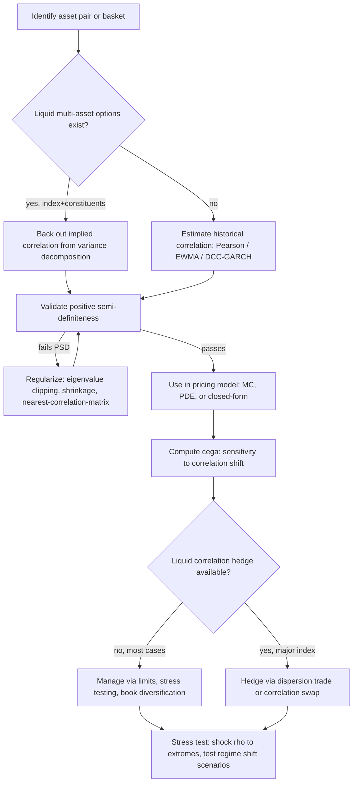

## Correlation Estimation and Correlation Risk

### Overview

Correlation is the dependence parameter connecting single-asset models into a joint multi-asset pricing framework, and it is simultaneously the least directly observable and most consequentially uncertain input in multi-asset derivatives pricing. Unlike volatility, which for liquid single names is directly extractable from listed option prices via inversion of a pricing formula, correlation between two assets has no equally liquid, equally direct market observable in most cases. This chapter covers the estimation methodologies (historical, implied, model-based) and the risk management framework (correlation vega/cega, stress testing, hedging limitations) that together define how multi-asset desks handle this parameter.

### Why Correlation Is Structurally Hard to Observe

**Key Points**

- **Volatility** has a nearly one-to-one mapping to a liquid, continuously quoted market object: invert an observed vanilla option price via Black-Scholes (or a smile-consistent model) to get implied volatility directly from market prices
- **Correlation** generally requires a multi-asset product to be liquidly traded before it can be "implied out," and such products are far rarer and less liquid than single-name vanilla options — index options (which embed an implied correlation via the variance decomposition below) are the major exception, not the rule
- For most asset pairs (e.g., two arbitrary single stocks, or a custom cross-commodity pair), no liquid two-asset option market exists at all, forcing reliance on historical estimation, which carries the standard problems of any backward-looking statistical estimate: parameter instability, regime dependence, and estimation error that grows as the sample window shrinks or the underlying relationship structurally shifts

### Method 1: Historical (Realized) Correlation Estimation

#### Pearson Sample Correlation

The standard estimator uses log-returns over a historical window:

$$\hat\rho_{ij} = \frac{\sum_{t=1}^T (r_{i,t}-\bar r_i)(r_{j,t}-\bar r_j)}{\sqrt{\sum_{t=1}^T(r_{i,t}-\bar r_i)^2}\sqrt{\sum_{t=1}^T(r_{j,t}-\bar r_j)^2}}$$

where $r_{i,t} = \ln(S_i(t)/S_i(t-1))$.

**Key Points**

- The choice of estimation window is a direct bias-variance tradeoff: a short window (e.g., 30-60 days) is more responsive to recent regime shifts but has high sampling noise; a long window (e.g., 2-5 years) is statistically more stable but can badly misrepresent current dependence if the underlying relationship has structurally changed
- Return-sampling frequency matters: correlations estimated from daily returns, weekly returns, and monthly returns on the same asset pair can differ meaningfully, particularly when there is asynchronous trading (different market closes, different liquidity/trading hours) inducing spurious lead-lag effects that distort same-day return correlation — this "non-synchronous trading bias" (related to the Epps effect) tends to bias short-horizon return correlation estimates toward zero relative to the true underlying economic correlation
- Sample correlation is a **backward-looking, real-world (physical measure) estimate**, whereas derivative pricing formally requires a **risk-neutral** correlation parameter; the two need not coincide, and in practice historical correlation is used as an input to a real-world-to-risk-neutral pricing model as a pragmatic approximation, not because it is theoretically justified as the correct risk-neutral parameter [Inference: the size of the resulting pricing bias depends on how large the risk-neutral/real-world correlation wedge actually is for the specific asset pair, which is empirically difficult to observe directly given the scarcity of liquid two-asset correlation markets]

#### Exponentially Weighted Moving Average (EWMA)

To make historical correlation more responsive to recent data while retaining some smoothing, EWMA weights recent observations more heavily:

$$\hat\sigma_{ij,t}^2 = \lambda\,\hat\sigma_{ij,t-1}^2 + (1-\lambda)\,r_{i,t}r_{j,t}$$

with the correlation then computed as $\hat\rho_{ij,t} = \hat\sigma_{ij,t}/\sqrt{\hat\sigma_{ii,t}\hat\sigma_{jj,t}}$. The decay factor $\lambda$ (RiskMetrics historically used $\lambda=0.94$ for daily data) controls the effective memory length of the estimator — smaller $\lambda$ means faster adaptation to new data and shorter effective memory.

#### GARCH-Type Multivariate Models

More sophisticated time-varying correlation models (DCC-GARCH — Dynamic Conditional Correlation, BEKK-GARCH) explicitly model the correlation matrix as evolving stochastically over time, driven by the same volatility clustering dynamics that univariate GARCH models capture for individual variances.

**Key Points**

- DCC-GARCH decomposes the covariance matrix into univariate GARCH volatility estimates combined with a separately-modeled, time-varying correlation matrix, allowing volatility clustering and correlation dynamics to be captured with more parsimony than a full multivariate GARCH specification
- These models are primarily **risk management and forecasting tools** rather than pricing tools per se — they characterize the historical/real-world dynamics and near-term forecast of correlation, useful for VaR calculation and correlation risk limit-setting, but do not directly answer the risk-neutral calibration question that pricing formally requires

### Method 2: Implied Correlation from Index Options

Where an index and its constituents both have liquid listed options, a market-implied correlation can be backed out from the relationship between index variance and the variance of its weighted constituents:

$$\sigma_{\text{index}}^2 = \sum_i w_i^2\sigma_i^2 + \sum_{i\ne j} w_i w_j \rho_{ij}\sigma_i\sigma_j$$

Assuming a single "average" pairwise correlation $\bar\rho$ across all constituent pairs (a simplifying but standard assumption) allows solving for $\bar\rho$ given the observed index implied volatility $\sigma_{\text{index}}$ (from index options, e.g., SPX) and the constituent implied volatilities $\sigma_i$ (from single-stock options):

$$\bar\rho \approx \frac{\sigma_{\text{index}}^2 - \sum_i w_i^2\sigma_i^2}{\sum_{i\ne j}w_iw_j\sigma_i\sigma_j}$$

**Key Points**

- This is the construction underlying tradable **implied correlation indices** (e.g., CBOE's implied correlation indices on the S&P 500), which are among the only directly market-observable, forward-looking correlation measures available in any asset class
- Implied correlation extracted this way is genuinely risk-neutral (unlike historical correlation), since it is backed out from risk-neutral implied volatilities — this makes it the theoretically preferred input where available, though it is only available for index/constituent structures with sufficiently liquid single-name option markets (predominantly major equity indices)
- Implied correlation is empirically observed to trade at a persistent premium to subsequently realized correlation over many historical periods — this "correlation risk premium" is analogous to the well-documented variance risk premium (implied volatility trading above subsequently realized volatility) and is a primary driver of dispersion trading profitability when the strategy is structured to be short implied correlation / long realized correlation exposure [Inference: the premium's magnitude and even its sign in a given period can vary and is not guaranteed to persist, since it reflects a time-varying risk premium rather than a fixed structural constant]
- This single-$\bar\rho$ construction is itself an approximation — it collapses an entire pairwise correlation matrix (potentially hundreds of distinct $\rho_{ij}$ for a broad index) into one average number, discarding all information about correlation dispersion across sector/style clusters within the index

### Method 3: Correlation Swaps and Direct Correlation Products

**Key Points**

- A **correlation swap** pays the difference between realized correlation (computed from the actual historical returns of a specified basket over the swap's life) and a fixed correlation rate agreed at trade inception, providing a direct, model-light way to trade correlation as an asset class
- **Dispersion trades** (long single-stock options / short index options, delta-hedged, in vega-neutral or gamma-weighted ratios) are the dominant practical vehicle for correlation exposure, since correlation swaps themselves are relatively illiquid and concentrated among a small number of specialized dealers — dispersion is, in effect, an indirect way to replicate correlation exposure using more liquid instruments
- The relationship connecting dispersion P&L to the correlation risk premium is not exact — dispersion trades carry residual exposure to individual-name jump risk, single-stock idiosyncratic volatility skew, and rebalancing/hedging slippage that make realized dispersion P&L diverge from a "pure" correlation swap payoff [Unverified: the magnitude of this basis risk is trade-structure- and market-condition-specific and does not have a single universal decomposition formula]

### Correlation Matrix Validity and Construction

#### Positive Semi-Definiteness Requirement

Any correlation matrix used for multi-asset pricing or simulation must be positive semi-definite (PSD) — a mathematical requirement for it to represent a valid covariance structure (equivalently, for the associated Cholesky decomposition used in Monte Carlo simulation to exist).

**Key Points**

- Empirically estimated correlation matrices, especially those assembled piecewise from separately-estimated pairwise correlations (rather than from a single simultaneous multivariate estimation), or estimated over inconsistent time windows per pair, frequently fail to be PSD in practice
- Standard remediation techniques include: **eigenvalue clipping** (set negative/near-zero eigenvalues to a small positive floor, then rescale), **shrinkage** (blend the estimated matrix toward a well-conditioned target matrix, such as a constant-correlation or identity matrix, per Ledoit-Wolf shrinkage methodology), and dedicated **nearest-correlation-matrix algorithms** (Higham's algorithm finds the PSD matrix closest, in Frobenius norm, to a given invalid input matrix)
- For very large baskets/indices, direct full-matrix estimation and validation becomes both statistically noisy (many more parameters than data points can reliably support) and computationally unwieldy; **factor models** are the standard practical remedy

#### Factor Models for Large Correlation Structures

A single-factor (or multi-factor) model expresses each asset's return as:

$$r_i = \beta_i F + \epsilon_i, \quad \text{Cov}(\epsilon_i,\epsilon_j)=0 \text{ for } i\ne j$$

which implies a highly parsimonious, automatically PSD correlation structure:

$$\rho_{ij} = \frac{\beta_i\beta_j\,\text{Var}(F)}{\sigma_i\sigma_j}$$

**Key Points**

- This reduces the number of correlation parameters from $O(n^2)$ pairwise correlations to $O(n)$ factor loadings, dramatically improving statistical estimability for large baskets (e.g., broad equity indices) at the cost of imposing a specific (and potentially overly simplistic) dependence structure
- Multi-factor extensions (e.g., style/sector factors, macro factors) improve fit but reintroduce more parameters and reduce the automatic-PSD-guarantee simplicity of the pure single-factor case if factors themselves are correlated
- Factor models are standard practice for basket/index Monte Carlo simulation specifically because they solve the PSD-validity and estimation-noise problems simultaneously, not merely for computational speed

### Correlation Risk in Pricing and Hedging

#### Correlation Vega (Cega)

**Key Points**

- **Cega** is defined analogously to vega, as the sensitivity of a multi-asset derivative's price to a (typically parallel) shift in the correlation matrix: $\text{Cega} = \partial V/\partial \rho$
- The **sign** of cega is payoff-structure-dependent and is one of the most important qualitative facts in multi-asset derivatives: standard arithmetic basket calls generally have **positive** cega (higher correlation → wider basket-return distribution → higher call value), while exchange options, spread options, and worst-of options generally have **negative** cega (higher correlation → assets move together → the "penalty" of picking the minimum or the spread shrinks)
- Best-of options have a more nuanced correlation sensitivity than worst-of options and basket calls; the relationship can be non-monotonic depending on strike and moneyness, since the max-of-two-assets payoff structure interacts with correlation differently than either the simple sum or the simple minimum [Inference: the precise sign and magnitude of best-of cega for a given strike/moneyness combination is structure-specific and benefits from direct numerical sensitivity computation rather than a general rule]

#### Hedging Limitations

**Key Points**

- Unlike single-asset vega, which can typically be hedged with other single-name vanilla options, correlation exposure (cega) has no equally liquid, directly tradable hedge instrument for the vast majority of asset pairs — implied correlation indices and dispersion trades exist meaningfully only for a handful of major equity indices, leaving most cross-asset and bespoke-basket correlation exposure effectively unhedgeable with market instruments
- As a consequence, correlation risk on most exotics desks is managed primarily through **position limits**, **stress testing** (shocking correlation to extreme values, e.g., $\rho \to 1$ or $\rho \to -1$, to bound worst-case P&L), and **diversification across the book** (offsetting positive-cega and negative-cega positions against each other) rather than through direct market hedging
- Because correlation cannot generally be dynamically hedged the way delta or even vega can be, correlation risk is fundamentally a **buy-and-hold model risk** for most desks — the P&L impact of correlation misestimation is realized gradually over the life of the position rather than being continuously neutralized, making correct initial correlation assumptions and periodic re-marking especially consequential

#### Regime Dependence and Correlation Breakdown

**Key Points**

- Correlation structures are widely observed to shift materially during market stress: equity correlations in particular tend to rise sharply during broad market sell-offs (a phenomenon sometimes summarized as "correlations go to 1 in a crisis"), which is precisely the scenario in which many correlation-dependent structured products (e.g., worst-of autocallables, basket-linked notes) experience their most adverse payoff outcomes simultaneously with the correlation shift itself
- This regime dependence means a single static historical or implied correlation estimate, however carefully constructed, is a simplification of a genuinely time-varying and state-dependent process — stress testing across multiple correlation regimes (not just a parallel shock to a single central estimate) is standard risk management practice specifically to capture this
- Commodity market correlations (e.g., crude-refined product spreads, inter-commodity correlations) are similarly known to be regime-dependent around supply disruptions, geopolitical events, and seasonal demand shifts, though the specific triggers and magnitude of regime shifts differ by commodity complex from the equity-market "correlation goes to 1" pattern [Unverified: commodity-specific correlation regime dynamics require empirical study per commodity pair rather than a single general rule]

### Correlation Estimation Method Comparison

| Method | Data source | Measure | Best suited for | Key limitation |
| --- | --- | --- | --- | --- |
| Historical Pearson | Time series of returns | Real-world (physical) | General estimation when no correlation market exists | Window choice bias-variance tradeoff, non-synchronous trading bias |
| EWMA / DCC-GARCH | Time series of returns | Real-world (physical) | Responsive risk management, VaR, forecasting | Still real-world, not risk-neutral; model-specification risk |
| Implied (index/constituent) | Listed vanilla option IVs | Risk-neutral | Major equity indices with liquid single-name options | Only available for index/constituent structures; single-$\bar\rho$ approximation |
| Correlation swaps / dispersion | Direct market trades | Risk-neutral (swap); proxy (dispersion) | Direct correlation exposure trading/hedging | Illiquid (swaps); basis risk (dispersion) |
| Factor models | Return time series, reduced parameterization | Real-world (typically) | Large baskets/indices, automatic PSD guarantee | Imposes simplified dependence structure |

### Correlation Regime Shift Illustration (svg_diagram)

<svg xmlns="http://www.w3.org/2000/svg" viewBox="0 0 720 280" font-family="Helvetica, Arial, sans-serif">
<text x="360" y="24" text-anchor="middle" font-size="16" font-weight="bold" fill="#1a1a1a">Equity Correlation Regime Shift in Market Stress (svg_diagram)</text>
<line x1="70" y1="230" x2="660" y2="230" stroke="#333" stroke-width="1.5" />
<text x="670" y="234" font-size="12" fill="#333">time</text>
<line x1="70" y1="230" x2="70" y2="50" stroke="#333" stroke-width="1.5" />
<text x="35" y="45" font-size="12" fill="#333">ρ</text>
<text x="30" y="65" font-size="11" fill="#555">1.0</text>
<text x="30" y="150" font-size="11" fill="#555">0.5</text>
<text x="30" y="225" font-size="11" fill="#555">0.0</text>
<line x1="70" y1="150" x2="660" y2="150" stroke="#dcdcdc" stroke-dasharray="3,3" />
<line x1="70" y1="65" x2="660" y2="65" stroke="#dcdcdc" stroke-dasharray="3,3" />

<path d="M 70 165 C 150 175, 250 160, 320 170 C 340 172, 350 175, 360 168" fill="none" stroke="`#2b6cb0`" stroke-width="2.5" />

<path d="M 360 168 C 380 130, 400 80, 440 65 C 480 58, 540 70, 600 80 C 620 84, 640 90, 660 95" fill="none" stroke="`#c0392b`" stroke-width="2.5" />

<rect x="360" y="50" width="140" height="180" fill="#fdeaea" opacity="0.4" />
<text x="430" y="245" text-anchor="middle" font-size="11" fill="#c0392b">Stress event: correlation spikes</text>
<text x="180" y="245" text-anchor="middle" font-size="11" fill="#2b6cb0">Calm regime: moderate, stable ρ</text>

<text x="360" y="270" text-anchor="middle" font-size="12" fill="#555">Static single-ρ calibration understates tail risk for correlation-sensitive structures during stress.</text>

</svg>

### Correlation Vega Sign by Payoff Structure (svg_diagram)

<svg xmlns="http://www.w3.org/2000/svg" viewBox="0 0 720 240" font-family="Helvetica, Arial, sans-serif">
<text x="360" y="24" text-anchor="middle" font-size="16" font-weight="bold" fill="#1a1a1a">Cega Sign by Product Type (svg_diagram)</text>
<rect x="40" y="60" width="180" height="60" rx="6" fill="#eafbea" stroke="#2f8f4e" />
<text x="130" y="85" text-anchor="middle" font-size="12">Basket call</text>
<text x="130" y="102" text-anchor="middle" font-size="12" font-weight="bold" fill="#2f8f4e">Cega +</text>
<rect x="270" y="60" width="180" height="60" rx="6" fill="#fdeaea" stroke="#c0392b" />
<text x="360" y="85" text-anchor="middle" font-size="12">Exchange / spread option</text>
<text x="360" y="102" text-anchor="middle" font-size="12" font-weight="bold" fill="#c0392b">Cega −</text>
<rect x="500" y="60" width="180" height="60" rx="6" fill="#fdeaea" stroke="#c0392b" />
<text x="590" y="85" text-anchor="middle" font-size="12">Worst-of option</text>
<text x="590" y="102" text-anchor="middle" font-size="12" font-weight="bold" fill="#c0392b">Cega −</text>
<rect x="270" y="160" width="180" height="60" rx="6" fill="#fdf3ea" stroke="#c0781b" />
<text x="360" y="185" text-anchor="middle" font-size="12">Best-of option</text>
<text x="360" y="202" text-anchor="middle" font-size="11" fill="#c0781b">Sign depends on strike/moneyness</text>
</svg>

### Correlation Estimation and Risk Pipeline (Mermaid)

### Practical Risk Management Framework

**Key Points**

- A robust correlation risk framework typically combines: (1) a primary estimation methodology appropriate to the asset class and data availability (implied where available, historical otherwise), (2) explicit correlation stress scenarios in daily/periodic risk reporting (not merely a single point estimate), (3) position and cega limits per correlation cluster or asset class, and (4) periodic backtesting of realized correlation against the correlation assumptions used in pricing and marking positions
- Model validation practice generally requires demonstrating sensitivity of reported P&L and risk metrics to the correlation assumption specifically — since correlation cannot be hedged away, understating this sensitivity in risk reporting understates a real and often the dominant source of tail risk in a multi-asset book
- Given the structural scarcity of directly observable correlation markets outside major equity indices, correlation assumptions used for less liquid asset pairs or cross-asset baskets warrant explicit conservatism (e.g., using stressed rather than central historical estimates for less liquid structures), particularly for negative-cega products where correlation risk compounds adverse payoff scenarios during stress

**Next Steps**

- DCC-GARCH and BEKK-GARCH model specification and estimation in depth
- Copula-based dependence modeling as an alternative to linear (Pearson) correlation, capturing tail dependence that linear correlation cannot represent
- Dispersion trading strategy construction: vega-neutral vs. gamma-weighted ratios and their P&L attribution
- Local and stochastic correlation models for smile-consistent multi-asset pricing
- Correlation risk in credit derivatives (CDO tranche pricing, default correlation) as a parallel but distinct correlation risk framework
- Stress testing methodology: historical scenario replay vs. hypothetical correlation shock construction
- Tail dependence measures (Kendall's tau, Spearman's rho, extreme value copulas) as complements to Pearson correlation
- Cross-asset correlation (equity-rates, equity-FX, commodity-equity) and its distinct estimation challenges relative to intra-asset-class correlation