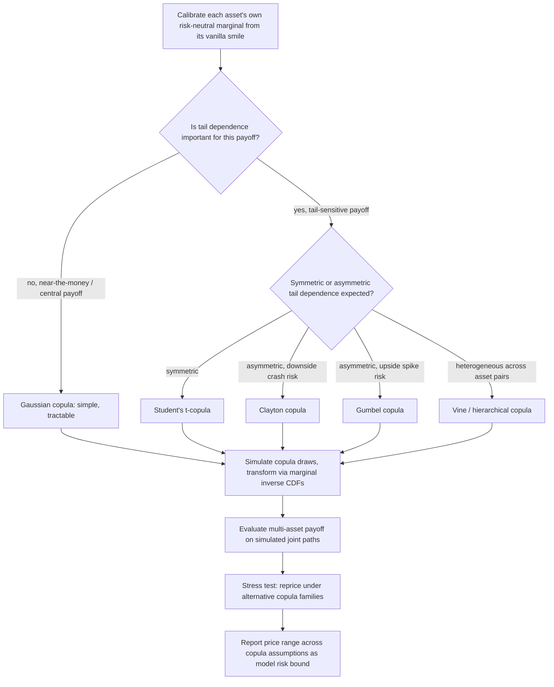

## Copula Methods for Multi Asset Payoffs


### Overview

Copula methods provide a general mathematical framework for constructing joint multivariate distributions by separating the specification of each variable's marginal distribution from the specification of their dependence structure. This separation directly addresses two limitations of the joint-lognormal/linear-correlation framework used in standard basket, spread, and exchange option pricing: (1) linear (Pearson) correlation captures only a single scalar measure of *average* co-movement and cannot represent asymmetric dependence (e.g., assets crashing together more than they rally together) or tail dependence (extreme joint moves being more or less likely than a Gaussian structure implies), and (2) the joint-lognormal assumption forces every marginal to be lognormal, which conflicts with the market-implied skew observed in each individual asset's own vanilla option smile. Copulas let each asset retain its own smile-consistent marginal distribution while flexibly specifying how those marginals are linked.

### Sklar's Theorem and the Copula Definition

Sklar's theorem (1959) is the foundational result: any joint cumulative distribution function $F(x_1,\ldots,x_n)$ can be decomposed as

$$F(x_1,\ldots,x_n) = C\big(F_1(x_1),\ldots,F_n(x_n)\big)$$

where $F_i$ are the marginal CDFs of each variable and $C:[0,1]^n \to [0,1]$ is a copula function — itself a valid joint CDF on uniform $[0,1]$ marginals. If each $F_i$ is continuous, the copula $C$ is unique.

**Key Points**

- This decomposition means the dependence structure ($C$) and the marginal behavior ($F_i$) can be specified **completely independently** — one can attach any copula to any set of marginals and obtain a valid joint distribution
- For derivatives pricing, this directly solves the marginal-consistency problem: each asset's marginal $F_i$ can be calibrated to match its own market-implied risk-neutral distribution (extracted from its vanilla option smile via the Breeden-Litzenberger relationship), while $C$ is calibrated or assumed separately to capture the dependence structure
- The joint-lognormal-with-linear-correlation model used in standard basket/spread pricing is a **special case**: it corresponds to using the **Gaussian copula** together with lognormal marginals — copula methods generalize this by allowing either the copula or the marginals (or both) to be replaced with more flexible alternatives

### Why Linear Correlation Is an Incomplete Dependence Measure

**Key Points**

- Linear correlation $\rho$ is a scalar summary and, by construction, is invariant to only linear (or affine) transformations of the marginals — it does not fully characterize dependence when marginals are non-Gaussian, and in particular tells us nothing directly about **tail dependence** (whether extreme joint outcomes are more or less likely than the "average" dependence level would suggest)
- **Tail dependence coefficients** quantify this directly: the upper tail dependence coefficient $\lambda_U = \lim_{u\to 1^-} P(F_2(X_2) > u \mid F_1(X_1) > u)$ measures the probability of a joint extreme high outcome; $\lambda_L$ is the analogous lower-tail measure. The Gaussian copula has $\lambda_U = \lambda_L = 0$ for any $\rho < 1$ — meaning it structurally assumes joint extreme events become vanishingly unlikely, even under high linear correlation, which conflicts with the empirically well-documented tendency of asset markets to exhibit stronger co-movement precisely during large downside moves
- This zero-tail-dependence property of the Gaussian copula was a well-known and specifically implicated modeling weakness in credit derivatives (CDO tranche pricing via the Gaussian copula) prior to and during the 2008 financial crisis, since Gaussian-copula-based models understated the probability of simultaneous defaults precisely in the tail scenario that materialized — this is one of the most frequently cited real-world illustrations of copula-choice model risk in derivatives markets [Inference: this is a widely-cited historical episode illustrating the general point, not a claim that copula misspecification was the sole or complete cause of the crisis, which involved many compounding factors]

### Common Copula Families

#### Gaussian Copula

$$C_{\text{Gauss}}(u_1,\ldots,u_n;\Sigma) = \Phi_\Sigma\big(\Phi^{-1}(u_1),\ldots,\Phi^{-1}(u_n)\big)$$

where $\Phi_\Sigma$ is the multivariate normal CDF with correlation matrix $\Sigma$, and $\Phi^{-1}$ is the inverse standard normal CDF. This is the copula implicit in standard joint-lognormal derivative pricing models.

**Key Points**

- Zero tail dependence (as above) is its principal limitation
- Simple to simulate: draw correlated multivariate normals (via Cholesky, as in standard basket MC), then transform each component through $\Phi$ to get uniform marginals, then through $F_i^{-1}$ to get the desired marginal distribution — this is the standard **copula simulation recipe** described generally below
- Widely used as a baseline/benchmark case precisely because of its tractability and its equivalence to the standard multi-asset lognormal framework

#### Student's t-Copula

$$C_t(u_1,\ldots,u_n;\Sigma,\nu) = t_{\Sigma,\nu}\big(t_\nu^{-1}(u_1),\ldots,t_\nu^{-1}(u_n)\big)$$

where $t_{\Sigma,\nu}$ is the multivariate Student's t CDF with correlation matrix $\Sigma$ and $\nu$ degrees of freedom.

**Key Points**

- Unlike the Gaussian copula, the t-copula has **positive, symmetric tail dependence** ($\lambda_U = \lambda_L > 0$) that increases as $\nu$ decreases (fewer degrees of freedom → fatter tails → more tail dependence), making it a natural choice when joint extreme moves need to be modeled as more likely than the Gaussian structure implies
- The tail dependence is symmetric between upper and lower tails, which is a limitation when the empirically observed dependence is asymmetric (e.g., stronger co-movement in downside moves than upside moves, as is commonly observed in equity markets)
- Widely used in credit risk and multi-asset equity derivatives specifically as a relatively simple upgrade from the Gaussian copula that directly addresses the zero-tail-dependence weakness while retaining a broadly similar elliptical structure and simulation approach

#### Archimedean Copulas (Clayton, Gumbel, Frank)

Archimedean copulas are constructed from a generator function $\varphi$:

$$C(u_1,\ldots,u_n) = \varphi^{-1}\big(\varphi(u_1)+\cdots+\varphi(u_n)\big)$$

**Key Points**

- **Clayton copula**: $\varphi(u) = u^{-\theta}-1$ (for $\theta>0$) — exhibits **lower tail dependence only** ($\lambda_L>0, \lambda_U=0$), making it suitable for modeling assets more likely to crash together than to rally together, a pattern frequently observed in equity markets
- **Gumbel copula**: $\varphi(u) = (-\ln u)^\theta$ (for $\theta\ge1$) — exhibits **upper tail dependence only** ($\lambda_U>0, \lambda_L=0$), the mirror-image case, relevant for assets more likely to have simultaneous upside spikes (e.g., certain commodity or currency crisis dynamics)
- **Frank copula**: has **zero tail dependence in both tails** but, unlike the Gaussian copula, allows for a more flexible degree of dependence in the body of the distribution and permits negative dependence more naturally in some parameterizations
- Archimedean copulas beyond the bivariate case require care: naive $n$-dimensional extension using a single generator imposes an "exchangeable" structure where all pairs share the same dependence parameter, which is often too restrictive for realistic multi-asset books — **nested** or **hierarchical Archimedean copulas** address this by allowing different generator parameters for different asset clusters (e.g., sector groupings), at the cost of substantially greater specification and calibration complexity

#### Vine Copulas

**Key Points**

- Vine copulas (pair-copula constructions) build a high-dimensional copula from a cascading sequence of bivariate copulas, each potentially from a different family, organized along a tree structure ("vine")
- This offers the greatest flexibility of the standard copula families — different asset pairs can have entirely different dependence structures (e.g., one pair modeled with a Clayton copula for lower tail dependence, another with a Gaussian copula) — but at substantial cost in specification complexity, calibration burden ($O(n^2)$ or more pairwise copula choices and parameters), and computational cost for simulation
- Vine copulas are more commonly encountered in academic and specialized quantitative risk research than in day-to-day multi-asset derivatives pricing desks, where the calibration and computational overhead relative to simpler copula choices (Gaussian, t) is often judged not to be justified by the incremental pricing accuracy for the specific product being priced [Inference: this practical tradeoff assessment varies by institution, product complexity, and the specific tail-risk sensitivity of the book in question]

### Simulating from a Copula for Multi-Asset Option Pricing

**Key Points**

- **Generic recipe**: (1) simulate a vector $(U_1,\ldots,U_n)$ from the chosen copula $C$ — for the Gaussian and t-copulas this means simulating correlated normal or t-distributed variables and transforming through their respective CDFs; for Archimedean copulas, specialized simulation algorithms (e.g., the Marshall-Olkin method) generate the generator-mixing variable and conditional draws; (2) transform each $U_i$ through the desired marginal's inverse CDF, $X_i = F_i^{-1}(U_i)$, to obtain draws with the correct marginal distribution and the copula's dependence structure; (3) evaluate the multi-asset payoff on the resulting $(X_1,\ldots,X_n)$ vectors and average discounted payoffs as in standard Monte Carlo
- The marginal $F_i^{-1}$ used in step 2 can be a **smile-consistent risk-neutral marginal** extracted from the asset's own vanilla option market (via Breeden-Litzenberger differentiation of the observed call price curve with respect to strike, or via a calibrated local/stochastic volatility model's terminal distribution) rather than a simple lognormal — this is precisely the mechanism by which copula methods reconcile individually-smile-consistent single-asset pricing with a jointly consistent multi-asset model
- This approach is computationally more expensive than standard joint-lognormal Monte Carlo (extra transformation steps per path, per asset) but is directly necessary whenever the pricing desk wants both individually smile-consistent marginals and a non-Gaussian dependence structure simultaneously — the joint-lognormal model cannot deliver both

**Example**

```python
import numpy as np
from scipy.stats import norm, t as student_t

def simulate_gaussian_copula(n_assets, corr_matrix, N_paths, seed=3):
    rng = np.random.default_rng(seed)
    L = np.linalg.cholesky(corr_matrix)
    Z = rng.standard_normal((N_paths, n_assets)) @ L.T
    U = norm.cdf(Z)  # uniform marginals with Gaussian copula dependence
    return U

def simulate_t_copula(n_assets, corr_matrix, nu, N_paths, seed=3):
    rng = np.random.default_rng(seed)
    L = np.linalg.cholesky(corr_matrix)
    Z = rng.standard_normal((N_paths, n_assets)) @ L.T
    chi2 = rng.chisquare(nu, N_paths)
    Y = Z / np.sqrt(chi2 / nu)[:, None]   # multivariate t draws
    U = student_t.cdf(Y, df=nu)
    return U

def apply_marginals(U, marginal_inv_cdfs):
    """
    marginal_inv_cdfs: list of callables, one per asset,
    each the inverse CDF of that asset's calibrated risk-neutral terminal distribution.
    """
    n_assets = U.shape[1]
    X = np.column_stack([marginal_inv_cdfs[i](U[:, i]) for i in range(n_assets)])
    return X
```

### Calibration of Copula Parameters

**Key Points**

- **Method of moments via rank correlation**: Kendall's tau ($\tau$) and Spearman's rho ($\rho_S$) are rank-based dependence measures that, unlike Pearson correlation, are invariant under any monotonic transformation of the marginals — for several copula families there exist closed-form relationships between $\tau$ or $\rho_S$ and the copula's dependence parameter (e.g., for the Gaussian copula, $\tau = \frac{2}{\pi}\arcsin(\rho)$), allowing quick parameter estimation from historical rank correlations without needing to jointly estimate marginals and copula simultaneously
- **Maximum likelihood (full or two-stage/IFM)**: full maximum likelihood jointly estimates marginal and copula parameters; the more common **Inference Functions for Margins (IFM)** two-stage approach first estimates each marginal separately, then estimates copula parameters conditional on the fitted marginals — computationally more tractable and standard practice for higher-dimensional problems
- **Calibration to option prices** (where a liquid multi-asset market exists, e.g., a small number of listed spread or basket options) allows extracting a genuinely risk-neutral copula parameter analogous to implied correlation extraction — but this is only feasible when such liquid multi-asset instruments exist, which remains the exception rather than the rule outside major index/constituent structures
- In practice, absent a liquid risk-neutral calibration target, copula parameters (like linear correlation in the standard model) are frequently estimated from historical data under the real-world measure and used as a pragmatic proxy for the risk-neutral parameter, carrying the same theoretical caveat noted for historical correlation estimation generally

### Copula Choice and Correlation Risk Interaction

**Key Points**

- Copula choice materially changes a multi-asset derivative's price even when the *linear correlation* implied by the copula is held constant — because tail dependence, not just average co-movement, directly affects payoffs that are sensitive to joint extreme outcomes (deep out-of-the-money basket options, worst-of options with far-out strikes, knock-in barrier baskets)
- For products whose payoff is dominated by central/typical outcomes (near-the-money basket or spread options), copula choice tends to matter less, since the bulk of the probability mass where the payoff is most sensitive is less affected by tail behavior differences between copula families [Inference: this "matters less" characterization is a general tendency rather than a precise universal statement, and the actual sensitivity should be checked numerically for any specific product and strike]
- Because copula choice is itself a **model risk** dimension (an additional degree of freedom beyond correlation level alone), robust multi-asset risk management practice includes stress-testing not just correlation *level* but copula *family* — repricing worst-of, deep-tail, or credit-correlation-sensitive products under alternative copula assumptions (e.g., Gaussian vs. t vs. Clayton) to bound the model risk associated with dependence structure misspecification, not merely correlation-level misspecification

### Copula Family Comparison

| Copula | Tail dependence | Symmetry | Simulation complexity | Typical use case |
| --- | --- | --- | --- | --- |
| Gaussian | None ($\lambda_U=\lambda_L=0$) | Symmetric | Low (standard Cholesky + CDF transform) | Baseline/benchmark, standard basket pricing |
| Student's t | Symmetric, positive ($\lambda_U=\lambda_L>0$) | Symmetric | Low-moderate (adds chi-square mixing) | General upgrade for joint tail-risk sensitivity |
| Clayton | Lower tail only ($\lambda_L>0$) | Asymmetric | Moderate (generator-based simulation) | Downside co-crash modeling (equities) |
| Gumbel | Upper tail only ($\lambda_U>0$) | Asymmetric | Moderate | Joint upside spike modeling |
| Frank | None | Symmetric, flexible body | Moderate | Flexible central dependence, weak tail assumptions |
| Vine (pair-copula) | Fully flexible per pair | Fully flexible | High | Bespoke, research-grade dependence modeling |

### Sklar's Theorem Decomposition (svg_diagram)

<svg xmlns="http://www.w3.org/2000/svg" viewBox="0 0 740 260" font-family="Helvetica, Arial, sans-serif">
<text x="370" y="24" text-anchor="middle" font-size="16" font-weight="bold" fill="#1a1a1a">Sklar's Theorem: Separating Marginals from Dependence (svg_diagram)</text>
<rect x="30" y="70" width="220" height="70" rx="6" fill="#eaf2fb" stroke="#2b6cb0" />
<text x="140" y="98" text-anchor="middle" font-size="12">Joint distribution</text>
<text x="140" y="115" text-anchor="middle" font-size="12">F(x1,...,xn)</text>

<text x="290" y="110" text-anchor="middle" font-size="20" fill="#333">=</text>

<rect x="330" y="70" width="180" height="70" rx="6" fill="#fdf3ea" stroke="#c0781b" />
<text x="420" y="98" text-anchor="middle" font-size="12">Copula C</text>
<text x="420" y="115" text-anchor="middle" font-size="12">(dependence structure)</text>

<text x="530" y="110" text-anchor="middle" font-size="20" fill="#333">∘</text>

<rect x="560" y="70" width="150" height="70" rx="6" fill="#eafbea" stroke="#2f8f4e" />
<text x="635" y="98" text-anchor="middle" font-size="12">Marginals F_i(x_i)</text>
<text x="635" y="115" text-anchor="middle" font-size="11">(each asset's own</text>
<text x="635" y="128" text-anchor="middle" font-size="11">smile-consistent CDF)</text>

<text x="370" y="185" text-anchor="middle" font-size="12" fill="#555">Calibrate each F_i to its own vanilla option smile independently of the dependence choice C.</text>

<text x="370" y="205" text-anchor="middle" font-size="12" fill="#555">Choose C (Gaussian, t, Clayton, Gumbel, vine) to match desired tail dependence behavior.</text>

<text x="370" y="225" text-anchor="middle" font-size="12" fill="#555">Joint-lognormal basket model = Gaussian copula + lognormal marginals (a special case).</text>

</svg>

### Tail Dependence Comparison (svg_diagram)

<svg xmlns="http://www.w3.org/2000/svg" viewBox="0 0 720 280" font-family="Helvetica, Arial, sans-serif">
<text x="360" y="24" text-anchor="middle" font-size="16" font-weight="bold" fill="#1a1a1a">Tail Dependence by Copula Family (svg_diagram)</text>
<line x1="100" y1="230" x2="620" y2="230" stroke="#333" stroke-width="1.5" />
<line x1="100" y1="230" x2="100" y2="50" stroke="#333" stroke-width="1.5" />
<text x="360" y="255" text-anchor="middle" font-size="12" fill="#333">Asset 1 return</text>
<text x="55" y="140" text-anchor="middle" font-size="12" fill="#333" transform="rotate(-90 55 140)">Asset 2 return</text>
<g opacity="0.55">
<circle cx="200" cy="180" r="2" fill="#2b6cb0" />
<circle cx="220" cy="160" r="2" fill="#2b6cb0" />
<circle cx="240" cy="150" r="2" fill="#2b6cb0" />
<circle cx="260" cy="130" r="2" fill="#2b6cb0" />
<circle cx="280" cy="140" r="2" fill="#2b6cb0" />
<circle cx="300" cy="120" r="2" fill="#2b6cb0" />
<circle cx="320" cy="110" r="2" fill="#2b6cb0" />
<circle cx="340" cy="100" r="2" fill="#2b6cb0" />
<circle cx="360" cy="90" r="2" fill="#2b6cb0" />
<circle cx="380" cy="95" r="2" fill="#2b6cb0" />
<circle cx="150" cy="200" r="2" fill="#2b6cb0" />
<circle cx="430" cy="75" r="2" fill="#2b6cb0" />
</g>
<text x="430" y="70" font-size="11" fill="#2b6cb0">Gaussian: thins out at extremes</text>
<g opacity="0.7">
<circle cx="120" cy="215" r="2.5" fill="#c0392b" />
<circle cx="110" cy="220" r="2.5" fill="#c0392b" />
<circle cx="105" cy="222" r="2.5" fill="#c0392b" />
<circle cx="100" cy="225" r="2.5" fill="#c0392b" />
<circle cx="95" cy="228" r="2.5" fill="#c0392b" />
<circle cx="90" cy="230" r="2.5" fill="#c0392b" />
</g>
<text x="130" y="215" font-size="11" fill="#c0392b">Clayton: clustered lower-tail crashes</text>

<text x="360" y="275" text-anchor="middle" font-size="12" fill="#555">Clayton copula keeps joint extreme downside points clustered where Gaussian dependence would have thinned out.</text>

</svg>

### Copula Selection and Pricing Workflow (Mermaid)



### Practical Adoption Considerations

**Key Points**

- Full copula-based pricing frameworks are more commonly deployed for **model risk quantification and stress testing** (bounding the price sensitivity to dependence-structure assumptions) than as the primary day-to-day pricing engine for vanilla basket/spread desks, where the simpler Gaussian-copula-equivalent joint-lognormal model with a single correlation parameter remains the operational default for most liquid, near-the-money products
- Copula methods become operationally central specifically for structured credit (CDO/basket default correlation), tail-risk-sensitive equity structures (deep out-of-the-money worst-of autocallables, knock-in baskets), and any product where regulatory or internal model validation explicitly requires demonstrating robustness to dependence-structure misspecification
- Computational cost is a real practical constraint: copula-based Monte Carlo requires an additional marginal-transformation step per asset per path relative to standard joint-lognormal simulation, and higher-dimensional or non-elliptical copulas (vine, nested Archimedean) can meaningfully increase simulation runtime for large baskets — a factor that must be weighed against the incremental pricing/risk accuracy for the specific product and desk mandate

**Next Steps**

- Breeden-Litzenberger extraction of risk-neutral marginal distributions from the vanilla option smile
- CDO tranche pricing and the historical role of the Gaussian copula in credit correlation modeling
- Kendall's tau and Spearman's rho: full derivation and their relationships to specific copula parameter families
- Vine copula (pair-copula construction) methodology in depth: C-vines, D-vines, and tree selection algorithms
- Local and stochastic correlation models as an alternative dependence-modeling paradigm to copulas
- Model risk quantification frameworks: systematic stress testing across copula family, correlation level, and marginal specification jointly
- Nested/hierarchical Archimedean copulas for sector- or cluster-structured multi-asset books
- Copula-based risk aggregation methodology beyond derivatives pricing (portfolio VaR, economic capital)