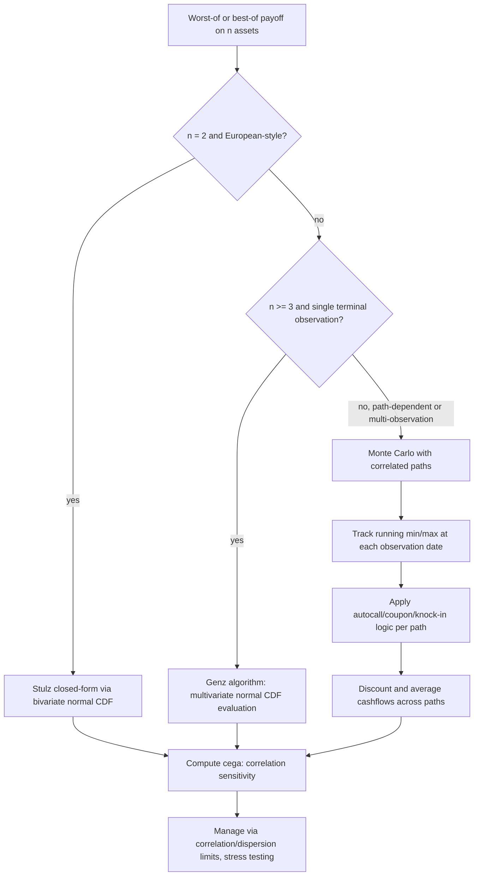

## Worst Of and Best Of Basket Structures

### Overview

Worst-of and best-of basket structures are multi-asset derivatives whose payoff depends on order statistics of a group of underlyings — the minimum-performing or maximum-performing asset in a basket — rather than a linear combination (as in arithmetic basket options) or a difference (as in spread options). This structural distinction places them in a separate pricing and risk regime: they are the primary vehicle by which correlation risk is packaged into retail and institutional structured products, and they exhibit correlation sensitivity that runs in the opposite direction from standard basket options. Worst-of structures are ubiquitous in structured note markets (autocallables, reverse convertibles), while best-of structures appear in principal-protected and rainbow-option-style products.

### Payoff Structures

**Key Points**

- **Worst-of call**: $\left(\min_i \frac{S_i(T)}{S_i(0)} - K\right)^+$ — payoff tied to the weakest-performing asset's return
- **Worst-of put** (common in structured notes as a downside trigger): $\left(K - \min_i \frac{S_i(T)}{S_i(0)}\right)^+$
- **Best-of call**: $\left(\max_i \frac{S_i(T)}{S_i(0)} - K\right)^+$ — payoff tied to the best-performing asset's return
- **Worst-of autocallable** (the dominant structured-note application): pays a fixed coupon at each observation date if all basket constituents are above a barrier, and automatically redeems (calls) early if all constituents are above an autocall trigger; at maturity, if never called and the worst performer has breached a downside knock-in barrier, principal is reduced according to the worst performer's return — this embeds a worst-of down-and-in put alongside the coupon/autocall mechanics
- **Rainbow option** ($k$-th best of $n$): generalizes best-of/worst-of to payoffs on the $k$-th ranked performer, e.g., second-best-of-three — used less frequently but structurally part of the same order-statistics family
- **Everest / Altiplano notes**: variants where the worst-of feature determines a final redemption level or a knock-in trigger over a multi-year horizon, common in long-dated structured products

### Correlation Sensitivity: The Central Distinguishing Feature

**Key Points**

- A **worst-of call's value decreases as correlation increases**: when constituent assets are highly correlated, they move together, so the minimum-performing asset tends to be close to the average performer — the "penalty" of selecting the worst of several assets shrinks toward zero as correlation approaches 1 (in the limit $\rho=1$, all assets move identically and the worst-of payoff collapses to a single-asset payoff). As correlation falls, dispersion among the constituents increases the *expected shortfall* of the minimum relative to the average, making the worst-of payoff systematically lower and — for a worst-of put/downside-trigger structure — the risk of breach systematically higher
- A **worst-of put** (or a downside knock-in embedded in an autocallable) therefore **increases in value (becomes more expensive/risky to the note issuer, more valuable to the holder of the embedded short-put risk) as correlation decreases** — lower correlation increases the probability that at least one constituent underperforms badly, even if the basket average is stable
- This is the **opposite sign** from a standard arithmetic basket call, whose value **increases with correlation** (higher correlation widens the basket-level return distribution, increasing the value of optionality on the sum)
- A **best-of call's value increases as correlation decreases**, by the mirror-image argument: lower correlation increases dispersion, which increases the expected value of the *maximum* performer, raising the best-of call's value; as correlation rises toward 1, the maximum converges toward the common single-asset outcome and the "upside from diversification of outcomes" the best-of structure is designed to capture shrinks
- This directional relationship makes worst-of and best-of structures the primary instruments through which correlation exposure is deliberately packaged and sold/bought in structured products — an issuer selling a worst-of autocallable to a client is, from a risk perspective, effectively short correlation (benefiting if realized correlation turns out higher than priced) and short dispersion/volatility of the individual constituents

### Pricing Methodology

#### Closed-Form: Stulz's Formula (Two Assets)

For exactly two assets, options on the maximum or minimum of two correlated lognormal assets have an exact closed-form solution (Stulz, 1982) using the bivariate normal cumulative distribution function $M(\cdot,\cdot;\rho)$:

$$C_{\max} = S_1e^{-q_1T}M(d_1, d_1';\,\rho_1) + S_2e^{-q_2T}M(d_2,d_2';\,\rho_2) - Ke^{-rT}\left[1-M(-d_1'',-d_2'';\,\rho)\right]$$

where each $d_i$, $d_i'$ term follows the standard Black-Scholes-type structure adjusted for the bivariate correlation, and $M(a,b;\rho) = P(X\le a, Y\le b)$ for standard bivariate normal $(X,Y)$ with correlation $\rho$. An analogous formula, related via put-call-type parity identities specific to rainbow options, gives the option on the minimum of two assets.

**Key Points**

- Requires evaluating the bivariate normal CDF, which itself has no elementary closed form but is efficiently computable via well-established numerical integration or rational approximation methods, making this "closed-form up to a standard special function," analogous to how Black-Scholes itself requires the univariate normal CDF
- Exact under joint GBM for exactly two assets — this is the natural benchmark case for validating any numerical (Monte Carlo) implementation of worst-of/best-of pricing before extending to $n\ge3$
- The correlation sensitivity described above falls directly out of this formula: differentiating with respect to $\rho$ confirms the sign relationships (best-of decreasing, worst-of increasing in value as $\rho$ falls) rigorously rather than merely intuitively

#### Numerical Extension: Genz's Algorithm for $n \geq 3$

For three or more assets, the exact closed-form analog requires evaluating an $n$-dimensional multivariate normal CDF, which has no simple closed form. **Genz's algorithm** (and related quasi-Monte Carlo-based multivariate normal probability estimators) provides an efficient numerical method for evaluating these integrals to high precision, transforming the problem into a numerically tractable (if not exactly closed-form) one.

**Key Points**

- Genz-type methods remain substantially faster than full Monte Carlo simulation of the underlying asset paths when only the terminal multivariate normal probability is needed (i.e., for European-style worst-of/best-of payoffs under a joint-lognormal assumption), since they directly target the specific integral needed rather than simulating full paths
- These methods lose their efficiency advantage once path-dependent features are added (e.g., worst-of autocallables with multiple observation dates, discrete barrier monitoring, or American-style early redemption features) — the multivariate normal CDF approach applies cleanly only to the single-date terminal payoff case
- For the multi-observation-date structures that dominate real-world worst-of note issuance (autocallables observed quarterly or semi-annually over multiple years), Monte Carlo becomes the standard and often only practical approach

#### Monte Carlo Simulation

Given the path-dependent, multi-observation-date nature of most real-world worst-of structures (autocallables in particular), Monte Carlo with correlated asset paths is the dominant practical pricing method.

**Example**

```python
import numpy as np

def mc_worstof_autocallable(S0, weights_na, sigma, corr, r, q,
                              obs_times, autocall_barrier, coupon_barrier,
                              coupon, knock_in_barrier, notional, N_paths, seed=21):
    """
    Simplified worst-of autocallable pricer.
    S0, sigma, q: arrays of length n (per-asset spot, vol, dividend yield)
    corr: n x n correlation matrix
    obs_times: array of observation dates (years from now)
    autocall_barrier, coupon_barrier, knock_in_barrier: fractions of S0 (e.g., 1.0, 0.7, 0.6)
    """
    n = len(S0)
    rng = np.random.default_rng(seed)
    L = np.linalg.cholesky(sigma[:, None] * sigma[None, :] * corr)

    n_obs = len(obs_times)
    dt = np.diff(np.concatenate([[0], obs_times]))

    S = np.tile(S0, (N_paths, 1)).astype(float)
    alive = np.ones(N_paths, dtype=bool)
    pv_cashflows = np.zeros(N_paths)
    called = np.zeros(N_paths, dtype=bool)

    for k in range(n_obs):
        Z = rng.standard_normal((N_paths, n)) @ L.T
        drift = (r - q - 0.5 * sigma**2) * dt[k]
        S = S * np.exp(drift + np.sqrt(dt[k]) * Z)

        worst_perf = np.min(S / S0, axis=1)

        # Coupon payment if worst performer above coupon barrier and still alive
        pays_coupon = alive & (worst_perf >= coupon_barrier)
        pv_cashflows[pays_coupon] += coupon * notional * np.exp(-r * obs_times[k])

        # Autocall trigger
        triggers_call = alive & (worst_perf >= autocall_barrier)
        pv_cashflows[triggers_call] += notional * np.exp(-r * obs_times[k])
        alive[triggers_call] = False
        called[triggers_call] = True

    # Maturity redemption for paths never called
    still_alive = alive
    worst_perf_final = np.min(S / S0, axis=1)
    knocked_in = worst_perf_final < knock_in_barrier

    redemption = np.where(
        knocked_in[still_alive],
        notional * worst_perf_final[still_alive],   # principal reduced to worst performer
        notional                                      # full principal if no knock-in
    )
    pv_cashflows[still_alive] += redemption * np.exp(-r * obs_times[-1])

    price = pv_cashflows.mean()
    stderr = pv_cashflows.std(ddof=1) / np.sqrt(N_paths)
    return price, stderr
```

**Key Points**

- Correlated path simulation follows the standard Cholesky-based approach used for baskets and spreads, but the payoff logic tracks the running minimum (or maximum) across constituents at every observation date, not just at maturity — path dependence here compounds with the order-statistics structure
- Control variates for worst-of/best-of options are less straightforward than the geometric-basket control used for arithmetic baskets, since there is no equally tractable "nearby" closed-form instrument for the general $n$-asset case beyond the Stulz two-asset formula; **importance sampling** on the correlation/dispersion structure (oversampling scenarios where the worst performer diverges significantly) is a more commonly used variance reduction technique for deep knock-in worst-of structures
- Discrete monitoring bias (analogous to the discrete-vs-continuous barrier issue in single-asset barrier options) applies directly here: worst-of knock-in features monitored only at discrete observation dates will understate the true breach probability relative to continuous monitoring, and Brownian-bridge-style corrections can, in principle, be extended to the multi-asset worst-of setting, though this is considerably more complex than the single-asset case

### Vega and Cross-Gamma Structure

**Key Points**

- Worst-of options have a **complex, state-dependent vega profile** across constituents: the vega with respect to any single constituent's volatility depends heavily on which asset is currently closest to being the worst performer — vega is concentrated on whichever asset is most likely to determine the minimum, and this can shift dramatically as relative asset prices move over the life of the trade
- **Cross-gamma** effects (sensitivity of one asset's delta to another asset's price move) are pronounced in worst-of structures specifically because the "worst performer" identity can flip between constituents as prices evolve — a small relative price move can cause a discontinuous-feeling shift in which asset's Greeks dominate the position's risk profile, even though the underlying payoff function is itself continuous
- **Cega** (correlation vega) for worst-of/best-of structures is typically the largest single risk factor relative to the size of any individual constituent's vega, precisely because the entire economic rationale of the worst-of/best-of structure is a bet on dispersion (equivalently, on correlation) rather than on any single asset's direction — risk management of worst-of trading books is therefore organized primarily around correlation and dispersion risk limits rather than single-name delta/vega limits alone
- Autocallable structures add further complexity: the embedded autocall feature creates a form of **negative gamma near the autocall barrier** (small moves around the trigger level can cause discontinuous changes in expected cash flows, since crossing the barrier removes all future coupon/redemption optionality), compounding the cross-gamma effects from the worst-of feature itself

### Structured Note Context: Autocallables in Practice

**Key Points**

- Worst-of autocallables are among the most commonly issued structured retail products globally, packaging an enhanced coupon (relative to a comparable bond or deposit) in exchange for the investor implicitly selling a worst-of down-and-in put — the enhanced yield compensates for bearing the tail risk that the worst-performing constituent breaches the knock-in barrier at maturity
- From the issuing bank's perspective, hedging a book of worst-of autocallables requires managing not just delta/vega across all referenced constituents but the aggregate correlation and dispersion exposure across the entire book, since individual notes' correlation exposures do not net cleanly against each other unless the underlying baskets overlap significantly
- The autocall feature's early-redemption possibility means the **expected life of the note is itself uncertain and correlation-and-volatility-dependent** — higher volatility and lower correlation both increase the probability the worst performer breaches barriers (either the autocall barrier upward or the knock-in barrier downward), directly linking the market-risk parameters to duration/reinvestment risk on the issuer's book
- Regulatory and suitability scrutiny of these products in various jurisdictions has focused specifically on whether retail investors adequately understand the worst-of (rather than average-of or best-of) structure and its correlation sensitivity, since the tail-risk profile of a worst-of note is markedly different from — and generally more adverse in stress scenarios — than a similarly-coupon-branded product referencing a single index [Inference: specific regulatory conclusions and requirements vary by jurisdiction and time period and should be verified against current local regulatory guidance rather than treated as a fixed universal standard]

### Method Comparison Summary

| Method | Best suited for | Weakness | Dimensionality/feature limit |
| --- | --- | --- | --- |
| Stulz closed-form | Exact 2-asset best-of/worst-of, European-style | Only exact for $n=2$ | $n=2$ only |
| Genz multivariate normal | Fast, precise $n\ge3$ terminal (European) payoffs | Loses efficiency once path-dependent features are added | Effective for European/terminal payoffs only |
| Monte Carlo | Autocallables, multi-observation-date structures, general $n$ | Slower convergence, harder variance reduction than basket case | Handles arbitrary $n$ and path features |

### Correlation Sensitivity: Worst-Of vs. Best-Of vs. Basket (svg_diagram)

<svg xmlns="http://www.w3.org/2000/svg" viewBox="0 0 740 320" font-family="Helvetica, Arial, sans-serif">
<text x="370" y="24" text-anchor="middle" font-size="16" font-weight="bold" fill="#1a1a1a">Value vs. Correlation Across Structure Types (svg_diagram)</text>
<line x1="90" y1="270" x2="660" y2="270" stroke="#333" stroke-width="1.5" />
<text x="670" y="274" font-size="12" fill="#333">ρ</text>
<line x1="90" y1="270" x2="90" y2="50" stroke="#333" stroke-width="1.5" />
<text x="60" y="45" font-size="12" fill="#333">Value</text>

<text x="100" y="285" font-size="11" fill="#555">ρ = -1</text>

<text x="365" y="285" font-size="11" fill="#555">ρ = 0</text>

<text x="630" y="285" font-size="11" fill="#555">ρ = +1</text>

<path d="M 90 220 C 250 210, 450 150, 650 110" fill="none" stroke="#2b6cb0" stroke-width="2.5" />
<text x="470" y="145" font-size="12" fill="#2b6cb0" font-weight="bold">Basket call (value ↑ with ρ)</text>
<path d="M 90 90 C 250 150, 450 210, 650 245" fill="none" stroke="#c0392b" stroke-width="2.5" />
<text x="440" y="225" font-size="12" fill="#c0392b" font-weight="bold">Worst-of call (value ↓ with ρ)</text>
<path d="M 90 70 C 250 120, 450 190, 650 235" fill="none" stroke="#c0781b" stroke-width="2.5" stroke-dasharray="6,3" />
<text x="150" y="65" font-size="12" fill="#c0781b" font-weight="bold">Best-of call (value ↓ with ρ, steeper at low ρ)</text>

<text x="370" y="308" text-anchor="middle" font-size="12" fill="#555">Best-of and worst-of share the same qualitative direction; magnitude and curvature differ by structure and strike.</text>

</svg>

### Worst-Performer Identity Shift Illustration (svg_diagram)

<svg xmlns="http://www.w3.org/2000/svg" viewBox="0 0 720 260" font-family="Helvetica, Arial, sans-serif">
<text x="360" y="24" text-anchor="middle" font-size="16" font-weight="bold" fill="#1a1a1a">Which Asset Determines the Worst-Of Payoff Can Flip (svg_diagram)</text>
<line x1="70" y1="220" x2="650" y2="220" stroke="#333" stroke-width="1.5" />
<text x="660" y="224" font-size="12" fill="#333">time</text>
<line x1="70" y1="220" x2="70" y2="50" stroke="#333" stroke-width="1.5" />
<text x="35" y="45" font-size="12" fill="#333">Return</text>
<path d="M 70 140 C 200 120, 350 160, 500 100 C 550 85, 600 90, 650 95" fill="none" stroke="#2b6cb0" stroke-width="2.5" />
<text x="200" y="108" font-size="11" fill="#2b6cb0">Asset A</text>
<path d="M 70 150 C 200 170, 350 110, 500 155 C 550 165, 600 150, 650 140" fill="none" stroke="#c0392b" stroke-width="2.5" />
<text x="380" y="180" font-size="11" fill="#c0392b">Asset B</text>
<path d="M 70 160 C 200 145, 350 175, 500 175 C 550 178, 600 175, 650 178" fill="none" stroke="#2f8f4e" stroke-width="2.5" />
<text x="480" y="195" font-size="11" fill="#2f8f4e">Asset C</text>
<circle cx="350" cy="175" r="4" fill="#000" />
<text x="360" y="200" font-size="10" fill="#000">worst = C</text>
<circle cx="500" cy="175" r="4" fill="#000" />
<text x="500" y="200" font-size="10" fill="#000">worst still C</text>
<circle cx="200" cy="170" r="4" fill="#000" />
<text x="150" y="200" font-size="10" fill="#000">worst = B</text>

<text x="360" y="245" text-anchor="middle" font-size="12" fill="#555">Vega and delta concentrate on whichever asset is currently determining the minimum — this identity shifts over the trade's life.</text>

</svg>

### Worst-Of / Best-Of Pricing Decision Flow (Mermaid)



### Risk Management Synthesis

**Key Points**

- The single most important qualitative fact to carry forward from this structure family is the **inverted correlation sensitivity relative to standard baskets**: worst-of and best-of options move in the opposite direction to arithmetic basket options as correlation changes, and any risk system or trader intuition trained primarily on basket products must explicitly account for this sign flip when moving to worst-of/best-of books
- Because these structures are simultaneously among the most commonly issued retail products and among the hardest to hedge (correlation risk lacking liquid direct hedges outside major indices), they represent a persistent source of warehoused correlation/dispersion risk on issuing banks' books, managed primarily through position limits, stress testing across correlation and copula assumptions, and partial offsetting across the book rather than through instrument-level hedging
- Model validation for worst-of/best-of pricing should always include a two-asset Stulz-formula cross-check for any new Monte Carlo implementation, given the closed-form availability at $n=2$ — this is the most direct and reliable way to catch implementation errors before extending to higher-dimensional or path-dependent (autocallable) structures

**Next Steps**

- Autocallable structuring mechanics in full depth: coupon barriers, memory coupons, and knock-in observation conventions
- Dispersion trading as the practical hedge/offset mechanism for worst-of/best-of correlation exposure
- Copula-based stress testing of worst-of tail risk (linking to non-Gaussian dependence structures)
- Genz's algorithm implementation details and quasi-Monte Carlo methods for multivariate normal probabilities
- American-style and callable features layered onto worst-of/best-of structures beyond the standard autocall mechanism
- Regulatory treatment and suitability frameworks for retail-distributed worst-of structured notes
- Local/stochastic volatility extensions for worst-of pricing beyond the joint-lognormal assumption
- Rainbow options and $k$-th-best-of-$n$ generalizations of the worst-of/best-of family