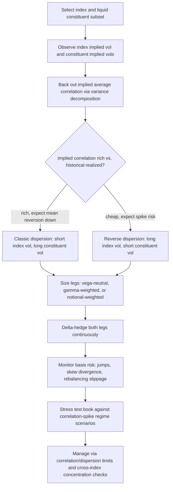

## Dispersion Trading Strategies

### Overview

Dispersion trading is a relative-value strategy that takes a position on the spread between index-level implied volatility and the weighted-average implied volatility of the index's individual constituents. Because index variance decomposes into a weighted sum of constituent variances plus a correlation-weighted cross term, a position that is long constituent volatility and short index volatility (or vice versa) is, to a close approximation, a direct trade on realized versus implied correlation. Dispersion trading is the primary practical mechanism by which correlation risk is traded in liquid markets, since correlation swaps themselves remain comparatively illiquid and concentrated among a small number of specialized dealers.

### The Variance Decomposition Foundation

For an index composed of $n$ constituents with weights $w_i$, index variance relates to constituent variances and pairwise correlations as:

$$\sigma_{\text{index}}^2 = \sum_{i=1}^n w_i^2\sigma_i^2 + \sum_{i\ne j} w_iw_j\,\rho_{ij}\,\sigma_i\sigma_j$$

Assuming a single average pairwise correlation $\bar\rho$ (the standard simplifying convention), this rearranges to:

$$\bar\rho \approx \frac{\sigma_{\text{index}}^2 - \sum_i w_i^2\sigma_i^2}{\sum_{i\ne j}w_iw_j\sigma_i\sigma_j}$$

**Key Points**

- This identity is the entire conceptual basis for dispersion trading: holding constituent volatilities fixed, index volatility is monotonically increasing in average correlation $\bar\rho$ — higher correlation means constituents move together, amplifying the index-level variance; lower correlation means idiosyncratic constituent moves partially cancel out at the index level, dampening index variance relative to the naive weighted sum of constituent variances
- A dispersion trade is therefore, in principle, a way to isolate and trade $\bar\rho$ directly, using only single-stock and index option markets — both of which are far more liquid than any direct correlation product for all but a handful of major indices
- The relationship is only approximate in practice because it collapses an entire pairwise correlation matrix into a single scalar $\bar\rho$, discards higher-order effects (skew correlation, correlation term structure), and assumes the simple variance decomposition holds exactly at all strikes and maturities, which real markets do not guarantee

### Standard Trade Construction

#### Classic Dispersion: Short Index Volatility, Long Constituent Volatility

**Key Points**

- The canonical dispersion trade **sells index-level options (or variance swaps)** and **buys a basket of single-stock options (or variance swaps)** on the index constituents, typically delta-hedged on both legs to isolate the volatility/correlation exposure from directional exposure
- This position benefits when **realized correlation comes in lower than the correlation implied by the relative pricing of index vs. constituent options at trade inception** — if constituents move more idiosyncratically than the market priced in, the long single-stock volatility leg outperforms the short index volatility leg
- This structure reflects the empirically documented tendency for **implied correlation to trade at a premium to subsequently realized correlation** over many historical periods (analogous to the well-known variance risk premium for volatility) — a short-correlation dispersion trade is designed to systematically harvest this premium, though the premium's size and even sign in any specific period are not guaranteed and can reverse, particularly around correlation-spiking market stress events [Inference: the premium's persistence and magnitude reflect a time-varying risk premium rather than a fixed structural constant, and historical average behavior is not a guarantee of any specific period's outcome]

#### Reverse Dispersion: Long Index Volatility, Short Constituent Volatility

**Key Points**

- The mirror-image trade — long index options/variance, short single-stock options/variance — profits when realized correlation comes in **higher** than priced, which tends to occur specifically during broad market stress events when "correlations go to 1"
- Reverse dispersion is therefore sometimes used as an explicit tail-risk hedge or crisis-scenario position, since it is structured to gain precisely when correlation spikes during systemic stress — the scenario in which the classic short-correlation dispersion trade suffers its worst losses
- This makes the two trade directions natural complements from a portfolio-construction perspective: a dispersion book run purely in the classic direction carries concentrated tail exposure to correlation spikes, and reverse dispersion positions (or explicit correlation swaps in the opposite direction) are one way desks manage that concentration

### Weighting Methodologies

#### Vega-Neutral Weighting

Single-stock option notionals are sized so the aggregate vega of the constituent leg offsets the vega of the index leg at trade inception:

$$\sum_i w_i \cdot \text{Vega}_i \cdot N_i = \text{Vega}_{\text{index}} \cdot N_{\text{index}}$$

**Key Points**

- Vega-neutral construction directly targets neutralizing first-order volatility-level exposure, leaving the position primarily exposed to the spread between realized index and realized constituent volatility (i.e., correlation) rather than to the overall level of volatility across the market
- Because individual constituent vegas change asymmetrically as spot prices move (each single-stock option's vega evolves along its own smile), a vega-neutral position established at inception drifts away from vega-neutrality over time and requires periodic rebalancing — this rebalancing itself introduces transaction costs and slippage that are a real, non-trivial drag on dispersion trade P&L in practice

#### Gamma-Weighted / Notional-Weighted Alternatives

**Key Points**

- Gamma-weighting sizes positions to achieve aggregate gamma neutrality rather than vega neutrality, shifting the trade's sensitivity profile — this can be preferred when the trader's primary view is specifically on realized volatility/correlation dynamics over the trade's life rather than on the implied volatility level differential at inception
- Notional (or index-weight) matching — simply using the index's own published constituent weights to size the single-stock legs — is simpler to implement but leaves the position with residual, uncontrolled vega and gamma mismatches that must be separately monitored and are generally considered a less precise way to isolate the correlation view specifically
- The choice of weighting scheme materially affects both the precision with which the trade isolates correlation exposure and the transaction cost/rebalancing burden of maintaining the position — there is a genuine practitioner tradeoff here rather than a single dominant convention across all desks [Inference: the specific weighting convention preferred varies by desk mandate, trade horizon, and the specific index/constituent liquidity profile]

### Sources of Basis Risk

**Key Points**

- **Idiosyncratic jump risk**: single-stock options carry event risk (earnings announcements, M&A activity, idiosyncratic news) that has no direct analog at the index level — a dispersion trade's constituent leg can experience sharp, uncorrelated P&L swings around individual company events that are structurally absent from the index leg, introducing noise unrelated to the correlation view the trade is meant to isolate
- **Skew and smile differences**: single-stock implied volatility smiles and the index's own implied volatility smile need not move in parallel, and the relative skew dynamics between constituent and index options is itself a distinct, only partially correlation-related risk factor embedded in a real-world dispersion position
- **Only a subset of constituents is typically traded**: for indices with very large constituent counts, trading single-stock options on every constituent is often impractical or uneconomical due to liquidity and transaction cost constraints — dispersion trades commonly use only the most liquid subset of constituents (or a liquidity-weighted subset), introducing a **basket composition mismatch** relative to the true index, which is itself a source of tracking error separate from the pure correlation view
- **Rebalancing and delta-hedging slippage**: both legs require ongoing delta-hedging over the trade's life, and the discrete, imperfect nature of real-world hedging (bid-ask spreads, execution timing, hedging frequency) introduces P&L noise that accumulates over the trade horizon and is not attributable to the correlation view itself
- The cumulative effect of these basis risk sources means that **realized dispersion trade P&L is not a clean, direct realization of the "correlation risk premium"** — it is a noisy proxy, and the gap between theoretical correlation-swap-equivalent P&L and actual realized dispersion trade P&L is itself a meaningful and actively studied risk in practice [Unverified: the precise magnitude of this basis, and its decomposition into the specific sources above, is trade-structure- and market-condition-specific without a single universal formula]

### Relationship to Correlation Swaps

**Key Points**

- A **correlation swap** pays the difference between subsequently realized correlation (computed from the basket's actual historical returns over the swap's life, typically as an average pairwise realized correlation) and a fixed correlation rate agreed at trade inception — this is the theoretically "pure" instrument for trading correlation directly, without the basis risk sources listed above
- Correlation swaps are comparatively illiquid, concentrated among a small number of specialized dealers, and generally only available on a limited set of major indices and standardized basket definitions — dispersion trading using listed single-stock and index options exists precisely because it offers a far more liquid and executable route to approximately the same underlying economic exposure
- The relationship between the two is close but not exact: theoretically, a properly weighted variance-swap-based dispersion trade (rather than one built from vanilla options) more closely approximates a correlation swap payoff, since variance swaps have a cleaner, more direct relationship to realized variance than delta-hedged vanilla options do — but variance swaps on individual single stocks are themselves less liquid than vanilla single-stock options, reintroducing a liquidity-versus-precision tradeoff at the instrument-selection level

### Implied Correlation Indices as a Monitoring Tool

**Key Points**

- Tradable implied correlation indices (e.g., CBOE's implied correlation indices on major equity indices) are constructed using precisely the variance decomposition described above, and serve as both a monitoring tool for dispersion desks (tracking whether current implied correlation levels appear rich or cheap relative to history) and, where directly tradable, as an alternative or complementary instrument to constructing a full dispersion trade from the underlying option legs
- These indices provide a convenient, standardized reference point for dispersion trade entry/exit timing decisions, though the index itself uses a specific fixed methodology (particular constituent subset, particular strike/maturity conventions) that may not exactly match the specific dispersion trade a given desk is constructing
- Historical implied correlation index levels are commonly used as a starting point for assessing whether current market pricing offers an attractive entry point for a classic (short correlation) or reverse (long correlation) dispersion position, though this is a market-timing judgment rather than a mechanical signal [Inference: the specific entry/exit criteria and their historical efficacy vary by desk, time period, and market regime, and should not be treated as a fixed, reliably repeatable timing rule]

### Risk Management of a Dispersion Book

**Key Points**

- Dispersion desks typically run **correlation and dispersion risk limits** as the primary risk control, distinct from and in addition to standard single-name delta/vega limits, precisely because the strategy's core economic rationale is a correlation view rather than a directional or single-name volatility view
- **Concentration risk across correlated positions**: a book with multiple dispersion trades across overlapping indices (e.g., dispersion on both a broad market index and a sector index with substantial constituent overlap) can have far less true diversification than the number of distinct "trades" suggests, since all positions share exposure to the same underlying correlation regime shift risk
- **Stress testing across correlation regimes** (not merely a parallel shock to a central correlation estimate) is standard practice, given the well-documented tendency for correlation to spike specifically during broad market sell-offs — this is the single most consequential tail scenario for a classic short-correlation dispersion book, since it represents simultaneous adverse moves on both legs (index volatility rising sharply while the short index leg loses money, and constituent correlation rising reduces the diversification benefit the long constituent leg was designed to capture)
- Position sizing and capital allocation for dispersion trading commonly incorporates explicit stress scenarios replicating historical correlation-spike episodes, given the strategy's structurally asymmetric tail risk profile (steady premium harvesting in calm regimes, concentrated losses in correlation-spike regimes) [Inference: the specific stress scenarios and capital treatment vary by institution and regulatory regime and are not standardized across the industry]

### Trade Structure Comparison

| Trade Direction | Position | Profits when | Primary risk |
| --- | --- | --- | --- |
| Classic dispersion | Short index vol, long constituent vol | Realized correlation < priced correlation | Correlation spike during market stress |
| Reverse dispersion | Long index vol, short constituent vol | Realized correlation > priced correlation | Correlation staying low / calm regime persistence |
| Correlation swap (direct) | Pay/receive fixed vs. realized correlation | Realized correlation below/above swap rate | Illiquidity, dealer concentration |

### Dispersion Trade P&L Decomposition (svg_diagram)

<svg viewBox="0 0 740 300" xmlns="http://www.w3.org/2000/svg" font-family="Helvetica, Arial, sans-serif">
<text x="370" y="24" text-anchor="middle" font-size="16" font-weight="bold" fill="#1a1a1a">Classic Dispersion Trade: Legs and P&amp;L Drivers (svg_diagram)</text>
<rect x="40" y="60" width="280" height="70" rx="6" fill="#fdeaea" stroke="#c0392b"/>
<text x="180" y="88" text-anchor="middle" font-size="12">Short index options / variance swap</text>
<text x="180" y="105" text-anchor="middle" font-size="11" fill="#555">Loses if index realized vol &gt; priced</text>
<text x="180" y="120" text-anchor="middle" font-size="11" fill="#555">(index vol rises when correlation rises)</text>
<rect x="420" y="60" width="280" height="70" rx="6" fill="#eafbea" stroke="#2f8f4e"/>
<text x="560" y="88" text-anchor="middle" font-size="12">Long basket of single-stock options</text>
<text x="560" y="105" text-anchor="middle" font-size="11" fill="#555">Gains from idiosyncratic realized vol</text>
<text x="560" y="120" text-anchor="middle" font-size="11" fill="#555">regardless of correlation level</text>

<text x="370" y="160" text-anchor="middle" font-size="13" font-weight="bold" fill="`#1a1a1a`">Net position ≈ short realized correlation</text>

<rect x="120" y="190" width="220" height="60" rx="6" fill="#eaf2fb" stroke="#2b6cb0"/>
<text x="230" y="215" text-anchor="middle" font-size="12">Calm regime, low correlation</text>
<text x="230" y="232" text-anchor="middle" font-size="11" fill="#2b6cb0" font-weight="bold">→ Trade profits</text>
<rect x="400" y="190" width="220" height="60" rx="6" fill="#fdeaea" stroke="#c0392b"/>
<text x="510" y="215" text-anchor="middle" font-size="12">Stress regime, correlation spike</text>
<text x="510" y="232" text-anchor="middle" font-size="11" fill="#c0392b" font-weight="bold">→ Trade suffers concentrated loss</text>

<text x="370" y="280" text-anchor="middle" font-size="12" fill="#555">Basis risk (jumps, skew, rebalancing slippage) makes realized P&L a noisy, imperfect proxy for the pure correlation view.</text>

</svg>

### Correlation Regime and Dispersion Book Outcome (svg_diagram)

<svg xmlns="http://www.w3.org/2000/svg" viewBox="0 0 700 260" font-family="Helvetica, Arial, sans-serif">
<text x="350" y="24" text-anchor="middle" font-size="16" font-weight="bold" fill="#1a1a1a">Classic vs. Reverse Dispersion Across Correlation Regimes (svg_diagram)</text>
<line x1="80" y1="220" x2="620" y2="220" stroke="#333" stroke-width="1.5" />
<text x="630" y="224" font-size="12" fill="#333">Realized ρ</text>
<line x1="80" y1="220" x2="80" y2="50" stroke="#333" stroke-width="1.5" />
<text x="45" y="45" font-size="12" fill="#333">P&amp;L</text>
<line x1="80" y1="135" x2="620" y2="135" stroke="#999" stroke-dasharray="4,4" />
<text x="630" y="139" font-size="10" fill="#999">0</text>
<path d="M 80 60 C 250 90, 450 175, 620 210" fill="none" stroke="#c0392b" stroke-width="2.5" />
<text x="120" y="55" font-size="12" fill="#c0392b" font-weight="bold">Classic dispersion (short ρ)</text>
<path d="M 80 210 C 250 175, 450 90, 620 60" fill="none" stroke="#2b6cb0" stroke-width="2.5" />
<text x="420" y="55" font-size="12" fill="#2b6cb0" font-weight="bold">Reverse dispersion (long ρ)</text>

<text x="350" y="245" text-anchor="middle" font-size="12" fill="#555">Opposite payoff profiles make the two directions natural offsetting positions in a correlation risk book.</text>

</svg>

### Dispersion Trade Construction Workflow (Mermaid)

### Practical Synthesis

**Key Points**

- Dispersion trading is best understood as an **approximate, liquid proxy for direct correlation trading**, not a perfect replication of a correlation swap — every element of the trade construction (weighting scheme, constituent subset, hedging frequency) introduces basis risk that separates realized dispersion P&L from the theoretical correlation-swap-equivalent payoff
- The strategy's structurally asymmetric risk profile — steady premium harvesting during calm markets, concentrated losses during correlation-spike stress events — means dispersion books require risk management frameworks explicitly built around correlation regime stress testing, not merely standard Greeks-based limits
- Because correlation itself lacks liquid direct hedging instruments outside major index/constituent structures, dispersion trading is simultaneously the primary tool for **expressing** a correlation view and one of the only practical tools for **partially hedging** correlation exposure arising elsewhere in a multi-asset derivatives book (e.g., offsetting warehoused correlation risk from a worst-of autocallable book)

**Next Steps**

- Variance swap replication and its use as a cleaner alternative to vanilla-option-based dispersion legs
- Full derivation and construction methodology of tradable implied correlation indices
- Correlation swap payoff mechanics and dealer market structure
- Skew and smile dynamics between single-stock and index options as an independent risk factor in dispersion trades
- Historical case studies of correlation-spike episodes and their impact on dispersion books
- Using dispersion trades as a partial hedge for warehoused worst-of/best-of correlation exposure
- Sector and style-factor dispersion (trading dispersion within a sector index rather than a broad market index)
- Quantitative signals and mean-reversion frameworks for implied-vs-realized correlation trade timing