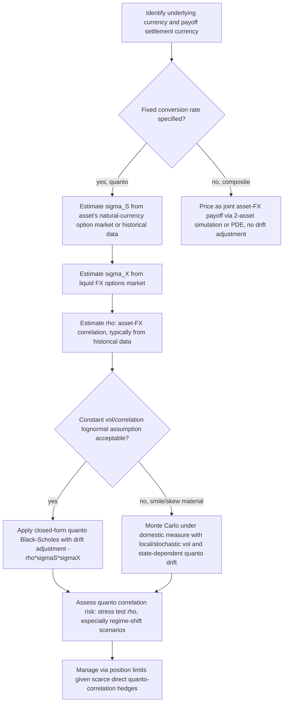

## Quanto Correlation Adjustment Effects

### Overview

A quanto (quantity-adjusted) derivative pays off in a currency different from the currency in which its underlying asset is naturally denominated, with the payoff converted at a fixed, pre-agreed exchange rate rather than the prevailing spot rate at settlement. This structure eliminates direct FX translation risk for the payoff amount, but it does not eliminate the *economic* influence of FX — instead, that influence resurfaces as a drift adjustment inside the pricing model, driven by the correlation between the underlying asset and the exchange rate. This correlation-driven drift shift, commonly called the "quanto adjustment" or "quanto correction," is the central object of this topic and represents one of the most important and frequently misunderstood correlation effects in cross-currency derivatives pricing.

### Setting Up the Quanto Pricing Problem

Consider an asset $S$ denominated in a foreign currency, with a payoff that will be settled in the domestic currency at a fixed FX rate $\bar{X}$ (the quanto factor, often set to 1 in normalized terms). Let $X_t$ denote the foreign-to-domestic exchange rate (units of domestic currency per unit of foreign currency).

**Key Points**

- Under the **foreign risk-neutral measure**, the asset evolves as $dS = (r_f - q)S\,dt + \sigma_S S\,dW_S$, where $r_f$ is the foreign risk-free rate and $q$ is the asset's dividend yield
- To price a quanto payoff (settled in domestic currency but written on the foreign asset), the valuation must be performed under the **domestic risk-neutral measure** — but $S$ is not directly tradable in the domestic economy, so a change of measure (via the FX rate as the connecting variable) is required
- This measure change is precisely where correlation between $S$ and $X$ enters: **Girsanov's theorem**, applied to the change from the foreign to the domestic risk-neutral measure, introduces a drift adjustment to $S$'s dynamics that is proportional to the covariance between $S$'s returns and $X$'s returns

### The Quanto Drift Adjustment

Under the domestic risk-neutral measure, the quanto-adjusted dynamics of the foreign asset become:

$$dS = \left(r_f - q - \rho\,\sigma_S\,\sigma_X\right)S\,dt + \sigma_S S\,dW_S^{\text{domestic}}$$

where $\rho$ is the correlation between the asset's return and the exchange rate's return, and $\sigma_X$ is the exchange rate's volatility. The term $-\rho\,\sigma_S\,\sigma_X$ is the **quanto adjustment** (sometimes written with different sign conventions depending on whether $X$ is defined as foreign-per-domestic or domestic-per-foreign units).

**Key Points**

- This is a **pure drift effect** under the joint lognormal (Black-Scholes-style) framework — the volatility of $S$ itself, $\sigma_S$, is unchanged; only the risk-neutral drift is shifted
- The sign and magnitude of the drift shift depend entirely on $\rho$: if the foreign asset tends to rise when the foreign currency strengthens against the domestic currency (positive correlation, in the convention where $X$ rising means the foreign currency is strengthening), the quanto adjustment is negative, reducing the effective drift used for pricing the domestically-settled payoff — and vice versa for negative correlation
- The economic intuition: a quanto structure removes the investor's *direct* currency exposure (the payoff amount itself doesn't fluctuate with FX), but a domestic-currency investor implicitly forgoes (or gains) the covariance benefit/cost that a similarly-currency-hedged position would have carried if it *had* been exposed to FX — this forgone/gained covariance benefit is capitalized into the risk-neutral drift precisely because risk-neutral pricing requires consistency with no-arbitrage replication, and replicating a fixed-FX-rate payoff using traded foreign and domestic instruments necessarily involves this cross term

### Quanto-Adjusted Black-Scholes Formula

For a European quanto call option (foreign underlying, domestic-currency-denominated payoff, fixed conversion rate), the quanto-adjusted Black-Scholes-type formula is:

$$C_{\text{quanto}} = \bar{X}\,e^{-r_d T}\left[S(0)\,e^{(r_f - q - \rho\sigma_S\sigma_X)T}\,\Phi(d_1) - K\,\Phi(d_2)\right]$$

$$d_{1,2} = \frac{\ln\left(\frac{S(0)}{K}\right) + \left(r_f - q - \rho\sigma_S\sigma_X \pm \frac{1}{2}\sigma_S^2\right)T}{\sigma_S\sqrt{T}}$$

**Key Points**

- Note the discounting is performed at the **domestic** risk-free rate $r_d$ (since the payoff settles in domestic currency), while the forward/drift term uses the **foreign** risk-free rate $r_f$ adjusted by the quanto correction — this asymmetric mixing of rates from both economies is the hallmark structural feature of quanto pricing
- $\bar{X}$ (the fixed quanto conversion factor) simply scales the payoff linearly and has no effect on the underlying option's moneyness or the quanto drift adjustment itself
- This formula is exact under the standard joint-lognormal (constant volatility, constant correlation) assumption for $S$ and $X$ — real-world implementation typically requires calibrating $\sigma_S$, $\sigma_X$, and $\rho$ from observable market data, each carrying its own estimation challenges (see below)

### Sourcing the Inputs: $\sigma_S$, $\sigma_X$, and $\rho$

**Key Points**

- $\sigma_S$: ideally extracted from the implied volatility of vanilla options on $S$ in its *natural* (foreign) currency market, where such a liquid market exists — for less liquid underlyings, historical realized volatility serves as a proxy, carrying the standard real-world/risk-neutral measure caveats
- $\sigma_X$: FX implied volatility is generally well-observed and liquid for major currency pairs via the FX options market, making this typically the most directly obtainable of the three quanto inputs
- $\rho$ (asset-FX correlation): this is the input facing the same structural observability challenge as inter-asset correlation generally discussed elsewhere in this chapter — no direct, liquid "quanto correlation swap" market exists for most asset-currency pairs, so $\rho$ is most commonly estimated from historical time series of asset returns versus FX returns, carrying the standard historical-estimation caveats (window-length bias-variance tradeoff, regime dependence, real-world-versus-risk-neutral measure mismatch)
- For certain liquid quanto product classes (e.g., quanto index options on major equity indices against major currency pairs, where both quanto and non-quanto versions of similar options may trade), an *implied* quanto correlation can in principle be backed out by comparing quanto and non-quanto option prices for otherwise similar payoffs — but this is only feasible where both structures are liquidly quoted side by side, which is the exception rather than the rule [Inference: the specific product pairs for which this back-out is practically feasible are limited and time-varying with market liquidity conditions]

### Practical Examples of Quanto Structures

**Key Points**

- **Quanto equity index options**: an option on a foreign equity index (e.g., a USD-based investor buying an option on the Nikkei 225, with payoff fixed in USD rather than converted from JPY at the prevailing spot rate) — this is among the most common retail and institutional quanto product classes, since it allows investors to gain equity index exposure without separately managing the FX leg
- **Quanto interest rate/cross-currency swaps**: quanto structures also appear in fixed income, where a floating rate index from one currency (e.g., a foreign LIBOR-successor rate) is paid in a different currency's notional — the same correlation-driven drift adjustment logic applies, adapted to the interest-rate modeling framework rather than the equity/FX lognormal framework
- **Quanto commodity options**: commodities priced in USD (as is standard for most global commodities) but settled in a domestic investor's home currency require the same quanto adjustment machinery, with $\rho$ representing the correlation between the commodity price and the relevant USD/domestic-currency exchange rate
- **Composite (non-quanto) options as the contrasting case**: a composite option, by contrast, pays off based on the actual prevailing spot FX rate at settlement (i.e., true currency conversion, no fixed rate) — this requires no quanto drift adjustment at all, since the payoff is genuinely a function of both $S$ and the realized $X$, and is instead priced using standard multi-asset (here, asset-and-FX) joint dynamics without the fixed-conversion-rate mechanism; distinguishing quanto from composite structures correctly is a frequent and consequential practical distinction in cross-currency derivatives documentation

### Correlation Risk in Quanto Products

**Key Points**

- **Quanto correlation is a genuine, tradable-in-principle risk factor** (sometimes called "quanto vega" or, more precisely, sensitivity to $\rho$ in the quanto drift term) — a mispriced or misestimated asset-FX correlation directly biases the quanto-adjusted forward price used in the option formula, and this bias compounds over the option's time to maturity since the adjustment enters as a drift term (proportional to $T$ in the exponent) rather than a one-time level shift
- Because $\rho$ here connects an *equity/commodity* asset class to an *FX* asset class, it sits outside the more commonly hedged single-asset-class correlation structures (e.g., equity-equity basket correlation) — cross-asset-class correlation hedging instruments are generally even scarcer than same-asset-class correlation hedges, making quanto correlation risk on most books effectively **unhedgeable with direct market instruments** and managed primarily through position limits and stress testing, similar to the correlation risk management approach used for worst-of/basket structures generally
- Historical asset-FX correlation is known to be regime-dependent, particularly around risk-on/risk-off market phases where many foreign equity markets and their local currencies exhibit shifting co-movement patterns with respect to a global reserve or safe-haven currency — a static historical correlation estimate calibrated in a calm regime can materially misprice quanto drift in a subsequent stress regime [Unverified: the specific regime-shift magnitude and direction is asset-pair- and time-period-specific and requires direct empirical study rather than a general formula]
- Quanto adjustment sensitivity is generally larger for longer-dated options (since the drift adjustment compounds over $T$) and for asset-FX pairs with both high individual volatilities and a correlation estimate that itself carries wide statistical uncertainty — this combination of long tenor, high volatility legs, and uncertain correlation is where quanto mispricing risk is most concentrated in practice

### Quanto Adjustment in Stochastic and Local Volatility Frameworks

**Key Points**

- The drift adjustment formula above is derived under the joint-lognormal (constant $\sigma_S$, $\sigma_X$, $\rho$) assumption; extending quanto pricing to a smile-consistent local or stochastic volatility framework for either $S$ or $X$ (or both) requires the quanto drift adjustment to become **state- and time-dependent** rather than a single constant term, since local/stochastic volatility itself varies with the underlying's level and time
- In a local volatility framework, the quanto-adjusted drift term becomes $-\rho(S,t)\,\sigma_{S,\text{loc}}(S,t)\,\sigma_{X,\text{loc}}(X,t)$ evaluated dynamically along the simulated or PDE-solved path, rather than the single constant $\rho\sigma_S\sigma_X$ of the lognormal case — this is typically implemented via Monte Carlo simulation of the joint $(S,X)$ system under the domestic risk-neutral measure with the appropriate local volatility surfaces for each, since a closed-form analog to the quanto Black-Scholes formula generally does not survive the transition to non-constant volatility
- Stochastic correlation (allowing $\rho$ itself to evolve, rather than remaining a fixed constant) is a further, more advanced extension used in some institutional quanto pricing frameworks specifically to capture the empirically observed regime-dependence of asset-FX correlation noted above, though this substantially increases model complexity and calibration burden relative to the constant-correlation lognormal baseline [Inference: the specific benefit of stochastic correlation modeling relative to its added complexity is product- and desk-specific, and is not universally adopted across all quanto pricing frameworks]

### Quanto vs. Composite vs. Unhedged FX Exposure Comparison

| Structure | Payoff FX treatment | Requires quanto drift adjustment? | Correlation risk exposure |
| --- | --- | --- | --- |
| Quanto | Fixed, pre-agreed conversion rate | Yes — drift adjustment $-\rho\sigma_S\sigma_X$ | Yes, embedded in pricing via drift |
| Composite | Actual spot FX rate at settlement | No — priced as joint asset-FX payoff directly | Yes, but via direct joint simulation, not a drift correction |
| Unhedged (natural currency) | No conversion; investor bears full FX translation | No | FX risk borne directly by investor, not embedded in option pricing model |

### Quanto Measure Change Mechanism (svg_diagram)

<svg xmlns="http://www.w3.org/2000/svg" viewBox="0 0 740 280" font-family="Helvetica, Arial, sans-serif">
<text x="370" y="24" text-anchor="middle" font-size="16" font-weight="bold" fill="#1a1a1a">Why Correlation Enters Quanto Pricing (svg_diagram)</text>
<rect x="30" y="60" width="220" height="70" rx="6" fill="#eaf2fb" stroke="#2b6cb0" />
<text x="140" y="88" text-anchor="middle" font-size="12">Asset S under foreign</text>
<text x="140" y="105" text-anchor="middle" font-size="12">risk-neutral measure</text>
<text x="140" y="120" text-anchor="middle" font-size="11" fill="#555">drift = r_f - q</text>

<text x="290" y="100" text-anchor="middle" font-size="20" fill="#333">→</text>

<text x="290" y="80" text-anchor="middle" font-size="11" fill="#555">Girsanov change</text>

<text x="290" y="118" text-anchor="middle" font-size="11" fill="#555">of measure via FX</text>

<rect x="330" y="60" width="240" height="70" rx="6" fill="#fdf3ea" stroke="#c0781b" />
<text x="450" y="88" text-anchor="middle" font-size="12">Asset S under domestic</text>
<text x="450" y="105" text-anchor="middle" font-size="12">risk-neutral measure</text>
<text x="450" y="120" text-anchor="middle" font-size="11" fill="#555">drift = r_f - q - ρσ_Sσ_X</text>
<rect x="610" y="60" width="110" height="70" rx="6" fill="#eafbea" stroke="#2f8f4e" />
<text x="665" y="88" text-anchor="middle" font-size="11">Correlation ρ</text>
<text x="665" y="105" text-anchor="middle" font-size="11">enters here</text>
<text x="665" y="120" text-anchor="middle" font-size="11">as drift shift</text>

<text x="370" y="175" text-anchor="middle" font-size="12" fill="#555">The fixed-FX-rate settlement does not remove FX influence — it relocates it into the risk-neutral drift.</text>

<text x="370" y="195" text-anchor="middle" font-size="12" fill="#555">No-arbitrage replication of a fixed-conversion-rate payoff requires this covariance term for consistency</text>

<text x="370" y="215" text-anchor="middle" font-size="12" fill="#555">between the foreign and domestic risk-neutral pricing measures.</text>

</svg>

### Quanto Drift Adjustment Sign Convention (svg_diagram)

<svg xmlns="http://www.w3.org/2000/svg" viewBox="0 0 720 240" font-family="Helvetica, Arial, sans-serif">
<text x="360" y="24" text-anchor="middle" font-size="16" font-weight="bold" fill="#1a1a1a">Quanto Drift Adjustment Direction (svg_diagram)</text>
<line x1="80" y1="160" x2="640" y2="160" stroke="#333" stroke-width="1.5" />
<text x="650" y="164" font-size="12" fill="#333">ρ</text>
<text x="90" y="180" font-size="11" fill="#555">ρ = -1</text>
<text x="350" y="180" font-size="11" fill="#555">ρ = 0</text>
<text x="600" y="180" font-size="11" fill="#555">ρ = +1</text>
<line x1="80" y1="160" x2="80" y2="60" stroke="#333" stroke-width="1.5" />
<text x="40" y="55" font-size="12" fill="#333">Drift adj.</text>
<line x1="80" y1="110" x2="640" y2="110" stroke="#999" stroke-dasharray="4,4" />
<text x="650" y="114" font-size="10" fill="#999">0</text>
<path d="M 80 60 L 640 160" stroke="#2b6cb0" stroke-width="2.5" />
<text x="140" y="80" font-size="12" fill="#2b6cb0" font-weight="bold">-ρσ_Sσ_X: adjustment falls as ρ rises</text>

<text x="360" y="215" text-anchor="middle" font-size="12" fill="#555">Positive asset-FX correlation lowers the effective quanto drift; negative correlation raises it.</text>

</svg>

### Quanto Pricing Workflow (Mermaid)

### Risk Management Synthesis

**Key Points**

- The single most important conceptual takeaway is that **fixing the settlement FX rate does not eliminate FX-related risk from a quanto structure** — it transforms direct FX translation risk into an embedded, correlation-driven drift risk that must be explicitly modeled, estimated, and risk-managed, and which compounds with option tenor
- Quanto correlation risk shares the general correlation risk management challenges seen elsewhere in this chapter (scarce direct hedging instruments, historical estimation as the primary practical fallback, regime dependence, stress-testing as the primary risk control) but is specifically distinguished by connecting two *different* asset classes (the underlying's asset class and FX) rather than two assets within the same class, which tends to make direct hedging instruments even scarcer than for same-asset-class basket or worst-of correlation risk
- Given the compounding nature of the drift adjustment over time to maturity, quanto correlation risk assessment should explicitly account for tenor when prioritizing model validation and stress-testing effort — long-dated quanto structures on volatile, uncertain-correlation asset-FX pairs represent the area of greatest concentrated model risk within this product family

**Next Steps**

- Quanto adjustments in interest rate derivatives (quanto CMS, cross-currency swaps) and their distinct modeling framework relative to the equity/FX case
- Composite option pricing methodology as the contrasting non-quanto cross-currency structure
- Girsanov's theorem and change-of-numéraire techniques in cross-currency derivatives pricing more broadly
- Stochastic correlation modeling for asset-FX dependence and its practical calibration challenges
- Historical case studies of quanto mispricing during FX regime shifts (e.g., major currency crisis episodes)
- Quanto CDS and quanto credit derivatives as a further cross-asset-class correlation application
- Local volatility surface construction for FX rates and its integration into quanto pricing frameworks
- Cross-currency correlation risk aggregation across a multi-quanto-product derivatives book