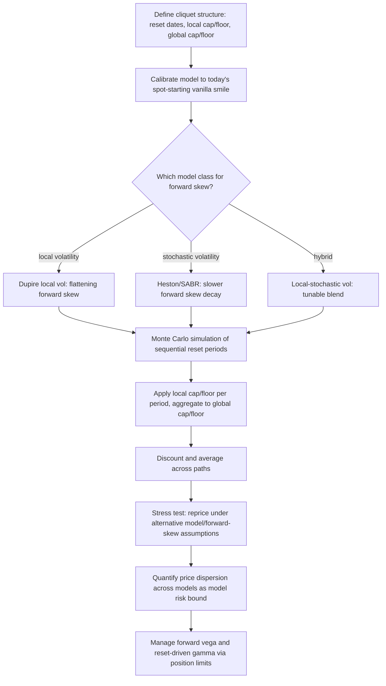

## Cliquet and Ratchet Option Structures


### Overview

Cliquet options (also called ratchet options, from the French *cliquet* meaning a ratchet mechanism) are structured products composed of a series of forward-starting options over successive sub-periods, where the strike for each sub-period is reset — typically to the prevailing spot level — at the start of that period. This periodic strike resetting is the defining structural feature: rather than a single option struck once at inception, a cliquet locks in a sequence of period-by-period returns, each capped and/or floored, and aggregates them into a final payoff. Cliquets are a cornerstone of principal-protected retail structured notes and are also traded by institutional desks as a vehicle for expressing views on forward volatility and the volatility term structure/skew, since their pricing is fundamentally more sensitive to forward-starting implied volatility than to spot-starting implied volatility.

### Basic Structure and Payoff Mechanics

**Key Points**

- A cliquet divides the total tenor $T$ into $N$ sub-periods with reset dates $0=t_0 < t_1 < \cdots < t_N=T$
- At each reset date $t_{k-1}$, a new strike is set (typically $K_k = S(t_{k-1})$, i.e., at-the-money at the reset), and the period return is computed as $R_k = \frac{S(t_k) - S(t_{k-1})}{S(t_{k-1})}$
- Each period return is subjected to a **local cap** $c$ and/or **local floor** $f$: $R_k^{\text{capped}} = \min(\max(R_k, f), c)$
- The **global payoff** aggregates the capped/floored local returns, most commonly as a simple sum, subject to its own **global cap** $C$ and/or **global floor** $F$:


  $$\text{Payoff} = N \times \left(\min\left(\max\left(\frac{1}{N}\sum_{k=1}^N R_k^{\text{capped}},\, F\right),\, C\right)\right)$$

  (conventions vary by structure — some cliquets sum rather than average the local returns, and some apply the global cap/floor to the sum directly rather than to an averaged quantity)
- A **ratchet** structure often specifically refers to the case with a **local floor at zero** (each period's negative return is floored, so the structure only "locks in" positive or zero performance each period, never below) combined with a positive local cap — this is the retail-note-friendly variant that markets well as "locking in gains while limiting losses period by period"

### Why Cliquets Are Forward-Volatility Instruments

**Key Points**

- Because each period's option is **struck at-the-money at the start of that period** (not at trade inception), the pricing of periods 2 through $N$ depends on the **forward-starting implied volatility** for each sub-period — the volatility the market expects to prevail during $[t_{k-1}, t_k]$, conditional on having reached $t_{k-1}$, rather than the current spot-starting implied volatility for a vanilla option of the same total maturity
- This distinguishes cliquets sharply from a standard vanilla option: a vanilla option's value depends on the volatility from now until maturity, whereas the second-and-later legs of a cliquet depend on volatility levels for time periods that haven't started yet, priced today under the risk-neutral measure — this makes the **forward volatility surface** (or equivalently, the volatility term structure and its evolution) the primary pricing input, rather than the spot-starting smile alone
- Because forward-starting implied volatility cannot, in general, be perfectly inferred from the spot-starting implied volatility surface without additional model assumptions (see below), cliquet pricing is inherently **more model-dependent** than vanilla option pricing — two models calibrated to match the identical spot-starting vanilla smile can produce materially different cliquet prices if they imply different forward volatility dynamics
- This forward-volatility dependence is precisely why cliquets are used by institutional desks specifically to express views on the **volatility term structure and skew dynamics** (e.g., whether the market's forward skew is too flat or too steep relative to a trader's view), a use case with no direct vanilla-option analog

### Forward Skew and the Sticky-Strike vs. Sticky-Delta Problem

**Key Points**

- **Sticky-strike** dynamics assume that as spot moves, the implied volatility for a *given absolute strike* remains fixed — under this assumption, if spot rises significantly before a reset date, the new at-the-money strike (now higher) would be priced off a *different point on today's smile*, generally implying **lower** volatility if the current smile is downward-sloping (as is typical for equity indices)
- **Sticky-delta** (or sticky-moneyness) dynamics instead assume the implied volatility for a given *moneyness* (e.g., at-the-money) remains fixed as spot moves — under this assumption, the reset at-the-money strike after a spot move is priced with **the same** at-the-money volatility as today, regardless of the spot level reached
- These two conventions can produce **substantially different cliquet prices** for the same reset structure, because they imply very different forward skew dynamics — this is one of the most consequential and well-known sources of model risk in cliquet pricing specifically, and it does not arise (or arises much less materially) for vanilla options, whose value is far less sensitive to the *forward* evolution of the skew
- Local volatility models (Dupire), by their mathematical construction, are known to generate a **flattening forward skew** — the model-implied forward-starting skew becomes progressively flatter than the current spot-starting skew as the forward-start date increases — which many practitioners consider empirically too flat relative to observed market behavior [Inference: whether local volatility's flattening forward skew is "too flat" relative to the true market-consistent forward skew is a widely held practitioner view rather than a definitively provable fact, since the true forward skew is not directly observable]
- Stochastic volatility models (Heston, SABR, and their variants) generally produce a forward skew that decays more slowly than local volatility models, and are frequently preferred specifically for cliquet and other forward-starting option pricing for this reason — though different stochastic volatility model choices and calibrations can still produce a meaningfully wide range of cliquet prices for the identical spot-starting vanilla smile, since the forward skew is not uniquely pinned down by spot-starting vanillas alone

### Pricing Methodology

#### Monte Carlo Simulation

Given the forward-volatility dependence and the path-dependent, multi-reset-date structure, Monte Carlo simulation under a chosen model (local volatility, stochastic volatility, or a stochastic-local-volatility hybrid) is the dominant practical pricing approach.

**Example**

```python
import numpy as np

def mc_cliquet_price(S0, r, q, T, N_periods, local_cap, local_floor,
                      global_cap, global_floor, notional, N_paths,
                      vol_model_fn, seed=17):
    """
    vol_model_fn(S, t) -> instantaneous volatility, e.g. from a calibrated
    local vol surface or a stochastic vol simulation step.
    Simplified Euler simulation for illustration; production systems typically
    use finer sub-stepping within each reset period and a properly calibrated
    local/stochastic vol model.
    """
    rng = np.random.default_rng(seed)
    dt_period = T / N_periods
    n_substeps = 50
    dt = dt_period / n_substeps

    S = np.full(N_paths, S0, dtype=float)
    period_returns = np.zeros((N_paths, N_periods))

    for k in range(N_periods):
        S_start = S.copy()
        for _ in range(n_substeps):
            sigma_t = vol_model_fn(S, k * dt_period)
            Z = rng.standard_normal(N_paths)
            S = S * np.exp((r - q - 0.5 * sigma_t**2) * dt + sigma_t * np.sqrt(dt) * Z)
        R_k = (S - S_start) / S_start
        period_returns[:, k] = np.clip(R_k, local_floor, local_cap)

    global_return = np.mean(period_returns, axis=1)
    global_return_capped = np.clip(global_return, global_floor, global_cap)

    payoff = notional * global_return_capped
    discounted = np.exp(-r * T) * payoff
    price = discounted.mean()
    stderr = discounted.std(ddof=1) / np.sqrt(N_paths)
    return price, stderr
```

**Key Points**

- The critical modeling choice embedded in `vol_model_fn` — whether it is driven by a local volatility surface, a stochastic volatility model, or a hybrid — is exactly the model-risk decision point discussed above, and materially affects the resulting cliquet price even when the model is calibrated to match the identical spot-starting vanilla option market
- Path-dependency here is comparatively mild relative to Asian or barrier options (the payoff depends only on the sequence of period-start/period-end spot levels, not on continuous path behavior within each period), but the multiplicative/compounding nature of sequential resets still requires full path simulation rather than a simpler decomposition
- Variance reduction techniques standard to other path-dependent MC applications (antithetic variates, control variates using simpler closed-form-approximable sub-components) apply here as well, though the model-risk uncertainty in the forward volatility assumption is typically a larger driver of pricing uncertainty than the Monte Carlo sampling error itself, particularly for longer-dated, many-period cliquets

#### PDE Methods

**Key Points**

- Because each reset resets the effective strike to the current spot, a cliquet's per-period valuation between reset dates is structurally similar to a forward-starting vanilla option, which can in principle be handled via a lower-dimensional PDE approach exploiting the fact that a forward-starting at-the-money option's value, expressed as a fraction of spot at the reset date, is often independent of the spot level at the reset date under certain model assumptions (e.g., pure local volatility with a homogeneity property, though this breaks down once local volatility depends on spot level in a way that is not scale-invariant, and generally breaks down for stochastic volatility models where variance is itself a state variable)
- For models where this simplification is not available (most realistic stochastic volatility or local-stochastic-volatility setups), PDE approaches typically require an auxiliary state variable to track the accumulated global sum of capped/floored period returns, similar in spirit to the Asian option state-augmentation approach — this again introduces the curse-of-dimensionality tradeoff between PDE precision and computational tractability discussed for other path-dependent products
- Given these complications, Monte Carlo remains the more commonly used practical approach for cliquet pricing in most institutional settings, with PDE methods reserved for specific simplified structures or as an independent cross-check under a restricted model assumption set

### Greeks and Risk Characteristics

**Key Points**

- **Forward vega** — sensitivity to the volatility applicable to future (not-yet-started) sub-periods — is the dominant and most distinctive Greek for a cliquet, and is fundamentally different from the standard spot-starting vega of a vanilla option; a cliquet trading book's primary risk management concern is typically the shape and level of the *forward* volatility surface, not merely the current spot-starting smile
- **Volga (vega convexity)** and **vanna** (cross-sensitivity of delta to volatility, or vega to spot) also play a more prominent role in cliquet risk than in simple vanilla option risk, since the local caps and floors introduce genuine option-like convexity at each individual reset, compounding across periods
- **Gamma near reset dates** exhibits a distinctive "reset-day" pattern: at the moment of a reset, the position's effective strike jumps to the new at-the-money level, causing a discontinuous-feeling shift in the delta/gamma profile as the option effectively "restarts" at the money — risk management systems for cliquet books must explicitly handle this reset-driven Greek behavior rather than treating the position as a smoothly-evolving single vanilla-like exposure throughout its life
- Because forward volatility itself has no equally liquid direct hedging instrument compared to spot-starting implied volatility (forward-starting variance swaps and forward volatility agreements exist but are considerably less liquid than standard listed vanilla options or standard variance swaps), cliquet books carry meaningful **model risk that is difficult to hedge away with market instruments**, similar in character to the correlation risk discussed for basket/worst-of structures — the primary practical risk mitigants are model validation, stress testing across alternative model assumptions (local vol vs. stochastic vol vs. varying forward skew assumptions), and position/exposure limits rather than direct instrument-level hedging

### Common Cliquet Variants

**Key Points**

- **Reverse cliquet**: local floor is set below zero and the global payoff typically starts from a high initial coupon that is reduced by the sum of negative period returns — these structures carry substantial tail risk since a series of poor periods can erode the payoff sharply, and they were a category of product that drew particular regulatory and investor-protection scrutiny in various jurisdictions following periods of poor realized performance [Inference: specific regulatory conclusions vary by jurisdiction and time period and should be checked against current guidance rather than treated as a fixed universal rule]
- **Napoleon**: pays a fixed coupon minus the *worst* period return observed (rather than the sum of all period returns) — this shifts the payoff's sensitivity toward extreme-value (order statistic) behavior of the period returns rather than their average, adding a further layer of path-dependent, tail-sensitive structure
- **Accumulator cliquets**: local floor at zero (only positive/zero contributions accumulate) combined with a high global cap or no cap, marketed as capturing upside participation while limiting period-by-period downside — economically similar to the ratchet structure described above
- **Vol-target / volatility-controlled cliquets**: incorporate a dynamic notional or leverage adjustment based on realized or implied volatility, explicitly managing the effective vega exposure of the structure over its life — these combine cliquet mechanics with a volatility-targeting overlay and add yet another layer of model dependency (specifically, on the volatility-targeting mechanism's own assumptions) beyond the base cliquet forward-volatility sensitivity

### Model Risk Comparison: Local Vol vs. Stochastic Vol for Cliquet Pricing

| Model Class | Forward Skew Behavior | Cliquet Pricing Implication | Typical Practitioner View |
| --- | --- | --- | --- |
| Local volatility (Dupire) | Flattens materially as forward-start date increases | Tends to produce lower cliquet prices for structures sensitive to persistent forward skew | Often considered too flat relative to market-consistent forward skew expectations |
| Stochastic volatility (Heston, SABR) | Decays more slowly, retains more forward skew | Tends to produce higher cliquet prices for skew-sensitive structures relative to local vol | Generally preferred for forward-starting/cliquet pricing, though calibration choice still drives meaningful price dispersion |
| Local-stochastic volatility (LSV) hybrid | Blends both effects, tunable via mixing parameter | Offers a middle ground, calibratable to both spot smile and a forward-skew view | Increasingly used where available, given the explicit tunability of the forward skew behavior |

### Cliquet Reset Mechanics Timeline (svg_diagram)

<svg xmlns="http://www.w3.org/2000/svg" viewBox="0 0 760 260" font-family="Helvetica, Arial, sans-serif">
<text x="380" y="24" text-anchor="middle" font-size="16" font-weight="bold" fill="#1a1a1a">Cliquet Structure: Sequential Strike Resets (svg_diagram)</text>
<line x1="60" y1="150" x2="700" y2="150" stroke="#333" stroke-width="1.5" />
<text x="700" y="170" font-size="12" fill="#333">t</text>

<path d="M 60 150 C 100 130, 140 100, 180 120 C 220 140, 260 110, 300 150 C 340 170, 380 130, 420 140 C 460 150, 500 100, 540 115 C 580 130, 620 160, 660 145" fill="none" stroke="`#2b6cb0`" stroke-width="2" />

<g fill="#2b6cb0">
<circle cx="60" cy="150" r="4" />
<circle cx="180" cy="120" r="4" />
<circle cx="300" cy="150" r="4" />
<circle cx="420" cy="140" r="4" />
<circle cx="540" cy="115" r="4" />
<circle cx="660" cy="145" r="4" />
</g>
<g font-size="11" fill="#333" text-anchor="middle">
<text x="60" y="185">t0: strike K1=S0</text>
<text x="180" y="205">t1: R1 locked in, K2=S(t1)</text>
<text x="300" y="185">t2: R2 locked in, K3=S(t2)</text>
<text x="420" y="205">t3: R3 locked in, K4=S(t3)</text>
<text x="540" y="185">t4: R4 locked in, K5=S(t4)</text>
<text x="660" y="205">T: R5 locked in, payoff computed</text>
</g>

<text x="380" y="240" text-anchor="middle" font-size="12" fill="#555">Each period's option is struck at-the-money at its own start — pricing later periods requires the forward volatility surface.</text>

</svg>

### Forward Skew: Local Vol vs. Stochastic Vol (svg_diagram)

<svg xmlns="http://www.w3.org/2000/svg" viewBox="0 0 720 280" font-family="Helvetica, Arial, sans-serif">
<text x="360" y="24" text-anchor="middle" font-size="16" font-weight="bold" fill="#1a1a1a">Forward Skew Decay by Model Class (svg_diagram)</text>
<line x1="80" y1="230" x2="640" y2="230" stroke="#333" stroke-width="1.5" />
<text x="650" y="234" font-size="12" fill="#333">Forward start date</text>
<line x1="80" y1="230" x2="80" y2="50" stroke="#333" stroke-width="1.5" />
<text x="45" y="45" font-size="12" fill="#333">Skew steepness</text>
<path d="M 80 70 C 200 130, 320 190, 460 215 C 520 222, 580 227, 640 228" fill="none" stroke="#2b6cb0" stroke-width="2.5" />
<text x="140" y="105" font-size="12" fill="#2b6cb0" font-weight="bold">Local volatility (flattens quickly)</text>
<path d="M 80 70 C 200 95, 320 120, 460 145 C 520 155, 580 165, 640 175" fill="none" stroke="#c0392b" stroke-width="2.5" />
<text x="440" y="130" font-size="12" fill="#c0392b" font-weight="bold">Stochastic volatility (decays slower)</text>

<text x="360" y="260" text-anchor="middle" font-size="12" fill="#555">Both models can match today's spot-starting smile exactly while implying very different forward skew — and hence different cliquet prices.</text>

</svg>

### Cliquet Pricing Decision Workflow (Mermaid)



### Practical Synthesis

**Key Points**

- The single most important structural fact distinguishing cliquets from vanilla options is that their pricing depends fundamentally on the **forward volatility surface**, which is not uniquely determined by the spot-starting vanilla smile alone — this makes cliquet pricing inherently more model-dependent, and model choice (local vs. stochastic vs. hybrid volatility) is a first-order pricing decision rather than a secondary refinement
- Given the practical impossibility of directly and liquidly hedging forward volatility/forward skew exposure for most underlyings, cliquet risk management relies heavily on **model risk quantification** (systematically repricing under alternative model assumptions) and **position limits**, in a manner structurally analogous to how correlation risk is managed for basket and worst-of structures elsewhere in this chapter — model risk here plays the role that unhedgeable correlation risk plays there
- Institutional desks that both issue retail cliquet-linked notes and trade cliquets as forward-volatility views must manage the resulting book with explicit attention to forward vega, volga, vanna, and reset-driven gamma dynamics — a risk framework built only around standard spot-starting vanilla Greeks will materially understate the true risk profile of a cliquet book

**Next Steps**

- Forward-starting option pricing fundamentals as the single-period building block of cliquet structures
- Stochastic volatility model calibration (Heston, SABR) with specific attention to forward skew matching
- Local-stochastic volatility (LSV) model construction and the mixing parameter's role in forward skew tuning
- Forward volatility agreements and forward-starting variance swaps as (partial) hedging instruments
- Napoleon and reverse cliquet structures: detailed payoff mechanics and historical performance case studies
- Volatility-targeting overlay mechanisms and their interaction with cliquet vega management
- Regulatory and suitability considerations for retail-distributed cliquet-linked structured notes
- Vanna-volga pricing methods as an alternative practical approach to forward-skew-sensitive product pricing