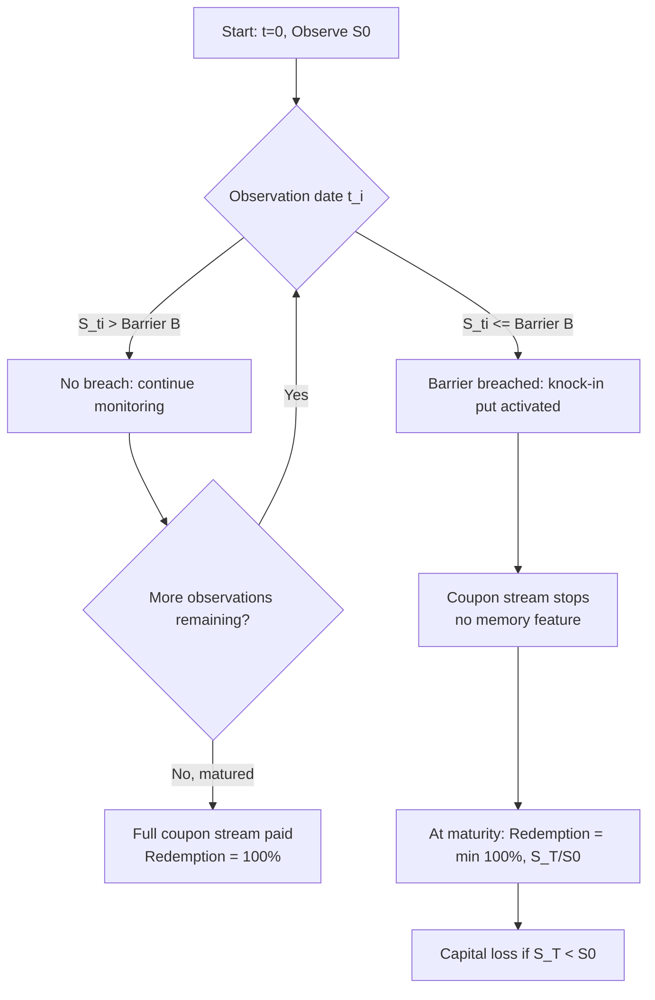

## Napoleon and Altiplano Payoffs

### Overview

Napoleon and Altiplano structures belong to the family of cliquet-type and range-accrual exotic payoffs used primarily in structured retail and institutional notes. Both structures monetize a view on realized volatility or range-bound behavior across a basket or single underlying, but they differ fundamentally in mechanics: Napoleons aggregate periodic returns with an asymmetric floor/cap structure, while Altiplanos are pure binary range-accrual coupons paid conditional on the underlying staying within (or outside) a defined corridor.

---

### Napoleon Payoff

#### Structural Definition

A Napoleon note pays a fixed guaranteed coupon (often at maturity or annually) equal to a **base rate plus the worst (or sum of the worst) periodic performance(s)** observed over a series of sub-periods, subject to a floor — typically zero. The defining asymmetry: the structure captures the *average* or *sum* of periodic returns but replaces the single worst-performing period's return with a floor, protecting the payoff from the tail-risk of one catastrophic sub-period.

The canonical single-underlying Napoleon coupon formula:

$$C = \max\left(0,\ \alpha + \frac{1}{N}\sum_{i=1}^{N} r_i \right)$$

where the worst individual return $r_{min} = \min_i(r_i)$ is either floored at a fixed value (commonly $-100\%$, i.e., left unmodified) or, in the "Napoleon with floor on worst return" variant, replaced entirely:

$$C = \max\left(0,\ \alpha + \frac{1}{N}\left(\sum_{i=1}^{N} r_i - r_{min} + f_{min}\right)\right)$$

Here:

- $\alpha$ = guaranteed base coupon (e.g., 8%)
- $r_i = \frac{S_i - S_{i-1}}{S_{i-1}}$ = periodic (monthly/quarterly) return of the underlying or basket
- $N$ = number of observation periods
- $f_{min}$ = floor applied to the worst observed period (often $0\%$ or a small negative number, replacing an uncapped negative drag)

**Key Points**

- The "Napoleon" name derives from the structure's defensive character — it caps downside from the single worst period, analogous to protecting a flank.
- Most Napoleon structures are **capital-protected** at maturity (principal returned regardless of coupon outcome), making the payoff purely coupon-linked rather than principal-linked.
- The guaranteed coupon $\alpha$ is typically calibrated so that the note is priced near par when combined with the embedded exotic option, funded by the volatility risk premium implicit in discarding the worst return.
- Basket variants replace $r_i$ with a basket return (equally weighted or worst-of across multiple underlyings), materially increasing correlation sensitivity.

#### Payoff Mechanics — Worked Example

Assume a 3-year Napoleon note with $N = 12$ quarterly observations, $\alpha = 6\%$, and the worst quarterly return floored at $0\%$ (i.e., excluded from the drag if negative).

| Quarter | Return $r_i$ | Treatment |
| --- | --- | --- |
| Q1–Q11 (avg) | $+1.2\%$ | Included as-is |
| Q12 (worst) | $-9.0\%$ | Replaced with $0\%$ |

$$C = \max\left(0,\ 6\% + \frac{(11 \times 1.2\%) + 0\%}{12}\right) = \max(0,\ 6\% + 1.1\%) = 7.1\%$$

Without the worst-return replacement, the raw average return would have been:

$$\frac{(11 \times 1.2\%) - 9.0\%}{12} = 0.35\%$$

illustrating the coupon uplift attributable to the floor mechanism — roughly 75 bps in this example.

#### Replication and Hedging

The Napoleon payoff can be decomposed as:

1. A fixed-income leg paying $\alpha$ (zero-coupon bond component funding the guarantee).
2. A **basket of forward-starting options** on each sub-period return, netted against a **rainbow option on the minimum** (to isolate and floor $r_{min}$).

Static replication is imperfect because the "min" operator is path-dependent across periods and introduces strong **correlation and volatility skew sensitivity** between consecutive sub-periods. Pricing generally requires Monte Carlo simulation under a joint model (e.g., local-stochastic volatility with a term structure of forward volatilities), since closed-form solutions for order statistics of correlated lognormal increments do not exist in general.

[Inference] In practice, desks often price Napoleons using a **local volatility model calibrated to the full smile** per observation date, since the payoff's sensitivity to forward skew (the "worst of periods" selection) makes flat Black-Scholes volatility materially mis-price the floor value.

#### Greeks Profile

- **Vega**: Positive vega concentrated in the forward volatilities of each sub-period, but *convex* — the "min" selection increases sensitivity to the volatility of the worst-performing period disproportionately, creating a long-vega, long-volatility-of-volatility profile (positive vega convexity, i.e., positive "volga").
- **Correlation sensitivity**: For basket Napoleons, the note is short correlation — lower correlation between underlyings widens the dispersion of possible worst returns, increasing the value of the floor.
- **Theta**: Complex, decomposed period-by-period; each sub-period's optionality decays independently as its observation date is crossed and the return is "locked in."

---

### Altiplano Payoff

#### Structural Definition

An Altiplano note pays a **high fixed coupon conditional on the underlying (or basket) never breaching a barrier** during the observation period, combined with a **capital-at-risk redemption** determined by the underlying's terminal or barrier-triggered performance. It is fundamentally a **digital/binary range-accrual** wrapped around a barrier (knock-in/knock-out) option, named for the flat, high-altitude plateau — evoking a payoff that stays "flat" (constant, elevated) as long as the underlying doesn't fall off the plateau's edge.

The prototypical structure:

$$\text{Coupon}_t = \begin{cases} C_{fixed} & \text{if } S_u > B \ \ \forall u \in [0, t] \\ 0 & \text{if barrier } B \text{ breached before } t \end{cases}$$

At maturity, principal repayment is typically:

$$\text{Redemption} = \begin{cases} 100\% & \text{if barrier never breached} \\ \min\left(100\%,\ \frac{S_T}{S_0}\right) & \text{if barrier breached (knock-in put activated)} \end{cases}$$

**Key Points**

- The barrier $B$ is usually set well out-of-the-money (e.g., 60–70% of initial spot) and monitored either **continuously** or at **discrete observation dates** (monthly/quarterly) — discrete monitoring is far more common in retail Altiplanos and materially cheapens the embedded barrier option versus continuous monitoring.
- Altiplanos are digital coupon structures layered on top of a **down-and-in put** (the capital-at-risk component). The high coupon is effectively the premium harvested from selling this knock-in put to the structuring bank.
- Multi-asset Altiplanos pay the coupon only if **all** underlyings in a basket remain above their respective barriers ("worst-of" monitoring), which sharply increases the probability of a barrier breach as basket size grows (increasing coupon but also increasing capital risk) — a direct consequence of the union bound over correlated barrier events.
- Some variants ("Altiplano with memory" or "airbag Altiplano") add coupon memory (missed coupons are paid retroactively upon a later barrier-clear observation) or an airbag redemption formula that partially buffers the knock-in loss.

#### Payoff Mechanics — Worked Example

3-year Altiplano, single underlying, discrete quarterly barrier monitoring at $B = 65\%$ of $S_0$, annual coupon $C_{fixed} = 9\%$.

- **Scenario A**: Underlying never trades below 65% of $S_0$ at any quarterly observation → investor receives 9% p.a. for 3 years and 100% principal at maturity.
- **Scenario B**: Underlying breaches 65% at the Q7 observation → coupon stream stops from Q7 onward (no memory feature); at maturity, redemption $= \min(100\%, S_T/S_0)$. If $S_T/S_0 = 55\%$, investor receives only 55% of principal, having also lost coupons after breach.

This illustrates the structure's asymmetric risk: **limited upside (fixed coupon cap) versus material downside (full participation in underlying decline once breached).**

#### Replication and Hedging

The Altiplano decomposes into:

1. A **digital (binary) option** on the "no-breach" event, paying $C_{fixed}$ per period — priced via a portfolio of vanilla-spread digitals or directly under a barrier-survival probability computed from the risk-neutral density.
2. A **down-and-in put** (or down-and-in forward, depending on redemption formula) providing the capital-at-risk leg.

The no-breach probability for continuous monitoring under Black-Scholes dynamics uses the reflection principle:

$$P(\min_{0 \le u \le t} S_u > B) = \Phi\left(\frac{\ln(S_0/B) + (\mu - \sigma^2/2)t}{\sigma\sqrt{t}}\right) - \left(\frac{B}{S_0}\right)^{\frac{2\mu}{\sigma^2}-1} \Phi\left(\frac{\ln(B/S_0) + (\mu-\sigma^2/2)t}{\sigma\sqrt{t}}\right)$$

[Unverified] This closed-form reflection-principle result holds exactly only under continuous monitoring and constant-parameter geometric Brownian motion; real desks price discrete-monitoring barriers using either a **Broadie-Glasserman-Kou continuity correction** to the barrier level or full Monte Carlo/PDE grid methods when volatility is stochastic or skew-dependent, since the discrete/continuous monitoring gap can be economically material (often several vol points of effective barrier shift).

#### Greeks Profile

- **Vega**: Sharply **negative** near the barrier — higher volatility increases breach probability, destroying the digital coupon value. Vega is highly path/spot-dependent and can flip sign far from the barrier (long vega on the underlying knock-in put's convexity once deep in-the-money on breach).
- **Gamma near barrier**: Digital-option-like discontinuous payoff creates large, unstable gamma near the barrier as observation dates approach — a classic "pin risk" profile requiring gamma-hedging desks to manage delta jumps around each monitoring date.
- **Correlation** (basket case): Strongly short correlation — lower correlation increases the probability that at least one asset breaches its barrier, reducing coupon value (worst-of monitoring).
- **Skew sensitivity**: Because the down-and-in put strike sits well OTM, the structure is highly sensitive to the **volatility skew** (smile slope at low strikes) rather than at-the-money volatility level — steeper negative skew (higher put-wing vol) increases the cost of the embedded barrier option.

---

### Comparative Summary

| Dimension | Napoleon | Altiplano |
| --- | --- | --- |
| Core mechanism | Cliquet-style periodic return averaging with worst-period floor | Barrier survival digital coupon + knock-in put |
| Path dependency | Sum/average of ordered periodic returns | Continuous or discrete barrier monitoring |
| Capital protection | Typically principal-protected | Capital-at-risk (knock-in put) |
| Dominant risk view | Bet against one single bad period; moderate positive drift | Bet on range-bound / non-crash behavior |
| Vega sign | Positive, convex (long volga) | Negative near barrier, path-dependent |
| Correlation exposure (basket) | Short correlation (min-of return) | Short correlation (worst-of barrier) |
| Typical monitoring | Discrete periodic (monthly/quarterly returns) | Discrete or continuous barrier observation |
| Skew sensitivity | Moderate — driven by forward-starting option skew | High — driven by low-strike put skew |

---

### Structural Diagram — Napoleon Coupon Construction

<svg xmlns="http://www.w3.org/2000/svg" viewBox="0 0 760 340" font-family="Helvetica, Arial, sans-serif">
<text x="380" y="24" text-anchor="middle" font-size="15" font-weight="bold" fill="#1a1a1a">Napoleon Coupon Construction (svg_diagram)</text>
<rect x="30" y="55" width="90" height="40" fill="#eaf2ff" stroke="#3366cc" rx="4" />
<text x="75" y="79" text-anchor="middle" font-size="11" fill="#1a1a1a">r1</text>
<rect x="140" y="55" width="90" height="40" fill="#eaf2ff" stroke="#3366cc" rx="4" />
<text x="185" y="79" text-anchor="middle" font-size="11" fill="#1a1a1a">r2</text>
<rect x="250" y="55" width="90" height="40" fill="#eaf2ff" stroke="#3366cc" rx="4" />
<text x="295" y="79" text-anchor="middle" font-size="11" fill="#1a1a1a">...</text>
<rect x="360" y="55" width="110" height="40" fill="#ffe6e6" stroke="#cc3333" rx="4" />
<text x="415" y="72" text-anchor="middle" font-size="10" fill="#1a1a1a">r_min</text>
<text x="415" y="86" text-anchor="middle" font-size="9" fill="#a01818">(worst period)</text>
<line x1="415" y1="95" x2="415" y2="140" stroke="#cc3333" stroke-width="2" />
<polygon points="410,135 420,135 415,145" fill="#cc3333" />
<text x="470" y="125" font-size="10" fill="#a01818">replaced with floor f_min</text>
<rect x="360" y="150" width="110" height="35" fill="#e6ffe6" stroke="#2e8b2e" rx="4" />
<text x="415" y="172" text-anchor="middle" font-size="11" fill="#1a1a1a">f_min</text>
<line x1="75" y1="95" x2="75" y2="220" stroke="#3366cc" stroke-width="1.5" />
<line x1="185" y1="95" x2="185" y2="220" stroke="#3366cc" stroke-width="1.5" />
<line x1="295" y1="95" x2="295" y2="220" stroke="#3366cc" stroke-width="1.5" />
<line x1="415" y1="185" x2="415" y2="220" stroke="#2e8b2e" stroke-width="1.5" />
<rect x="150" y="225" width="330" height="45" fill="#fff4d6" stroke="#cc9900" rx="4" />
<text x="315" y="252" text-anchor="middle" font-size="12" fill="#1a1a1a">Average( r1, r2, ..., f_min ) = periodic sum / N</text>
<line x1="315" y1="270" x2="315" y2="295" stroke="#cc9900" stroke-width="1.5" />
<polygon points="310,290 320,290 315,300" fill="#cc9900" />
<rect x="180" y="300" width="270" height="35" fill="#e0f7ff" stroke="#1a7a99" rx="4" />
<text x="315" y="322" text-anchor="middle" font-size="12" font-weight="bold" fill="#1a1a1a">Coupon = max( 0, alpha + avg )</text>
</svg>

---

### Structural Diagram — Altiplano Barrier Survival Logic

---

### Pricing Considerations Across Both Structures

**Key Points**

- Both payoffs are fundamentally **discretely-monitored path-dependent exotics**, making finite-difference PDE methods impractical beyond a handful of dimensions; **Monte Carlo with variance reduction** (control variates using vanilla replication portfolios, or Brownian bridge techniques for barrier monitoring) is the standard industry approach.
- **Model risk concentration**: Napoleon payoffs are sensitive to the **term structure and correlation of forward volatilities** between consecutive sub-periods; Altiplano payoffs are sensitive to the **low-strike skew and monitoring frequency convention**. Misspecifying either materially mis-prices the embedded optionality.
- **Regulatory/suitability note**: [Unverified] Both product families have historically drawn retail-suitability scrutiny (e.g., under MiFID II product governance rules in the EU and similar frameworks elsewhere) because the "headline coupon" advertised to retail investors can obscure the embedded short-volatility, short-correlation, and capital-at-risk exposure — actual regulatory treatment varies by jurisdiction and issuance date and should be verified against current local rules rather than assumed from general structured-product practice.

---

**Related Topics**

- Reverse convertible and autocallable (Phoenix) note structures
- Himalaya and Everest basket options (order-statistic-based exotic payoffs)
- Digital and range-accrual option pricing under local/stochastic volatility
- Barrier option monitoring frequency adjustments (Broadie-Glasserman-Kou correction)
- Volatility-of-volatility and volga/vanna Greeks in cliquet structures
- Worst-of and best-of basket option correlation risk
- Monte Carlo variance reduction techniques for path-dependent exotics