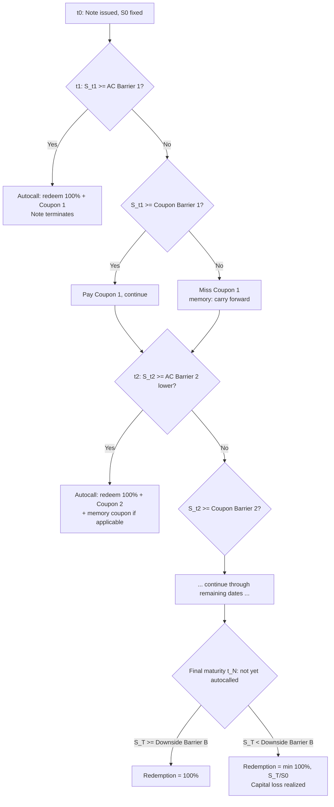

## Autocall Trigger Mechanics

### Overview

Autocallable notes (also referred to as "autocalls" or, in single-underlying reverse-convertible form, "Phoenix Autocallables") are structured products that early-redeem automatically when the underlying (or basket) meets a predefined trigger condition on a scheduled observation date. The autocall trigger transforms an otherwise fixed-maturity structured note into a **path-dependent, Bermudan-style contingent redemption instrument**, with the redemption date itself a random variable dependent on the underlying's trajectory. This document covers trigger construction, coupon interaction, barrier layering, and pricing/hedging mechanics.

---

### Core Trigger Mechanism

#### Observation Schedule and Trigger Condition

At each scheduled observation date $t_i$ ($i = 1, \dots, N$), the underlying's level $S_{t_i}$ is compared against an **autocall barrier** $K_i^{AC}$, typically expressed as a percentage of initial spot $S_0$:

$$\text{Trigger}_i = \mathbb{1}\left[S_{t_i} \geq K_i^{AC}\right]$$

If triggered, the note redeems early at $t_i$, paying:

$$\text{Redemption}_i = 100\% \times N_{notional} + \text{Coupon}_i \ (\text{and often accrued memory coupons})$$

and no further observation dates are evaluated. If no observation date triggers, the note runs to final maturity $T = t_N$, at which point a **different payoff logic** applies (typically the capital-at-risk redemption via a downside barrier).

**Key Points**

- The autocall barrier $K_i^{AC}$ is commonly set at or near $100\%$ of initial spot for the first observation, and many structures apply a **step-down schedule**, lowering the barrier at each subsequent date (e.g., $100\%, 95\%, 90\%, \dots$) to increase the cumulative probability of early redemption over the note's life.
- Observation frequency is typically quarterly, semi-annually, or annually; higher frequency increases the effective "optionality" priced into the note and generally raises the fair coupon (more chances to call = higher expected early redemption = shorter expected duration = different funding cost profile).
- The trigger is a **discrete digital condition** — there is no partial autocall; the entire notional redeems or nothing does at that date.

#### Step-Down Barrier Schedule — Worked Example

5-year note, annual observations, step-down autocall barrier:

| Year | Autocall Barrier ($K_i^{AC}$) | Coupon if Triggered |
| --- | --- | --- |
| 1 | 100% | 8% |
| 2 | 95% | 16% (cumulative, if memory feature) |
| 3 | 90% | 24% |
| 4 | 85% | 32% |
| 5 (maturity) | 80% (often waived — see maturity logic) | 40% |

The step-down schedule is calibrated so that as time passes (and thus as the remaining volatility-driven uncertainty compounds), the bar for triggering redemption is progressively lowered — reflecting that a smaller relative recovery is "good enough" to call the note later in its life, partially compensating for the coupon foregone in earlier non-trigger years.

---

### Coupon Interaction: Fixed, Conditional, and Memory Coupons

#### Fixed (Guaranteed) Coupon Autocalls

Simplest variant: coupon $C_i$ is paid **regardless of underlying performance** as long as the note has not yet been called or matured with a loss. The autocall barrier only governs redemption timing, not coupon eligibility.

#### Conditional (Phoenix-style) Coupon

More common in current retail structuring: the coupon at $t_i$ is paid only if a **separate coupon barrier** $K_i^{C}$ (often lower than or equal to $K_i^{AC}$) is also satisfied:

$$\text{Coupon}_i = C \times \mathbb{1}\left[S_{t_i} \geq K_i^{C}\right]$$

This decouples the "pays a coupon" condition from the "redeems early" condition — a note can pay a coupon at $t_i$ without autocalling if $K_i^C \le S_{t_i} < K_i^{AC}$.

#### Memory Coupon Feature

Under a memory feature, if the coupon condition is missed at $t_j$ but is subsequently satisfied at a later date $t_k > t_j$, **all previously missed coupons are paid retroactively** at $t_k$:

$$\text{Coupon}_k^{memory} = C \times \left(\sum_{m: t_{last\ paid} < t_m \leq t_k} \mathbb{1}[\text{no prior payment at } t_m]\right)$$

**Key Points**

- Memory coupons materially increase the expected coupon value versus non-memory structures and are priced as a **strip of digital options with path-dependent (cumulative) payoff**, not independent digitals — the value of the memory feature depends on the joint probability of "eventually recovering above barrier," which is higher than the marginal per-period probability.
- The combination of step-down autocall barrier + conditional coupon barrier + memory feature is the dominant retail autocallable template in EU and Asian structured note markets as of the last training update; exact prevailing conventions should be verified against current issuer term sheets since naming and feature combinations evolve by issuer and jurisdiction. [Unverified]

---

### Maturity (Non-Triggered) Payoff Logic

If the note survives to final maturity without autocalling, redemption typically depends on a **separate downside barrier** $B$ (distinct from and usually well below the autocall/coupon barriers), most commonly structured as one of:

1. **European-style knock-in put** (barrier observed only at maturity):

   $$\text{Redemption}_T = \begin{cases} 100\% & S_T \geq B \\ \min\left(100\%, \frac{S_T}{S_0}\right) & S_T < B \end{cases}$$
2. **American-style knock-in put** (barrier monitored continuously or discretely throughout the note's life, not just at maturity) — this variant is materially more expensive to the investor (cheaper embedded put sold by the investor) since continuous/frequent monitoring increases the probability of ever touching the barrier versus only checking at the single maturity date.

**Key Points**

- The choice between European- and American-style downside barrier is one of the most consequential structuring decisions in an autocallable — it drives a large share of the note's total risk and is frequently the least well-understood feature by retail buyers, since the "barrier" is often marketed with a single percentage without clearly distinguishing monitoring style.
- Some structures include a **capital protection floor** even below the knock-in barrier (partial protection), converting the payoff from linear participation in $S_T/S_0$ to a floored/capped structure — this is a product-design choice, not a market standard.

---

### Payoff Timeline Diagram

---

### Pricing and Replication

#### Decomposition

An autocallable is replicated as a **strip of forward-starting binary options plus a knock-in put at maturity**:

1. **Autocall digitals**: At each $t_i$, a binary/digital call option paying the accreted redemption value, conditional on *no prior trigger* — this makes each period's digital a **compound/conditional option**, since its existence depends on non-exercise at all prior dates.
2. **Coupon digitals** (if conditional): Separate digital call struck at $K_i^C$, similarly conditional on survival to $t_i$.
3. **Terminal knock-in put**: A down-and-in put (European or American barrier style) struck at $S_0$ (or the relevant participation level), active only in the no-autocall path.

Because each component's existence is conditional on the path not having triggered earlier, autocallables cannot be priced as independent sums of vanilla options — they require either:

- **Monte Carlo simulation**, simulating the full path and applying trigger logic sequentially per path, or
- **PDE/lattice backward induction**, solving the value function backward from maturity, applying the trigger condition as a boundary condition at each observation date (this is the more standard desk approach for single-underlying autocalls, since it's a genuinely Bermudan-style problem well-suited to backward induction).

#### Backward Induction Value Function

Let $V_i(S)$ be the note's value immediately before the $t_i$ observation. The backward recursion:

$$V_i(S) = \begin{cases} 100\% + C_i^{accrued} & \text{if } S \geq K_i^{AC} \\ e^{-r\Delta t}\,\mathbb{E}\left[V_{i+1}(S_{t_{i+1}}) \mid S_{t_i} = S\right] + C_i \cdot \mathbb{1}[S \geq K_i^C] & \text{otherwise} \end{cases}$$

with terminal condition $V_N(S)$ given by the maturity payoff logic (knock-in put formula above).

**Key Points**

- This backward induction is directly analogous to Bermudan swaption/option pricing — the autocall trigger acts as an **early-exercise boundary imposed by product design** (not chosen by the holder, but by the deterministic trigger rule), simplifying the problem relative to true American/Bermudan optionality since there is no optimal-stopping decision to solve for — the "exercise" is mechanical.
- [Inference] Because the "exercise" boundary is fixed by contract rather than optimized, autocallables are computationally cheaper to price than comparable Bermudan swaptions of similar dimensionality, since no least-squares Monte Carlo (Longstaff-Schwartz) continuation-value regression is needed for the trigger decision itself — only for any embedded American-style barrier monitoring within the terminal payoff.

---

### Greeks and Risk Profile

- **Delta**: Highly **discontinuous near each autocall barrier** as an observation date approaches — a small move in spot across $K_i^{AC}$ changes the note from "redeems now at 100%+coupon" to "continues with full remaining optionality," creating large delta jumps (pin risk) that intensify as $t \to t_i$.
- **Gamma**: Large and unstable near autocall barriers close to observation dates — analogous to a digital option's gamma spike, requiring active delta-hedging management ("gamma scalping" or barrier-shift reserving) by the issuing desk in the days surrounding each observation date.
- **Vega**: Generally **negative** — higher volatility increases the probability of the underlying being below the autocall barrier (delaying redemption) and increases the probability of breaching the downside knock-in barrier at maturity, both of which reduce note value to the investor (increase risk retained). This is the primary reason autocallables are structured as a way for issuers to **sell volatility** to retail investors in exchange for an enhanced coupon.
- **Correlation** (basket/worst-of autocalls): Strongly short correlation — lower correlation between basket constituents reduces the probability that *all* assets simultaneously clear the autocall barrier (in a worst-of structure), delaying redemption and increasing downside barrier breach probability, both of which reduce value to the investor.
- **Theta**: Coupon accrual creates a sawtooth theta profile — value increases steadily as each coupon/autocall date approaches (time value of an approaching conditional payment), then jumps discontinuously if the trigger fires.

---

### Structural Comparison: Autocall Trigger Variants

| Variant | Autocall Condition | Common Use Case |
| --- | --- | --- |
| Standard step-down autocall | $S_{t_i} \geq K_i^{AC}$, declining schedule | Retail income notes, single stock/index |
| Worst-of basket autocall | $\min_j(S_{t_i}^{(j)}/S_0^{(j)}) \geq K_i^{AC}$ | Enhanced coupon via basket dispersion |
| Best-of basket autocall | $\max_j(S_{t_i}^{(j)}/S_0^{(j)}) \geq K_i^{AC}$ | Rare; cheaper optionality, lower coupon |
| Snowball autocall | Coupon increases with each missed observation (memory + escalating rate) | Aggressive income enhancement, popular in Asia-Pacific retail |
| Kick-out with no coupon barrier | Fixed coupon, autocall barrier only | Simplified retail marketing, less path complexity |

---

### Model Risk and Practical Considerations

**Key Points**

- **Barrier monitoring convention risk**: Whether observation is "closing price only" versus "intraday touch" for the terminal knock-in barrier is a critical, often contractually buried detail that dramatically changes fair value — intraday monitoring approximately doubles effective breach probability relative to close-only monitoring for typical daily volatility assumptions. [Inference — magnitude is illustrative and instrument/volatility-dependent, not a fixed multiplier]
- **Dividend and repo risk**: For single-stock autocalls, the forward level (and hence trigger probability) is highly sensitive to **dividend assumptions** — a specific, often illiquid input for less-covered names — making autocall pricing meaningfully exposed to dividend curve risk in addition to volatility and correlation.
- **Skew dependency**: Because the terminal payoff embeds a downside put struck well OTM while the autocall triggers are near-ATM-to-ITM digitals, the note's total value depends on the **full volatility skew shape**, not a single implied volatility — flat-vol pricing models will systematically mis-price autocallables, sometimes materially.
- **Regulatory scrutiny**: [Unverified] Autocallable structures have drawn regulatory attention in multiple jurisdictions (e.g., FINRA investor alerts in the US, ESMA product governance guidance in the EU) regarding retail suitability, given the complexity of trigger/barrier interaction versus the simplicity of the marketed "enhanced yield" narrative; current regulatory posture should be verified against the relevant jurisdiction's latest guidance rather than assumed static.

---

**Related Topics**

- Phoenix note structuring and conditional coupon barrier calibration
- Snowball and snowball-cash autocallables (Asia-Pacific retail structures)
- Bermudan swaption pricing and Longstaff-Schwartz least-squares Monte Carlo
- Worst-of/best-of basket option correlation and dispersion trading
- Knock-in put replication: European vs. American barrier monitoring
- Digital option replication via tight call spreads
- Napoleon and Altiplano payoffs (comparative cliquet/barrier exotic structures)