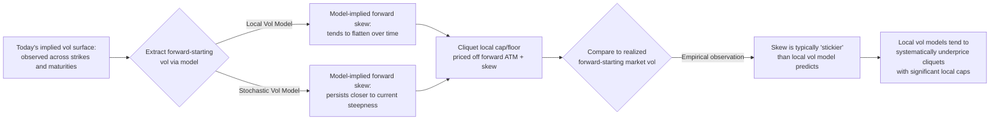

## Capped and Floored Cliquets

### Overview

Capped and Floored Cliquets (also termed "ratchet options" or "locally-capped, globally-floored cliquets" depending on aggregation structure) are the foundational building block of the cliquet family, from which Napoleon, Snowball, and most coupon-escalating exotics are derived. A cliquet decomposes a single long-dated option into a **series of forward-starting options over consecutive sub-periods**, with each period's return individually capped and/or floored before aggregation into a final payoff. This document covers the core local/global cap-floor mechanics, aggregation conventions, and the forward-volatility pricing problem that makes cliquets a canonical test case for volatility model risk.

---

### Core Structural Definition

#### Periodic Return Capping and Flooring

At each reset date $t_i$, the underlying's periodic return is computed and then individually constrained:

$$r_i = \frac{S_{t_i} - S_{t_{i-1}}}{S_{t_{i-1}}}$$

$$r_i^{local} = \min\left(C_{local},\ \max\left(F_{local},\ r_i\right)\right)$$

where $F_{local}$ is the **local floor** (commonly $0\%$, protecting each period from negative returns) and $C_{local}$ is the **local cap** (commonly a modest positive percentage, e.g., $3$–$8\%$ per period), limiting the upside captured in any single sub-period.

**Key Points**

- The local floor at $0\%$ is the single most common convention — it means each period's return, if negative, contributes nothing to the aggregate payoff rather than a negative drag, structurally similar to the "floor on worst return" mechanic in Napoleon structures but applied to **every** period rather than only the single worst one.
- The local cap exists primarily as a **cost-control mechanism** for the structurer — without it, a cliquet with only a floor (no cap) is effectively a strip of at-the-money forward-starting call options, which becomes prohibitively expensive as the number of reset periods increases, since each period resets the option to at-the-money regardless of prior performance (removing the "cheapening" effect of moving out-of-the-money that a standard long-dated call would experience after a large early rally).
- Typical reset frequency is monthly, though quarterly and annual reset cliquets exist; higher reset frequency increases the number of independent local caps/floors, which — for pure local-cap-floor-then-sum structures — tends to **reduce** the terminal payoff's volatility relative to a single long-dated option of equivalent maturity, since sequential capping suppresses the compounding of large moves (a structural volatility-dampening effect distinct from, and often confused with, actual realized market volatility).

#### Aggregation Methods

The capped/floored periodic returns are aggregated into a terminal payoff via one of two dominant conventions:

**1. Additive (Sum) Cliquet:**

$$\text{Payoff} = \max\left(0,\ G_{floor} + \sum_{i=1}^{N} r_i^{local}\right)$$

**2. Compounding (Product) Cliquet:**

$$\text{Payoff} = \max\left(0,\ \prod_{i=1}^{N}\left(1 + r_i^{local}\right) - 1\right)$$

where $G_{floor}$ is an optional **global floor** applied to the aggregate sum (frequently $0\%$, guaranteeing no loss of principal even if the sum of local returns is negative — though under a $0\%$ local floor convention, the sum of local returns is by construction non-negative, making a separate global floor redundant unless $F_{local} < 0$).

**Key Points**

- The additive and compounding conventions produce **meaningfully different payoffs** whenever local returns are non-trivial in magnitude, since compounding captures the multiplicative effect of sequential gains (a $5\%$ gain followed by another $5\%$ gain compounds to $10.25\%$, not $10\%$) — compounding cliquets are therefore generally more valuable to the holder for a given set of local caps, all else equal, and correspondingly more expensive.
- A **global cap** $G_{cap}$ is sometimes layered on top of either aggregation method, capping the total payoff regardless of how favorably the local returns compound — this converts the structure into a fully "double-capped" instrument (local cap per period + global cap on aggregate), further reducing cost and total optionality value.

#### Worked Example — Additive vs. Compounding Divergence

12-month cliquet, monthly resets, local floor $0\%$, local cap $4\%$, hypothetical realized monthly returns (post-capping):

| Month | Raw Return | Post-Cap/Floor $r_i^{local}$ |
| --- | --- | --- |
| 1–6 | Various | $4\%$ (capped) each month |
| 7–12 | Various | $0\%$ (floored) each month |

**Additive aggregation:**

$$\text{Payoff} = \max(0,\ 0\% + 6 \times 4\% + 6 \times 0\%) = 24\%$$

**Compounding aggregation:**

$$\text{Payoff} = \max\left(0,\ (1.04)^6 \times (1.00)^6 - 1\right) = \max(0,\ 1.2653 - 1) = 26.53\%$$

The compounding structure delivers $\sim$2.5 percentage points more in this scenario purely from the multiplicative effect of six consecutive $4\%$ gains — this divergence grows super-linearly with both the local cap magnitude and the number of capped-positive periods, which is precisely why compounding cliquets carry a meaningfully higher fair-value premium.

---

### The Forward Volatility Pricing Problem

#### Why Cliquets Are a Canonical Volatility-Model Test Case

Because each sub-period's option resets to be priced off **forward-starting, at-the-money (or near-the-money) implied volatility**, the cliquet's fair value depends almost entirely on the **term structure and dynamics of forward volatility** — not on the current spot volatility surface directly, since by the time each period begins, the "spot" for that period's option is the (unknown at inception) underlying level at the start of that period.

$$\sigma_{fwd}(t_{i-1}, t_i) = \sqrt{\frac{\sigma_{implied}(t_i)^2 \cdot t_i - \sigma_{implied}(t_{i-1})^2 \cdot t_{i-1}}{t_i - t_{i-1}}}$$

This forward volatility is only directly observable from the **current** term structure of implied volatilities under a model assumption of **deterministic (or at least, model-consistent) forward volatility evolution** — a standard Black-Scholes term structure model implies forward volatilities that are fully determined by today's ATM vol curve, but this assumption is known to be **empirically poor**: realized forward-starting implied volatilities in practice do not simply equal the model-implied forward derived from today's curve, particularly for the *skew* dimension.

**Key Points**

- This is the origin of the well-known **"cliquet volatility puzzle"** or **forward skew problem**: local volatility models (calibrated to fit today's full smile at every maturity) systematically imply a **flattening forward skew** — i.e., the model predicts that the skew observed today at, say, the 1-month tenor will be much flatter when re-observed as a forward-starting 1-month option beginning in 11 months. Empirically, however, skew tends to be **much stickier** — persisting at roughly its current steepness as time evolves, rather than flattening as local vol models predict.
- Because cliquets' local caps and floors are struck at or near the forward-at-the-money level, their value is disproportionately sensitive to **forward at-the-money volatility and the forward skew's steepness**, making the choice between local volatility, stochastic volatility (e.g., Heston), and stochastic-local volatility (SLV) hybrid models a **first-order pricing decision** rather than a second-order refinement — unlike for vanilla options, where these models are largely calibrated to agree by construction.
- [Inference] Pure local volatility models tend to **underprice** cliquets with significant local caps (since the model-implied flattening forward skew understates the value of the capped upside optionality relative to what sticky-skew dynamics would suggest), while models incorporating stochastic volatility or a "sticky-strike"/"sticky-delta" forward skew assumption tend to produce materially higher cliquet valuations for otherwise identical local cap/floor parameters — the specific magnitude of this discrepancy is model- and market-regime-dependent and should not be treated as a fixed universal offset.

#### Forward Volatility Term Structure — Diagram

---

### Greeks Profile

- **Vega (forward vega)**: The dominant risk metric for cliquets is not spot vega in the traditional sense but **forward-bucket vega** — sensitivity to the implied volatility of each individual forward-starting period, decomposed period by period. A cliquet's total vega can appear small or even near-zero at the aggregate level while carrying substantial *offsetting* forward-bucket exposures (long vega on later periods, effectively short on the realized path of earlier periods once they've locked in), making naive parallel-vega-shift hedging insufficient.
- **Volga (vega convexity)**: Capped cliquets exhibit **negative volga** in the capped region (higher volatility beyond a certain point stops helping, since the local cap limits upside capture, while continuing to increase the probability of hitting the floor) — this is structurally the opposite of the Napoleon's worst-of floor mechanic (positive volga), illustrating how the *direction* of the cap/floor asymmetry flips the convexity sign.
- **Gamma**: Concentrated near each period's reset date and near the local cap/floor thresholds — as spot approaches a level that would cap or floor the current period's return, gamma spikes similarly to a digital option's behavior near its strike.
- **Correlation to realized volatility (not implied)**: [Inference] Because local floors suppress downside contribution while local caps limit upside, a capped-and-floored cliquet's *sensitivity to realized volatility* is genuinely ambiguous in sign and depends on where the underlying's realized path sits relative to the cap/floor band at each reset — high realized volatility increases the chance of touching the cap (helpful, up to the cap) but also increases the chance of falling into the floored region more often (return not captured at all), meaning the net realized-vol sensitivity is a function of the cap/floor width relative to typical period volatility, not a fixed-sign exposure.

---

### Comparative Structural Table

| Feature | Local Floor Only | Local Cap Only | Local Floor + Cap (Collar) | Global Floor/Cap Layer |
| --- | --- | --- | --- | --- |
| Protects against | Negative periods dragging aggregate | N/A (limits upside instead) | Both single-period tails | Aggregate-level outcome only |
| Cost impact | Increases cost (more optionality retained) | Decreases cost (caps value given away) | Balanced — narrows cost vs. floor-only | Secondary cost adjustment |
| Vega sign (typical) | Positive | Can be negative in cap region | Mixed — volga sign flips near cap | Depends on global strike placement |
| Common use case | Base cliquet / Napoleon worst-of | Cost-controlled retail ratchet notes | Standard retail "collared" cliquet | Additional principal protection overlay |

---

### Relationship to Other Cliquet-Family Structures

**Key Points**

- The **Napoleon** payoff (covered previously) is a specific case of a globally-floored additive cliquet where the floor/cap treatment is applied asymmetrically to only the single worst-performing period rather than uniformly to every period — it can be understood as a capped-and-floored cliquet with a **non-uniform, order-statistic-dependent local treatment**.
- The **Snowball's** escalating coupon can be viewed as a capped-and-floored cliquet where the "cap" per period is effectively the fixed coupon rate itself (a full digital cap at the coupon level, rather than a continuous linear cap), combined with the autocall's early-termination feature layered on top.
- Standard **reverse cliquets** (a related but distinct variant, sometimes covered separately) invert the typical structure: the holder starts with a high guaranteed coupon that is then **reduced** by the sum of any negative periodic returns, creating a payoff that is short volatility overall rather than long — this is a materially different risk direction from the capped/floored cliquets described here, which remain net long optionality (long the sum/product of locally-capped-and-floored returns).

**Related Topics**

- Forward volatility and forward skew modeling (local vol, Heston, SLV comparison)
- Napoleon and Altiplano payoffs (worst-of order-statistic cliquet variant)
- Snowball and Accumulator structures (escalating digital-cap cliquet variant)
- Reverse cliquets and short-volatility coupon structures
- Ratchet option replication via strips of forward-starting calls/puts
- Volga and vanna hedging for path-dependent exotic books
- Sticky-strike vs. sticky-delta volatility surface dynamics