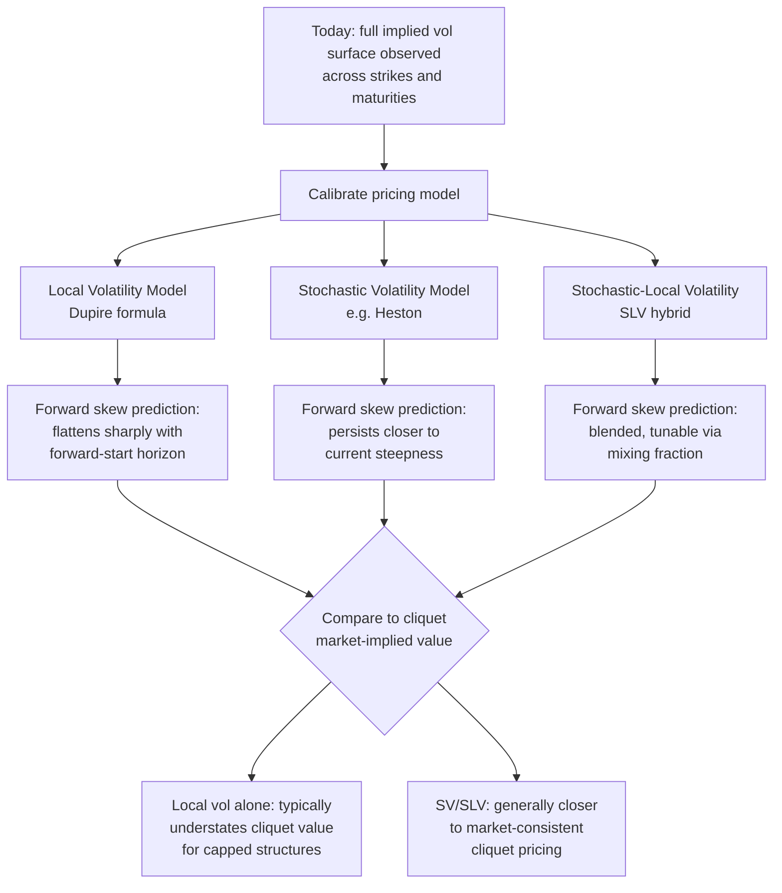

## Forward Volatility Risk in Cliquets

### Overview

Forward volatility risk is the central and most economically significant risk factor in cliquet-family structures, distinguishing them from vanilla or simple barrier exotics. Because each reset period's optionality is priced off volatility that has not yet been realized or directly observed — the implied volatility of an option that will only begin its life at a future date — cliquets expose both the holder and the hedging desk to model risk in the **forward volatility surface** itself, not merely to the current spot volatility surface. This item provides a focused, quantitative treatment of forward volatility extraction, model-implied dynamics, hedging breakdown, and the specific risk metrics used to manage cliquet books.

---

### Defining Forward Volatility

#### Mathematical Extraction from the Term Structure

Given a term structure of at-the-money implied variance $\sigma_{implied}^2(t)$ observed today, the **model-implied forward variance** between two future dates $t_1 < t_2$ is extracted via the additivity of variance under standard diffusion assumptions:

$$\sigma_{fwd}^2(t_1, t_2) = \frac{\sigma_{implied}^2(t_2) \cdot t_2 - \sigma_{implied}^2(t_1) \cdot t_1}{t_2 - t_1}$$

This formula holds **exactly** under any model where instantaneous variance is a deterministic function of time only (i.e., no smile, no stochastic volatility) — in that special case, forward variance is unambiguous and model-independent. The moment a smile/skew is introduced, however, forward *volatility* additionally depends on **which strike** the forward-starting option will be measured against, and that strike is itself a function of the (unknown) underlying level at $t_1$ — this is the root of the entire forward volatility modeling problem.

**Key Points**

- For a cliquet, the relevant forward volatility is not simply the forward ATM level from the formula above — it is the forward volatility **at the strike that will be at-the-money (or at the relevant local cap/floor level) when that period begins**, which requires a model assumption about how the *entire smile*, not just the ATM level, evolves forward in time.
- Three canonical model assumptions produce three materially different forward skew predictions: **sticky-strike** (implied vol at a fixed absolute strike stays constant as spot moves — implies the smile shifts with spot), **sticky-delta/sticky-moneyness** (implied vol at a fixed percentage-moneyness stays constant — implies the ATM point always carries today's ATM vol regardless of where spot has moved), and **sticky-local-vol** (the local volatility surface, not the implied surface, is held fixed, producing its own distinct forward skew prediction that is generally intermediate between the other two).

#### Why Local Volatility Models Flatten Forward Skew

A local volatility model, by construction, is calibrated to **exactly reproduce today's entire implied volatility surface** (every strike, every maturity) via a single deterministic local volatility function $\sigma_{LV}(S,t)$ (Dupire's formula). Once calibrated, this same local volatility function is used to generate the model's forward-starting implied volatility surface.

[Inference] The well-documented empirical/theoretical result — consistently discussed in derivatives literature since the early 2000s — is that local volatility models generate forward skews that **flatten rapidly with the length of the forward-start period**: a 1-month option starting in 11 months exhibits far less skew under the local vol model's forward projection than the market's actual 1-month skew observed *today*. This occurs because Dupire local volatility, by mechanically fitting every maturity's smile from a single deterministic function of spot and time, effectively "explains away" much of the skew as a *spot-level effect* rather than a persistent *time-to-maturity effect*, causing the model to predict that skew should diminish once the "explaining" spot-dependence resets at each new forward-start date.

**Key Points**

- This flattening is the single most consequential and well-known local volatility model artifact in the context of cliquet/forward-starting option pricing, and is the primary reason local volatility models alone are considered **inadequate for reliable cliquet valuation** by practitioners, despite being perfectly adequate (by construction) for pricing vanilla options of any single maturity.
- Empirically, realized forward-starting implied volatility surfaces (observed later, once the forward-start date has actually arrived) tend to exhibit skew that is **closer to "sticky" — i.e., closer to today's skew shape — than the local vol model's flattened prediction**, though the degree of stickiness itself varies by asset class, market regime, and time period, and is not a fixed universal constant. [Unverified — degree and consistency of forward skew stickiness varies materially by market and period; treat directional statement as the well-established qualitative result, not a precise quantitative rule]

---

### Model Comparison: Forward Skew Behavior

---

### Stochastic Volatility and SLV Approaches

#### Why Stochastic Volatility Models Preserve Forward Skew

Under a stochastic volatility model (e.g., Heston, SABR), the instantaneous volatility itself follows a random process correlated with the underlying (the leverage/correlation parameter $\rho$), rather than being a deterministic function of spot and time. This structural feature means the model's **forward-starting smile does not collapse to flat** the way local volatility's does — the stochastic vol-of-vol and correlation parameters continue to generate skew at every forward horizon, more consistent with the empirically observed persistence of skew.

$$dS_t = \mu S_t\,dt + \sqrt{v_t}\,S_t\,dW_t^S, \qquad dv_t = \kappa(\theta - v_t)\,dt + \xi\sqrt{v_t}\,dW_t^v, \qquad dW^S dW^v = \rho\,dt$$

**Key Points**

- Pure stochastic volatility models, however, typically **cannot exactly fit today's entire implied volatility surface** across all strikes and maturities simultaneously (unlike local volatility, which fits by construction) — Heston, for instance, has a limited number of free parameters and generally leaves residual calibration error versus the full observed smile, especially at short maturities and extreme strikes.
- **Stochastic-Local Volatility (SLV)** hybrid models address this by combining a stochastic volatility "backbone" (providing realistic forward skew dynamics) with a local volatility "leverage function" multiplier calibrated to force exact fit to today's full smile — the leverage function absorbs the calibration residual while the stochastic component drives the forward dynamics, making SLV the practitioner-standard approach for cliquet desks needing both exact current-smile fit and realistic forward skew behavior.
- The **mixing fraction** between the stochastic and local volatility components in an SLV model is itself a free modeling choice (not derived from market data directly) — a purely local-vol-weighted SLV model degenerates back toward the flattening-skew problem, while a purely stochastic-weighted model may leave meaningful current-smile calibration error, making this parameter a direct, tunable lever on cliquet valuation that requires independent calibration or judgment (often against a liquid forward-starting option market, cliquet-specific market quotes, or historical realized forward skew, where available).

---

### Hedging Breakdown: Why Standard Vega Hedging Fails

#### The Forward-Bucket Vega Problem

A cliquet's aggregate/parallel vega (sensitivity to a uniform shift in the entire implied volatility surface) can be **near zero or even sign-ambiguous** while the position carries substantial risk to the **shape** of forward volatility evolution — hedging only parallel vega leaves the position exposed to a "forward skew realization" risk that a single Greek cannot capture.

The standard risk decomposition used by cliquet desks:

$$\text{Vega}_{total} = \sum_{i=1}^{N} \text{Vega}_i^{fwd-bucket}$$

where $\text{Vega}_i^{fwd-bucket}$ is the sensitivity to the implied volatility specifically governing the $i$-th forward-starting sub-period, computed by bumping only that segment of the forward volatility term structure and holding all others fixed.

**Key Points**

- Because each period's local cap/floor is triggered at a strike that is only known once the prior period's return is realized, forward-bucket vegas are themselves **path-dependent and re-computed dynamically** as the note progresses — the risk decomposition is not static at inception but must be recalculated at each reset date as prior periods lock in.
- Desks managing cliquet books typically hedge using a combination of (1) **calendar spreads in listed options** across the relevant maturities to approximate forward-bucket vega exposure, (2) **variance swaps or volatility swaps** for cleaner forward-variance exposure where liquid, and (3) residual **model risk reserves** held against the irreducible uncertainty in which forward skew model (local vol, SV, SLV, or a specific mixing fraction) most accurately reflects eventual realized dynamics — this last component is a genuine, unhedgeable model risk rather than a market risk with an available hedging instrument.
- [Inference] The practical consequence is that cliquet trading desks generally treat forward volatility model choice as a **P&L-relevant business decision with direct bid/offer and reserve implications**, not merely a technical pricing detail — the spread between local-vol-implied and SV/SLV-implied cliquet values can be economically material for cap/floor parameters and reset frequencies common in retail structured products, though the exact magnitude is instrument- and market-regime-specific.

---

### Realized Volatility Path-Dependency (Second-Order Effect)

Beyond the *implied* forward volatility modeling problem, cliquets also carry genuine sensitivity to the **path of realized volatility** because local caps and floors interact nonlinearly with the actual sequence of returns observed:

- High realized volatility in early periods, if it pushes returns beyond the local cap repeatedly, **wastes** volatility (the excess above the cap is not captured in the payoff) — meaning realized-vol sensitivity is not monotonic once the local cap is being hit frequently.
- Low realized volatility keeps most periods within the uncapped band, making the payoff's realized-vol sensitivity closer to a standard positive-vega profile in that regime.

**Key Points**

- This creates a **regime-dependent realized-volatility sensitivity**: cliquets with local caps set well above typical single-period volatility behave like standard long-vega instruments, while cliquets with tight local caps (frequently binding) behave increasingly like a strip of digital options, with correspondingly digital-like (discontinuous, cap-proximity-concentrated) volatility sensitivity — practitioners typically characterize this via simulation across a range of realized volatility scenarios rather than a single closed-form Greek.

---

### Summary Table: Forward Volatility Risk Management Toolkit

| Risk Component | Description | Primary Mitigant |
| --- | --- | --- |
| Forward skew model risk | Uncertainty in how skew evolves forward (flattening vs. sticky) | SLV calibration, reserve policy, benchmark against liquid forward-starting quotes |
| Forward-bucket vega | Sensitivity to specific period's forward implied vol | Calendar spreads, tenor-matched listed option hedges |
| Mixing fraction sensitivity | SLV local/stochastic weighting choice | Independent calibration, historical forward skew backtesting |
| Realized volatility path-dependency | Nonlinear interaction of realized returns with local caps/floors | Scenario/Monte Carlo stress testing across realized vol regimes |
| Cross-gamma between periods | Correlation of hedging P&L across sequential reset dates | Portfolio-level Monte Carlo risk aggregation, not per-period Greeks alone |

---

**Related Topics**

- Capped and Floored Cliquets (structural mechanics and aggregation conventions)
- Dupire local volatility and the forward Kolmogorov (Fokker-Planck) equation
- Heston stochastic volatility model calibration and parameter interpretation
- Stochastic-local volatility (SLV) hybrid model construction and leverage function calibration
- Sticky-strike vs. sticky-delta volatility surface dynamics
- Variance and volatility swap replication for forward variance hedging
- Napoleon and Altiplano payoffs (order-statistic and barrier-based cliquet variants)