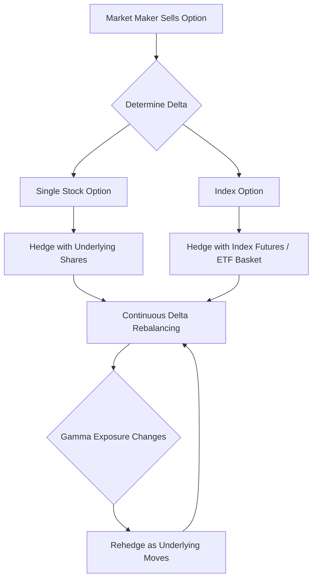

## Single Stock and Index Options Markets

### Market Structure Overview

Single stock and index options are standardized derivative contracts granting the holder the right, but not the obligation, to buy (call) or sell (put) an underlying asset at a predetermined strike price on or before expiration. The two segments differ meaningfully in mechanics, participants, and risk profile despite sharing common pricing frameworks.

**Key Points**

- Single stock options reference an individual equity (e.g., AAPL, TSLA options)
- Index options reference a basket/index value (e.g., SPX, NDX, RUT)
- Both trade on regulated exchanges (CBOE, NYSE Arca, Nasdaq PHLX) and clear through the Options Clearing Corporation (OCC) in the U.S.
- Index options are typically cash-settled; most U.S. single stock options are physically settled

### Contract Specifications

#### Single Stock Options

- Standard contract multiplier: 100 shares per contract
- Exercise style: American (exercisable any time before expiration) — standard for U.S. equity options
- Settlement: Physical delivery of underlying shares
- Strike intervals: Typically $0.50, $1, or $2.50 depending on underlying price
- Expirations: Weekly, monthly (third Friday), quarterly, and LEAPS (up to 3 years out)

#### Index Options

- Contract multiplier: Typically 100× the index value, though this varies by product ($100 for SPX, $10 for XSP "mini-SPX")
- Exercise style: Predominantly European (exercisable only at expiration) — e.g., SPX, NDX
- Settlement: Cash-settled based on the Special Opening Quotation (SOQ) or closing index value
- Some index products (e.g., OEX/S&P 100) retain American-style exercise

**Example**

An SPX call with strike 5,000 and multiplier 100 settled at an index value of 5,050 pays:

$$(5050 - 5000) \times 100 = \$5{,}000$$

### American vs. European Exercise Mechanics

The exercise style materially affects early-exercise risk and dividend sensitivity.

- **American-style (single stocks):** Early exercise is rational primarily for deep in-the-money calls just before an ex-dividend date, when the dividend captured exceeds the remaining time value of the option
- **European-style (most indices):** No early exercise risk; pricing relies purely on terminal payoff, simplifying valuation via Black-Scholes without early-exercise premium adjustments

[Inference] The absence of early-exercise optionality in index options generally makes them marginally cheaper, all else equal, than an equivalent American-style contract on a similar underlying, though this is highly dependent on dividend yield and interest rate environment.

### Settlement Mechanics: PM vs. AM Settlement

Index options settle differently depending on the series:

- **AM-settled (traditional monthly SPX, NDX):** Settlement value derived from opening prices of constituent stocks on the morning of expiration Friday, published as the SOQ. This creates a divergence between the last tradeable price (Thursday close) and the actual settlement value.
- **PM-settled (SPXW weeklies, most modern index products):** Settlement based on the index's closing value on expiration day, more closely aligned with the final quoted price.

**Key Points**

- AM settlement introduces basis risk for hedgers who cannot adjust positions between Thursday's close and Friday morning's settlement calculation
- PM-settled products have become the dominant convention for newer weekly and daily-expiry contracts

### Pricing Framework

Both segments price off the same theoretical foundation, adjusted for exercise style and dividend treatment.

#### Black-Scholes-Merton for European Index Options

$$C = S_0 e^{-qT} N(d_1) - K e^{-rT} N(d_2)$$

where:

$$d_1 = \frac{\ln(S_0/K) + (r - q + \sigma^2/2)T}{\sigma\sqrt{T}}, \quad d_2 = d_1 - \sigma\sqrt{T}$$

- $S_0$: current index level
- $K$: strike price
- $q$: continuous dividend yield of the index
- $r$: risk-free rate
- $\sigma$: implied volatility
- $T$: time to expiration

#### American Single Stock Options

Priced via binomial/trinomial trees, finite-difference PDE solvers, or the Barone-Adesi-Whaley approximation to capture the early-exercise premium, since no closed-form solution exists for American calls/puts with discrete dividends.

**Key Points**

- Discrete dividend adjustments are critical for single stock options — a known dividend payment reduces the stock price on the ex-date, affecting call/put parity and early exercise incentives
- Index dividend yield is typically modeled as a continuous proportional yield since it aggregates hundreds of constituents

### Volatility Surface Differences

Single stock and index options exhibit structurally different implied volatility surfaces.

- **Index volatility skew:** Pronounced negative skew (put skew) — downside puts trade at materially higher implied volatility than upside calls, reflecting persistent demand for portfolio protection and the empirical negative correlation between index returns and volatility ("leverage effect" / volatility risk premium)
- **Single stock skew:** Generally flatter or less pronounced skew than index options; idiosyncratic events (earnings, M&A rumors) can produce smile-shaped or even positively skewed surfaces for individual names
- **Correlation and dispersion:** Index implied volatility embeds an implied correlation among constituents; when average single-stock implied volatility is high but index implied volatility is comparatively low, it signals low implied correlation — the basis for dispersion trading strategies

[Inference] The gap between index-implied and average single-stock-implied volatility (the "correlation risk premium") tends to widen during systemic stress periods, though the magnitude is regime-dependent and not a stable constant.

### Market Participants and Use Cases

| Participant | Single Stock Options | Index Options |
| --- | --- | --- |
| Retail traders | Directional speculation, covered calls, protective puts | Portfolio-level hedging, income strategies (iron condors) |
| Institutional hedgers | Hedging single-name exposure, executive stock plans | Macro hedging, tail-risk overlay programs |
| Market makers | Delta-hedge with underlying shares | Delta-hedge with futures (e.g., E-mini S&P) |
| Dispersion traders | Sell single-stock vol | Buy index vol (or vice versa) |

### Liquidity and Microstructure

- Index options (especially SPX) are among the most liquid derivatives globally, with tight bid-ask spreads in front-month, at-the-money strikes
- Single stock option liquidity varies enormously by name — mega-cap tech names (AAPL, NVDA, TSLA) have deep, liquid chains; small/mid-cap names often have wide spreads and thin open interest
- Payment for order flow (PFOF) and complex order routing (e.g., price improvement auctions) are prominent in single stock option execution
- Index options often trade via complex spread orders (verticals, condors, calendars) submitted as a single package to avoid legging risk

### Tax Treatment (U.S. Context)

- **Broad-based index options (SPX, RUT, NDX)** meeting IRS Section 1256 criteria receive 60/40 tax treatment: 60% taxed as long-term capital gains, 40% as short-term, regardless of holding period
- **Single stock options** are taxed under standard capital gains rules based on actual holding period, with no blended treatment

[Unverified] Specific eligibility under Section 1256 depends on the exact contract and current IRS guidance; treatment should be confirmed against the latest tax code and is not investment or tax advice.

### Options Chain Visualization (svg_diagram)

<svg xmlns="http://www.w3.org/2000/svg" viewBox="0 0 720 320">
\<style\>
.lbl { font-family: monospace; font-size: 12px; fill: #333; }
.hdr { font-family: monospace; font-size: 13px; font-weight: bold; fill: #111; }
.call { fill: #d6f5d6; }
.put { fill: #f5d6d6; }
.atm { fill: #fff3b0; }
.grid { stroke: #999; stroke-width: 1; }
\</style\>
<text x="10" y="20" class="hdr">Options Chain (svg_diagram)</text>
<text x="150" y="45" class="hdr">CALLS</text>
<text x="450" y="45" class="hdr">PUTS</text>
<text x="330" y="45" class="hdr">Strike</text>

<line x1="10" y1="55" x2="710" y2="55" class="grid" />
<text x="30" y="70" class="lbl">Bid</text>
<text x="90" y="70" class="lbl">Ask</text>
<text x="150" y="70" class="lbl">IV%</text>
<text x="210" y="70" class="lbl">OI</text>
<text x="330" y="70" class="lbl">Price</text>
<text x="450" y="70" class="lbl">Bid</text>
<text x="510" y="70" class="lbl">Ask</text>
<text x="570" y="70" class="lbl">IV%</text>
<text x="630" y="70" class="lbl">OI</text>

<g>
<rect x="10" y="80" width="300" height="24" class="call" opacity="0.4" />
<rect x="430" y="80" width="290" height="24" class="put" opacity="0.4" />
<text x="30" y="97" class="lbl">4.10</text>
<text x="90" y="97" class="lbl">4.20</text>
<text x="150" y="97" class="lbl">18.2</text>
<text x="210" y="97" class="lbl">5,120</text>
<text x="330" y="97" class="lbl">490</text>
<text x="450" y="97" class="lbl">0.85</text>
<text x="510" y="97" class="lbl">0.92</text>
<text x="570" y="97" class="lbl">22.4</text>
<text x="630" y="97" class="lbl">3,340</text>
</g>
<g>
<rect x="10" y="108" width="720" height="24" class="atm" opacity="0.6" />
<text x="30" y="125" class="lbl">2.55</text>
<text x="90" y="125" class="lbl">2.65</text>
<text x="150" y="125" class="lbl">17.1</text>
<text x="210" y="125" class="lbl">9,880</text>
<text x="330" y="125" class="hdr">500 (ATM)</text>
<text x="450" y="125" class="lbl">2.40</text>
<text x="510" y="125" class="lbl">2.50</text>
<text x="570" y="125" class="lbl">19.8</text>
<text x="630" y="125" class="lbl">8,410</text>
</g>
<g>
<rect x="10" y="136" width="300" height="24" class="call" opacity="0.4" />
<rect x="430" y="136" width="290" height="24" class="put" opacity="0.4" />
<text x="30" y="153" class="lbl">1.20</text>
<text x="90" y="153" class="lbl">1.28</text>
<text x="150" y="153" class="lbl">16.5</text>
<text x="210" y="153" class="lbl">4,050</text>
<text x="330" y="153" class="lbl">510</text>
<text x="450" y="153" class="lbl">5.60</text>
<text x="510" y="153" class="lbl">5.75</text>
<text x="570" y="153" class="lbl">26.1</text>
<text x="630" y="153" class="lbl">6,720</text>
</g>
<line x1="10" y1="164" x2="710" y2="164" class="grid" />
<text x="10" y="200" class="lbl">Skew: put IV (26.1%) &gt; ATM IV (18-20%) &gt; call IV (16.5%)</text>
<text x="10" y="220" class="lbl">— characteristic negative skew of index options</text>
</svg>

### Delta-Hedging Flow Diagram

### Risk Management Distinctions

- **Pin risk:** Prominent in single stock options at expiration when the stock closes very near the strike, creating uncertainty about assignment (relevant given physical settlement)
- **Systemic/gap risk:** Index options carry exposure to overnight and weekend macro events affecting the entire market simultaneously, whereas single stock options are additionally exposed to idiosyncratic event risk (earnings surprises, litigation, M&A)
- **Assignment risk:** Only relevant for American-style single stock options; index (European) options eliminate early assignment risk entirely for holders of short positions

### Regulatory and Clearing Considerations

- All U.S.-listed options clear through the OCC, which acts as central counterparty, mitigating bilateral counterparty risk
- Position and exercise limits apply per underlying to prevent market cornering, with limits varying significantly by name/index liquidity
- FINRA and exchange rules mandate specific margin treatments; portfolio margining (e.g., under SPAN or similar methodologies) is common for index options due to their use in broad hedging strategies

**Next Steps**

- Volatility Skew and Smile Dynamics
- Options Greeks (Delta, Gamma, Vega, Theta, Rho) in Practice
- Variance and Volatility Swaps
- Dispersion Trading Strategies
- VIX and Volatility Index Derivatives
- Options Market Making and Delta-Gamma Hedging
- Exotic Options on Indices (Barrier, Asian, Basket)