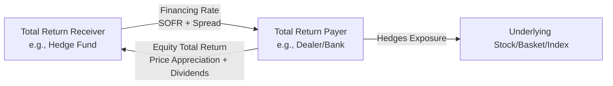

## Equity Swaps and Financing Structures

### Definition and Core Mechanics

An equity swap is a bilateral derivative contract in which two counterparties exchange cash flows over a specified period, with at least one leg referencing the total return (price appreciation plus dividends) of an equity, equity basket, or equity index, while the other leg typically references a funding rate (floating rate plus/minus a spread, or occasionally a fixed rate).

**Key Points**

- No exchange of the underlying shares occurs — the swap is purely a synthetic exposure
- Notional amount is set at inception and typically remains fixed (though resettable structures exist)
- Payments are netted and settled periodically (monthly, quarterly) or at maturity
- Widely used to obtain synthetic long or short equity exposure without direct share ownership

### Standard Structure: Total Return Swap (TRS)

The most common equity swap format is the Total Return Swap.

- **Equity leg (Total Return Receiver):** Receives capital appreciation of the underlying plus any dividends paid during the period; pays capital depreciation if the underlying falls
- **Funding leg (Total Return Payer):** Receives a financing rate (e.g., SOFR + spread) on the notional; pays out the equity total return

**Example**

A hedge fund enters a TRS on $10M notional of a stock basket, receiving total return and paying SOFR + 50 bps quarterly. If the basket appreciates 8% and pays 1% in dividends over the quarter:

$$\text{Fund receives} = (10{,}000{,}000 \times (0.08 + 0.01)) - (10{,}000{,}000 \times (\text{SOFR} + 0.005) \times \frac{90}{360})$$

The fund achieves the equity's total return exposure while only posting a fraction of the notional as collateral/margin — the core leverage mechanism.

### Cash Flow Diagram

### Economic Rationale and Use Cases

#### Synthetic Financing / Leverage

- Allows funds to gain leveraged equity exposure off-balance-sheet, since only margin/collateral is posted rather than full notional
- Avoids stamp duty, transaction taxes, or ownership restrictions applicable in certain jurisdictions
- Commonly used by hedge funds to scale exposure beyond what cash-funded positions would allow

#### Tax and Regulatory Arbitrage

[Inference] Historically, equity swaps have been used to defer or alter the character of taxable events (e.g., avoiding withholding tax on dividends or deferring capital gains recognition), though this has been increasingly curtailed by regulations such as U.S. Section 871(m), which imposes withholding tax on "dividend equivalent" payments under certain swap structures referencing U.S. equities.

#### Synthetic Short Exposure

- Enables short exposure without borrowing shares directly, useful when stock loan availability is constrained or borrow costs are prohibitively high
- The dealer (total return payer side from the client's perspective, if client is short) manages the actual short/borrow logistics

#### Regulatory Ownership Avoidance

[Inference] Swaps can be structured to obtain economic exposure to a company without triggering beneficial ownership disclosure thresholds (e.g., Schedule 13D filings in the U.S.), since the swap counterparty—not the total return receiver—technically holds the shares. This has drawn regulatory scrutiny (e.g., the Archegos Capital collapse in 2021 highlighted concentrated, undisclosed swap-based exposures).

### Basket and Index Equity Swaps

- **Single-stock swaps:** Reference one company's total return
- **Basket swaps:** Reference a custom-weighted basket of stocks, common for thematic or sector exposure
- **Index swaps:** Reference a published index (e.g., S&P 500 TR), often used by institutional asset managers to replicate index exposure without directly trading the constituent basket, reducing transaction costs and tracking friction

**Key Points**

- Basket composition and rebalancing terms are negotiated bilaterally and specified in the trade confirmation
- Index swaps typically reference the index's official Total Return variant to appropriately capture reinvested dividends

### Financing Structures: Prime Brokerage Synthetic Financing

Equity swaps sit within a broader category of synthetic financing structures used primarily by hedge funds via prime brokers.

| Structure | Mechanism | Primary Use |
| --- | --- | --- |
| Total Return Swap | Exchange total return for financing rate | Leveraged directional/basket exposure |
| Contract for Difference (CFD) | Similar to TRS, retail/institutional variant, mark-to-market daily | Retail leveraged trading (non-U.S. markets) |
| Portfolio Swap | Multi-name TRS covering an entire fund portfolio | Fund-level synthetic prime brokerage |
| Synthetic Prime Brokerage | Dealer holds actual securities; client holds swap exposure | Circumvents direct custody, consolidates financing |

[Unverified] CFDs are generally not offered to U.S. retail investors due to regulatory restrictions; specific current availability should be verified against current SEC/CFTC and broker-dealer rules.

### Collateral and Margin Mechanics

- **Initial Margin (IM):** Posted at trade inception, sized to cover potential future exposure (PFE) over a defined close-out period
- **Variation Margin (VM):** Adjusted periodically (often daily) to reflect mark-to-market changes in the swap's value
- Under regulatory frameworks (e.g., Uncleared Margin Rules / UMR), bilateral equity swaps between in-scope entities require both IM and VM to be exchanged, increasing the cost of maintaining large swap books

**Key Points**

- Margin requirements directly affect the "implicit leverage" available via swaps — tighter margin rules reduce the capital efficiency advantage of swaps versus cash positions
- Concentration risk (large swap exposure to a single name with insufficient margin) was central to the Archegos Capital Management collapse, prompting subsequent industry-wide review of counterparty risk practices for concentrated swap books

### Dividend Treatment Nuances

- Dividend amounts passed through the swap are negotiated as either:
  - **100% of actual dividend:** Full pass-through
  - **Dividend estimate/forecast fixed at trade inception:** Basis risk if actual dividends differ
- Withholding tax leakage on the dividend component is a key pricing consideration, especially for cross-border equity swaps (e.g., a non-U.S. counterparty receiving total return on U.S. equities faces potential Section 871(m) withholding)

### Valuation Framework

The swap's fair value at any point equals the present value of expected future net cash flows:

$$V_{swap} = \sum_{i=1}^{n} \left[ \left(\frac{S_i - S_{i-1}}{S_{i-1}} + d_i\right) \times N - (r_i + spread) \times N \times \Delta t_i \right] \times DF_i$$

where:

- $S_i$: underlying price at reset date $i$
- $d_i$: dividend yield accrued over the period
- $N$: notional
- $r_i$: reference floating rate
- $DF_i$: discount factor to payment date

At each reset date, the equity leg re-references the current spot price, effectively resetting the swap's mark-to-market to par on the equity side (for standard resettable structures), isolating interim mark-to-market to the period between resets.

### Counterparty and Systemic Risk Considerations

- Equity swaps are predominantly traded OTC (bilateral), though central clearing for certain standardized equity swap types has expanded under post-2008 reforms
- Regulatory reporting (e.g., under Dodd-Frank swap data repository requirements, EMIR in the EU) mandates trade reporting for transparency, though aggregate position concentration across multiple dealers historically remained opaque — a key vulnerability exposed by Archegos
- ISDA Master Agreements govern documentation, with equity-specific terms captured in the Equity Derivatives Definitions

**Next Steps**

- Contracts for Difference (CFDs) — Structure and Retail Use
- Securities Lending and Stock Borrow Mechanics
- ISDA Master Agreement and Equity Derivatives Definitions
- Prime Brokerage and Synthetic Financing Arrangements
- Section 871(m) and Cross-Border Withholding Tax on Swaps
- Uncleared Margin Rules (UMR) and Initial Margin Models (SIMM)
- Case Study: Archegos Capital and Concentrated Swap Risk