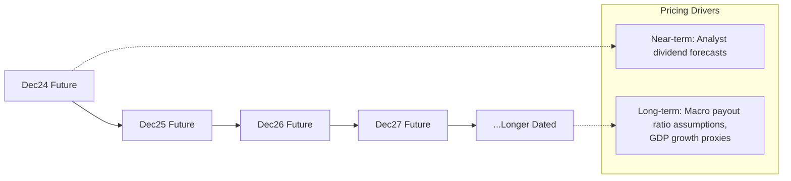

## Dividend Futures and Dividend Swaps

### Definition and Core Concept

Dividend futures and dividend swaps are derivative instruments that isolate and trade the dividend component of equity returns separately from price risk. Both instruments allow market participants to take a pure view on future dividend payments of a single stock or index without exposure to the underlying's price movement.

**Key Points**

- The underlying reference is the realized dividend amount (index points or currency) paid by constituents over a specified period
- Primarily used by structured product desks to hedge dividend risk embedded in other equity derivatives (autocallables, equity swaps, convertible bonds)
- Most liquid on major indices (Euro Stoxx 50, S&P 500, FTSE 100); single-stock dividend derivatives exist but are less liquid

### Why Dividend Risk Exists as a Separate Factor

Standard equity derivatives pricing (e.g., Black-Scholes) treats dividends as an input assumption (continuous yield or discrete schedule). In reality, dividends are uncertain and subject to:

- Corporate payout policy changes (cuts, suspensions, special dividends)
- Macroeconomic shocks (e.g., widespread dividend cuts during 2008 and 2020 crises)
- Index composition changes / rebalancing

Because option and structured product prices embed a dividend assumption, mispricing this assumption creates hedging risk for dealers. Dividend futures/swaps let desks hedge this risk directly.

[Inference] The 2008 financial crisis and 2020 COVID-19 period are frequently cited as demonstrating how sharply implied dividend assumptions can diverge from consensus dividend forecasts during systemic stress, though the precise magnitude of dislocation varies by index and period and should be verified against historical market data for specific dates.

### Dividend Swaps

A dividend swap is an OTC contract where one party pays a fixed dividend amount (agreed at inception) and receives the floating (realized) dividend amount paid by the reference index/stock over the swap's term.

**Structure:**

- **Fixed leg payer:** Pays an agreed fixed dividend amount, receives realized dividends — effectively "short" future dividend risk (benefits if realized dividends fall)
- **Floating leg payer:** Pays realized dividends, receives the fixed amount — effectively "long" future dividend risk (benefits if realized dividends rise or wants protection against dividend increases)

**Example**

A dealer sells a 1-year dividend swap on the Euro Stoxx 50 with a fixed strike of 120 index points. If realized dividends over the year total 110 points:

$$\text{Payoff to fixed receiver} = (120 - 110) \times \text{multiplier}$$

The fixed receiver profits because actual dividends came in below the agreed strike.

### Dividend Futures

Dividend futures are exchange-traded (e.g., Eurex for Euro Stoxx 50 Dividend Futures) standardized contracts referencing the total dividends paid by index constituents over a calendar year, settling to the realized dividend index value at expiration.

**Key Points**

- Exchange-cleared, reducing counterparty risk versus OTC dividend swaps
- Each futures contract typically references a specific calendar year's dividend period (e.g., "Dec24" dividend future covers dividends paid Jan–Dec 2024)
- Price is quoted directly in index dividend points
- Settlement is cash-based against the realized cumulative dividend index at expiry

### Term Structure of Dividend Futures

Dividend futures trade across multiple calendar-year maturities simultaneously, forming a term structure analogous to a yield curve.

- **Near-dated contracts** (current/next calendar year) are priced closely to consensus analyst dividend estimates for known constituent payout schedules
- **Long-dated contracts** trade with wider bid-ask spreads and greater uncertainty, often pricing in a discount reflecting uncertainty premium and historically have shown a tendency to trade below eventual realized dividends in some periods (a pattern noted by practitioners and academic studies on dividend futures term structure)

[Inference] The empirical tendency for long-dated dividend futures to underprice realized dividends has been documented in several academic and sell-side studies, but this is a historical pattern rather than a guaranteed structural feature, and results vary by sample period and index.

### Relationship to Implied Dividend Yield in Options Pricing

Dividend futures/swaps provide a market-observable, tradable proxy for the dividend assumption embedded in option pricing models, allowing:

- **Extraction of implied dividends** from put-call parity in listed index options, which can be cross-checked against dividend futures prices to identify relative value
- **Direct hedging** of the dividend (rho-like) sensitivity of structured products — e.g., an autocallable note's issuer can hedge the embedded short-dividend exposure using dividend futures/swaps rather than relying solely on the dynamic delta-hedge of the underlying

**Key Points**

Put-call parity relationship used to imply dividends from listed options:

$$C - P = S_0 e^{-qT} - K e^{-rT}$$

Rearranging to solve for the implied dividend yield $q$ (or discrete dividend $D$) given observed call/put prices provides a cross-check against dividend future levels.

### Pricing Framework

#### Dividend Swap Fair Value

$$V = (D_{fixed} - E[D_{realized}]) \times DF(T) \times N$$

where $E[D_{realized}]$ is the risk-neutral expected realized dividend, $DF(T)$ is the discount factor to settlement, and $N$ is the notional per index point.

#### Dividend Future Fair Value

At any time before expiry, the future's fair value reflects:

$$F_t = \sum_{i} E[d_i] \times DF(t_i, T)$$

summed across constituent dividend payment dates $i$ within the reference year, each discounted from payment date to the future's expiration date $T$.

### Market Participants and Use Cases

| Participant | Motivation |
| --- | --- |
| Structured products desks | Hedge dividend risk embedded in autocallables, reverse convertibles, barrier options |
| Dividend-focused hedge funds | Directional views on corporate payout trends, macro dividend cycle bets |
| Index arbitrageurs | Relative value between dividend futures term structure and implied dividends from options |
| Real-money asset managers | Yield enhancement strategies, dividend risk premium harvesting |

### Risk Considerations

- **Basis risk:** Dividend swaps/futures on an index don't perfectly hedge single-stock dividend exposure within structured products referencing individual names
- **Liquidity risk:** Long-dated maturities and single-stock dividend instruments can have wide spreads and limited depth
- **Correlation/concentration risk:** A small number of large-cap constituents can dominate an index's total dividend payout, so idiosyncratic cuts by mega-cap names can disproportionately affect settlement values
- **Model risk in valuation:** Forecasting realized dividends requires assumptions about payout ratios, earnings, and corporate actions that can shift rapidly during stress periods

**Related Topics**

- Autocallable Notes and Dividend Risk Hedging
- Put-Call Parity and Implied Dividend Extraction
- Variance Swaps and Volatility Risk Premium
- Structured Product Desks: Hedging Frameworks
- Eurex/Exchange-Traded Dividend Derivatives Specifications
- Convertible Bond Dividend Sensitivity (Rho/Dividend Greeks)