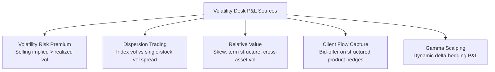

## Variance and Volatility Trading Desks

### Overview and Desk Mandate

Variance and volatility trading desks specialize in trading, market-making, and risk-managing volatility as an asset class, distinct from directional equity price exposure. These desks operate across listed options, OTC variance/volatility swaps, and index volatility products, deriving revenue from the volatility risk premium, dispersion, and relative value across the volatility surface.

**Key Points**

- Core function: warehouse and hedge vega, gamma, and higher-order volatility exposures generated by client flow (structured products, hedging demand) and proprietary positioning
- Distinct from single-name options desks in that the primary risk factor traded is volatility itself, not direction
- Typically organized around index volatility, single-stock volatility, dispersion, and exotic/structured volatility products

### Core Instruments Traded

#### Variance Swaps

A variance swap pays the difference between realized variance and a fixed variance strike agreed at inception, with payoff:

$$\text{Payoff} = N_{var} \times (\sigma_{realized}^2 - K_{var}^2)$$

where $N_{var}$ is the variance notional and $K_{var}$ is the fixed variance strike (quoted as volatility, i.e., $K_{var} = \sigma_{strike}$).

**Key Points**

- Realized variance is computed from daily log returns of the underlying over the observation period
- Variance swaps provide "pure" exposure to realized volatility, replicable via a static strip of options (the variance swap replication argument), which is why dealers can hedge them robustly
- Payoff is convex in volatility moves — large moves in either direction increase the payout disproportionately, a key attraction for long-volatility positioning

#### Volatility Swaps

Pays based on realized volatility (not variance) directly:

$$\text{Payoff} = N_{vol} \times (\sigma_{realized} - K_{vol})$$

[Inference] Volatility swaps are generally less liquid than variance swaps because they cannot be perfectly replicated with a static option strip (their payoff is not linear in variance), requiring dynamic hedging and introducing convexity/model risk for the dealer — this is a widely cited market structure characteristic though liquidity conditions vary by underlying and period.

#### VIX and Volatility Index Futures/Options

- VIX measures 30-day implied volatility of S&P 500 options, calculated via a variance-swap-replication formula applied to a strip of SPX option prices
- VIX futures and options allow direct trading of forward volatility expectations
- VIX futures typically trade in contango (upward-sloping term structure) during calm markets, reflecting the volatility risk premium and mean-reversion expectations, and can invert into backwardation during acute stress

### Desk P&L Drivers

### Volatility Risk Premium (VRP)

The persistent tendency for implied volatility to trade above subsequently realized volatility, forming the core systematic source of return for short-volatility strategies.

$$VRP = IV_{t} - E[RV_{t,T}]$$

**Key Points**

- [Inference] The VRP is widely documented across academic literature and practitioner research as a persistent (though time-varying and not guaranteed) risk premium, generally attributed to investors' willingness to pay for downside protection (analogous to an insurance premium)
- Selling variance/volatility systematically harvests this premium but exposes the seller to significant tail risk during volatility spikes (e.g., 2018 "Volmageddon," 2020 COVID crash)
- Desks manage this via limiting gross short-vega exposure, tail hedges (far OTM puts, VIX calls), and dynamic position sizing based on realized vol regimes

### Dispersion Trading

A strategy exploiting the spread between index implied correlation and realized correlation among index constituents.

**Mechanics:**

- **Long dispersion:** Sell index volatility (or variance), buy single-stock volatility on constituents — profits when realized correlation is lower than implied (constituents move less in sync than the index vol suggested)
- **Short dispersion:** Buy index volatility, sell single-stock volatility — profits when realized correlation exceeds what was implied

**Example**

If SPX implied volatility is 15% and the weighted average single-stock implied volatility of its top constituents is 22%, this gap suggests a high implied correlation is priced in. A dispersion desk might sell SPX variance and buy a basket of single-name variance swaps, positioned to profit if realized correlation comes in lower than implied.

$$\sigma_{index}^2 \approx \sum_i w_i^2 \sigma_i^2 + \sum_{i \neq j} w_i w_j \rho_{ij} \sigma_i \sigma_j$$

This variance decomposition formula underlies the implied correlation calculation used to identify dispersion opportunities.

### Skew and Term Structure Trading

- **Skew trades:** Relative value positions across strikes (e.g., risk reversals, put spreads vs call spreads) expressing views on the shape of the volatility smile independent of overall level
- **Calendar/term structure trades:** Positions across expirations (e.g., calendar spreads) expressing views on the forward volatility curve, particularly relevant around known catalysts (earnings, macro events, index rebalancing dates)
- **Cross-asset volatility relative value:** Comparing equity volatility to rates, FX, or credit volatility for macro-informed relative value positioning

### Hedging Infrastructure

**Delta-Gamma-Vega Hedging**

- Vega exposure from variance swap books is typically hedged with a static or semi-static option strip matching the replication portfolio
- Gamma from short-dated options requires continuous delta-hedging (gamma scalping), generating P&L proportional to the difference between implied and realized volatility along the path
- Cross-Greek risk (vanna, volga) becomes material for large books with skewed/convex volatility exposure, requiring more sophisticated risk systems beyond simple Black-Scholes Greeks

**Key Points**

- Desks typically run risk through a volatility surface model (SVI, SABR, or local/stochastic volatility hybrids) rather than flat Black-Scholes assumptions, to consistently price and hedge across strikes and maturities
- Real-time correlation and dispersion risk monitoring is essential given the multi-name nature of index vol books

### Risk Management and Governance

| Risk Type | Description | Mitigation |
| --- | --- | --- |
| Tail/gap risk | Sudden vol spikes causing outsized losses on short-vol positions | Position limits, tail hedges, stress testing |
| Correlation risk | Realized correlation deviating sharply from implied | Diversified dispersion books, correlation limits |
| Liquidity risk | Wide spreads in stressed markets impede rebalancing | Pre-defined liquidation protocols, liquidity buffers |
| Model risk | Surface model misspecification affecting pricing/hedging | Model validation, cross-checking against listed market prices |

[Inference] Following events such as the 2018 "Volmageddon" (short-volatility ETP unwind) and the 2020 COVID volatility spike, many desks and regulators increased scrutiny of gross short-vega concentration and margining practices for volatility products, though specific current risk limits and regulatory requirements vary by institution and jurisdiction.

### Organizational Structure

Typical desk segmentation within a large volatility trading operation:

- **Index volatility desk:** Trades SPX, Euro Stoxx, Nikkei index options and variance
- **Single-stock volatility desk:** Trades individual equity options, often closely coordinated with the index desk for dispersion strategies
- **Exotics/structured volatility desk:** Prices and hedges path-dependent volatility exposure from structured notes (autocallables, cliquets)
- **Systematic/quant volatility desk:** Runs rules-based volatility risk premium harvesting or relative value strategies

**Next Steps**

- Variance Swap Replication via Static Option Portfolios
- Implied vs Realized Correlation and Dispersion Trading Mechanics
- VIX Futures Term Structure and Roll Yield
- Local Volatility vs Stochastic Volatility Models (SABR, Heston)
- Autocallable Notes and Cliquet Option Structuring
- Cross-Asset Volatility Relative Value Strategies
- Volmageddon (2018) and Short-Volatility ETP Structural Risk