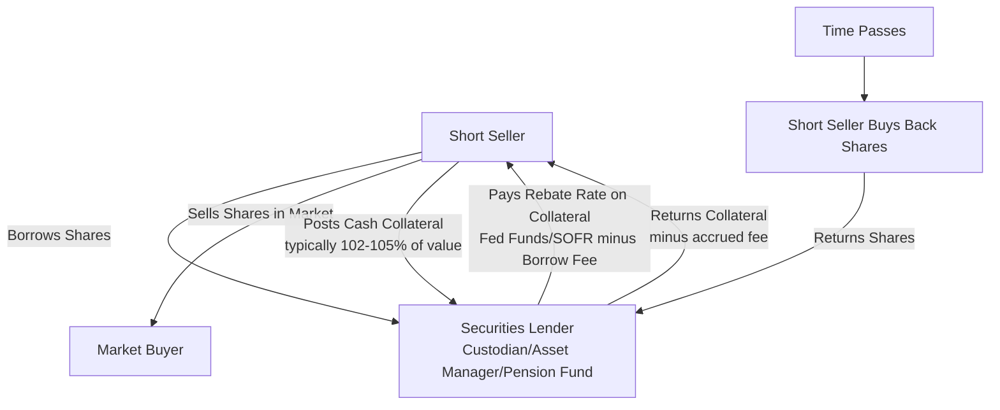

## Stock Borrow Cost and Short Selling Mechanics

### Overview and Purpose

Short selling requires borrowing shares to deliver upon sale, creating a securities lending market where the borrow cost directly affects derivatives pricing, arbitrage relationships, and structured product hedging. Understanding stock loan mechanics is essential for pricing any instrument where the hedger must maintain a short position in the underlying.

**Key Points**

- Short selling involves borrowing shares, selling them in the market, and later repurchasing to return to the lender
- Borrow cost (rebate rate) is a direct input into derivatives pricing models (options, swaps, futures) since it affects the effective cost of carry
- Securities lending is intermediated primarily by prime brokers, custodians, and specialized agent lenders

### Mechanics of a Short Sale

- **Step 1:** Short seller locates and borrows shares (via prime broker) from a lender (typically institutional holders like pension funds, mutual funds, insurance companies)
- **Step 2:** Short seller sells borrowed shares in the open market, receiving cash proceeds
- **Step 3:** Short seller posts collateral (in the U.S., typically cash collateral at 102%+ of borrowed share value) to the lender
- **Step 4:** Lender reinvests collateral and pays the short seller a "rebate rate" (a portion of the reinvestment return), while charging a "borrow fee" — the net rebate rate reflects the difference
- **Step 5:** To close the position, the short seller buys back shares in the market and returns them to the lender, receiving collateral back (minus fees accrued)

### Rebate Rate and Borrow Fee Terminology

**Key Points**

- **General Collateral (GC) stocks:** Easy-to-borrow, liquid names where rebate rates track close to the general funding rate (e.g., Fed Funds/SOFR minus a small spread of a few basis points)
- **Hard-to-borrow (HTB) / Special stocks:** Limited share availability drives rebate rates significantly negative — the short seller effectively pays a fee (not just forgoes interest) to maintain the borrow
- **Rebate rate formula:** $\text{Rebate Rate} = \text{Reinvestment Rate} - \text{Borrow Fee}$

**Example**

If SOFR is 5.30% and a stock's borrow fee is 8% (a "hard-to-borrow" name), the short seller effectively pays a negative rebate:

$$\text{Rebate Rate} = 5.30\% - 8.00\% = -2.70\%$$

This means the short seller pays 2.70% annualized on the notional short position, in addition to being exposed to any price appreciation.

### Drivers of Borrow Cost

- **Float and share availability:** Stocks with small free float, high insider ownership, or high short interest relative to float typically command higher borrow fees
- **Short interest ratio:** Days-to-cover (short interest / average daily volume) signals potential squeeze risk and elevated borrow costs
- **Corporate actions:** Impending mergers, spin-offs, index inclusion/exclusion events can spike demand to borrow (e.g., merger arbitrage shorts) or reduce available supply
- **Dividend record dates:** Borrow demand can spike around ex-dividend dates due to dividend arbitrage and tax-related trading strategies
- **Recall risk:** Lenders can recall shares at any time (e.g., to vote proxies or sell the underlying position), forcing the short seller to find alternative borrow or close the position — a persistent operational risk in short selling

[Inference] Recall risk is generally considered more acute in hard-to-borrow names with concentrated lending supply, since alternative borrow sources may be scarce, though the specific likelihood of recall in any given situation depends on the lender's own portfolio needs and cannot be predicted with certainty.

### Impact on Derivatives Pricing

#### Options Pricing

Borrow cost enters option pricing analogously to a dividend yield or negative carry cost, affecting the cost-of-carry term in the underlying's forward price:

$$F = S_0 e^{(r - q + b)T}$$

where $b$ represents the borrow cost (negative rebate) — a higher borrow cost lowers the forward price relative to spot, which in turn:

- Increases put prices relative to calls (since the forward is depressed)
- Affects put-call parity: $C - P = (F - K)e^{-rT}$, where $F$ already embeds the borrow-adjusted carry

**Key Points**

- For hard-to-borrow stocks, options market makers must factor in their own cost of hedging (since delta-hedging a call requires shorting stock, which incurs borrow cost)
- This can create persistent skew/distortions in listed options for heavily shorted names, independent of pure volatility views

#### Equity Swaps and Synthetic Shorts

- Total Return Swaps referencing hard-to-borrow names typically price in a wider financing spread on the short side, passing through the dealer's own stock borrow cost to the client
- This makes synthetic short exposure via swaps directly linked to underlying securities lending market conditions

#### Convertible Bond Arbitrage

- Convertible arbitrage strategies (long convertible bond, short underlying equity) are directly exposed to borrow cost as a carrying cost of the hedge
- Elevated borrow fees can erode arbitrage profitability or even make certain convertible arb trades uneconomical during specific market conditions

### Regulatory Framework (U.S. Context)

- **Regulation SHO:** Requires broker-dealers to have a reasonable basis to believe shares can be borrowed ("locate" requirement) before executing a short sale, and imposes close-out requirements for persistent settlement failures ("threshold securities")
- **Rule 201 (Alternative Uptick Rule):** Restricts short selling at or below the national best bid when a stock has dropped 10%+ intraday, triggering a circuit-breaker style restriction for the remainder of that day and the next
- **Naked short selling:** Selling short without a locate/borrow arranged; prohibited under Reg SHO, distinguished from "failure to deliver" which can occur even with a good-faith locate due to settlement timing issues

[Unverified] Specific regulatory thresholds, locate requirements, and enforcement mechanics are subject to periodic SEC rule amendments; current requirements should be verified against the latest Reg SHO text and SEC guidance.

### Securities Lending Market Participants

| Role | Description |
| --- | --- |
| Beneficial owners (lenders) | Pension funds, mutual funds, insurance companies holding long-term equity positions |
| Agent lenders | Custodian banks intermediating lending on behalf of beneficial owners |
| Borrowers | Prime brokers (on behalf of hedge fund clients), market makers |
| Prime brokers | Aggregate borrow demand from clients, source supply from lending market, mark up rates |

### Short Squeeze Dynamics

A short squeeze occurs when a sharp price increase forces short sellers to buy back shares to cover losses or meet margin calls, which in turn drives the price higher, creating a feedback loop.

**Key Points**

- Amplified in names with high short interest relative to float and limited available borrow supply
- Rising borrow fees during a squeeze increase the cost of maintaining the short, adding pressure to cover independent of price view
- [Speculation] Coordinated retail buying campaigns targeting heavily shorted stocks (as observed in early 2021 meme-stock episodes) represent a relatively novel dynamic in short squeeze mechanics, though the extent to which this pattern will recur or evolve in future market cycles is not something that can be reliably forecast.

### Cost-of-Carry Summary Table

| Component | Effect on Short Position Cost |
| --- | --- |
| Reinvestment rate (SOFR/Fed Funds) | Short seller earns interest on cash collateral (offsetting) |
| Borrow fee (GC vs HTB spread) | Direct cost, subtracted from reinvestment return |
| Dividend obligations | Short seller must pay lender any dividends declared during borrow period |
| Recall risk / buy-in cost | Potential forced close-out at unfavorable price if borrow is recalled |

**Related Topics**

- Regulation SHO and Short Sale Regulatory Framework
- Convertible Bond Arbitrage Strategies
- Put-Call Parity Under Borrow Cost Constraints
- Securities Lending Collateral Management
- Merger Arbitrage and Borrow Demand Dynamics
- Meme Stock Phenomena and Short Squeeze Case Studies